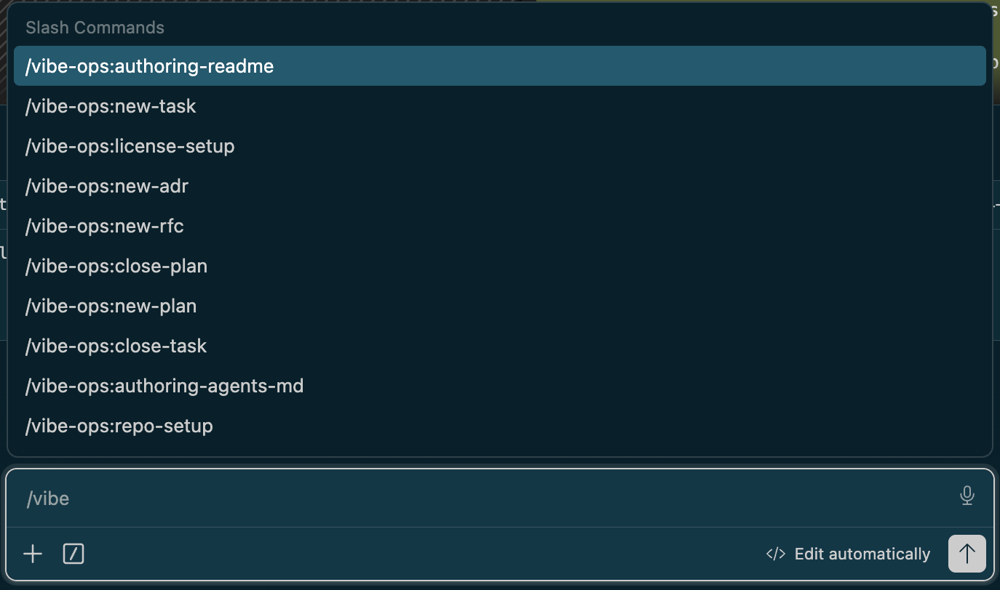

<h1 align="center">vibe-ops</h1>

<p align="center">
  <b>Context engineering for repositories.</b><br>
  A Claude Code plugin. One command lays down the governance, docs, licensing and agent config a project
  needs; the rest of the skills keep them true as the work moves.
</p>

<p align="center">
  <a href="https://github.com/entelekheia-ai/vibe-ops/actions/workflows/check.yml"></a>
  
  
</p>

<p align="center">
  <a href="#install">Install</a> ·
  <a href="#what-repo-setup-produces">What it produces</a> ·
  <a href="#skills">Skills</a> ·
  <a href="#it-checks-its-own-work">Self-checking</a> ·
  <a href="GOVERNANCE.md">Governance</a>
</p>

---

<p align="center">
  
</p>

## Why

A repository's `AGENTS.md`, its rules and its skills are not documentation *about* the project — they are
the context an agent is handed before it does anything. So the question is not only what they say, but
when each one loads: the map at session start, a rule scoped to the folder it governs, a skill only when
it is asked for. That much is scaffolding, and most tools stop there.

The cost arrives three months later. The conventions live in one person's head, `AGENTS.md` describes a
folder that was renamed, and whatever the last piece of work *taught* was deleted along with its notes.
An agent working through a task learns a great deal inside a single run and forgets it at the end.

This plugin is aimed at that second half. Closing a task writes back to the document that started it, so a
plan cannot quietly claim work that never shipped. Each learning is routed to a surface where the next
agent will actually read it — or, when it is mechanically checkable, turned into a guard instead of a
sentence, because a sentence is only followed by whoever read it. The repository becomes the thing that
remembers.

## Install

```bash
claude plugin marketplace add entelekheia-ai/vibe-ops
claude plugin install vibe-ops@entelekheia
```

Or try it from a local checkout with `claude --plugin-dir ./vibe-ops`.

## What `repo-setup` produces

```
/vibe-ops:repo-setup
```

An empty directory becomes:

```
my-lib/
├── AGENTS.md                       the map an AI collaborator reads first
├── CLAUDE.md                       one line: @AGENTS.md
├── GOVERNANCE.md                   which artifact answers which question
├── README.md · LICENSE
├── .agents/
│   └── rules/
│       ├── governance.md           path-scoped — loads only inside project/
│       └── repo-guardrails.md
├── .claude/rules/                  relative symlinks back into .agents/ — one copy, two frameworks
├── project/
│   ├── adr/ rfc/ tasks/ plans/ research/ log/
│   └── templates/{adr,rfc,plan,task}.md
├── docs/                           Diátaxis: tutorials · how-to · reference · explanation
├── src/ · test/
└── package.json · tsconfig.json · tsconfig.build.json
```

Point it at a repository that already exists and it does the same job: it reports what is missing, what
diverged and what it will leave alone, then asks before writing. Pass `audit` to get that report and no
changes at all. An empty directory is just the maximum-gap case.

## Skills

`repo-setup` is the entry point. The rest are invoked directly, or picked up by Claude when the task fits.

| | |
|---|---|
| `/vibe-ops:repo-setup` | Set up **or reconcile** a repo or npm-workspaces monorepo. `audit` reports without writing. |
| `/vibe-ops:new <adr\|rfc\|plan\|task>` | Open one governance record, using the *target repo's* own template and numbering. |
| `/vibe-ops:close <task\|plan>` | Close the loop — write back, propagate, route what the work taught. A task dossier is distilled and deleted; a plan is kept, because it is the permanent record. |
| `/vibe-ops:authoring-agents-md` · `authoring-readme` | Write or repair the two files a newcomer — human or agent — reads first. |
| `/vibe-ops:license-setup` | `LICENSE`, fork attribution, and optional header enforcement. |

Each skill reads the **target repository's own** templates and conventions, so one installed plugin adapts
to every repo instead of being copied into each and drifting. Everything it writes into your repository is
in English, whatever language you are working in.

## It checks its own work

Every skill that touches a file an agent reads at session start runs a validator against your repository
afterwards: the `AGENTS.md` line budget, every relative link still resolving, the `.agents`/`.claude`
symlinks intact — including the case where git checked one out as plain text, which reads as a working
rule file containing one line of nonsense — and every rule carrying a `description:`.

It runs from the plugin, reads your repository and **writes nothing into it**, so there is no per-repo copy
to keep up to date. If you want the same check on every push, `repo-setup` offers to copy it in as a CI
job, and tells you that copy is a snapshot.

## Requirements

Claude Code with plugin support. Scaffolded repos default to Node ≥ 22 and TypeScript (ESM) — adjust to
taste.

## License

Apache-2.0 — see [LICENSE](LICENSE). How this repository is organized and governed:
[GOVERNANCE.md](GOVERNANCE.md) · [AGENTS.md](AGENTS.md) · [CHANGELOG.md](CHANGELOG.md) ·
[ACKNOWLEDGEMENTS.md](ACKNOWLEDGEMENTS.md).
