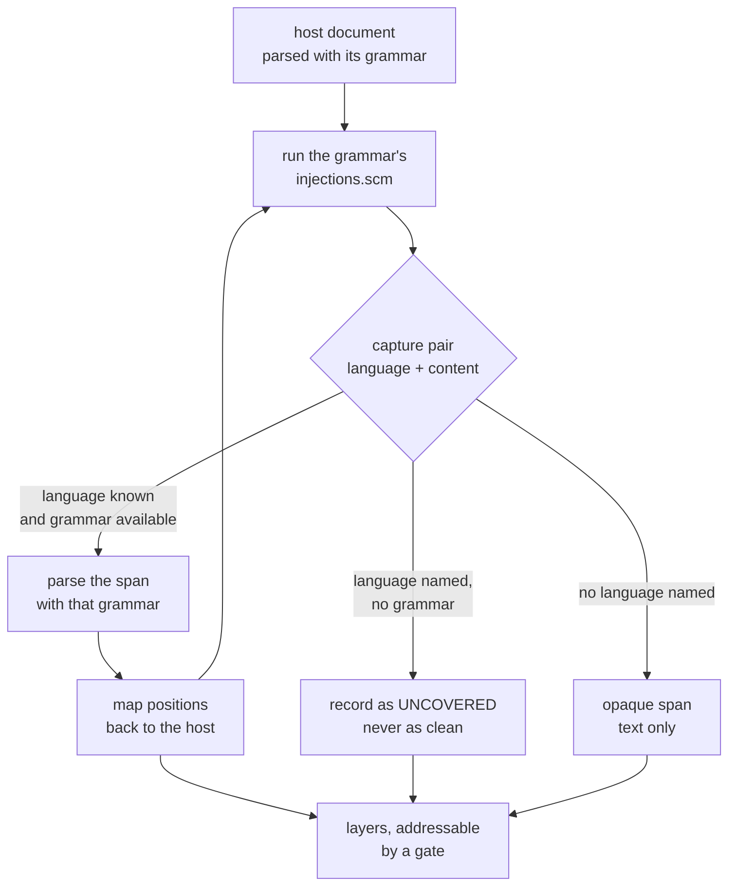
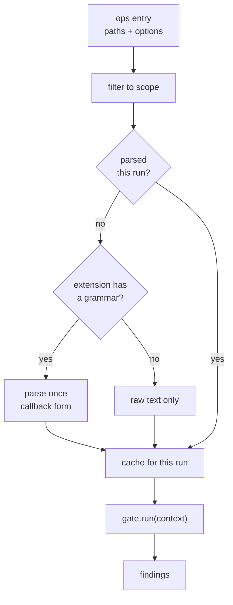
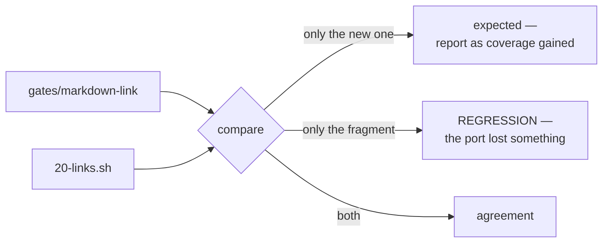

<!--
 Copyright (c) 2026 Danilo Borges (https://github.com/daniloborges)

 Licensed under the Apache License, Version 2.0 (the "License");
 you may not use this file except in compliance with the License.
 You may obtain a copy of the License at

 https://www.apache.org/licenses/LICENSE-2.0
-->

<!-- vibe-ops-template plan@0.2 — KEEP THIS LINE. /vibe-ops:migrate reads it to find artifacts written
     against an older template. Removing it makes this file invisible to migration. -->

# Plan-010: The document model under the gates

| Field | Value |
|---|---|
| Status | Shipped |
| Created | 2026-08-10 |
| Author | Danilo Borges |
| Depends on | RFC-0001 (Accepted) — gates and ops as the unit of composition |
| Related | [ADR-0004](../adr/0004-budgeted-artifacts-and-guards.md) (a guard, not a line), [Plan-009](009-the-first-skill-scoped-hook-and-the-cli-it-calls.md) (the `fix` capability this builds on) |

---

## Summary

Every gate in `cli/packages/gates/` opens its own files and finds what it needs with regular
expressions. That was correct for five detectors that look at different things, and it stops being
correct now: the next three all need the *same* structure out of the same markdown, and the shell
fragment they descend from gets a whole category wrong by construction. `20-links.sh` deletes
everything between backticks before it extracts links — deliberately, because link syntax quoted as
code is not a link — and therefore cannot see a reference that is *written* as code, which is how
every archival reference in a governance corpus is written. This plan puts one parsed document model
in `cli/packages/core/`, hands it to gates instead of a file path, ports the link check onto it, adds
a reference checker that has never existed in any form, and teaches the frontmatter gate the record
types that today have no mechanical check at all. It detects; it does not decide what a reference
should look like.

## Goals

1. A gate receives a parsed document rather than a path, and no gate under `cli/packages/gates/`
   contains a markdown regular expression. The document is **layered**, not single-language: a region
   written in another language is a region of that language, addressable as such.
2. A link written inside an inline code span or a fenced block is not reported as a link, and that is
   true because the parser says so rather than because a stripping pass ran first.
3. Every `git show <sha>:<path>` reference in a repository is checked three ways — the commit resolves,
   the path existed in that commit, and the file is gone from the working tree — where today none of
   the three is checked anywhere.
4. A plan, ADR, RFC or research document missing a required header field fails a gate, closing the
   asymmetry where a rule file and a skill file are both guarded and the records themselves are not.
5. Each ported gate runs beside the fragment it ports, and the disagreement between them is reported as
   its own finding rather than silently accepted or silently suppressed.

## Scope

### In scope

- `DocumentModel` in `cli/packages/core/`, backed by tree-sitter, resolving a grammar per file
  extension, exposing structure rather than text.
- **The injection resolver**: reading the `injections.scm` a grammar ships, parsing each injected region
  with the grammar it names, and mapping positions back to the host document.
- The seam on `GateRunContext` that hands a gate the parsed document.
- A grammar-load test that fails when any declared grammar cannot load under the pinned runtime.
- `cli/packages/gates/markdown-link/` — the port of
  `cli/packages/module-check/sh/checks/20-links.sh`.
- `cli/packages/gates/breadcrumb/` — new, detection only.
- `cli/packages/gates/check-frontmatter/` gaining `plan`, `adr`, `rfc` and `research` schemas beside
  the existing `rule` and `skill`.
- An ops composing the above over a repository's governance surface.

### Out of scope

- **What a reference should look like.** Whether an archival reference stays `git show <sha>:<path>` or
  becomes a content-addressed identifier is a decision with no record in this repository yet. This plan
  checks the form that exists in corpora today and leaves any rewriting to whatever record decides the
  form. The `fix()` that would perform that rewrite is out of scope with it.
- **Removing the shell fragments.** They stay until the pair is shown to agree; see *Reading a
  disagreement* below.
- **Moving the other gates onto the model.** `bridge` and `budget` read files directly and keep doing
  so until one of them needs structure.
- **Consuming ranges.** The model exposes section ranges because they fall out of the parse; nothing in
  this plan reads them. The consumer is whatever record settles the reference form.
- **Gates over injected regions.** The resolver produces the layers; no gate in this plan reads one. The
  first consumers — a check that a fenced example still compiles, a documentation comment validated by
  its own grammar — are each their own act, and each needs a grammar that may not exist yet.
- **Incremental re-parse.** Every published implementation of layered parsing spends its complexity
  there, and a gate does not need it: one parse per file per run, and the editing-time path is a single
  file. Reaching for it would import the hardest part of the problem for none of the benefit.
- **A browser build.** The model uses the native binding, which is what a CLI running under Node needs.
  The published grammar set has no WebAssembly build for markdown, and working around that is a
  separate act with its own cost.

## Design

### Why a model rather than three parsers

The three detectors this plan needs all ask structural questions of the same file. A link gate must
know what is a link; a reference gate must know what is a code span; a frontmatter gate must know
where the metadata block ends. Written separately, each grows its own approximation of markdown, and
each approximation is wrong in a different place. The shell fragment already demonstrates the cost:
its backtick-stripping pass is correct for its own purpose and makes an entire class of reference
invisible, so a corpus can carry archival references that nothing has ever validated.

A parser removes the category rather than improving the approximation. Measured over 173 tracked
markdown files against a CommonMark reference implementation: identical link sets, no link seen that
was not there and none missed, with links inside code spans and fenced blocks excluded because the
grammar puts them in different nodes — not because a pass removed them.

### What the model is

`DocumentModel` lives in `cli/packages/core/` and is **language-plural from the start**, not a markdown
helper that later grows. One API, one grammar per extension, because the gates already run over shell,
JSON and TypeScript and will eventually want structure from those too. Measured on the published
grammar set: 33 of 36 grammars load and parse through a single API.

For a markdown document the model exposes the frontmatter block, headings with their section ranges,
links with their positions, and code spans and fenced blocks as structure rather than as text to be
removed.

Two mechanical constraints belong in the implementation from the first commit, because both are
invisible until they bite and both were measured rather than assumed:

- **The string form of `parse` refuses input at 32,767 bytes**, failing with `Invalid argument`. Half
  of a governance corpus is larger than that — this repository's own changelog is past 40 KB. The
  callback form has no such limit and parsed 160 KB without complaint. An implementation that takes
  the string form passes every small test and fails exactly on the documents that matter.
- **The runtime and the grammars are coupled by binary interface.** One runtime version loads the
  grammar set; the adjacent versions above and below it do not. This makes the grammars a versioned,
  tested dependency rather than an installation detail, and the sensor is cheap: a test that loads
  every declared grammar and parses a snippet, in the same spirit as `defineGate` refusing a
  declaration its code does not back.

### A file is not one language, and the routing is not ours to invent

A markdown document holds fenced blocks in other languages. A TypeScript file holds documentation
comments with their own grammar. Treating either as one language means the embedded region is either
analysed by the wrong parser or, more commonly, silently skipped — and a run that skipped it reports
success, which is worse than reporting nothing, because a green result over an unexamined region reads
as the region being clean.

So the model is **layered**: a region written in another language becomes a document of that language,
with its own tree, whose positions map back into the host. The pattern is old enough to have a name in
editors — a virtual document over a span of a real one — and it is what makes a polyglot file
addressable at all.

The part that matters for this repository is **who decides the routing**, and the answer is already
correct in the ecosystem: the grammar that owns an extension declares its own injections, in a query
file it ships. That is not a configuration this plan writes; it is a fact this plan reads. The markdown
grammar's own declaration settles five different cases (verified against the installed package,
2026-08-10 — the block half of a two-part frontmatter route is easy to miss reading the query by eye,
because it names no field the naive case does):

```scheme
(fenced_code_block (info_string (language) @injection.language)
                   (code_fence_content) @injection.content)
((html_block) @injection.content (#set! injection.language "html"))
(document . (section . (thematic_break) (_) @injection.content (thematic_break))
 (#set! injection.language "yaml"))
([(minus_metadata) (plus_metadata)] @injection.content (#set! injection.language "yml"))
((inline) @injection.content (#set! injection.language "markdown_inline"))
```

The fence route is **dynamic** — the language comes from the fence's own label, so a grammar arriving
later needs no change here. **Frontmatter is two routes, not one**: the fourth line is the metadata node
the parser already names (`minus_metadata`/`plus_metadata`); the third is a second, structural route for
a frontmatter block the grammar has not (yet) recognized as metadata — a leading section bounded by two
thematic breaks — so a document whose frontmatter the parser missed is still read as YAML rather than
silently treated as prose. Either way the frontmatter gate gets a parsed mapping instead of a line scan.
The last line is the one that pays immediately: markdown's block and inline grammars are two parsers,
and the hand-off between them **is itself an injection**. Implementing the resolver generically
therefore removes special-case code rather than adding it.

The inline grammar declares two injections of its own, reached only by recursing into the last line
above — markdown's `injections.scm` never names them directly:

```scheme
((html_tag) @injection.content (#set! injection.language "html"))
((latex_block) @injection.content (#set! injection.language "latex"))
```

This is what makes the resolver's recursion a measured requirement rather than a defensive one: markdown
injects inline, and inline injects again, on the first document the resolver ever sees.



Two properties of that flow are load-bearing. It **recurses** — an injected region may itself declare
injections — and it must terminate, so the resolver carries a depth bound rather than trusting the
grammars to be acyclic. And the `UNCOVERED` branch is the whole point: a fenced block whose language has
no grammar must be *reported as unexamined*, because the failure this design exists to remove is a tool
reporting success over a region it never read.

What the library provides stops at the query. Running `injections.scm` and getting the captures is
supported; assembling the layers, offsetting the positions and recursing is the consumer's job — every
editor that does this has written its own, and in each of them the expensive part is keeping the layers
current as the text changes. A gate parses a file once per run and the editing-time path is a single
file, so that expensive part is out of scope here (see *Out of scope*) and the resolver stays small.

### How a gate sees it



The parse is per run and per file, never per gate: three gates over the same file parse it once. A
file whose extension has no grammar still reaches its gate, with text and no tree — a gate that needs
structure declares that and skips, naming why, rather than silently reporting nothing.

### The reference gate, and why almost none of it is repairable

An archival reference names a commit and a path inside it, and points at something the working tree no
longer has. Four things can be wrong with one, and only the last is mechanical:

| Failure | Repairable | Level |
|---|---|---|
| the commit does not resolve in this repository | no — a commit cannot be invented | fail |
| the path did not exist in that commit | no — the intended path is unknowable | fail |
| the file is still present in the working tree | no — deleting it is a judgement about the work | warn |
| the reference is malformed against the declared form | yes, mechanically | fail, fixable |

This is the split `pairing` established in Plan-009 and it is applied here for the same reason: a hard
failure the tool refuses to repair is a dead end, so anything requiring judgement warns and names the
consequence instead. The fourth row is where a `fix()` would live, and it stays empty in this plan
because there is no record yet declaring what the form is.

### Reading a disagreement

The ported gates run beside the fragments they replace, which is the precedent `ops-agents-md` set.
Here that arrangement needs one addition, because the usual assumption behind it does not hold: a port
is normally expected to agree with its source, and this one is expected to **disagree in a specific
direction**. The new gate sees references inside code spans; the fragment cannot. Divergence is the
evidence that the port worked.

So the ops reports the comparison as a finding of its own rather than leaving a reader to notice two
lists differ:



Findings only the fragment produces are the ones that matter: each is something the port lost. The
fragment is removed when that set is empty and stays empty, and that removal is a separate act with
its own record.

### Frontmatter, and the asymmetry it closes

`check-frontmatter` already validates two schemas and takes the schema as an option, which was designed
so that a third type costs a schema rather than a fragment. The types that need one are the governance
records themselves: a plan, an ADR, an RFC and a research document each declare a header table whose
required fields are stated in prose and checked by nothing.

The asymmetry is worth naming because it explains why the gap survived: the two guarded surfaces are
the ones a *machine* parses, and both guards exist because a machine broke on them — a skill whose
frontmatter would not parse loaded with empty metadata and vanished from the listing, silently. The
unguarded surface is read only by people and agents, so no breakage ever forced a guard. Sensor
placement has been following tool failure rather than the importance of the field, and the fields most
load-bearing for the records are on the unwatched side.

## Tracks

- [x] **Track 1 — The model and its sensor.** `DocumentModel` in `cli/packages/core/`, grammar
      resolution by extension, the callback-form parse, and the per-run cache; plus the test that loads
      every declared grammar and fails when one cannot. At the end, `cli/packages/core/` exposes a
      parsed document and a test proves the grammar set is loadable under the pinned runtime.
      `project/tasks/001-the-document-model-and-its-sensor.md`. Acceptance, measured rather than assumed:
      the runtime/grammar ABI held stable across the whole `0.21`–`0.25` matrix (see the dossier), so
      "moving the pin" does not discriminate — the Load test's real coverage is the wrong-wrapper
      regression (confirmed to throw) and a runtime old enough to fail outright at install.
- [x] **Track 2 — The injection resolver.** Reading a grammar's own `injections.scm`, parsing each
      injected span with the grammar it names, mapping positions back to the host, recursing under a
      depth bound, and recording a named language with no grammar as uncovered rather than as absent. At
      the end a markdown document exposes its frontmatter as a parsed YAML layer and its inline content
      as a parsed layer, and the hand-rolled block-to-inline hand-off does not exist anywhere in the
      tree. Acceptance is a fixture whose fenced block is in a language with no installed grammar
      reporting `uncovered` for that span while the rest of the document reports normally.
      `project/tasks/002-the-injection-resolver.md`. Shipped as designed, with two corrections made
      during the work rather than assumed going in: positions are carried **parent-relative** (the byte
      range within the immediate parent's own text), not eagerly resolved to a host-absolute offset —
      cheaper to compute at each recursion level, and no consumer yet needs a host-absolute one; and a
      `Layer` carries its own `uncoveredLayers` alongside `layers`, not only `Document` — markdown's
      inline grammar injects `html` and `latex`, neither installed here, so an uncovered finding one
      level into recursion needs somewhere to land other than being silently dropped. The yaml
      compatibility matrix (`tree-sitter` `0.21.1`/`0.22.4`/`0.25.1` against
      `@tree-sitter-grammars/tree-sitter-yaml@0.7.1`) repeated Track 1's finding: the ABI held
      byte-for-byte across the whole range.
- [x] **Track 3 — The link gate, beside its fragment.** `cli/packages/gates/markdown-link/`, ported
      from `cli/packages/module-check/sh/checks/20-links.sh`, reading the model rather than the file.
      At the end both run and both report. Acceptance predicted the comparison from *Reading a
      disagreement* would land on "only the new one — expected, report as coverage gained": every
      finding the fragment produces also produced by the gate, and the gate producing more. The
      measured comparison instead landed on **"both — agreement"**, at zero: this repository currently
      has no broken relative link, so there is nothing for either detector to disagree about. No
      regression (the fragment-only branch, the one this track actually guards against) is confirmed
      empty. Coverage gained is real but does not show up as extra *findings* in a clean repository — it
      is proven directly instead: item 1's supplement (below) delivers 83 links across 17 files that
      exist only inside table cells, matching an independent count taken from the block tree, and every
      one of them already resolves. `project/tasks/003-the-inline-layer-gates.md`.
- [x] **Track 4 — The reference gate.** `cli/packages/gates/breadcrumb/`, detection only, with the four
      failure modes above and the level each carries. At the end a repository's archival references are
      checked for the first time. Acceptance (a fixture carrying one of each mode, firing on exactly
      those) held; the corpus run surfaced one thing the fixture couldn't: a `code_span` starting with
      `git show ` is not always an attempted reference — this repository's own governance docs teach the
      convention using `<sha>`/`<path>` placeholders, in a real code span, matching the gate's own
      trigger prefix. Excluding any inner text containing `<` (never present in a real sha) removed all
      7 false positives with no effect on the 6 real breadcrumbs, which all resolve cleanly.
      `project/tasks/003-the-inline-layer-gates.md`.
- [x] **Track 5 — Header schemas for the record types.** Planned as schemas for `plan`, `adr`, `rfc`
      and `research` inside the *existing* `check-frontmatter` gate. Both halves of that premise were
      wrong, found while sizing the work rather than assumed: a governance record carries a
      `| Field | Value |` markdown table right after its H1, never YAML frontmatter —
      `check-frontmatter` reads only `lines[0] === "---"` and had never touched one — so the fields live
      in a different *place*, not merely a different shape. And `research` has no schema anywhere in
      this repository's tooling to validate against: `resolve-governance.sh` rejects it outright, no
      template exists for it, the skill that would create one is `Backlog`, and 0 of 5 existing research
      documents carry a header table at all. Shipped instead: a **new gate**,
      `cli/packages/gates/record-header/`, reading the block layer via `document.tree` for the first
      `pipe_table` reached before the first level-2 heading (measured exact over this repository's 28
      tracked records: 21 hits, 7 correct misses, 0 misfires — "the first `pipe_table`", unqualified,
      instead grabs a content table in 4 research documents). Schemas for `adr`, `plan`, `rfc` and
      **`task`** (not originally listed, added because task dossiers carry the same table with one more
      required field, `Issue`); `research` carries none, the reason recorded above rather than invented.
      Presence only — no value validated. Acceptance held as stated: this repository's own adr and plan
      records pass (asserted directly against the real checkout in
      `cli/packages/gates/test/record-header.test.ts`), and a stripped copy of each fails naming the
      missing field. `project/tasks/004-the-governance-ops.md`.
- [x] **Track 6 — The ops, and the comparison as its own gate.** Planned as a composition that "carries
      the fragment comparison as a finding" — that phrasing assumed `defineOps` had a seam for
      composition-specific logic, and it does not: `defineOps` is purely declarative
      (`{id, version, summary, gates}`), so the comparison could not live *in* the ops as written.
      Shipped as a **gate instead**, `cli/packages/gates/fragment-parity/`, parameterized
      (`{runner, fragment, against}`) and holding no repository knowledge of its own — it spawns the
      named shell runner, parses its `FAIL  [<fragment>] <file>: …` lines, resolves `against` through
      `loadGate` (already exported for this purpose), and runs it fresh over the *same* population this
      entry declares. Only one direction is reported, `port-regression` — the fragment flagged a file
      the port did not — because the reverse (the port catching more) is the expected, desired outcome
      and not a finding. This generalizes to every other fragment eventually ported by editing
      `options`, and it leaves the repository the day its `fragment` does. The composition itself,
      `cli/packages/ops-governance/`, holds seven entries: four `record-header` schemas, `markdown-link`,
      `breadcrumb`, and one `fragment-parity` comparing `20-links.sh` against `markdown-link`.
      Acceptance held: `vibe-ops governance --list` names all seven with their paths, and
      `vibe-ops governance --verbose` against this repository reports `7 gates, 0 failed`.
      `project/tasks/004-the-governance-ops.md`.
- [x] **Track 5.5 — The population contract (not originally planned).** Sizing Track 6's acceptance —
      "a clean run on this repository" — by actually running the Track 3/4 gates unfiltered, the way a
      composition would, found 14 findings, **all false**: 13 from `markdown-link` on shipped templates
      under `plugin/skills/*/templates/`, whose links are written to resolve in a *target* repository,
      not this one; 1 from `breadcrumb` on the bare code span `` `git show ` `` at
      `project/plans/010-…md:329` — the sentence, written during Track 4's own closure, describing the
      fix for the *previous* false positive. Both were population faults, not detection faults, and the
      root cause was the same in both: the `/templates/` exclusion already existed in three divergent
      copies (the shell runner's own file listing, a hardcoded filter inside `memory-slug`, and no
      filter at all inside `markdown-link`), and a fourth copy would have matched the pattern rather
      than fixed it. Shipped: two typed config keys any ops's `settings` slice may carry — `ignore`
      (glob exclusions, `"*"` for every entry, a gate's own label for one) and `disabled` (a reason
      string, never a boolean — a disablement is a ledger entry, not a silent pass) — read and applied
      by `defineOps` itself, never inside a gate. `memory-slug`'s hardcoded filter was deleted as the
      demotion this produced. `breadcrumb`'s bare-prefix false positive was a genuine gate fix, not a
      population fault: requiring a colon (never present in a bare mention of the command) alongside the
      existing `<`-exclusion (never present in a real sha) resolved it. `project/tasks/004-the-governance-ops.md`.
- [x] Run `/vibe-ops:close plan` — retrospective against the goals, the demotion check, the tracking
      issue closed. The plan file itself is kept.

## Success criteria

Verified by running the CLI against this repository and against the deliberately broken fixture:

- `vibe-ops <ops> --list` names every composed gate with the paths it runs over.
- A file containing a link inside a fenced block and a link inside an inline code span produces **no**
  link findings for either, and one finding for a genuinely broken link on the line beside them.
- A reference naming a commit that does not resolve fails; one naming a path absent from an otherwise
  valid commit fails; one whose file is still in the working tree warns; a correct one is silent.
- A record with its `Status` row removed fails the frontmatter gate, and the unmodified record passes.
- A document whose fenced block names a language with an installed grammar exposes that span as a
  parsed layer of that language; one naming a language with no installed grammar exposes it as
  `uncovered`; one naming no language at all exposes it as opaque text. The three are distinguishable
  in the output, and none of them reports as clean.
- Every finding the shell fragment produces on this repository is also produced by the ported gate.
- The grammar-load test fails when the runtime is moved off its pinned version, and passes on it.

---

<!-- ===== LIVING SECTIONS — maintained during the work, not written at the end ===== -->

## Decision Log

- Decision: build the model on tree-sitter rather than on a CommonMark parser, for markdown as well as
  for everything else.
  Rationale: the markdown grammar's own documentation says it prioritises syntax highlighting over
  parse accuracy and should not be relied on where correctness matters, which is a serious warning and
  was the reason to prefer a CommonMark parser. Measurement contradicted it for both things this plan
  needs. Over 173 files: link sets identical to a CommonMark reference, nothing invented and nothing
  missed; headings identical, with zero invented and zero missed; and 1,211 section ranges differing
  from the reference by exactly two values, 0 and 1, correlating perfectly with whether the section
  ends the file — a convention, not a disagreement. On a document where another markdown language
  server reads a paragraph continuation beginning `#362` as a heading and truncates the document
  structure under it, tree-sitter reads the fourteen real headings and nothing else. The warning is
  real and does not touch either half this plan uses.
  Date / Author: 2026-08-10 / Danilo Borges

- Decision: keep the reference form out of this plan; the gate detects against the form found in the
  corpus and performs no rewriting.
  Rationale: the detector is valuable on its own — a dead commit or a path that never existed is worth
  catching whatever syntax surrounds it — and it would otherwise be blocked behind a decision nobody
  has recorded. Shipping detection first also means the form decision, when it comes, arrives with a
  working instrument to measure the corpus it will migrate.
  Date / Author: 2026-08-10 / Danilo Borges

- Decision: the model is layered from the first commit, and the routing between layers is **read from
  the grammar, never configured here**.
  Rationale: a fenced block, a metadata header and a documentation comment are all regions of another
  language inside a host file, and a tool that treats them as text either analyses them with the wrong
  parser or skips them while reporting success. Making the model layered later would mean rewriting
  every consumer, because "a document has one tree" leaks into every signature. The routing is not a
  design problem at all: the grammar that owns an extension already ships its own injection query, so
  the party that understands how that format embeds others is the party that declares it — which is the
  right owner and costs nothing to adopt. The immediate return is that markdown's block and inline
  grammars stop being hand-joined: that hand-off is itself one of the declared injections, so the
  generic resolver deletes special-case code instead of adding it, and the metadata block becomes a
  parsed mapping rather than a line scan in the same stroke.
  Date / Author: 2026-08-10 / Danilo Borges

- Decision: the third-party markdown language server is **replaced**, not run alongside — this work
  takes over editor diagnostics for markdown as well as the gate.
  Rationale: keeping both was the safe-looking option and it buys a second opinion nobody reconciles.
  The two do not agree: on one document the third-party server reads a paragraph continuation beginning
  `#362` as a heading — against the specification, which requires a space — and restructures the whole
  document beneath it, while the parser chosen here reads the fourteen real headings and nothing else.
  A diagnostic channel that is confidently wrong about *where* a problem is teaches its reader to
  distrust the channel, and that distrust is not selective. Two channels also means two configuration
  surfaces and two rule vocabularies for one corpus. Note what this decision costs: the replacement
  must reach parity on the rules that were actually earning their keep before the server goes, and this
  plan does not deliver those rules — it delivers the model they will be written against, so the
  removal is a later act with its own record.
  Date / Author: 2026-08-10 / Danilo Borges

- Decision: the ported gates run beside their fragments, and the comparison between them is a finding.
  Rationale: the precedent is `ops-agents-md`, which runs beside what it ports until the two are shown
  to agree. The addition here is that agreement is *not* the expected outcome — the port is expected to
  see more — so a bare "they differ" reads as failure. Classifying the difference by direction turns
  the coexistence period into a measurement instead of an impression, and gives the removal of the
  fragment an observable trigger rather than a feeling that enough time has passed.
  Date / Author: 2026-08-10 / Danilo Borges

- Decision: a governance record's required fields are a new gate, `record-header`, reading the block
  layer's own `pipe_table` — not a third schema inside `check-frontmatter`.
  Rationale: the two guarded surfaces before this plan (a rule, a skill) are read by a machine and use
  YAML frontmatter; a record is read only by people and agents and uses a markdown table right after its
  H1. The extraction is a different tree walk over a different node type, and `GateFinding.rule` is
  meant to name the failure mode — reporting a missing table row as `[frontmatter]` names something the
  file does not have and never should.
  Date / Author: 2026-08-10 / Danilo Borges

- Decision: the fragment/port comparison from *Reading a disagreement* is a gate, `fragment-parity`,
  parameterized and composed by the ops — not logic carried inside `defineOps` itself.
  Rationale: `defineOps` is purely declarative (`{id, version, summary, gates}`) with no seam for
  per-composition behaviour, so "the ops carries the comparison as a finding" had nowhere to live as
  originally phrased. A gate that takes `{runner, fragment, against}` as options generalizes to every
  other fragment eventually ported by editing configuration, needs no change to core, and disappears
  from the repository the same way any other gate does — by removing the entry that composes it.
  Date / Author: 2026-08-10 / Danilo Borges

- Decision: population exclusions (`ignore`, `disabled`) are typed keys on an ops's own config settings,
  owned and applied by `defineOps` — never inside a gate.
  Rationale: sizing Track 6's acceptance by actually running the Track 3/4 gates unfiltered found 14
  false findings, both population faults rather than detection faults, and both traced to the same
  cause — a repository-specific exclusion (`**/templates/**`) already existed in three divergent copies
  (the shell runner's own listing, a hardcoded filter inside one gate, no filter inside another), and a
  fourth copy inside a third gate would have matched the pattern rather than broken it. A signal's
  identity includes the population it was read over (RFC-0001), so that population may not be
  reinvented per gate; a gate's own `options` stay free-form because only the gate can validate them,
  and validating them does not change what was examined.
  Date / Author: 2026-08-10 / Danilo Borges

## Outcomes & Retrospective

Goal by goal, against what shipped:

1. **Met.** No gate under `cli/packages/gates/` contains a markdown regular expression; every one that
   needs structure reads `GateRunContext.documents`, layered via `injections.ts`.
2. **Met.** A link inside a code span or fenced block is never collected — `markdown-link` walks
   `inline_link`/`image` node types the grammar itself excludes from those regions; nothing strips
   anything first.
3. **Met.** `breadcrumb` checks all three ways: the commit resolves, the path existed in that commit,
   and the file is gone from the working tree (warn, not fail — deleting it is a judgement this tool
   does not make).
4. **Met, with the shape corrected mid-plan.** The original phrasing ("in the existing gate") assumed
   records use frontmatter; they use a header table, so this landed as a new gate
   (`record-header`) rather than a new schema. `research` carries no schema — nothing declares its
   shape, a decision this plan does not own — and `task` gained one that was never listed, because task
   dossiers carry the same table with one more required field.
5. **Met, relocated.** "The ops carries the comparison as a finding" had no seam in `defineOps` as
   written; it shipped as `fragment-parity`, a parameterized gate the ops composes instead.

Success criteria: every bullet under *Success criteria* was run and holds, with one correction already
recorded against Track 3 — the predicted comparison direction ("only the new one") did not occur because
this repository currently has no broken relative link; the *absence* of a fragment-only regression is
what was confirmed, and coverage gained was proven directly (83 links found only via the supplement)
rather than showing up as extra findings in an already-clean repository.

What was cut: nothing from the original *Scope*. What was added and not originally scoped: the
`ignore`/`disabled` population contract (Track 5.5) — required to make Track 6's own acceptance
("a clean run") true rather than accidentally true of a hand-filtered probe — and the `task` schema on
`record-header`.

What is still open, carried forward rather than silently dropped: every item under *Open questions*
below is unchanged by this plan's closure and remains real — none of them was Track 5 or Track 6's job.
`markdown-link`'s and `breadcrumb`'s shell precedents (`20-links.sh` and the pairless `breadcrumb`, which
has none) still run beside their ports, per RFC-0001, until `fragment-parity` — now built — has reported
zero `port-regression` findings for long enough that removing `20-links.sh` is a decision rather than a
guess.

<!-- ===== END LIVING SECTIONS ===== -->

---

## Open questions

- **Which rules the replacement owes before the third-party server can go.** The decision to replace it
  is taken; the inventory is not. The rules that were producing real findings in the editor have to be
  identified and re-implemented against this model, and nothing here has counted them.
- **A named language with no grammar stays uncovered, and this plan only makes that visible.** Diagram
  syntax inside a fenced block is the standing example: the fence declares its language, the resolver
  will report the span as uncovered rather than clean, and no grammar for it is published, so the span
  remains unvalidated. Making `uncovered` loud is an improvement over silent success and is not a fix;
  whether to vendor or write a grammar for any given embedded language is a decision per language.
- **Whether the model should serve the non-markdown gates.** `bridge` and `budget` work today. The
  grammar set covers shell, JSON and TypeScript, so the capability exists; the demand does not yet.
- **Two Track 2 findings hold beyond this repository and have no reachable destination in it.** This
  repository's own governance describes a `project/learnings/` tier for exactly this — a toolchain fact
  true regardless of which repository someone is in — filed by a `route-learnings` skill "never by
  hand." Neither the directory nor that skill exists here yet, so the promotion is blocked rather than
  forced by hand against the stated norm. What unblocks it: scaffolding `project/learnings/` and a
  `route-learnings` skill for this repository. The two findings themselves, preserved so they are not
  lost when this blocker clears: (1) the `tree-sitter` npm package's JS `Query` class exposes `#set!`
  predicate results at runtime as `.setProperties`, on both the `Query` instance (per pattern index) and
  each `QueryMatch` (when its pattern has one) — undocumented in the package's own `.d.ts`, which
  mentions neither "predicate" nor "setProperties" nor "#set" anywhere. (2) grammar packages for
  tree-sitter declare their manifest one of two ways — a `"tree-sitter"` array inside their own
  `package.json` (older), or a standalone `tree-sitter.json` with a `"grammars"` array (newer,
  schema-validated) — and a consumer reading only the first will silently resolve zero grammars for a
  package using the second.
- **Whether any of this is reachable from a browser.** The markdown grammar publishes no WebAssembly
  build. A missing-symbol shim was shown to load a grammar the runtime otherwise refuses, which
  suggests the obstacle is surmountable, but nothing has been built and no consumer needs it.

## Related

- [RFC-0001](../rfc/0001-gates-and-ops-as-the-cli-unit-of-composition.md) — the gate/ops split this
  builds inside; its Q1 (a gate holds no opinion about scope) is what lets one detector serve two
  schemas.
- [Plan-009](009-the-first-skill-scoped-hook-and-the-cli-it-calls.md) — introduced the `fix` capability
  and the mechanical-versus-judgement split this plan's reference gate reuses.
- [ADR-0004](../adr/0004-budgeted-artifacts-and-guards.md) — a guard, not a line; the frontmatter track
  is that doctrine applied to the records themselves.
- [ADR-0010](../adr/0010-supplement-injection-queries-not-a-branch-per-grammar-gap.md) — the injection
  mechanism Track 3 designed, feeding the same `markdown-link` gate Track 5.5 later scoped by config.
- [ADR-0011](../adr/0011-population-belongs-to-configuration-not-a-gate.md) — the `ignore`/`disabled`
  population contract Track 5.5 introduced.

- Task dossiers closed and removed per the task lifecycle (`Planned -> In Progress -> Done -> file removed, git history is the archive`):
  - `git show 7eb34c5116e9446cebcf3b5f42892fc400fa688b:project/tasks/001-the-document-model-and-its-sensor.md`

- Task dossiers closed and removed per the task lifecycle (`Planned -> In Progress -> Done -> file removed, git history is the archive`):
  - `git show 9756b5a89ddd574058c995793df581307472bbf0:project/tasks/002-the-injection-resolver.md`

- Task dossiers closed and removed per the task lifecycle (`Planned -> In Progress -> Done -> file removed, git history is the archive`):
  - `git show 271ce0d0e464815f4d21c4c5b83ec905021eb1a8:project/tasks/003-the-inline-layer-gates.md`
