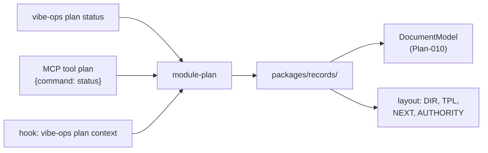

<!-- vibe-ops-template plan@0.2 — KEEP THIS LINE. /vibe-ops:migrate reads it to find artifacts written
     against an older template. Removing it makes this file invisible to migration. -->

# Plan-011: The governance lifecycle becomes three CLI nouns

| Field | Value |
|---|---|
| Status | Backlog |
| Created | 2026-08-10 |
| Author | Danilo Borges |
| Depends on | Plan-009 (Shipped), Plan-010 (Shipped) |
| Related | RFC-0001, ADR-0009, ADR-0011 |

---

## Context

The plan/task/log lifecycle is implemented in **1,107 lines of shell**, spread across
`plugin/scripts/`, `plugin/hooks/` and one skill:

| File | Lines | What it is |
|---|---|---|
| `scripts/resolve-governance.sh` | 191 | the type resolver — where records live, next number, template, `LIVING`, GitHub facts |
| `hooks/plan-progress-nudge.sh` | 245 | reads `Status` and `LIVING`, nudges when a turn misses the living sections |
| `skills/close/finalize.sh` | 217 | the ordering-sensitive tail of task closure |
| `hooks/plan-approved-copy.sh` | 133 | files an approved plan-mode plan |
| `hooks/task-dossier-guard.sh` | 73 | refuses `rm` of a dossier whose `## Closure` box is unchecked |
| `hooks/plan-mode-context.sh` | 72 | injects the plan format at plan time |
| `hooks/new-command-context.sh` | 43 | the resolver in a hook envelope |

**Four of those hooks shell out to `resolve-governance.sh` and re-parse its `KEY=value` output with
`sed`.** Every one of them is reached through `${CLAUDE_PLUGIN_ROOT}`, which under the release freeze
points at a copy made on install day — so a fix here does not reach an installed plugin at all.

Three defects follow from the shape, all measured:

1. **`plan-mode-context.sh:72` restates the living-section names in prose** — "Progress, Surprises &
   Discoveries, Decision Log, Outcomes & Retrospective" — instead of reading the `LIVING=` the resolver
   already computes from the template's own markers, which `plan-progress-nudge.sh:187` does read.
   Against a repository still on `plan@0.1` it is accidentally right; against `plan@0.2`, which declares
   **two** living sections, it prescribes the format that was deleted.
2. **`resolve-governance.sh plan` returns `TPL=(none)` inside this repository**, because there is no
   `project/templates/`. `LIVING` is then `(unknown)` and `plan-mode-context.sh` exits at line 50. The
   plugin's own repository is the one place its plan hooks do nothing — and the cause is that the
   template location is a hardcoded search order with no way to declare an exception. Here the canonical
   templates are the distributable, at `plugin/templates/`.
3. **Nothing reads a plan's `Status` against its own track boxes.** Plan-009 sits `Shipped` with its
   `close plan` box unchecked. The `record-header` gate stops one step short of this on purpose — its header says *"PRESENCE ONLY — the
   value in each row is never validated… reading it mechanically is a different act with its own scope
   than this one."* This plan is that act.

Plan-010 shipped the thing that makes the move cheap: `DocumentModel` parses a record once, and
`record-header`'s `findHeaderTable` already locates a metadata table exactly (measured 21 hits, 7 correct
misses, 0 misfires over 28 records). Reading `Status` and the track checkboxes is a query against a tree
that is already there.

## Goals

1. `vibe-ops <plan|task|log> <verb>` behaves identically from a terminal, over MCP, and from a hook.
2. The plan/task/log format is read from the artifact, once, and never restated in shell prose.
3. `/close` becomes `/close-task` and `/close-plan`, each carrying its own `paths:` and `hooks:`.
4. A closed plan moves to `project/plans/shipped/` and keeps its number.
5. No shell file implements governance logic that a CLI command implements — the rewire lands in the
   same track as the command, never after it.

## Scope

### In scope

- `ModuleDefinition.commands`, and the three surfaces that read a definition: `--help`, flag parsing,
  the MCP input schema.
- `cli/packages/records/` — the resolver in TypeScript, over `DocumentModel`.
- A `records` key on `VibeOpsConfig` declaring record directories and templates, and this
  repository's own `vibeops.config.ts` pointing at `plugin/templates/`.
- `cli/packages/module-plan/`, `module-task/`, `module-log/`, and `module-records/` — the last is the
  generic `vibe-ops records --type <adr|rfc|plan|task>`, for the two types with no noun module of their
  own (see Decision Log).
- `vibe-ops new-context`, the `UserPromptExpansion` hook surface `new-command-context.sh` needed.
- The five governance hooks, rewired to name `vibe-ops` directly (Plan-009's established pattern).
- `resolve-governance.sh`, `finalize.sh` and the five hook scripts **deleted**, not left beside their
  replacements.
- `project/plans/shipped/`, and `plan` moving to `DEPTH=2` in the resolver.
- Splitting `plugin/skills/close/` into `close-task/` and `close-plan/`.

### Out of scope

- **`session-touched-repos.sh` and `session-state-cleanup.sh`.** Neither is governance logic; they are
  session bookkeeping and have no noun here.
- **Closing an RFC.** `records/rfc.md` describes Accepted → Implemented and nothing executes it. It is a
  third skill and a third noun-verb, and admitting it here doubles the surface for a lifecycle nobody has
  run yet.
- **The remaining shell check fragments.** Unchanged from RFC-0001 — an ops composes them or they stay.
- **Publishing the CLI.** `npm link` remains the arrangement.
- **A `log` index generator that rewrites `RETIRED.md`.** `log sweep` reports what is retirable; writing
  the tombstone is the skill's judgement, not the command's.

## Design

### The line between this and `ops-governance`

They are not the same kind of thing and must not merge:

| | Answers | Unit |
|---|---|---|
| `vibe-ops governance` (exists) | *is this record malformed?* | gates over a population — **detection** |
| `vibe-ops plan\|task\|log` (new) | *where does it go, what does it say, close it* | **action** on one artifact's lifecycle |

A gate never mutates and never resolves a destination. `task close` deletes files and posts to an issue.
Putting the second inside an ops would give a detector a `--fix` that files a plan.

### The contract gains `commands`

Today a module is `vibe-ops <id> [flags]`, and `mcp.ts:47` passes `args: []` — so a positional
subcommand is reachable from a terminal and from nowhere else. `ModuleDefinition` gains:

```ts
export interface ModuleCommand {
  readonly name: string;
  readonly summary: string;
  readonly flags?: readonly ModuleFlag[];
}
// on ModuleDefinition:
readonly commands?: readonly ModuleCommand[];
```

The three surfaces that already read a definition each learn one thing:

- `bin.ts` takes `argv[0]` as the command when `commands` is declared, parses that command's flags
  merged with the module's own, and fails naming the valid set when it is unknown.
- `mcp.ts` adds `command: z.enum([...])` to `shapeFor` and passes it through as `args[0]`. One tool per
  noun, not one per verb — the MCP listing is the same shared budget the skill listing is.
- `--help` lists verbs under the noun.

This keeps the doctrine in `cli/AGENTS.md` intact: a module that describes itself wrongly is wrong
everywhere at once, rather than in one surface nobody checks.



### `packages/records/` — the resolver, once

Everything `resolve-governance.sh` computes, in TypeScript, as functions the three modules import:
directory search order per type, template search order, `AUTHORITY`, `PAD`/`EXISTING`/`NEXT`, the GitHub
facts for `task`, and `PLAN_ACTIVE`/`LIVING` read from the template's `LIVING SECTIONS` markers.

Two things change in the port rather than being carried over:

- **`LIVING` is returned as a list, not a `|`-joined string**, so no consumer parses it back out. The
  prose in `plan context` is built from that list — defect 1 cannot recur, because there is no second
  place to write the names.
- **`plan` moves to `DEPTH=2`.** The resolver already does this for `rfc`, with the reason in its own
  comment: *"an implemented or rejected RFC moves into a subfolder and must keep owning its number."*
  A shipped plan moves to `project/plans/shipped/` for exactly that reason, so the count that feeds
  `NEXT` must still see it.

Reading a record goes through `DocumentModel` and reuses `record-header`'s table location — extracted to
`packages/records/` and imported by the gate, so there is one definition of *where a record's header
is*.

### The layout is declarable, and this repository is the first exception

The built-in search order stays exactly what the shell has today, so a repository laid out the ordinary
way declares nothing. What is new is that it can be overridden, on a top-level key rather than a
`settings` slice — three nouns read one resolver, and a per-module slice would be three copies of the
same answer:

```ts
// on VibeOpsConfig
readonly records?: {
  readonly dirs?: Partial<Record<RecordType, string>>;
  readonly templates?: Partial<Record<RecordType, string>>;
};
```

This repository's own `vibeops.config.ts` gains the exception that defect 2 is:

```ts
records: {
  // There is no project/templates/ here: the canonical templates ARE the distributable. Pointing the
  // resolver at them is what makes this repo's own records get written from the very file it ships to
  // every other repository — the drift 35-dogfooding-drift.sh exists to catch, closed at the source.
  templates: {
    adr: "plugin/templates/adr.md",   rfc:  "plugin/templates/rfc.md",
    plan: "plugin/templates/plan.md", task: "plugin/templates/task.md",
    log: "plugin/templates/log.md",
  },
},
```

Two properties this must have, or it trades a silent `(none)` for a silent wrong answer:

- **A declared path that does not exist fails, naming the config file that declared it.** It never falls
  back to the search order — a missing declared template is a typo, and quietly searching past it is how
  the config comes to look like it works.
- **`resolve` reports where the answer came from** (`TPL=plugin/templates/plan.md (config)` vs
  `(search)`). A resolver that returns a path without its provenance cannot be debugged from its output.

`plugin/templates/**` is excluded from the governance ops' *population* by the `ignore` already in this
config, because shipped template content is not this repository's to judge. Reading a template as the
authority for a record's shape is a different act from gating its content — the exclusion stays.

### `vibe-ops plan`

| Verb | Does | Replaces |
|---|---|---|
| `resolve` | the layout block, plus `LIVING` and the active status | `resolve-governance.sh plan` |
| `status` | `Status` against the track checkboxes — **the new detection** | nothing |
| `context` | the plan-time guidance payload, built from the resolved `LIVING` | `plan-mode-context.sh` |
| `file` | copies an approved plan-mode plan into `DIR`, dropping the `Repository` row | `plan-approved-copy.sh` |
| `close` | sets the terminal status and moves the file to `shipped/` | new (Track 6) |

`status` reports incoherence, it does not rank it: a plan at the terminal status with an unchecked track,
or at the active status with every track checked. Both are true of this repository today, which is the
fixture.

### `vibe-ops task`

| Verb | Does | Replaces |
|---|---|---|
| `resolve` | the layout block plus `GH_REMOTE`/`GH_AUTH` | `resolve-governance.sh task` |
| `close` | the whole ordering-sensitive tail, `--dry-run` preserved | `finalize.sh` |
| `guard` | reads the `## Closure` box for a path | `task-dossier-guard.sh` |

`close` is a port, not a rewrite. The three properties its comment header names are the acceptance
criteria and are asserted by test, not by reading: referrers collected across the whole batch **before**
any deletion; the tick committed **before** the `git rm`, so the breadcrumb sha names a commit that still
contains the dossier; the link check run **after** the deletion. `destructive: true` on the module, so
the CLI confirms — the `--dry-run` preview stays because the skill shows its output and waits.

### `vibe-ops log`

| Verb | Does | Replaces |
|---|---|---|
| `resolve` | where entries live; no number, deliberately | nothing (`new-log` Step 2 forbids the resolver) |
| `index` | regenerates `project/log/README.md`, grouped by `path:` prefix | the hand-written row, `new-log` Step 5 |
| `sweep` | `path:` that no longer resolves → retirable | nothing — *"the only retirement detector this tier has"* |
| `lint` | `name:` matches filename, `kind:` ∈ {trap,debt}, no `status:`, real `attempted:` | nothing |

`new-log` Step 5 carries an HTML comment saying *"when the index generator exists this step becomes 'run
it'"*. `index` is that generator, and the comment is deleted in the same track.

`sweep` reports; it never deletes. Retirement is a judgement — an entry whose path moved is not the same
as an entry whose trap is gone.

### `/close` splits into two skills

Not two reference files. The two lifecycles diverge in what happens to the file — a task dossier is
deleted, a plan **moves folder** — and `paths:` and `hooks:` are per skill, so one file cannot carry a
trigger for each. This is the same reason the `route-*` skills were not collapsed.

| Skill | `paths:` | Its own hook |
|---|---|---|
| `close-task` | `project/tasks/*.md` | `PreToolUse` on `Bash` → `vibe-ops task guard` |
| `close-plan` | `project/plans/*.md` | `PostToolUse` on `Write\|Edit` → `vibe-ops plan status` |

Both keep Step 3's routing verbatim — the filter, the placement, and the rule that a rejected entry is
dropped out loud rather than falling through to `project/log/`. `/close` disappears; a router skill that
only forwards costs listing budget for nothing.

### The hooks are the CLI

Per ADR-0009 and Plan-009: the registration names `vibe-ops` directly, no shell, no `command -v` guard.
A missing CLI fails loudly rather than making an unusable install look like a working one. Each hook is
rewired **in the track that creates its command**, so no window exists where a hook and a command both
implement the same rule.

## Tracks

- [x] **Track 1 — `commands` on the contract.** `ModuleCommand`, the `bin.ts` dispatch, the MCP enum
      field, `--help`. At the end a throwaway module declaring two verbs runs both from a terminal and
      answers both over MCP, and an unknown verb fails naming the valid set.
- [x] **Track 2 — `packages/records/`, and `<noun> resolve`.** The resolver in TypeScript, the header
      table located once and imported by `record-header`, the `records` config key with its
      fail-loud and its provenance, and the three modules with their `resolve` verb.
      `new-command-context.sh` rewired and deleted. At the end `vibe-ops plan resolve` matches
      `resolve-governance.sh plan` field for field on the workspace root with `LIVING` a list; in **this**
      repository it reports `TPL=plugin/templates/plan.md (config)` and a real `LIVING` where the shell
      reported `(none)`/`(unknown)`; and a config naming a template that does not exist fails naming the
      config file rather than searching past it.
- [x] **Track 3 — `vibe-ops plan status` and `context`.** The coherence read, and the plan-time payload
      built from the resolved `LIVING`. `plan-mode-context.sh` rewired and deleted, replaced by
      `vibe-ops hook plan-context`. `plan-progress-nudge.sh` is **not** deleted — see Decision Log; only
      its internal `sh "$RESOLVER" plan` call is rewired to `vibe-ops plan resolve`, since the
      rest of that hook (session-transcript offset tracking, the cross-turn `NUDGED` set, the
      date-partitioned log) is session bookkeeping tied to `session-touched-repos.sh`, which Scope
      already excludes. At the end `plan status` names Plan-009's unchecked `close plan` box, and
      `plan context` against a `plan@0.2` template says two living sections rather than four.
- [x] **Track 4 — `vibe-ops task close` and `guard`.** The `finalize.sh` port with its three ordering
      properties under test, and the closure-box read. `task-dossier-guard.sh` rewired and deleted. At
      the end a scratch repository with two dossiers and one referrer closes to the same commits, the
      same breadcrumbs and the same repointed link the script produces, and `--dry-run` mutates nothing.
- [ ] **Track 5 — `vibe-ops log index`, `sweep`, `lint`.** At the end `log index` reproduces the current
      hand-written `project/log/README.md` from the entries themselves; `log sweep` reports zero on this
      repository and one on a fixture whose `path:` was deleted; `log lint` fires on each of the four
      shapes `new-log`'s checklist names. `new-log` Step 5 becomes "run it".
- [ ] **Track 6 — `project/plans/shipped/`, and `plan file`/`plan close`.** `DEPTH=2` for plan,
      `plan close` moving the file, `plan-approved-copy.sh` rewired and deleted. At the end the seven
      shipped plans have moved, `plan resolve` still reports `NEXT=012`, and every link into
      `project/plans/` still resolves under `vibe-ops governance`.
- [ ] **Track 7 — `/close-task` and `/close-plan`.** The split, each with its `paths:`, its `hooks:`
      block and its half of the ceremony; `close/` removed. At the end `claude plugin validate . --strict`
      passes, `25-hooks-registration.sh` accepts both blocks, and neither skill's description exceeds the
      per-skill character cap.
- [ ] **Track 8 — Docs, in the same act.** `cli/AGENTS.md` (the `commands` contract, the three nouns, the
      action/detection line), `plugin/AGENTS.md` (the skill table, the hook list going from six scripts to
      one), `README.md`, and `70-plugin-root-paths.sh` losing the paths of seven deleted scripts.
- [ ] Run `/vibe-ops:close plan` — retrospective against the goals, the demotion check, the tracking
      issue closed. The plan file moves to `project/plans/shipped/` by its own Track 6.

## Success criteria

```bash
cd <this repository's checkout>
npm run build && npm run typecheck && npm test
vibe-ops check .                        # green, with seven fewer plugin-root paths
vibe-ops governance                     # unchanged findings — this plan adds no detection to the ops
```

The three nouns, and the parity that decides whether the port is faithful:

```bash
vibe-ops plan resolve                   # TPL=plugin/templates/plan.md (config), LIVING a 2-item list
                                        # — where the shell reports (none)/(unknown)
vibe-ops plan status                    # names 009's unchecked close-plan box
vibe-ops log lint && vibe-ops log sweep # clean on this repository
vibe-ops task resolve --json | diff - <(sh plugin/scripts/resolve-governance.sh task | …)
```

MCP, where the subcommand has to survive a schema round trip:

```bash
vibe-ops mcp   # tools: check, agents-md, governance, plan, task, log
               # plan's inputSchema carries command: enum[resolve,status,context,file,close]
```

The one that cannot be asserted from a terminal, and is what Plan-009 established as the bar: a real
`claude --plugin-dir` session — not `-p` — writing a plan in plan mode gets the guidance built from
`LIVING`, and a session deleting a dossier with an unchecked `## Closure` box is refused. Nothing claimed
here that was not observed in a transcript.

---

## Decision Log

- Decision: `task close`'s step 7 asks "does any tracked file still link to a deleted dossier", in-process,
  instead of running the whole links gate and grepping one line out of it as `finalize.sh` did. A file left
  dangling is the one outcome that exits non-zero.
  Rationale: the step exists for one measured failure — deleting dossiers left 13 links dangling across two
  documents. The narrow question answers that directly, cannot be diluted by an unrelated finding from
  another gate, and needs no subprocess. It is matched by basename inside a link target, the same way the
  repoint matched, because a referrer writes `](../tasks/001-x.md)` and grepping the repository-relative
  path would miss exactly the links the repoint was aiming at — and report clean. The full gate still runs
  at the commit gate, so nothing is lost by narrowing here.
  Date / Author: 2026-08-10 / Danilo Borges

- Decision: The closure box is read from the tree, and ticked by splicing over the marker node's own three
  characters — one reader (`closureBoxOpen`) shared by `task guard` and `task close`.
  Rationale: the guard and the ceremony must agree about what "closed" means, and two implementations of
  one marker is how they stop agreeing. The tree read is not cosmetic here: a task dossier is the artifact
  most likely to quote a shell transcript or a template excerpt, so a raw-line grep for `- [ ] … close
  task` blocks a legitimate deletion over a quoted example — and it fails in the *blocking* direction,
  which is the expensive one. Splicing the marker node's span also drops the shell's assumption that
  `close task` appears after the box on the same line, which the template's own wrapped line satisfies
  only by accident of where it wraps. The matcher accepts `close task` and `close-task` both, because
  Track 7 renames the skill and dossiers written against either form coexist.
  Date / Author: 2026-08-10 / Danilo Borges

- Decision: `vibe-ops hook <surface>` is the one namespace for every entry point that reads a hook payload
  on stdin — `ops <ops>`, `plan-context`, `new-context`, and the two Tracks 4 and 6 will add. `ops` is a
  reserved first word.
  Rationale: Track 3 shipped `vibe-ops plan-context-hook` as a top-level verb, which left the *narrowest*
  of the surfaces holding the generic word `hook` while its siblings sat beside it — and by Track 6 there
  would have been five names in three shapes. `hook <ops>` could not simply host the new one: it reads
  `tool_input.file_path` (a Pre/PostToolUse-only field), filters on an `AGENTS.md`/`CLAUDE.md` basename,
  passes `--file` (an ops flag), and answers with a hardcoded `hookEventName: "PostToolUse"`. So the
  namespace names the thing they actually share — the envelope — and each surface keeps its own event.
  The reserved `ops` exists because that surface takes an *arbitrary* ops name: without it a third-party
  ops could shadow a surface, or a surface added later could silently shadow someone's ops.
  Date / Author: 2026-08-10 / Danilo Borges

- Decision: Every reader in `packages/records/` takes a `Document` from the caller's `DocumentStore`, and
  each command builds exactly one store for its whole invocation. No reader opens a file, and none takes a
  bare `Parser.SyntaxNode`.
  Rationale: the first implementation of Track 3 read the template and the authority with `readFileSync`
  and scanned lines, then was half-corrected to take a root node — which still bypassed the store. Three
  things follow from taking the `Document` instead, and none of them are stylistic. The store is the
  per-run parse cache, so `plan status` (which resolves and then sweeps) stops parsing the same template
  twice, the way `defineOps` already builds one store for a whole gate composition. `tree === undefined`
  becomes the one way a file says it could not be read, instead of a `try/catch` inventing a second.
  And a `Document` carries `layers`, so an inline question — a link inside a table cell — stays reachable
  from here; a root node closes that door for every future verb. The idiom is
  `cli/packages/core/README.md#the-document-model`, and `gates/markdown-link` is the shape to copy.
  Date / Author: 2026-08-10 / Danilo Borges

- Decision: The authority's status chain is read as the `fenced_code_block` inside the section of the
  heading naming "Plan", and a trailing parenthetical is stripped from every chain term.
  Rationale: measured against `.agents/rules/governance.md` — the chain is written
  `Backlog → In Progress → Shipped   (the file is never deleted)` inside a fenced block. The shell
  searched the eight lines after the heading, which is right only by luck; the `section` node is the
  boundary the document itself declares, so a chain belonging to the *next* record type can no longer be
  attributed to `plan`. The gloss matters because it is new load: the shell only ever took the middle
  term, where the parenthetical is invisible, and `plan status` needs the last one — unstripped it
  compares a plan's `Status` against `"Shipped   (the file is never deleted)"` and matches nothing, ever,
  in silence.
  Date / Author: 2026-08-10 / Danilo Borges

- Decision: `records` joins `core` in `build:foundation`, and `cli`'s build ends in `chmod +x dist/bin.js`.
  Rationale: both are the same defect this repository already documented once — `npm run build --workspaces`
  runs in *directory* order, so `records` (sorting last) was built after every `module-*` that depends on
  it, and they typechecked against its stale `dist/`. That is the false green `cli/AGENTS.md` says cost
  eita three passes, and it reappeared the moment a second foundation package existed. The `chmod` is the
  same class: `npm link` sets the executable bit once, and any `rm -rf dist` silently removes it, leaving
  a linked `vibe-ops` that answers "permission denied" — which now reads as the CLI being absent, since
  hooks name it directly.
  Date / Author: 2026-08-10 / Danilo Borges

- Decision: `27-nudge-behaviour.sh` SKIPs, naming the cause, when `vibe-ops` is not on PATH.
  Rationale: the nudge now resolves through the CLI, so without it every fixture repository is skipped
  *inside the hook* and three assertions fail at once, each describing a silence whose cause appears in
  none of their messages. A SKIP naming the missing binary is the honest report: this is a reading that
  did not happen, not a nudge that misbehaved. The fragment's dependency on `resolve-governance.sh` is
  dropped in the same edit, because the hook no longer calls it.
  Date / Author: 2026-08-10 / Danilo Borges

- Decision: `plan-progress-nudge.sh` is not deleted. Only the `sh "$RESOLVER" plan` call inside it
  (line 141) is rewired to `vibe-ops plan resolve`.
  Rationale: the draft's "rewired and deleted" for this file did not survive reading it in full. 245 of
  its lines are session-transcript offset tracking, a cross-turn `NUDGED` set (Plan-008's own fix for a
  measured regression), at-most-one-plan-per-firing, and a date-partitioned log — all of it inseparable
  from `session-touched-repos.sh`, which Scope already excludes as "session bookkeeping... no noun
  here." That carve-out and "delete this whole file" cannot both be true. Only the ~15 lines that
  literally re-derive what Track 2's resolver now computes move; the rest has no noun in this plan to
  move to.
  Date / Author: 2026-08-10 / Danilo Borges

- Decision: The new resolver package is `@entelekheia/vibe-ops-records` (`cli/packages/records/`), not
  `packages/governance/` as originally drafted; the config key is `records`, not `governance`.
  Rationale: `@entelekheia/vibe-ops-governance` already exists — it is `ops-governance`'s own npm package
  name. The draft would have collided with a real, shipping package. Caught before any code was written,
  by checking `cli/packages/ops-governance/package.json` at the start of Track 2.
  Date / Author: 2026-08-10 / Danilo Borges

- Decision: `module-records` (`vibe-ops records --type <adr|rfc|plan|task>`) and the `new-context` verb
  exist, though neither is named in Scope.
  Rationale: `new-command-context.sh` resolves all four record types, not only the three with a noun
  module here — `adr` and `rfc` have no lifecycle actions in this plan (Out of scope) but still need
  their layout resolved for `/new`. Goal 5 ("no shell file implements governance logic that a CLI
  command implements") has no exception for these two types, so the hook needs one command that answers
  for all four. `module-records` is that command; `new-context` is the `UserPromptExpansion`-shaped
  hook surface it did not have (`hook.ts`'s `runHook` is specific to `PostToolUse` + `tool_input.file_path`).
  Date / Author: 2026-08-10 / Danilo Borges

- Decision: Three nouns with declared subcommands, rather than nine flat module ids.
  Rationale: the grouping is the artifact type, and nine ids lose it. The cost is one field on
  `ModuleDefinition`, which is where every surface already reads — so the verb reaches `--help`, flag
  parsing and the MCP schema from one declaration rather than three.
  Date / Author: 2026-08-10 / Danilo Borges

- Decision: `/close` becomes two skills, not one skill with per-type reference files.
  Rationale: the lifecycles diverge in what happens to the file — a dossier is deleted, a plan moves
  folder — and `paths:` and `hooks:` are declared per skill. A single file cannot carry a trigger for
  each, which is the same reason the `route-*` skills were not collapsed.
  Date / Author: 2026-08-10 / Danilo Borges

- Decision: A closed plan moves to `project/plans/shipped/`; `plan` becomes `DEPTH=2` in the resolver.
  Rationale: the resolver already carries this exact case for `rfc`, with the reason in its own comment —
  a record that moves out of the active directory must keep owning its number, or the next one collides.
  A sibling directory would make the count span two paths, which is the collision the depth rule exists
  to avoid.
  Date / Author: 2026-08-10 / Danilo Borges

- Decision: Each hook is rewired in the track that creates its command, and its script is deleted there.
  Rationale: `ops-agents-md` ran beside the fragments it ported until the two were shown to agree, which
  was right for a detector — a disagreement is a finding. A hook is not a detector: two implementations
  of one rule both firing means the rule fires twice, and the stale one is the one on `${CLAUDE_PLUGIN_ROOT}`.
  Date / Author: 2026-08-10 / Danilo Borges

- Decision: The action nouns stay out of `ops-governance`.
  Rationale: a gate is a pure detector that never mutates (RFC-0001). `task close` deletes files and posts
  to an issue; admitting it as a gate would give a detector a `--fix` that files a plan.
  Date / Author: 2026-08-10 / Danilo Borges

- Decision: Record directories and templates are declarable in `vibeops.config.ts`, under a top-level
  `records` key, and this repository declares `plugin/templates/`.
  Rationale: the shell's search order has no exception mechanism, which is why the plugin's own repository
  is the one place its plan hooks do nothing. The key is top-level rather than a `settings` slice because
  three nouns read one resolver and a per-module slice would be three copies of the same answer. A
  declared path that does not resolve fails rather than falling back — trading a silent `(none)` for a
  silent wrong answer is not a fix.
  Date / Author: 2026-08-10 / Danilo Borges

- Decision: `LIVING` crosses the boundary as a list, and the plan-time prose is built from it.
  Rationale: defect 1 is a second place where the section names are written down. Returning a string that
  a consumer re-splits recreates the same opportunity; returning a list removes it.
  Date / Author: 2026-08-10 / Danilo Borges

## Outcomes & Retrospective

<!-- Written at track completion, not now. -->

---

## Open questions

- Does the header-table locator move to `packages/records/` and get imported by `record-header`, or
  the reverse — the gate keeps it and `governance` imports from `gates/`? The first keeps detection
  depending on the shared reader; the second makes an action package depend on a detector. Track 2
  answers it by writing the import that does not create a cycle.
- `plan status` finds two incoherences in this repository today. Is a stalled plan a **finding** of the
  governance ops, or only a report of `plan status`? Admitting it to the ops means every commit is judged
  against plan hygiene, which is a policy decision this plan does not own.
- `project/plans/shipped/` will hold seven files on the day Track 6 lands, and every existing link into
  `project/plans/NNN-*.md` from an ADR, an RFC or a README breaks. Does Track 6 rewrite them, the way
  `task close` repoints referrers, or does `markdown-link` simply catch them and they are fixed by hand?

## Related

- `project/plans/009-the-first-skill-scoped-hook-and-the-cli-it-calls.md` — the hook-is-the-CLI pattern
  and the co-dependency this plan applies five more times.
- `project/plans/010-the-document-model-under-the-gates.md` — `DocumentModel`, and `record-header`
  stopping deliberately at presence.
- `project/rfc/0001-gates-and-ops-as-the-cli-unit-of-composition.md` — the gate/ops split this plan
  declines to stretch.
- `project/adr/0009-hooks-as-a-delivery-surface.md` — the four obligations every rewired hook must meet.
