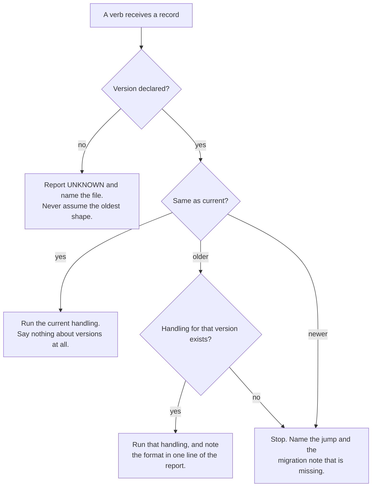

<!--
 Copyright (c) 2026 Danilo Borges (https://github.com/daniloborges)

 Licensed under the Apache License, Version 2.0 (the "License");
 you may not use this file except in compliance with the License.
 You may obtain a copy of the License at

 https://www.apache.org/licenses/LICENSE-2.0
-->

<!-- vibe-ops-template plan@0.2 — KEEP THIS LINE. /vibe-ops:migrate reads it to find artifacts written
     against an older template. Removing it makes this file invisible to migration. -->

# Plan-012: Versions travel with the record

| Field | Value |
|---|---|
| Status | Backlog |
| Created | 2026-08-11 |
| Author | Danilo Borges |
| Related | [RFC-0001](../rfc/0001-gates-and-ops-as-the-cli-unit-of-composition.md), [Plan-011](shipped/011-the-governance-lifecycle-becomes-three-cli-nouns.md) |

---

## Summary

Three kinds of thing in this repository change their behaviour over time — the governance templates a
record is written against, the detectors a gate run applies, and the shape of the observations a run
emits — and only the first of them says so on the artifact it produces. A record written against an older
template carries a stamp; a finding produced by a detector that has since changed carries nothing, so two
readings under the same id are not comparable and nothing reports that. This plan puts a version on every
instrument, moves it to a machine-readable place, makes it travel onto the record that instrument
produces, and makes an absent version a refusal rather than a silent default. It then spends that on two
things: a verb handed an older record routes to the handling that matches it, and the spread of records
still sitting on old versions becomes a readable health signal for the repository.

## Goals

1. Every instrument that can change behaviour — template, gate, shell fragment, ops, module — declares a
   version, in frontmatter or in a definition, and that version is on the record it produces.
2. An artifact carrying no version is reported as **unknown**, never silently treated as the oldest known
   shape, and a mechanical check keeps the unversioned population from growing.
3. A verb handed a record written against an older version routes to the handling for that version and
   says so in one line. It never asserts the current shape about a record that does not have it.
4. Version is invisible in ordinary use. It reaches the operator only as an alert, as a health reading, or
   through the verbs whose subject *is* versions and migration.
5. Two observations recorded under the same id at different times can be told apart when the instrument
   between them changed.
6. What is open and what is behind a version is answerable from the repository itself, as the signal that
   says where an upgrade or a fix is owed.

## Scope

### In scope

`plugin/templates/`, the version declarations on records under `project/`, `GateDefinition` and the ten
gates in `cli/packages/gates/`, the seventeen shell fragments in
`cli/packages/module-check/sh/checks/`, the emitter in `cli/packages/core/src/emit.ts`, the closing and
creating skills under `plugin/skills/`, and the shared policy files in `plugin/references/`.

### Out of scope

**Research documents.** The five documents under `project/research/` have no template and the type is
still being felt out. Bringing them into the versioning scheme now would fix a shape that is not settled;
they are excluded explicitly, with the reason recorded, rather than left to read as permanently unknown.

**The hook output contract.** A hook's input envelope belongs to the host and is not this repository's to
version; its output wording is, and it is behaviour, which makes it a candidate for observation as a trait
rather than for a version field. That is a different mechanism from everything else here, it needs a
case-by-case judgement, and folding it in would make this plan two plans.

**Bumping any package version to a release.** Every package in `cli/` sits at `0.0.1` and the plugin
manifest is frozen by policy. This plan makes the version *fields* meaningful and load-bearing; deciding
that a number moves is a release decision and belongs to whoever cuts one.

**Retro-migrating existing records to the current shape.** The backfill declares which shape a record
*is*. Converting a record from one shape to another is `/vibe-ops:migrate`'s job, run per artifact, with a
decision per entry — and it is deliberately not bundled here, because bundling it is how a mechanical
backfill silently deletes a working record.

## Design

The failure this plan removes has one shape, and it appears three times. An instrument produces an
artifact; the artifact does not name the instrument's version; a later consumer assumes the current
version. When the assumption is wrong the consumer does not fail — it produces a plausible, stable, wrong
answer. That is the same failure as grouping observations under an absent condition defaulted to zero: the
output is indistinguishable from a correct one.

**The version goes on the record, not in a registry beside it.** A lookup table mapping artifact to
instrument version is a second place to forget, and it is wrong the moment an artifact is copied. The
declaration travels with the bytes.

### Two axes, and what moves on each

A thing that can change carries two independent numbers, and conflating them is what makes either one
useless:

| Axis | Form | Moves when |
|---|---|---|
| **Document / instrument version** | integer — `plan@2`, `budget@1` | the shape or the behaviour changes in a way a consumer must handle differently |
| **Package version** | semver — `0.0.1` | the package is released |

The integer moves **only on a break** — the change a consumer cannot absorb silently. A detector made
stricter within the same vocabulary does not move it; a detector that starts reporting a category nobody
was handling does. This is the same split the observation framework this repository emits into already
uses, and it is the shape of a pinned major tag in a CI workflow: the consumer names an integer and never
sees the patch stream underneath it.

### The declaration lives in frontmatter

The version is machine-read, so it belongs where a machine reads first. Frontmatter carries it; the
header table in a record becomes a **thin presentation layer** whose only job is rendering in a markdown
preview, never the source of truth. Today's HTML-comment stamp is the intermediate form and is migrated
away — a comment above the H1 is a position that has to be described in prose to every consumer, which is
exactly how one measurement of this repository came back wrong.

Every template moves, so every type takes a version jump with a migration note, written through
`/vibe-ops:new-migration`. That is Track 1, and it is first for a mechanical reason: a sensor built to
read the current position would be invalidated by the move it precedes.

### The dispatch, and where the operator sees it

Ordinary use must not acquire a version vocabulary. A verb resolves the version, picks its handling, and
mentions it only when the answer is not "current". There is no `--version` flag on an ordinary verb, and
no question asked at the prompt.

The `no` branch is the one that carries the plan's weight. Treating an absent declaration as the oldest
known version is a claim about the file's shape that nobody verified, and it is wrong in both directions:
a record already written in the current shape but never declared receives a migration that does not apply
to it, and a genuinely old record looks handled when it was guessed at.

### The health reading

Once every record declares a version, the interesting number is not how many are stamped — it is **what is
open and what is behind**. A record still on an older version is a place where an upgrade is owed; a
record that is open *and* behind is where a fix is owed first. That reading is the sensor's real output,
and counting stamps is only the means to it.

### Where a version has to be declared, and where it already is

`ModuleDefinition` and `OpsDefinition` in `cli/packages/core/src/` both require `version`.
`GateDefinition` in `cli/packages/core/src/gate.ts` does not — it carries `id`, `summary`,
`defaultPaths` and `fixable`. The gate is the detector, so it is the one whose change actually
invalidates a comparison, and it is the one with no version. The seventeen shell fragments under
`cli/packages/module-check/sh/checks/` have none either, and they are the baseline the `fragment-parity`
gate compares a port against.

### The emitted record, and the shape it must converge on

`cli/packages/core/src/emit.ts` writes one flat object per observation:
`{observedAt, producer, repo, id, subject, value, tags}`. The receiving side accepts a different shape: a
header line declaring `kind`, the producer, the instrument as `<name>@<version>`, the moment and the
population actually examined, followed by finding lines. It validates that header and **refuses** anything
that does not open with it.

So the two do not meet, and the consequence is measurable: the shell emission path reaches the receiving
registry and is ingested, while everything the TypeScript emitter has written is unreadable to it. The
emitter converges on the accepted shape rather than the receiving side growing a second branch — a
translator with a branch per producer shape is the lookup table this design rejected, moved one repository
over. The record also gains its own schema version, because two producers already write into one directory
and a third consumer cannot otherwise tell which shape it is reading.

The instrument field is where the gate version lands: the shell path already writes an instrument name
carrying a trailing `@1` by hand, so the target shape exists and has a consumer. Track 4 makes it declared
rather than hand-written.

### Recovering after a compaction

This file is written to be the whole context. A session that loses its history recovers by reading this
plan and the task dossiers in `project/tasks/` named by the tracks below — in that order, and nothing
else. Anything a track needed that is not in one of those files was not written down, and rewriting it
from memory is the failure this plan exists to prevent.

## Tracks

- [ ] **Track 1 — The version moves to the frontmatter.** Every template under `plugin/templates/` gains
      frontmatter carrying its version; the header table becomes presentation only. Each type takes a
      version jump with its migration note, written through `/vibe-ops:new-migration` — five types, five
      notes. At the end the version is read from a parsed field rather than from a position described in
      prose. First, because a sensor built against the old position would be invalidated by this move.
      Acceptance: every template declares its version in frontmatter; every jump has a note; no note was
      invented for a jump that did not happen.
      Task: `project/tasks/001-the-version-moves-to-the-frontmatter.md`

- [ ] **Track 2 — The sensor, and the health reading it produces.** A check fragment that reads the
      frontmatter version and reports a record without one as `UNKNOWN`, naming the file. Its real output
      is the health reading: what is open, and what is behind a version — the signal that says where an
      upgrade or a fix is owed. At the end the unversioned and out-of-date populations are reported by the
      gate rather than discovered by hand, and neither can grow silently. Acceptance: the fragment
      reports unknown, open-and-behind, and behind separately; its fixture proves each fires.
      Task: `project/tasks/002-the-sensor-and-the-health-reading.md`

- [ ] **Track 3 — The emitted record reaches eita.** `cli/packages/core/src/emit.ts` writes the
      header-plus-findings shape the receiving side accepts, carrying its own schema version, the
      population examined and the moment. The local artifacts written under the old shape are deleted, not
      converted. At the end an artifact produced by an ops is ingested the way the shell path already is.
      Acceptance: an emission from `ops-governance` is accepted end to end; the previous flat shape appears
      nowhere.
      Task: `project/tasks/003-the-emitted-record-reaches-eita.md`

- [ ] **Track 4 — The gate declares its version.** `GateDefinition` gains a required integer `version`
      that moves only on a break, and it travels into the emitted record's instrument field. The seventeen
      shell fragments gain the same declaration, replacing the one hand-written instance. Breaking for the
      ten gates in `cli/packages/gates/`. At the end two observations recorded under one id at different
      times can be told apart when the detector between them changed. Acceptance: every gate and every
      fragment declares a version; an emission carries it; `defineGate` rejects a definition without one.
      Task: `project/tasks/004-the-detector-says-which-detector-it-is.md`

- [ ] **Track 5 — Backfill the declarations.** Every governance record under `project/` except research
      declares the template version it was written against. Mechanical for the types whose template has
      only ever had one version; the plans require reading each file's actual shape before claiming one,
      because the declaration is an assertion about the file and not a default. At the end Track 2's
      fragment reports no unknowns. Acceptance: zero unknown records, and no declaration written without
      the file being read.
      Task: `project/tasks/005-backfill-the-version-declarations.md`

- [ ] **Track 6 — Verbs dispatch on the version they were handed.** The creating and closing skills, and
      the CLI verbs behind them, resolve a record's version and route to the handling that matches it,
      reporting the format in one line when it is not current and stopping when no handling exists. No flag
      and no prompt. The mechanism for keeping several versions' behaviour alive is open and is explored
      when this track runs — a skill-scoped hook forwarding to a versioned sibling skill is the candidate.
      At the end a closing verb can no longer assert the current shape about a record that does not have
      it. Acceptance: closing a record written against a previous version routes correctly and says which
      format it used; closing a current one mentions no version at all.
      Task: `project/tasks/006-verbs-dispatch-on-the-version.md`

- [ ] **Track 7 — The cited policy says which policy.** The files under `plugin/references/` are cited by
      name as the authority by more than one skill, and they change. Each declares a version — in
      frontmatter if a prose file can carry it, otherwise by a versioned filename with each citation
      pointing at one — and a closure records which version of the policy it applied. At the end it is
      answerable which closures ran under which routing rule. Acceptance: every reference declares a
      version; a closure's record names the one it applied.
      Task: `project/tasks/007-the-cited-policy-says-which-policy.md`

- [ ] Run `/vibe-ops:close-plan` — retrospective against the goals, the demotion check. The plan file
      itself is kept. Stays unchecked until the plan is actually closed; a track list that is otherwise
      complete but has this box open is not finished.

## Success criteria

Run from the repository root:

- `vibe-ops check .` is green, including the Track 2 fragment, and `vibe-ops check --self-test` still
  asserts every fragment fires on a deliberately broken fixture.
- Every template under `plugin/templates/` declares its version in frontmatter, and every version jump it
  took has a migration note beside it.
- The Track 2 fragment reports zero unknown records outside `project/research/`, and prints the
  open-and-behind reading as a separate number from the behind reading.
- `vibe-ops governance` and `vibe-ops agents-md` each produce an artifact whose first line declares the
  schema version, the producer, the instrument with its version, the moment, and the population examined,
  and that artifact is accepted by the receiving side.
- Every gate under `cli/packages/gates/` and every fragment under `cli/packages/module-check/sh/checks/`
  declares an integer version; constructing a gate without one fails at define time, with a test asserting
  it.
- Closing a record written against a previous version reports which format it used, in one line. Closing a
  current one produces no mention of a version anywhere in its output.
- `npm test` from the repository root passes, having built the foundation packages first.

---

<!-- ===== LIVING SECTIONS — maintained during the work, not written at the end ===== -->

## Decision Log

- Decision: version handling is the CLI's and the MCP server's, and it is transparent. An ordinary verb
  resolves the version and acts; version reaches the operator only as an alert, as a health reading, or
  through the verbs whose subject is versions and migration.
  Rationale: a version vocabulary imposed on ordinary use is a tax paid on every invocation to serve the
  rare one. The operator's question is "close this record", never "close this record, which is at 0.1".
  Making it a flag also makes it answerable wrongly under time pressure, and making it a prompt puts a
  question on the path taken every time.
  Date / Author: 2026-08-11 / Danilo Borges

- Decision: an absent version is reported as unknown and refused, never defaulted to the oldest known
  shape.
  Rationale: the default is an unverified assertion about the file's shape, and it is wrong in both
  directions — a record already in the current shape receives a migration that does not apply, and a
  genuinely old one looks handled when it was guessed at. A guess that produces a stable, plausible result
  is indistinguishable from a correct one, which is the class of failure this whole plan is about.
  Date / Author: 2026-08-11 / Danilo Borges

- Decision: two version axes, and they are independent — an **integer** for the document or instrument
  version, moving only on a break, and **semver** for the package, moving on release.
  Rationale: one number cannot serve both. A package version moves for reasons a consumer of the artifact
  does not care about, so routing on it would re-route on every patch; an integer that moves only when a
  consumer must handle something differently is exactly the signal a dispatch needs. This is the split the
  observation framework this repository emits into already uses, and it is the shape of a pinned major tag
  in a CI workflow — the consumer names an integer and never sees the patch stream underneath it.
  Date / Author: 2026-08-11 / Danilo Borges

- Decision: the version is declared in **frontmatter**, and a record's header table becomes a thin
  presentation layer for markdown preview tools rather than a source of truth.
  Rationale: the version is machine-read, so it belongs where a machine reads first. The HTML-comment
  stamp is a position that has to be described in prose to every consumer, and that description has
  already failed once — a substring match over a whole file counted a prose mention as a stamp and made
  this repository's unversioned population look smaller than it is. A parsed field cannot be matched by
  accident.
  Date / Author: 2026-08-11 / Danilo Borges

- Decision: the emitter converges on the shape the receiving side already accepts, rather than the
  receiving side gaining a branch for the shape the emitter currently writes.
  Rationale: a translator with one branch per producer shape is a lookup table mapping artifact to
  instrument, which is the design this plan rejects — moved one repository away rather than removed. The
  receiving shape also already carries the instrument-with-version field this plan needs, so converging
  costs less than branching and lands the plan's own requirement for free.
  Date / Author: 2026-08-11 / Danilo Borges

- Decision: the observations already written under the old emitted shape are deleted rather than
  converted.
  Rationale: they are unreadable to the only consumer that exists, they are a day old, and they live
  outside version control. Converting them would spend real effort to preserve a sample nothing has ever
  read, and would put the first records of a new schema into the world as reconstructions rather than
  observations.
  Date / Author: 2026-08-11 / Danilo Borges

- Decision: the sensor runs before the backfill, and the frontmatter move runs before the sensor.
  Rationale: the backfill is a one-time act against a population that is still growing, so the sensor
  bounds it first and tells it which files it is about — a hand-built list would be one more thing to go
  stale. The frontmatter move goes first for the same class of reason inverted: a sensor built to read the
  comment position would be invalidated by the move that follows it.
  Date / Author: 2026-08-11 / Danilo Borges

- Decision: `project/research/` is out of scope for versioning, explicitly rather than by omission.
  Rationale: the type has no template and its shape is still being felt out. Fixing a version scheme onto
  it now would settle by accident something that has not been decided, and leaving it unmentioned would
  make five documents read as permanently unknown to the sensor. Excluded, with the exclusion recorded so
  the sensor's silence about them is a statement rather than a gap.
  Date / Author: 2026-08-11 / Danilo Borges

- Decision: this plan's tasks open no GitHub issues; the dossiers carry the whole working record.
  Rationale: the work is internal and single-operator for now. ADR-0006 splits a task across an issue and
  a dossier so that status and summary live where collaborators look — with no collaborators and no issue,
  that split buys nothing and costs a second surface to keep current. The dossier remains ephemeral and is
  still closed through `/vibe-ops:close-task`; only the issue half is absent.
  Date / Author: 2026-08-11 / Danilo Borges

- Decision: the hook output contract is cut from this plan.
  Rationale: it is behaviour rather than shape, which makes it a candidate for observation as a trait
  rather than for a version field — a different mechanism from every other track here, needing a
  case-by-case judgement. Recorded as out of scope rather than dropped, so the question survives the plan
  that declined to answer it.
  Date / Author: 2026-08-11 / Danilo Borges

## Outcomes & Retrospective

*Not yet written — the plan has not started.*

<!-- ===== END LIVING SECTIONS ===== -->

---

## Open questions

Both are deliberately left to the track that runs into them, because deciding either from here would be
deciding it without the code in front of you.

- **How several versions of a skill's behaviour stay alive at once** (Track 6). The candidate is a
  skill-scoped hook that forwards to a versioned sibling — `close-plan` dispatching to a `close-plan-2`
  that keeps the older handling intact rather than branching inside one skill body.

- **Whether a prose reference under `plugin/references/` can carry frontmatter** (Track 7). If it can, it
  uses the same mechanism as everything else. If it cannot, the fallback is a versioned filename with each
  citation pointing at one, which leaves room for a `references/<name>/<version>.md` layout later.

## Related

- [RFC-0001 — Gates and ops as the CLI's unit of composition](../rfc/0001-gates-and-ops-as-the-cli-unit-of-composition.md)
- [ADR-0004 — Budgeted artifacts, and a guard instead of a line](../adr/0004-budgeted-artifacts-and-guards.md)
- [ADR-0006 — A task is an issue plus an ephemeral dossier](../adr/0006-task-as-issue-plus-ephemeral-dossier.md)
- [Plan-010 — The document model under the gates](shipped/010-the-document-model-under-the-gates.md)
- [Plan-011 — The governance lifecycle becomes three CLI nouns](shipped/011-the-governance-lifecycle-becomes-three-cli-nouns.md)
