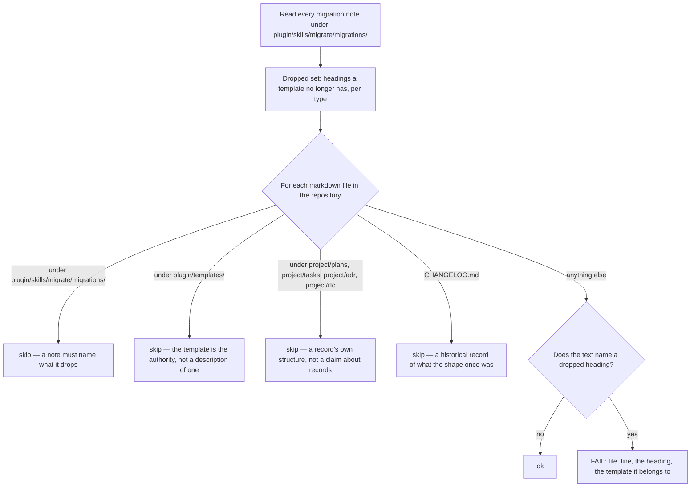

<!--
 Copyright (c) 2026 Danilo Borges (https://github.com/daniloborges)

 Licensed under the Apache License, Version 2.0 (the "License");
 you may not use this file except in compliance with the License.
 You may obtain a copy of the License at

 https://www.apache.org/licenses/LICENSE-2.0
-->

# Plan-014: The prose that describes a template is checked against the template

| Field | Value |
|---|---|
| Status | Backlog |
| Created | 2026-08-13 |
| Author | Danilo Borges |
| Related | [`project/log/dropping-a-section-from-a-template.md`](../log/dropping-a-section-from-a-template.md), [Plan-012](shipped/012-versions-travel-with-the-record.md) |

---

## Summary

When a template loses a section, every sentence written elsewhere that describes that template's shape
becomes false in the same commit, and it stays readable as authority for as long as nobody looks. This
already happened here: the plan template lost `Progress` and `Surprises & Discoveries`, four documents
describing the old shape were found two days later, and the finding was written down as a trap. The sweep
that followed corrected one of them. At least five more still carry the claim today, two of which are
shipped into every repository this plugin scaffolds, and one of which is the reference file the record
skill instructs an author to read before writing a plan. On 2026-08-13 two agents auditing this repository
read that prose and reported the dropped sections as the current model. This plan finishes the sweep, and
then makes the sweep unnecessary by deriving the dropped-heading set mechanically and failing on it.

## Goals

1. No document in this repository states that a record carries a section its template does not have.
2. Nothing this repository ships into another repository carries that statement either.
3. A section dropped from any template is caught on the commit that drops it, not by a reader later.
4. The check separates a **record that has** an old heading — legitimate, it was written against an older
   template — from a **document that says** records have it, which is the defect.
5. The check is proven to fail on a fixture built to break it, before it is trusted anywhere.

## Scope

### In scope

The five templates under `plugin/templates/`, as the only authority on what a record's shape is today.
The documents that describe them: `plugin/references/`, `GOVERNANCE.md`, `.agents/rules/`, and the
scaffolding copies under `plugin/skills/setup/templates/`. One new gate under `cli/packages/gates/src/`,
its fixture, and its composition into the governance ops. The inventory named in Track 1.

### Out of scope

**Migrating the records that were written against an older template.** A plan carrying
`## Surprises & Discoveries` because it was authored when the template had that section is correct as it
stands; changing it is a separate job with its own per-entry decisions, and it is not this plan.

**The opposite direction** — a document that fails to mention a section a template *gained*. Absence
cannot be located the way a forbidden string can, and a check that guesses at it would fire on every
document that legitimately says nothing about templates. Recorded under `Open questions`.

**Every other kind of stale prose.** Documents in this repository also name scripts and command flags that
no longer exist. That is the same class of failure with a different detector and belongs to its own plan.

## Design

The hard part is not finding the string. It is knowing which strings are forbidden and where.

**What a template no longer has is already declared.** Every migration note under
`plugin/skills/migrate/migrations/` opens with a table naming each section and its fate across one version
jump — the note for the plan template's first jump marks `Progress` and `Surprises & Discoveries` as
`dropped` in exactly that form. Reading the notes gives the dropped set as an assertion someone wrote on
purpose. Deriving it from git history instead was considered and rejected: history answers *what changed*
and not *what the change meant*, so a renamed section reads as a drop plus an addition, and the check
would then demand that documents stop naming a section that still exists.

**Where the forbidden string is a defect is a question about the file, not about the sentence.** A record
written against an older template legitimately carries the old heading as its own structure. A document
that describes the shape of records must not name it at all. No content heuristic separates those two
reliably, and one that tried would be the kind of guard that passes because it is not looking. The
separation is therefore a path policy, declared and reviewable:

The gate is `template-heading-drift`, written in `cli/packages/gates/src/` against the document model the
other gates already consume, so that a heading named inside a fenced code block or an inline code span is
read as text and a heading named in a link target is not mistaken for prose. It is composed into the
governance ops, beside the other gates that read this repository's own records.

Two properties are required of the failure message, because both were missing from the sweep that
preceded this plan. It names **which template** the heading belongs to, so the reader knows whether the
sentence is wrong or merely about a different type. And it names **every** occurrence rather than the
first, because the failure mode being prevented is a partial sweep.

## Tracks

- [ ] **Track 1 — Correct the inventory.** Six files state that a plan carries four living sections, or
      instruct an author to write into a section the plan template no longer has. Four are in this
      repository — the human-facing governance document, the always-on rule that governs work inside the
      records directory, and the record-type reference the `/new` skill tells an author to read, which
      contradicts itself within forty lines: its checklist names two living sections while its migration
      guidance and its maintenance contract both name the dropped ones. Two more are the scaffolding
      copies under `plugin/skills/setup/templates/`, which means every repository brought to the baseline
      since the drop received the false text as its own governance. At the end each file describes the
      two living sections the template actually has. Acceptance: the check built in Track 2, run before it
      is wired anywhere, reports nothing.
- [ ] **Track 2 — Build the gate.** `template-heading-drift` reads the migration notes for the dropped
      set, walks the repository under the path policy above, and reports one finding per occurrence. At
      the end the gate exists, declares its version like every other gate, and is unit-tested against a
      fixture directory rather than against the repository. Acceptance: the unit tests pass, and the gate
      run against the tree as it stands *before* Track 1 lands reports the six files.
- [ ] **Track 3 — Prove it fails.** A guard nobody has watched fail is not yet evidence of anything, and
      this repository has shipped that mistake before. At the end `vibe-ops check --self-test` builds a
      copy carrying a dropped heading in a describing document and asserts the gate fires, and the
      self-test runs ahead of the real check in continuous integration. Acceptance: deleting the gate's
      detection makes the self-test fail.
- [ ] **Track 4 — Compose and document.** The gate joins the governance ops so it runs with the others,
      and the one fact a reader cannot derive — that dropping a section from a template now has a
      mechanical consequence — is stated where template versions are already discussed. At the end
      `vibe-ops governance --list` names it. Acceptance: a scratch edit that reintroduces a dropped
      heading into a describing document fails the commit gate.
- [ ] Run `/vibe-ops:close-plan` — retrospective against the goals, the demotion check, and the check for
      whether this gate makes any existing written instruction redundant. The plan file itself is kept.

## Success criteria

Run from the repository root:

- `vibe-ops governance --list` names `template-heading-drift`.
- `vibe-ops governance` exits zero with no finding from that gate.
- `vibe-ops check --self-test` passes, and its output shows the new fixture case running.
- Reintroducing `Surprises & Discoveries` as a claim about plans into any file outside the skipped paths
  makes `vibe-ops governance` fail, naming the file, the line and the template.
- Grepping the scaffolding copies under `plugin/skills/setup/templates/` for the dropped section names
  returns nothing, so a repository brought to the baseline receives the current shape.

---

## Decision Log

- Decision: the dropped-heading set is read from the migration notes, not from git history.
  Rationale: a migration note is an assertion someone wrote deliberately, one row per section, already
  required to exist for every version jump. History records that lines moved and cannot distinguish a
  rename from a drop followed by an addition, which would make the check demand that documents stop
  naming sections that still exist.
  Date / Author: 2026-08-13 / Danilo Borges

- Decision: a record keeping an old heading is out of scope, and the separation between a record and a
  description of records is a declared path policy rather than a content heuristic.
  Rationale: a plan written against an older template legitimately carries that template's structure, and
  no sentence-level rule separates that from a claim about how plans are shaped. A path list is wrong in
  a way a reader can see and correct; a heuristic is wrong in a way that looks like a clean tree.
  Date / Author: 2026-08-13 / Danilo Borges

- Decision: discovery and mechanical edits under a contract that fits in a paragraph may be handed to a
  subagent; any judgement that has to agree with this plan's intent may not.
  Rationale: the audit that produced this plan used five subagents, and two of them read the stale prose
  this plan exists to remove and reported the wrong model as current. Sweeping for a fixed string and
  reporting file and line is a closed contract and delegates cleanly. Deciding whether a given sentence
  is a description of a template or a record's own structure is exactly the judgement that drifts.
  Date / Author: 2026-08-13 / Danilo Borges

## Outcomes & Retrospective

*Not yet started.*

---

## Open questions

- The reverse direction: a document that never mentions a section a template **gained** is equally wrong
  and cannot be found by looking for a string. Whether that is worth a second detector, or whether adding
  a section is rare enough and visible enough to leave to review, is unresolved.
- A **renamed** section is a third case: the old name is forbidden and the new one is required in the same
  places. The migration notes carry enough to detect it; whether the gate should report it as its own
  verdict rather than as a drop is not decided.

## Related

- [`project/log/dropping-a-section-from-a-template.md`](../log/dropping-a-section-from-a-template.md) —
  the trap this plan closes, recorded when the first four copies were found.
- [Plan-012](shipped/012-versions-travel-with-the-record.md) — moved the version stamp into the
  frontmatter and found the first stale copies while doing it.
