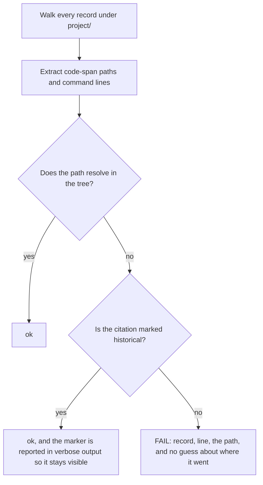

<!--
 Copyright (c) 2026 Danilo Borges (https://github.com/daniloborges)

 Licensed under the Apache License, Version 2.0 (the "License");
 you may not use this file except in compliance with the License.
 You may obtain a copy of the License at

 https://www.apache.org/licenses/LICENSE-2.0
-->

# Plan-015: A closed record that cites a path that no longer exists

| Field | Value |
|---|---|
| Status | Backlog |
| Created | 2026-08-13 |
| Author | Danilo Borges |
| Related | [Plan-014](./shipped/014-the-prose-that-describes-a-template-is-checked-against-it.md) |

---

## Summary

A plan is kept forever precisely so someone can open it in a year and find out why the thing is shaped
the way it is. Seven of the closed plans in this repository name a script, a directory, an environment
variable or a command flag that no longer exists, and most of those citations sit in `Success criteria` —
the section whose entire purpose is to be runnable. The capability each one describes survived; it was
moved into a package, renamed, or turned into a command verb by a later plan that had no reason to know
who was pointing at it. Nothing detects this. The version stamp on a record is checked, its links are
checked, and the commands pasted into its body are not. This plan settles what a permanent record owes
when the tree moves underneath it, applies that answer to the known cases, and adds the detector.

## Goals

1. It is written down, once, what happens to a permanent record when a path it cites stops existing —
   and the answer is neither "rewrite history" nor "leave the reader with a dead command".
2. Every currently dead citation in a closed record is resolved under that policy.
3. A record that cites a path which stops resolving is reported by a check rather than discovered by a
   reader following it.
4. A citation that is *deliberately* historical can be marked as such and stops being reported, using the
   same kind of inline marker this repository already uses to exempt a known-good exception.

## Scope

### In scope

The records under `project/plans/` and `project/plans/shipped/`, and the one live reference file that
carries the same defect: the record-type reference for plans cites a hook script that a later plan
deleted. A detector for unresolvable paths cited inside records, its exemption marker, and its fixture.

### Out of scope

**Prose that describes a template's shape rather than a path.** Same class of rot, different detector,
and it has its own plan.

**Rewriting what a record asserts.** A closed plan's account of what was decided and why is the thing
being preserved. This plan changes how a dead *pointer* is handled, never the claim around it.

**Correcting records in any repository other than this one.** The policy this plan settles is written so
it can travel later; applying it elsewhere is not this work.

## Design

Three answers were available and only one survives contact with what a plan is for.

Rewriting the citation in place makes the record say something that was never true on the day it was
written, which is exactly the property that makes an old plan worth reading. Leaving it alone makes the
`Success criteria` section a list of commands that fail, and a reader who runs one and sees it fail has
no way to tell a moved file from a regression. **The record keeps what it said and gains a pointer**:
the original text stays, and an annotation on the same entry names where the thing lives now. This
repository has already done that once by hand, in the oldest plan, where a decision entry carries a line
naming the later decision record that revisited it — the convention exists and has never been generalised.

The detector follows from that. A path cited inside a record is a claim that the path resolves; when it
stops resolving, either the record needs its pointer or the citation was historical from the start. Those
two cases cannot be told apart by looking, so the author declares which it is:

The check must not guess where a moved file went. A wrong guess is worse than the dead path, because a
reader trusts a guess that came from a tool. It reports the dead citation and stops.

**False positives are the risk that decides whether this ships.** A record legitimately names paths that
never existed here: an illustrative path in a design sketch, a path inside a repository the record only
describes. The marker exists for those, and Track 1 measures how many markers the known corpus needs
before the gate is wired into anything. If the corpus needs a marker on most citations, the detector is
wrong and the track says so rather than shipping noise.

## Tracks

- [ ] **Track 1 — Inventory and measure.** Every unresolvable citation across the closed and open plans,
      with what replaced it where that is known: a validator script that moved into a package, a
      governance resolver, a dossier guard and a finalisation script that all became command verbs, a
      hook script the record-type reference still names, an environment variable that was renamed, a
      records subcommand that shipped as a flag and became a verb a day later, and a directory of
      templates that moved out of the records tree entirely. At the end there is a count, a
      replacement for each where one exists, and a measured false-positive rate for the detector's rule.
      Acceptance: the false-positive rate is stated as a number, and the decision to continue or to
      redesign the rule is taken against it.
- [ ] **Track 2 — Settle and write the policy.** The keep-and-annotate answer above becomes the written
      rule for what closure does when a citation dies, stated where the record lifecycles already live so
      that it travels with the scaffolding. At the end a closing agent has an instruction to follow, and
      the annotation has one shape rather than one per author. Acceptance: the rule names the annotation's
      form and says explicitly that the original text is not edited.
- [ ] **Track 3 — Apply it.** Every entry from Track 1 gains its annotation, or its marker if it was
      historical. At the end no closed record leaves a reader following a dead pointer without knowing it
      is dead. Acceptance: the detector from Track 4, run against the corpus, is clean.
- [ ] **Track 4 — Build the detector and prove it fails.** The check, its exemption marker, and a fixture
      that asserts it fires. At the end it runs with the other governance gates. Acceptance: a scratch
      record citing a nonexistent path fails the gate, and removing the detection makes the self-test fail.
- [ ] Run `/vibe-ops:close-plan` — retrospective against the goals, the demotion check, and the check for
      whether this detector makes any written instruction redundant. The plan file itself is kept.

## Success criteria

Run from the repository root:

- The governance ops names the new gate in its list, and a full run exits zero.
- Every dead citation named in Track 1 either resolves, carries an annotation naming where the capability
  lives now, or carries the historical marker — none is silently left.
- `vibe-ops check --self-test` passes with the new fixture case visible in its output.
- Adding a citation of a nonexistent path to any record makes the gate fail, naming the record and line.
- Track 1's false-positive measurement is recorded in this file, as a number, whatever it turned out to be.

---

## Decision Log

- Decision: a permanent record keeps its original text and gains an annotation; it is never rewritten to
  match the current tree.
  Rationale: the value of an old plan is that it says what was true when the decision was made. Editing
  the citation destroys that and produces a document that has always agreed with the present, which is
  the same as having no record. The annotation costs one line and preserves both readings.
  Date / Author: 2026-08-13 / Danilo Borges

- Decision: the detector reports the dead path and never proposes a replacement.
  Rationale: a replacement is a guess, and a guess delivered by a tool is trusted more than a guess
  written by a person. The cost of being wrong is a reader sent confidently to the wrong file.
  Date / Author: 2026-08-13 / Danilo Borges

- Decision: Track 1 measures the false-positive rate before Track 4 wires anything, and a bad rate stops
  the plan rather than shipping a noisy gate.
  Rationale: a gate that fires on legitimate citations gets switched off within a week, and a gate that
  has been switched off is worse than no gate because the written instruction it replaced was already
  deleted.
  Date / Author: 2026-08-13 / Danilo Borges

- Decision: discovery and mechanical edits under a contract that fits in a paragraph may be handed to a
  subagent; any judgement that has to agree with this plan's intent may not.
  Rationale: extracting citations and testing whether each resolves is a closed contract. Deciding
  whether a given citation is historical or dead is the judgement that has to agree with what the record
  was trying to say, and a subagent does not hold the record's intent.
  Date / Author: 2026-08-13 / Danilo Borges

## Outcomes & Retrospective

*Not yet started.*

---

## Open questions

- Whether the same detector should run over the always-on rules and the references, which cite paths just
  as heavily and are read far more often than any closed record. The argument for including them is that
  a live instruction pointing at a dead file is worse than a dead record doing it; the argument against
  is that it widens the false-positive surface before the rule has been measured once.

## Related

- [Plan-014](./shipped/014-the-prose-that-describes-a-template-is-checked-against-it.md) — the same class of rot in
  prose that describes a template's shape rather than a path.
