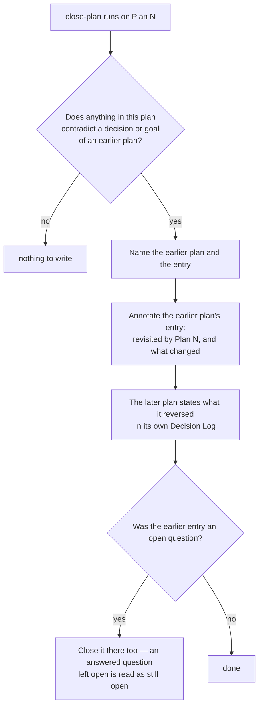

<!--
 Copyright (c) 2026 Danilo Borges (https://github.com/daniloborges)

 Licensed under the Apache License, Version 2.0 (the "License");
 you may not use this file except in compliance with the License.
 You may obtain a copy of the License at

 https://www.apache.org/licenses/LICENSE-2.0
-->

# Plan-016: A reversed decision is visible from the record it reversed

| Field | Value |
|---|---|
| Status | Backlog |
| Created | 2026-08-13 |
| Author | Danilo Borges |

---

## Summary

A decision record that is superseded says so on its own face — the lifecycle requires it, and the reader
who opens the old one is told immediately. A plan has no such mechanism, and plans are where most of the
design actually gets decided here. Four closed plans in this repository state as current fact something a
later plan reversed: a goal about how a hook should behave, a skill collapsed into one and then split back
into two, an invocation path the repository now documents as unreachable, and an open question that was
answered in one direction and then answered in the opposite direction by the plan after it, while the plan
that first asked it still lists it as unresolved. In every case the later plan knows what it reversed and
the earlier plan does not. One instance is annotated, by hand, once, in the oldest plan — the convention
exists and was never made a step anyone runs.

## Goals

1. Opening any closed plan in this repository is enough to learn that one of its decisions was later
   reversed, without reading the plans that came after it.
2. Writing that annotation is a step in closure, not an act of remembering.
3. The four known reversals are annotated on both sides.
4. A question answered twice in opposite directions is resolved to one answer, and the record that still
   lists it as open stops doing so.

## Scope

### In scope

The plans under `project/plans/` and `project/plans/shipped/`. The closure skill for plans, which is
where the annotation has to be produced. The annotation's form, so that there is one shape rather than
one per author.

### Out of scope

**The decision-record lifecycle**, which already handles supersession properly and needs nothing from
this plan.

**Automatic detection of a reversal.** Deciding that a later plan reverses an earlier one is a judgement
about intent, and nothing in the tree carries the evidence. The closure step asks; it does not infer.

## Design

The asymmetry is the whole problem. A reversal is obvious from the side doing the reversing and invisible
from the side being reversed, and only the second side is the one a future reader opens by accident.

The annotation therefore has to be written by the plan doing the reversing, at the moment its author
still knows what it displaced. The oldest plan here already carries the shape: a line hanging off the
superseded decision entry, naming the record that revisited it and saying in one clause what changed. It
reads correctly a year later and costs nothing to write. Making it a step is the entire mechanism.

This is the one edit a closed plan legitimately receives, and it is worth saying why it does not
contradict the rule that a permanent record is not rewritten. The annotation adds a fact about what
happened *after*; it changes nothing the record asserted about its own moment. A closed plan whose text
was edited to agree with the present has lost its value. A closed plan carrying a dated pointer to what
came next has gained it.

The fourth case needs more than an annotation. A question about whether two closure skills should be one
was answered by collapsing them, and answered again by splitting them back apart, and the plan that
originally raised it still lists it as unresolved. Two answers in opposite directions with no record of
why the second overturned the first is not a supersession, it is a loop. Track 3 settles which answer
stands and records the reason, because otherwise the next author reopens it a third time.

## Tracks

- [ ] **Track 1 — Fix the form.** Decide and write down the annotation's exact shape and where it hangs:
      on the decision entry, on the goal, or in a dedicated block, and what it must name. At the end
      there is one form. Acceptance: applying it to the one existing hand-written instance requires no
      change to that instance, or the form is wrong.
- [ ] **Track 2 — Make it a step.** The plan-closure skill gains the question — does this plan reverse
      anything earlier — and the instruction to write both sides when the answer is yes. At the end a
      closure that reverses something cannot complete without saying so. Acceptance: the step names the
      open-question case explicitly, because that is the one that was missed.
- [ ] **Track 3 — Settle the question that was answered twice.** The two closure skills were merged and
      then unmerged. Determine which answer stands, record why the second overturned the first, and close
      the question in the plan that raised it. At the end the question is answered once, with a reason.
      Acceptance: no plan in the tree still lists it as open.
- [ ] **Track 4 — Annotate the four known reversals.** Both sides for each: the reversed goal about hook
      behaviour, the collapsed-then-split closure skill, the invocation path now documented as
      unreachable, and whatever Track 3 settles. At the end each earlier plan carries its pointer.
      Acceptance: opening any of the four earlier plans surfaces the reversal within its own text.
- [ ] Run `/vibe-ops:close-plan` — retrospective against the goals, the demotion check, and the check for
      whether this step makes any written instruction redundant. The plan file itself is kept.

## Success criteria

Run from the repository root:

- Each of the four earlier plans contains an annotation naming the later plan that reversed it.
- Each of the later plans states in its own decision log what it reversed.
- The plan-closure skill contains the reversal question and the both-sides instruction.
- No plan in `project/plans/` or `project/plans/shipped/` lists as open a question that a later plan
  answered.
- Reading only the earlier plan of any reversed pair is sufficient to learn that the decision moved.

---

## Decision Log

- Decision: the annotation is written by the plan doing the reversing, at closure, not by a later sweep.
  Rationale: the author reversing something is the only person who knows what was displaced and why. A
  sweep months later has to reconstruct intent from two documents that disagree, which is how a reversal
  becomes an apparent contradiction instead of a decision.
  Date / Author: 2026-08-13 / Danilo Borges

- Decision: annotating a closed plan is not a rewrite and is explicitly permitted.
  Rationale: the rule protecting a permanent record protects what it asserted about its own moment. A
  dated pointer to what came after adds to that record instead of altering it, and its absence is what
  makes an old plan actively misleading rather than merely old.
  Date / Author: 2026-08-13 / Danilo Borges

- Decision: no attempt is made to detect a reversal mechanically.
  Rationale: whether a later design contradicts an earlier one is a judgement about intent that nothing
  in the tree records. A detector would produce a list of plausible pairs that someone has to adjudicate
  anyway, at which point the question in the closure step has already done the work more cheaply.
  Date / Author: 2026-08-13 / Danilo Borges

- Decision: discovery and mechanical edits under a contract that fits in a paragraph may be handed to a
  subagent; any judgement that has to agree with this plan's intent may not.
  Rationale: finding candidate pairs and applying an agreed annotation are closed contracts. Deciding
  that one plan reverses another, and which of two opposite answers stands, is exactly the judgement a
  subagent has no basis for.
  Date / Author: 2026-08-13 / Danilo Borges

## Outcomes & Retrospective

*Not yet started.*

---

## Open questions

- Whether a plan should also be annotated when a later plan *extends* rather than reverses it. The
  argument for is that a reader wants the whole thread; the argument against is that every plan extends
  something, and an annotation that fires on everything stops being read.

## Related

- [Plan-015](015-a-closed-record-that-cites-a-path-that-no-longer-exists.md) — the neighbouring failure,
  where what went stale in a closed record is a path rather than a decision.
