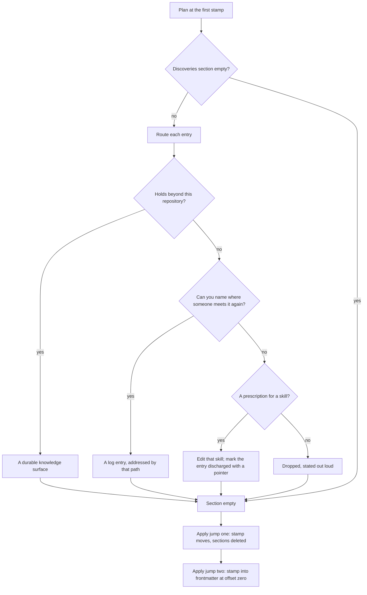

<!--
 Copyright (c) 2026 Danilo Borges (https://github.com/daniloborges)

 Licensed under the Apache License, Version 2.0 (the "License");
 you may not use this file except in compliance with the License.
 You may obtain a copy of the License at

 https://www.apache.org/licenses/LICENSE-2.0
-->

# Plan-017: The plans still written against the first template shape

| Field | Value |
|---|---|
| Status | Backlog |
| Created | 2026-08-13 |
| Author | Danilo Borges |
| Related | [Plan-014](014-the-prose-that-describes-a-template-is-checked-against-it.md) |

---

## Summary

Eight plans in this repository declare the first version of the plan template, in the comment form the
stamp used before it moved into the frontmatter. Six of them are closed. The governance run already
reports all eight, so this is known debt rather than a discovery. Migrating them is not the mechanical
job the count makes it look like: the second half of the jump drops the two sections those plans lean on
hardest, and the migration note is explicit that a plan whose discoveries section is not empty stays at
the old version until every entry has been routed by hand. Across the eight there are seventy-seven such
entries. That routing is the work; the version stamp is the receipt. This plan does the routing, and in
doing it settles the fate of the one plan among the eight whose subject was delivered elsewhere entirely.

## Goals

1. No plan in this repository declares a template version older than the current one.
2. Every entry from a dropped section reaches a named destination — a durable surface, a skill it
   prescribes a change to, or an explicit and stated drop. Nothing evaporates because a section was
   deleted around it.
3. The plan whose subject was delivered outside this repository is either closed as overtaken or rescoped
   to what actually remains, rather than left in the backlog describing work nobody is going to do.
4. The governance run reports zero records behind on their template version.

## Scope

### In scope

The eight plans carrying the first template stamp, and the two template jumps between that stamp and the
current one. The per-entry routing decisions the first jump requires.

### Out of scope

**The plan that is currently in progress.** Its work has shipped and only its closure ceremony remains;
it is being closed under that ceremony, and migrating a record while it is being closed produces a
conflict for no gain. It rejoins this plan's scope only if its closure leaves it behind.

**Records of any other type.** The decision, proposal and task templates have their own jumps and their
own notes; nothing here depends on them and they are not blocked by this.

**Inventing dossiers for finished work.** The migration note forbids it explicitly and it is worth
repeating: a step-level progress item from a plan that shipped months ago does not get a task dossier
created retroactively so that it has somewhere to live. It is routed or dropped, out loud.

## Design

The two jumps are not the same kind of work and must not be run as one pass.

The second jump moves the version declaration from a comment above the title into frontmatter at the very
start of the file, and changes nothing else. Its own note carries no needs-a-decision column at all,
which is what makes it safe to run across a directory unattended. It is also the jump that fails
silently: frontmatter is only frontmatter if it begins at the first byte, and a plan carrying a licence
comment before it will render fine while every consumer reads its version as absent.

The first jump is the real work. It drops the step-level progress list and the discoveries section, and
it narrows the decision log to decisions only. Each surviving entry is routed by asking, in order,
whether it holds beyond this repository, whether it names a file or folder where someone meets it again,
and whether it is a prescription for how a skill should behave — and if none of those, it is dropped
deliberately rather than filed one tier down to feel thorough.

**Two of the routing destinations do not exist in this repository.** The durable knowledge surface for a
fact that outlives one repository, and the ceremony that files into it, are both absent here — which is
why an earlier plan's findings are still sitting unrouted with nowhere to go. That gap is its own plan,
and this one is blocked on it for exactly the entries that land in that row. Entries routed anywhere else
proceed regardless; the plan is not held hostage by one row of the table.

## Tracks

- [ ] **Track 1 — Route the six closed plans.** Seventy-seven entries across eight files, of which these
      six hold the bulk. Each entry gets a destination or an explicit drop, recorded as it is decided
      rather than reconstructed at the end. At the end each of the six has an empty discoveries section
      and nothing has been lost. Acceptance: the count of entries routed plus entries dropped equals the
      count that existed, and the drops are listed rather than implied.
- [ ] **Track 2 — Decide the fate of the plan whose subject was delivered elsewhere.** Its three tracks
      are unchecked, its success criteria were never written, and the capability it describes exists
      today outside this repository in a form that went beyond what it scoped. Either it closes as
      overtaken, with the reason recorded, or it is rescoped to the part that genuinely remains here. At
      the end it is one or the other and not a backlog item nobody reads. Acceptance: its status is
      terminal or its scope names only work that is still real.
- [ ] **Track 3 — Apply both jumps.** The mechanical half, once the routing is done: sections deleted,
      stamps moved into frontmatter at the first byte, nothing else touched. At the end the diff for each
      file shows only the stamp move and the removal of sections emptied in Track 1. Acceptance: no file
      gains or loses content beyond that.
- [ ] **Track 4 — Confirm the reporting closes.** The governance run is the thing that has been carrying
      this debt visibly. At the end it reports nothing behind. Acceptance: the count of records reported
      behind on their version is zero, and it was non-zero before.
- [ ] Run `/vibe-ops:close-plan` — retrospective against the goals, the demotion check, and the check for
      whether the routing done here makes any existing written instruction redundant. The plan file
      itself is kept.

## Success criteria

Run from the repository root:

- The governance run reports zero records behind on their template version, where it previously reported
  eight.
- No plan under `project/plans/` or `project/plans/shipped/` contains a progress or discoveries heading.
- Every plan's first three lines are the frontmatter delimiters and its version stamp, with nothing ahead
  of them.
- For each routed entry there is either a file that now carries the fact, a skill edit it prescribed, or
  a line in this plan's retrospective stating it was dropped and why.
- The plan addressed by Track 2 has a terminal status, or a scope that names only work still outstanding.

---

## Decision Log

- Decision: the two template jumps are run as two separate passes, routing first and stamping second.
  Rationale: the second jump is purely mechanical and safe across a directory; the first requires a
  judgement per entry. Running them together means the mechanical half's diff hides the judgement half's,
  and a reviewer loses the ability to check the part that can be wrong.
  Date / Author: 2026-08-13 / Danilo Borges

- Decision: an entry that fails the routing questions is dropped explicitly and listed, never filed one
  tier down to avoid the appearance of losing it.
  Rationale: filing rejects into the tier below is what pushes a knowledge base past the point where
  anyone reads it, and the tier below is then the one that rots. A drop that is stated is a decision; a
  drop disguised as a filing is a deferral nobody will revisit.
  Date / Author: 2026-08-13 / Danilo Borges

- Decision: the plan currently in progress is excluded until its own closure has run.
  Rationale: it is being closed under its own ceremony, which will rewrite the same sections this
  migration touches. Doing both at once produces a conflict whose resolution is guesswork.
  Date / Author: 2026-08-13 / Danilo Borges

- Decision: discovery and mechanical edits under a contract that fits in a paragraph may be handed to a
  subagent; any judgement that has to agree with this plan's intent may not.
  Rationale: extracting the entries, counting them, and applying the second jump are closed contracts and
  delegate cleanly. Routing an entry is the judgement this whole plan is about, and it is precisely what
  a subagent returns plausibly and wrongly.
  Date / Author: 2026-08-13 / Danilo Borges

## Outcomes & Retrospective

*Not yet started.*

---

## Open questions

- Whether a closed plan should be migrated at all, or whether a permanent record ought to keep the shape
  it was written in and be exempted from version reporting once it reaches a terminal status. The
  argument for migrating is a single shape across the corpus and a reporting run that reaches zero; the
  argument against is that the sections being deleted are part of what that record was. This plan assumes
  migration, and the assumption is worth challenging before Track 3 rather than after.

## Related

- [Plan-014](014-the-prose-that-describes-a-template-is-checked-against-it.md) — the prose that describes
  these templates, which went stale in the same jump and is corrected there rather than here.
