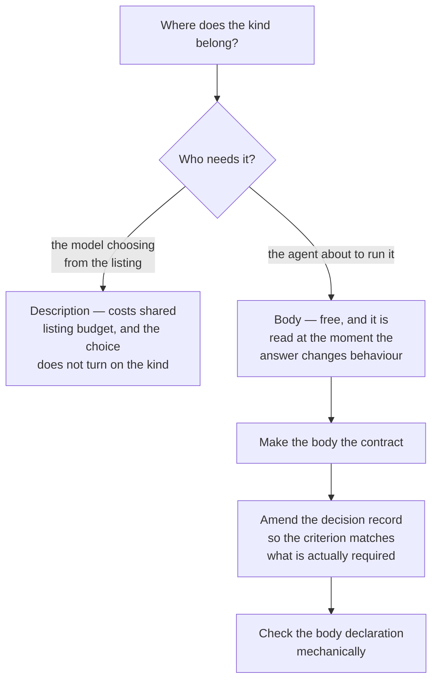

<!--
 Copyright (c) 2026 Danilo Borges (https://github.com/daniloborges)

 Licensed under the Apache License, Version 2.0 (the "License");
 you may not use this file except in compliance with the License.
 You may obtain a copy of the License at

 https://www.apache.org/licenses/LICENSE-2.0
-->

# Plan-018: Every skill declares whether running it twice is correct

| Field | Value |
|---|---|
| Status | Backlog |
| Created | 2026-08-13 |
| Author | Danilo Borges |
| Related | [ADR-0001](../adr/0001-skill-taxonomy-target-state-vs-event.md) |

---

## Summary

Every skill this plugin ships is one of two kinds. A target-state skill is convergent: there is a correct
shape, the work is making the disk match it, and running it again is safe and sometimes the point. An
event skill is append-only: it records that something happened, running it twice correctly produces two
records, and it has no update mode. Which kind a skill is decides whether re-running it is a repair or a
duplicate, and the accepted decision record on the subject requires that the answer be visible without
opening the file — it is supposed to be in the skill's own description, so that the listing carries it.
Measured on 2026-08-13: **no skill's description states it**, and three of the eleven do not state it in
their body either. The criterion has been unmet since the day it was written, and nothing checks it.

## Goals

1. The kind of every skill is stated in its body, without exception.
2. Whether the kind also belongs in the description is decided against its real cost rather than
   inherited from a criterion nobody has met, and the decision record is brought into line with whichever
   answer wins.
3. A skill added later cannot omit its kind without something saying so.

## Scope

### In scope

The eleven skills under `plugin/skills/`. The accepted decision record that requires the declaration. A
check that the declaration is present, and its fixture.

### Out of scope

**Reclassifying any skill.** Every skill's kind is already settled and stated in the decision record and
in the convergence reference; this plan makes the statement visible and enforced, and changes no
classification.

**The description text in general.** Descriptions are also where trigger phrasing lives, and rewriting
them for triggering quality is a separate concern with a separate failure mode.

## Design

The interesting part is that the unmet criterion may itself be the thing that is wrong.

A skill's description is not free. The listing every installed skill contributes to is capped per skill
and shares a small fraction of the context window with every other installed plugin, and this repository
has already paid down that budget once on purpose — four record-creating skills were collapsed into one
precisely to reclaim listing space. Adding a clause about convergence to eleven descriptions spends part
of that back, and it spends it on a fact the model reading the listing cannot act on: the listing is used
to *choose* a skill, and the kind matters once the skill is already running.

The body is the opposite. A reader who has opened the file is about to run it, is deciding whether a
second run repairs or duplicates, and the eight skills that already say it say it in the first few lines
with a link to the policy. That is where the fact is load-bearing.

The check is a small one and belongs beside the existing skill-frontmatter sensor rather than as a new
gate of its own: it reads each skill file, looks for the declaration near the top, and reports the ones
without it. It must not accept the words appearing anywhere in the file — a skill that mentions the
convergence policy in passing halfway down has not declared its own kind, and a check that counts that as
a pass is the kind of guard that reports a clean tree because it stopped looking.

## Tracks

- [ ] **Track 1 — Decide where the declaration belongs, and amend the record.** Weigh the listing budget
      against the criterion as written, settle on the body, and update the accepted decision record and
      any reference that repeats the description requirement so that the written rule and the practice
      agree. At the end no document requires something the codebase deliberately does not do. Acceptance:
      grepping for the description requirement finds only the amended statement.
- [ ] **Track 2 — Declare the three that do not.** Three skills state their kind nowhere: the migration
      skill, the log-entry skill and the migration-note skill. Each gains the same opening declaration
      the other eight carry, linking the convergence policy rather than restating it. At the end all
      eleven declare. Acceptance: the check from Track 3 reports nothing.
- [ ] **Track 3 — Check it, and prove the check fails.** A sensor that requires the declaration near the
      top of each skill, plus a fixture asserting it fires on a skill that omits it. At the end adding a
      skill without a declaration fails the gate. Acceptance: removing the declaration from any one skill
      fails the run, and removing the detection fails the self-test.
- [ ] Run `/vibe-ops:close-plan` — retrospective against the goals, the demotion check, and specifically
      the check for whether this sensor now makes a written instruction about declaring the kind
      redundant. The plan file itself is kept.

## Success criteria

Run from the repository root:

- The new sensor reports eleven skills examined and zero missing a declaration.
- The self-test shows the new fixture case running and passing.
- Deleting the declaration line from any skill makes the check fail, naming that skill.
- No document in the repository requires the kind to appear in a skill's description, unless Track 1
  decided the opposite — in which case all eleven descriptions carry it and the listing budget cost is
  recorded in this plan.

---

## Decision Log

- Decision: the plan starts from a measurement, not from the earlier plan's criterion.
  Rationale: the criterion asserted that every description states the kind, and it was recorded as met.
  Measured on 2026-08-13, no description states it and three bodies do not either. Planning the work from
  the criterion would have produced a plan to fix five skills that an audit had named without checking,
  when the real shape is eleven descriptions and three bodies.
  Date / Author: 2026-08-13 / Danilo Borges

- Decision: the check requires the declaration near the top of the file, not anywhere in it.
  Rationale: a skill that mentions the convergence policy in passing has not told its reader which kind
  it is. A check satisfied by an incidental mention passes on files it should fail, and produces output
  indistinguishable from a compliant tree.
  Date / Author: 2026-08-13 / Danilo Borges

- Decision: discovery and mechanical edits under a contract that fits in a paragraph may be handed to a
  subagent; any judgement that has to agree with this plan's intent may not.
  Rationale: inventorying which skills declare their kind, and adding an agreed line to three of them,
  are closed contracts. Weighing listing budget against a written criterion and amending an accepted
  decision record is the judgement, and it stays here.
  Date / Author: 2026-08-13 / Danilo Borges

## Outcomes & Retrospective

*Not yet started.*

---

## Open questions

- Whether the same declaration should be required of skills a consumer repository writes for itself, or
  whether it is a property of this plugin's own product only. The convergence policy is shipped as a
  reference, so the question is really whether the scaffolding installs the sensor too.

## Related

- [ADR-0001](../adr/0001-skill-taxonomy-target-state-vs-event.md) — the two kinds, and the requirement
  this plan brings into line with practice.
