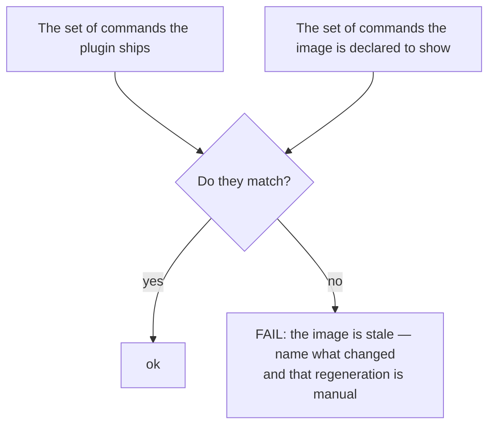

<!--
 Copyright (c) 2026 Danilo Borges (https://github.com/daniloborges)

 Licensed under the Apache License, Version 2.0 (the "License");
 you may not use this file except in compliance with the License.
 You may obtain a copy of the License at

 https://www.apache.org/licenses/LICENSE-2.0
-->

# Plan-019: An artefact that shows the tool goes stale in silence

| Field | Value |
|---|---|
| Status | Backlog |
| Created | 2026-08-13 |
| Author | Danilo Borges |

---

## Summary

The README's first image is a screenshot of this plugin's commands as they appear once installed. It sits
near the top, above the usage, and it is the first concrete thing a visitor sees. It shows a command that
was renamed and four commands that were collapsed into one. Neither change is recent, and the failure was
predicted in writing by the plan that introduced the image: any artefact showing an installed tool has to
be captured against the version being documented, or it drifts. It then drifted, was noticed by a later
plan whose track was left partially done because regenerating it needs a real session, and has drifted
further since. Prose that goes stale is caught by a reader; an image is not read, it is glanced at, and a
wrong one is believed. This plan regenerates it and makes the next drift detectable.

## Goals

1. The image in the README shows the commands this plugin actually offers.
2. Renaming or removing a command produces a signal that the image is now wrong, at the time of the
   rename rather than at the next time someone happens to look.
3. It is written down where the image comes from and what it must be captured against, so that
   regenerating it is a procedure rather than a reconstruction.

## Scope

### In scope

The command screenshot referenced from the README, whatever accompanies it, and a way to detect that it
has gone stale.

### Out of scope

**Every other image.** If more are added later the same mechanism should cover them, but this plan solves
the one that is wrong today rather than building for a set of one.

**Removing the image.** It earns its place: it is the fastest possible answer to what installing this
gives you, and the alternative is a list that says less and is also capable of going stale.

## Design

The capture cannot be automated here. The image shows a command listing rendered by an installed client,
and producing it needs a real interactive session — which is exactly why the earlier track that should
have regenerated it was left partially done rather than finished. So the goal is not automatic
regeneration. It is that a human is *told*, at the moment of the rename, that a manual step is now owed.

That makes the detector a comparison between two lists rather than anything about the image itself:

The second list has to exist somewhere, because an image cannot be read. It is declared beside the image
as a plain list of the command names the capture contains, together with the version it was captured at.
That declaration is cheap, is reviewed in the same diff as any rename, and turns an invisible drift into
a failing check. It also has an honest cost: the declaration can itself be updated without recapturing
the image, which would defeat the whole thing. The check therefore reports the declared capture version
alongside the result, so a declaration that moved while the image did not is visible in the output rather
than hidden by a passing line.

## Tracks

- [ ] **Track 1 — Recapture.** Produce the image against the current command set, in a real session,
      recording the version it was captured at. At the end the README shows what a visitor would actually
      see. Acceptance: every command in the image exists, and every command the plugin ships is in the
      image or deliberately excluded with the exclusion stated.
- [ ] **Track 2 — Declare and check.** The command list and capture version are declared beside the
      image, and a check compares them against the shipped skills. At the end a rename that lands without
      a recapture fails. Acceptance: renaming any command in a scratch copy fails the check and names the
      command.
- [ ] **Track 3 — Write down the procedure.** How the image is produced, what it must be captured
      against, and that the declaration is not a substitute for recapturing. At the end whoever is told
      by the check that the image is stale knows what to do. Acceptance: the instruction names the manual
      step and says why it cannot be automated here.
- [ ] Run `/vibe-ops:close-plan` — retrospective against the goals, the demotion check, and the check for
      whether this detector makes any written warning about stale artefacts redundant. The plan file
      itself is kept.

## Success criteria

Run from the repository root:

- The check reports the declared command list matching the shipped skills, and prints the capture version.
- No command shown in the image is absent from the plugin, and none shipped is missing from the image
  without a stated exclusion.
- Renaming a skill without recapturing fails the check, naming the skill.
- The procedure for regenerating is written somewhere a person told by the check will find it.

---

## Decision Log

- Decision: the detector compares command lists, not images.
  Rationale: comparing images requires rendering one, which requires the interactive client this cannot
  run. The list is a faithful proxy for the only property that has ever gone wrong here — a command
  shown that no longer exists — and it is checkable in the same commit as the rename that breaks it.
  Date / Author: 2026-08-13 / Danilo Borges

- Decision: the check prints the declared capture version on success as well as on failure.
  Rationale: the declaration is the weak point, because updating it is easier than recapturing and would
  turn the check green while leaving the image wrong. Printing it on every run makes that visible in the
  output rather than requiring someone to suspect it.
  Date / Author: 2026-08-13 / Danilo Borges

- Decision: discovery and mechanical edits under a contract that fits in a paragraph may be handed to a
  subagent; any judgement that has to agree with this plan's intent may not. The capture itself is
  neither — it needs a real session and a person.
  Rationale: comparing two lists delegates cleanly. Deciding which commands belong in a marketing image
  is a judgement about what the front door should say, and capturing it cannot be delegated at all.
  Date / Author: 2026-08-13 / Danilo Borges

## Outcomes & Retrospective

*Not yet started.*

---

## Related

- [Plan-003](shipped/003-readme-presentation.md) — introduced the image and predicted this failure in its
  own record.
