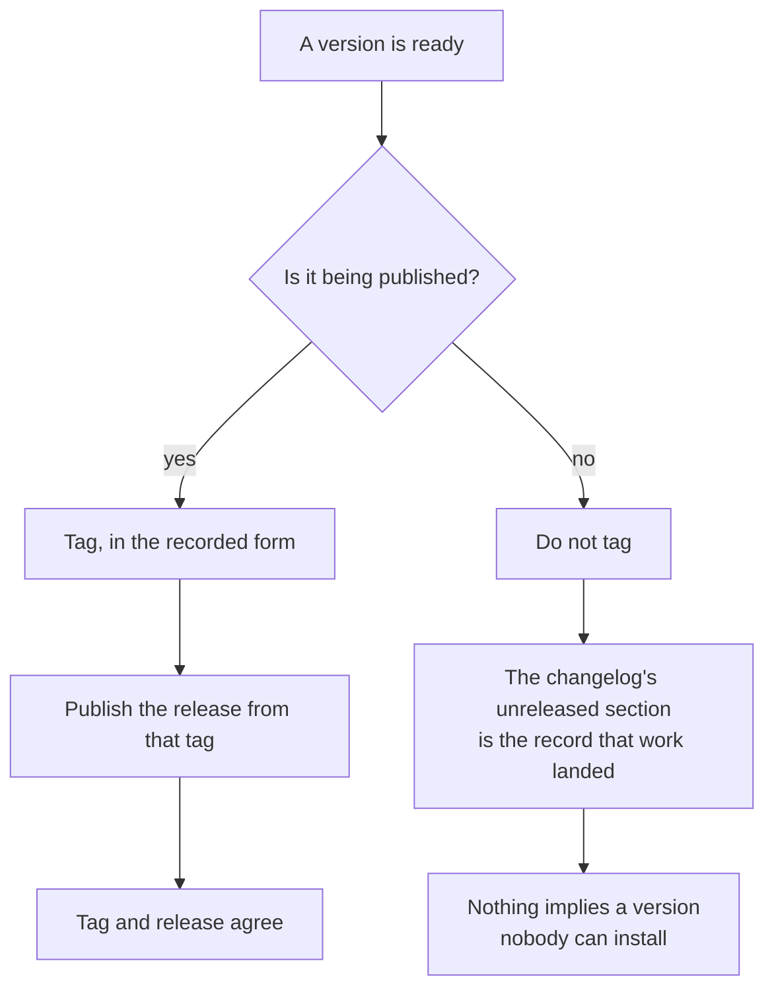

<!--
 Copyright (c) 2026 Danilo Borges (https://github.com/daniloborges)

 Licensed under the Apache License, Version 2.0 (the "License");
 you may not use this file except in compliance with the License.
 You may obtain a copy of the License at

 https://www.apache.org/licenses/LICENSE-2.0
-->

# Plan-020: The release tag scheme changed and nothing says so

| Field | Value |
|---|---|
| Status | Backlog |
| Created | 2026-08-13 |
| Author | Danilo Borges |

---

## Summary

This repository's tags run `v0.4.0` through `v0.6.0`, and then switch to a prefixed form for `0.7.0`,
`0.8.0` and `0.9.0`. Nothing in the repository states that the scheme changed, why, or which form a
future tag takes. Separately and more seriously: the three most recent tags have **no published release
behind them**, while the six before them all do. An earlier plan recorded almost exactly this failure in
the other direction — version numbers existing with no tag and no release behind any of them — and
concluded that the version was tracking commits rather than releases. The distinction that plan
introduced has decayed on the other side of the same boundary. A tag that publishes nothing is a version
number nobody can install, and three of them have accumulated without anyone deciding that was the plan.

## Goals

1. The tag scheme is written down, in one place, including what changed and when.
2. It is settled whether the three unpublished tags represent releases that were never published or
   markers that should never have been tags, and whichever answer is right is acted on.
3. Cutting a tag and publishing a release are either one act or two acts with a stated relationship —
   never an accident of which command someone remembered to run.

## Scope

### In scope

The tag naming scheme, the relationship between a tag and a published release, and the record of what
each has meant historically in this repository.

### Out of scope

**Resuming releases.** Whether to publish again is a maintainer decision about the product, stated
elsewhere as a deliberate hold. This plan makes the mechanism and the history legible; it does not decide
when the hold ends.

**Package version numbers.** What a version number means and when it moves is settled and unchanged here;
this plan is about what happens at the tag and publish boundary.

## Design

Two facts have to be separated before anything can be written down, because they look like one problem
and have different causes.

The **scheme change** is a naming decision that was taken in practice and never recorded. Both forms are
defensible — a bare version is shorter, a prefixed one survives a repository that publishes more than one
thing — and the cost is not in which was chosen but in a future author having to guess by looking at
history, where the two forms disagree with each other.

The **unpublished tags** are a different failure. A tag is cheap and local; a release is the thing a user
can find. When the two drift apart, the tag stops meaning what a reader assumes it means, and the
assumption is the dangerous part: someone reading the tag list concludes that three versions shipped.

The right shape follows from what already exists: the changelog already carries an unreleased section
precisely so that *work landed* and *work shipped* are different statements. A tag belongs to the second
statement. If work needs marking without shipping, the changelog is already the place, and a tag adds
nothing except a false signal.

That leaves the three existing tags, which cannot be undone quietly — a tag that other clones have seen
is not safely deleted. Track 2 chooses between publishing releases for them retroactively, with notes
saying what they contain, and leaving them in place with a written explanation of what a tag meant during
that window. Both are honest; deleting them and pretending the window did not happen is not.

## Tracks

- [ ] **Track 1 — Write the scheme down.** The form a tag takes, when the form changed, and why both
      exist in the history. At the end a future author does not have to infer it from a tag list that
      contradicts itself. Acceptance: the record names both forms and the boundary between them.
- [ ] **Track 2 — Resolve the three unpublished tags.** Decide between publishing releases behind them
      and documenting the window in which a tag meant something else, then do it. At the end no tag in
      this repository implies a release that does not exist. Acceptance: for every tag, either a
      published release exists or the record says explicitly why it does not.
- [ ] **Track 3 — Bind the two acts.** State the relationship between tagging and publishing so that
      neither happens alone by accident, and make the state observable — a listing of tags without
      releases is the whole check. At the end the drift that produced this plan is detectable in one
      command. Acceptance: the command exists, and running it today returns whatever Track 2 left.
- [ ] Run `/vibe-ops:close-plan` — retrospective against the goals, the demotion check, and the check for
      whether the new record makes any existing instruction about versioning redundant. The plan file
      itself is kept.

## Success criteria

Run from the repository root:

- Listing tags and listing published releases produce sets that agree, or every difference is explained
  in the record Track 1 wrote.
- The tag naming scheme is stated in one place, and grepping for it finds one statement rather than none.
- The relationship between tagging and publishing is stated, and the observability from Track 3 runs.

---

## Decision Log

- Decision: a tag marks a published release and nothing else; work that landed without shipping is
  recorded in the changelog's unreleased section.
  Rationale: this repository already introduced that split deliberately, after finding version numbers
  with nothing behind them. Tags without releases are the same failure approached from the other side,
  and the fix is to hold the same line rather than to invent a second meaning for a tag.
  Date / Author: 2026-08-13 / Danilo Borges

- Decision: existing tags are not deleted.
  Rationale: a tag that has been fetched elsewhere cannot be withdrawn cleanly, and a history rewritten
  to look tidier than it was is exactly the failure the permanent-record rule exists to prevent. They are
  explained or they are published behind; they are not erased.
  Date / Author: 2026-08-13 / Danilo Borges

- Decision: discovery and mechanical edits under a contract that fits in a paragraph may be handed to a
  subagent; any judgement that has to agree with this plan's intent may not.
  Rationale: comparing tag and release listings and drafting release notes from a changelog are closed
  contracts. Deciding whether three historical tags get retroactive releases is a judgement about what
  this repository is telling its users, and it stays here.
  Date / Author: 2026-08-13 / Danilo Borges

## Outcomes & Retrospective

*Not yet started.*

---

## Open questions

- Whether the prefixed form should be kept or reverted now that both exist in history. Keeping it means
  the tag list is permanently inconsistent across a boundary; reverting means it is inconsistent across
  two. Neither is clean, and the decision should be made once and recorded rather than deferred again.

## Related

- [Plan-007](shipped/007-taxonomy-guards-one-close-and-filing-approved-plans.md) — raised the tag scheme
  as an open question and closed without answering it.
