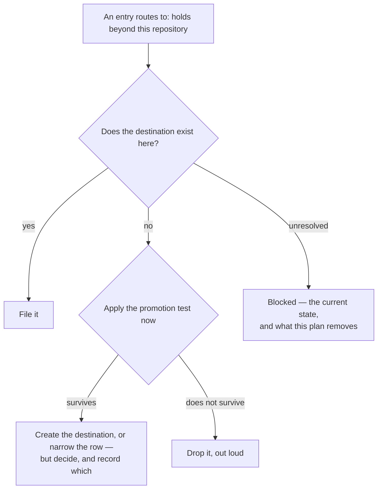

<!--
 Copyright (c) 2026 Danilo Borges (https://github.com/daniloborges)

 Licensed under the Apache License, Version 2.0 (the "License");
 you may not use this file except in compliance with the License.
 You may obtain a copy of the License at

 https://www.apache.org/licenses/LICENSE-2.0
-->

# Plan-021: The routing destination this repository does not have

| Field | Value |
|---|---|
| Status | Backlog |
| Created | 2026-08-13 |
| Author | Danilo Borges |
| Related | [Plan-017](017-the-plans-still-written-against-the-first-template-shape.md) |

---

## Summary

Closure routes what the work taught. The routing table has a row for a fact that holds beyond the
repository it was learned in, and in this repository that row points at nothing: the directory it names
does not exist here, and neither does the ceremony that files into it. The consequence is already on
record. A closed plan carries two findings about the parser layer that were left explicitly unfiled,
with the reason stated as waiting on exactly those two things, and they have been waiting since. A
second plan, migrating older records, is blocked on the same row for the same reason. A routing table
whose rows do not all resolve does not fail loudly — it produces an entry marked blocked, and blocked
entries accumulate quietly because nothing counts them.

## Goals

1. Every row of the routing table used at closure resolves to something that exists in this repository,
   or the row is removed from what this repository's own closures apply.
2. The two findings currently waiting are filed, or dropped with the reason stated — not left waiting a
   third time.
3. A future closure cannot leave an entry blocked on a missing destination without that being visible.

## Scope

### In scope

The routing table as this repository applies it to itself, the destination it names and does not have,
and the findings currently blocked on it.

### Out of scope

**What the shipped reference tells other repositories to do.** The reference is the product and it
describes a policy that is correct in general. The question here is what *this* repository does when it
runs that policy on itself, which is a narrower thing and must not turn into a redesign of the shipped
rule.

**Building a general knowledge-base tool.** The gap is one directory and one filing step, and the
smallest thing that makes the row resolve is the right size. Anything larger is a different plan with a
different justification.

## Design

There are three honest answers and one dishonest one, and the dishonest one is the current state.

The first honest answer is to **create the destination**: the directory and the filing step, so the row
resolves and the waiting findings land. This is the smallest change and it makes the repository able to
run its own published policy on itself, which has independent value — the policy has never been executed
end to end by its author.

The second is to **narrow the row for this repository**: state that a fact holding beyond this repository
goes to the nearest surface that does exist, and accept that this repository does not keep that tier.
This is defensible for a single repository with no siblings, and it is a real answer rather than an
evasion, provided it is written down.

The third is to **drop the two waiting findings**, if applying the promotion test honestly to them says
they do not survive it. A finding waiting on a destination is not thereby proven worth keeping; it was
never actually tested, only deferred.

Whichever answer wins, the failure to prevent is the fourth path. An entry parked as blocked with no
owner and no trigger is indistinguishable from an entry that was handled, because both leave the closure
looking complete. Track 3 makes the difference observable: the count of entries deferred on a missing
destination is either zero or reported.

## Tracks

- [ ] **Track 1 — Decide which answer.** Weigh creating the destination against narrowing the row for
      this repository, and record the choice with its reason. At the end the routing table this
      repository applies to itself has no row pointing at nothing. Acceptance: the choice is written in
      the decision log with the alternative it beat.
- [ ] **Track 2 — Discharge the two waiting findings.** Apply the promotion test to each, properly, and
      file or drop accordingly. At the end neither is waiting. Acceptance: for each, either a file now
      carries the fact or this plan states it was dropped and why — never "still pending".
- [ ] **Track 3 — Make a blocked route visible.** Whatever Track 1 chose, an entry that cannot be routed
      should not be able to disappear into a closed record. At the end the number of such entries is
      reported rather than discovered. Acceptance: introducing an unroutable entry produces a report,
      not a silent pass.
- [ ] Run `/vibe-ops:close-plan` — retrospective against the goals, the demotion check, and the check for
      whether resolving this row makes any written instruction about deferring entries redundant. The
      plan file itself is kept.

## Success criteria

Run from the repository root:

- Every destination named by the routing table this repository applies to itself resolves on disk, or the
  table as applied here no longer names it.
- Neither of the two previously blocked findings is described anywhere as waiting; each is filed or
  recorded as dropped.
- The reporting from Track 3 runs and returns zero.
- Reading a closed record is enough to tell whether an entry was routed, dropped, or blocked — the three
  are distinguishable rather than all looking like completion.

---

## Decision Log

- Decision: this plan does not redesign the shipped routing policy.
  Rationale: the policy is the product and it is correct for the general case. What is broken is this
  repository's ability to execute it on itself, and confusing the two would turn a missing directory into
  a rewrite of a document other repositories depend on.
  Date / Author: 2026-08-13 / Danilo Borges

- Decision: a finding that was deferred is re-tested rather than assumed worth keeping.
  Rationale: a deferral is not a pass. Both waiting findings were parked because the destination was
  missing, which says nothing about whether they survive the promotion test. Filing them unexamined
  because they waited a long time is how a knowledge base fills with things nobody chose.
  Date / Author: 2026-08-13 / Danilo Borges

- Decision: discovery and mechanical edits under a contract that fits in a paragraph may be handed to a
  subagent; any judgement that has to agree with this plan's intent may not.
  Rationale: finding every place the missing destination is named is a closed contract. Choosing between
  creating the destination and narrowing the row, and applying the promotion test to a specific finding,
  are the judgements, and both have to agree with what this repository is for.
  Date / Author: 2026-08-13 / Danilo Borges

## Outcomes & Retrospective

*Not yet started.*

---

## Related

- [Plan-017](017-the-plans-still-written-against-the-first-template-shape.md) — blocked on the same row
  for the subset of entries that route to it.
