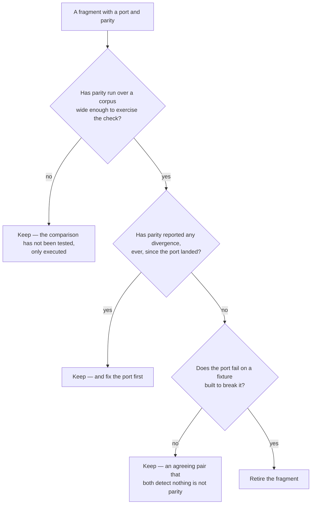

<!--
 Copyright (c) 2026 Danilo Borges (https://github.com/daniloborges)

 Licensed under the Apache License, Version 2.0 (the "License");
 you may not use this file except in compliance with the License.
 You may obtain a copy of the License at

 https://www.apache.org/licenses/LICENSE-2.0
-->

# Plan-022: Retiring a shell fragment its port has replaced

| Field | Value |
|---|---|
| Status | Backlog |
| Created | 2026-08-13 |
| Author | Danilo Borges |

---

## Summary

When a check written as a shell fragment was reimplemented against the document model, the fragment was
deliberately kept and a parity gate was built to compare the two on every run. The deferral was recorded
with an honest but unmeasurable condition: remove the fragment once parity has reported no regression
*for long enough*. Parity reports no regression today and has for as long as it has existed, and "long
enough" was never given a number, so the fragment is still there and the condition can never be observed
to be met. A deferral whose trigger cannot fire is a permanent state wearing the costume of a temporary
one. This plan replaces the phrase with a bar that can be checked, applies it to the one fragment
currently eligible, and makes the same decision cheap for the ports that follow.

## Goals

1. The condition for retiring a ported fragment is stated as something observable, not as a feeling about
   elapsed time.
2. The fragment whose port has been running in parity is either retired under that bar or explicitly kept
   for a reason that is not "not long enough yet".
3. The next port inherits the bar rather than inventing a new phrase for the same deferral.

## Scope

### In scope

The retirement condition for a fragment that has a port and a parity comparison, and the one fragment
that currently satisfies whatever bar is chosen.

### Out of scope

**Porting the fragments that have not been ported.** Deciding when a port is finished is a different
question from deciding when to write one, and mixing them turns a small cleanup into a migration
programme.

**Removing the parity mechanism.** Parity is what makes retirement safe; it retires with the last
fragment, not with the first.

## Design

The unmeasurable phrase can be replaced by three observable conditions, all of which the existing
machinery already reports or can:

The third condition is the one that matters and the one a time-based rule silently skips. Two
implementations that agree may agree because both are correct or because neither is looking, and the
output is identical. This repository has already shipped a check that reported a clean tree because a
pattern bug made it examine almost nothing, and the lesson written down then was that a guard nobody has
watched fail proves nothing. Parity inherits that exactly: agreement is evidence only once each side has
been made to disagree on purpose.

The first condition is why the bar is not simply "zero divergences". A parity gate that has examined a
corpus containing no instance of what the check looks for reports zero divergences and has established
nothing. The existing run already prints how many files it examined and how many it ignored, so the
condition is readable from output that exists.

Retirement itself is small: the fragment file goes, its parity entry goes with it, and the composed list
shrinks by one. What must not go quietly is the record of why the pair existed, since the next port will
ask the same question.

## Tracks

- [ ] **Track 1 — Write the bar.** The three conditions above, stated where the port-and-parity practice
      is already described, replacing the unmeasurable phrase wherever it appears. At the end the
      question "can this fragment go?" has an answer that does not depend on how long anyone has waited.
      Acceptance: no document states the retirement condition in terms of elapsed time.
- [ ] **Track 2 — Test the pair against a fixture.** Make the port fail on something built to break it,
      and confirm the fragment fails on the same thing. At the end the agreement between them is evidence
      rather than a coincidence. Acceptance: a fixture exists on which both sides fail, and it runs with
      the self-test.
- [ ] **Track 3 — Retire the eligible fragment.** If Tracks 1 and 2 are satisfied, remove the fragment
      and its parity entry, and record in this plan what the pair was for. At the end the check exists
      once. Acceptance: the check count drops by exactly one, the composed run stays green, and nothing
      that the fragment caught is now uncaught — demonstrated on the Track 2 fixture.
- [ ] Run `/vibe-ops:close-plan` — retrospective against the goals, the demotion check, and the check for
      whether the written bar makes any existing instruction about deferring retirement redundant. The
      plan file itself is kept.

## Success criteria

Run from the repository root:

- No document states a fragment's retirement condition in terms of how long parity has been green.
- The Track 2 fixture makes the port fail, and made the fragment fail before it was removed.
- After retirement the full run is green and reports one fewer check, with no parity entry left pointing
  at a fragment that no longer exists.
- Introducing the defect the retired fragment used to catch still fails the run.

---

## Decision Log

- Decision: retirement is gated on the port having been proven to fail, not on parity having been green
  for a period.
  Rationale: two implementations that both detect nothing agree perfectly, and their agreement is
  indistinguishable from correctness in the output. Time does not improve that; a fixture does. This
  repository has already shipped exactly that failure once, in a check whose pattern bug made it examine
  almost nothing while reporting a clean tree.
  Date / Author: 2026-08-13 / Danilo Borges

- Decision: the corpus-width condition is kept even though it looks redundant next to the fixture.
  Rationale: the fixture proves the port can fail; the corpus width proves parity has actually compared
  the two on real input. A pair that agrees only on a fixture has been tested, not exercised, and the
  difference shows up the first time a real file has a shape neither author imagined.
  Date / Author: 2026-08-13 / Danilo Borges

- Decision: discovery and mechanical edits under a contract that fits in a paragraph may be handed to a
  subagent; any judgement that has to agree with this plan's intent may not.
  Rationale: finding every occurrence of the unmeasurable phrase and removing a fragment plus its entry
  are closed contracts. Deciding that the bar has been met for a given fragment is the judgement, and it
  is the one that ends with a check silently gone.
  Date / Author: 2026-08-13 / Danilo Borges

## Outcomes & Retrospective

*Not yet started.*

---

## Open questions

- Whether the bar should also require the port to have run in a consumer repository and not only here.
  The argument for is that the fragment's real job is in repositories that install this; the argument
  against is that no mechanism currently reports what a consumer's run found, so the condition would be
  unobservable in exactly the way this plan exists to remove.
