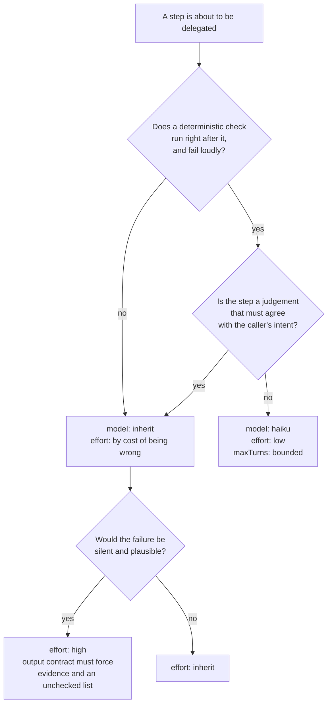

# Plan-024: The work a skill declares and the caller cannot afford

| Field | Value |
|---|---|
| Status | Backlog |
| Created | 2026-08-13 |
| Author | Danilo Borges |
| Related | [ADR-0004](../adr/0004-budgeted-artifacts-and-guards.md), [RFC-0001](../rfc/0001-gates-and-ops-as-the-cli-unit-of-composition.md), `plugin/references/convergence-policy.md` |

---

## Context

Several `SKILL.md` files in `plugin/skills/` declare a verification step, state plainly that skipping it
is the failure mode they most fear, and then place that step in the one context that cannot afford to run
it: the caller's own, where the survey competes with the writing the skill is actually there to do. The
step is real, the warning is real, and it gets skipped anyway.

One of them was fixed on 2026-08-13 (commit `78024a7`): the survey every target-state skill opens with —
and the whole of `audit` mode — now runs in `plugin/agents/governance-auditor.md`, a subagent holding
`Read`, `Grep`, `Glob` and `Bash` and no writing tool. Two things changed at once. The guarantee stopped
being a sentence ("write nothing") in the same file that had just explained how to write everything, and
the directory listings, `vibe-ops check` output and `test -L` probes stopped reaching the caller's
context, so the survey became cheap enough to actually run.

This plan applies the same reasoning to the four remaining places it fits, and settles the question the
first one exposed: `plugin/AGENTS.md` currently says **"Never set `model:`"**, which forbids the one
configuration that would make a mechanical, verified step cheap. That prohibition was written against a
real failure — a small model fabricating sections to fill a template with no source material — but it is
stated as a universal, and transcription behind a deterministic verifier is not that failure.

## Goals

1. Every read-only verification step in `plugin/skills/migrate/SKILL.md` and
   `plugin/skills/new-migration/SKILL.md` that is laborious enough to be skipped runs in a subagent that
   cannot write, and returns a compact result to the caller.
2. Every skill and agent in `plugin/` declares an `effort:`, chosen on the axis the repository already
   uses — what it costs to be wrong here — with none left undeclared by omission.
3. A rule exists for when a shipped plugin may pin a model, stated so someone can apply it to a surface
   this plan never saw, and recorded where a reversal is visible.
4. `plugin/agents/*.md` is covered by the same frontmatter detector that covers rules and skills, so the
   surface added on 2026-08-13 is not the one surface nothing reads.
5. Nothing in this plan delegates a judgement that has to agree with the caller's intent, and the record
   says which parts were considered for delegation and refused.

## Scope

### In scope

- `effort:` declarations on `plugin/agents/governance-auditor.md`, `plugin/skills/migrate/SKILL.md` and
  `plugin/skills/new-migration/SKILL.md`.
- Three further delegations to the existing `governance-auditor`, in `migrate` Steps 1 and 4 and
  `new-migration` Step 5.
- One new agent, `plugin/agents/migration-rehearser.md`, for `new-migration` Step 4.
- One new agent, `plugin/agents/scaffolder.md`, for `setup` Steps 2–3, pinned to `haiku`.
- An ADR and the `plugin/AGENTS.md` rewrite that replaces the blanket `model:` prohibition.
- An `agent` schema in `cli/packages/gates/src/check-frontmatter/index.ts` and its entry in
  `cli/packages/ops-agents-md/src/index.ts`.
- A guard asserting that migrating an artifact loses no content line, which is the precondition for ever
  delegating `migrate` Step 3.

### Out of scope

- **Delegating `migrate` Step 3 itself** — applying a note's mechanical column unattended. The guard in
  Track 7 is its precondition, not its authorisation; whether to delegate it afterwards is a separate
  decision with its own evidence.
- **`cli/packages/module-check/sh/checks/45-skill-frontmatter.sh`**, which globs `"$ROOT"/skills/*/SKILL.md`
  while the skills live under `$PLUGIN_DIR/skills/`, so its loop runs zero times in this repository and
  the check passes vacuously (it fires correctly in the self-test fixture, where the layout is flat and
  `PLUGIN_DIR` equals `ROOT`, which is why it was never caught). The shell fragments are being retired in
  favour of the gates, so new coverage goes to the CLI gate in Track 6 and this fragment is left alone.
- **The auditor's own contract**, shipped as `convergence-policy@2`: the four inputs a caller passes, the
  gap-list shape returned, and the inline fallback for an install predating the agent.

## Design

### What may cross into a subagent

The boundary is not "is this work big" but **what a wrong answer costs and who can see it**. Three
categories, and only the first two move:

- **Read-only verification with a compact result.** A survey, a census, a rehearsal, a "does this parse"
  check. It moves because its input is large, its output is small, and its correctness is inspectable in
  the result itself.
- **Transcription under a closed contract, behind an immediate verifier.** Copying template files and
  substituting placeholders, where `grep -rn '{{'` returning empty and `vibe-ops check` running green are
  the proof. It moves *and* may drop a tier, because being wrong is loud within the same minute.
- **A judgement that has to agree with the caller's intent.** Which of several destinations an entry
  belongs in; whether a divergence is a convention to adopt or a defect to migrate; what a note's step
  means when it does not say. This never moves, and `plugin/skills/new/SKILL.md` already states why: a
  subagent does not hold the intent and returns something plausible that drifts.

### Choosing the tier

Pinning **downward** is what this permits, and only behind the verifier. Pinning **upward** stays
forbidden for a different reason than the old rule gave: a shipped plugin's model choice runs on someone
else's machine and budget, in a session where they already sized the work by choosing their model.

### Where each delegation lands

`plugin/skills/migrate/SKILL.md` Step 1 already delegates its census. It is extended to return the **jump
chain per artifact and which migration notes are missing**, so Step 2's "a jump with no note stops the
run" is known before any note is opened rather than halfway through reading them.

Step 4 of the same skill is the half that "fails in a way that looks like success": the population read
(`vibe-ops governance --verbose`, which runs `template-heading-drift`) and — the part that decides the
step — the **second clean run** that is its completion criterion. Both are read-only. Rewriting the
sentences the gate flags stays with the caller, because a sentence rewritten into a claim the note does
not support is exactly the judgement that must not move.

`plugin/skills/new-migration/SKILL.md` Step 5 is three mechanical questions — detection finds artifacts at
the old version, the jump is contiguous, the note parses for `template-heading-drift` — and goes to the
auditor whole, with the note and the template as the declared target state.

Step 4 of that skill is different in kind and gets its own agent. It is a **rehearsal**: find the artifact
this migration handles least comfortably and walk the note against it without editing anything. Its
deliverable is the point where the walk stalls, not a gap list, which is why it does not fold into the
auditor's output contract. "The note applied cleanly" is only acceptable from it when the artifact is
named, its size given, and the step that met the heaviest content identified — that phrasing, not a tier
dial, is what makes a shallow pass visible.

`plugin/skills/setup/SKILL.md` Steps 2–3 are the transcription case: roughly twenty-five fixed
source-to-destination copies from `plugin/skills/setup/templates/` plus five `{{PLACEHOLDER}}`
substitutions. Nothing is decided there — the shape, names and licence were settled in Step 1 by the
caller, and the verbs in Step 0 by the auditor. Two constraints apply and neither is optional: a plugin
agent **cannot** declare `permissionMode` (ignored for security), so the write throughput depends on the
caller's session mode and the plugin cannot relax it; and the "leave the `TODO` placeholder in
`repo-guardrails.md`, do not invent guardrails" instruction must survive into the agent body, since
inventing is what a larger model does there and obeying is what a smaller one does.

### The frontmatter surface nothing reads

`plugin/agents/*.md` has no frontmatter validation at all. The detector already exists —
`cli/packages/gates/src/check-frontmatter/index.ts`, one gate against an `options.schema` argument, where
"a third type costs a schema rather than a fragment". An `agent` schema is that third type, and it can
report what no other surface can see: a plugin-shipped agent declaring `hooks`, `mcpServers` or
`permissionMode` is **silently ignored** at load, and an `isolation` value other than `worktree` is
invalid. The composition entry goes in `cli/packages/ops-agents-md/src/index.ts` beside the existing
`skill-frontmatter` one, scoped to `<plugin>/agents/*.md` — the `<plugin>` token expands to wherever the
plugin surface is, so the entry works in a flat repo too. No `fragment-parity` entry accompanies it:
parity compares a gate against a shell fragment, and this one has no fragment to replace.

## Tracks

- [ ] **Track 1 — Effort declared where it is missing.** `plugin/agents/governance-auditor.md` gets
      `effort: high`; `plugin/skills/migrate/SKILL.md` and `plugin/skills/new-migration/SKILL.md` get
      `effort: high`. The repository already differentiates effort deliberately (`license-setup: low`,
      `close-plan`/`close-task`/`authoring-agents-md: high`) on the axis of what being wrong costs; these
      three were left undeclared by omission, and `migrate` carries the one safety property the skill says
      it cannot recover from. At the end, every skill and agent in `plugin/` declares one.
- [ ] **Track 2 — Three more surveys reuse the auditor.** Extend `migrate` Step 1's delegation to return
      the jump chain and the missing notes; delegate `migrate` Step 4's population read and its
      second-clean-run criterion; delegate `new-migration` Step 5 whole. No new surface, no new contract —
      each is a pointer at `plugin/references/convergence-policy.md`, one line, as the three existing call
      sites already are.
- [ ] **Track 3 — `plugin/agents/migration-rehearser.md`.** A new agent for `new-migration` Step 4:
      `model: inherit`, `effort: high`, `Read`/`Grep`/`Glob`/`Bash`, no `maxTurns`. Its body carries the
      output contract above. The dispatch site in the skill declares the fan-out — one rehearsal or one
      per candidate artifact — because that decides coverage, and coverage is what shrinks in silence.
      At the end, a run of `/new-migration` produces a walk that was actually performed.
- [ ] **Track 4 — The model rule, decided.** An ADR (next number `0013`) stating: pin downward only, and
      only where a deterministic check runs immediately and fails loudly; never pin upward; `inherit`
      otherwise. Then rewrite the "Never set `model:`" bullet in `plugin/AGENTS.md` to point at it. The
      prohibition lives in no ADR today, so nothing is superseded — but authorising a pin to travel to
      another person's machine and budget is hard to reverse, which is what earns the record.
- [ ] **Track 5 — `plugin/agents/scaffolder.md`.** Depends on Track 4. `model: haiku`, `effort: low`,
      `maxTurns` bounded, `Read`/`Write`/`Edit`/`Bash`, invoked by `setup` Steps 2–3 after the caller has
      confirmed the plan. The skill keeps the Step 7 checklist and runs it. At the end, a `setup repo` run
      produces the same tree it produces today, with the copying done elsewhere.
- [ ] **Track 6 — Agent frontmatter reaches the CLI gate.** An `agent` schema in
      `cli/packages/gates/src/check-frontmatter/index.ts` and one entry in
      `cli/packages/ops-agents-md/src/index.ts` scoped to `<plugin>/agents/*.md`. The gate's `version`
      stays where it is — see the Decision Log. At the end, an agent file missing `description`, or
      declaring a field plugins ignore, fails `vibe-ops agents-md`.
- [ ] **Track 7 — The guard that says no content vanished.** Written through `/vibe-ops:new-signal`, which
      produces the rule, the guard and the fixture proving it fires as one act: migrating an artifact must
      not lose a content line that the note gave no destination. This is the precondition for ever
      delegating `migrate` Step 3, and it is worth having even if that delegation never happens — the
      failure it catches is silent, permanent, and lands on the artifact with the most content in it.
- [ ] Run `/vibe-ops:close-plan` — retrospective against the goals, the demotion check, the tracking issue
      closed. The plan file itself is kept.

## Success criteria

Run from the repository root:

- `grep -L '^effort:' plugin/skills/*/SKILL.md plugin/agents/*.md` prints nothing — every skill and agent
  declares one (Track 1, and Tracks 3 and 5 as they add agents).
- `grep -c 'governance-auditor' plugin/skills/migrate/SKILL.md plugin/skills/new-migration/SKILL.md`
  shows the new call sites, and each is a pointer at `convergence-policy.md` rather than a restatement of
  its four inputs (Track 2).
- A real dispatch of `vibe-ops:migration-rehearser` against the worst artifact of an existing note returns
  either a stall point or a clean walk naming the artifact and its size — verified by running it, not by
  reading the file (Track 3). The auditor was verified this way on 2026-08-13 and the run is what proved
  the contract held.
- `vibe-ops agents-md` fails on a fixture agent file with no `description:` and on one declaring
  `permissionMode:`, and passes against `plugin/agents/` (Track 6).
- `vibe-ops check .` reports 17 checks, 0 failed, and `vibe-ops check . --self-test` still reports every
  check firing on the broken fixture, after every track.
- `claude plugin validate . --strict` passes — noting that it ignores unknown frontmatter keys entirely
  (measured 2026-08-13 with a control key), so it is not evidence that a field is honoured.

---

## Decision Log

- Decision: The survey of every target-state skill runs in a read-only subagent, and `agents/` is
  auto-discovered rather than declared in `plugin/.claude-plugin/plugin.json`.
  Rationale: The manifest's `agents` field takes an array of file paths, not a directory — the directory
  form fails `claude plugin validate --strict` — so declaring it would cost one entry per agent. With no
  key at all, `claude --plugin-dir` lists the file as `vibe-ops:governance-auditor`. Adding an agent stays
  "adding a file", as adding a skill is "adding a folder".
  Date / Author: 2026-08-13 / Danilo Borges (shipped, commit `78024a7`)

- Decision: One generic auditor parameterised by the target state, not one auditor per surface.
  Rationale: The four audits share a shape — gap list, four verbs, evidence per row — and the target
  state is a file the caller can name. Four specialised agents would each restate the verb contract and
  drift apart.
  Date / Author: 2026-08-13 / Danilo Borges

- Decision: The auditor holds `Bash`, and read-only is a contract in its body rather than a property of
  its tool set alone.
  Rationale: The survey genuinely needs commands — `vibe-ops check .`, `git config --get core.hooksPath`,
  `git remote -v`, and `test -L`, since a bridge entry that is a real file where a symlink belongs is not
  detectable by `Read`. The alternative, having the caller run them and pass the output in, returns to the
  caller's context exactly the bytes delegation exists to keep out.
  Date / Author: 2026-08-13 / Danilo Borges

- Decision: `migrate` Step 3 (applying a note) and the sentence rewriting in Step 4 are not delegated.
  Rationale: Step 3 carries the property the skill says it cannot recover from — a section deleted while
  it still has content is silent and permanent. Both are judgements that must agree with the caller's
  intent, which `plugin/skills/new/SKILL.md` already records as the line that does not move.
  Date / Author: 2026-08-13 / Danilo Borges

- Decision: The blanket "Never set `model:`" is replaced by a scenario rule (Track 4), not merely relaxed.
  Rationale: The failure it was written against — a small model fabricating sections to fill a template
  with no source material — is specific to authoring, and does not generalise to transcription verified
  immediately afterwards. The half worth keeping is the one the old rule never stated: a pin inside a
  shipped plugin runs on another person's machine and budget.
  Date / Author: 2026-08-13 / Danilo Borges

- Decision: Of the eleven fields a plugin agent supports, only `name`, `description`, `model`, `effort`,
  `tools` and (for the scaffolder alone) `maxTurns` are used. `skills`, `memory`, `background`,
  `isolation` and `disallowedTools` are refused.
  Rationale: `skills` **preloads** full skill content and does not restrict anything — the docs state a
  subagent can still invoke unlisted skills through the `Skill` tool — and the auditor's target state
  changes per call, so preloading would inject all of them every time. `memory` gives a persistent
  directory across conversations, which is the opposite of what a survey needs: a gap list is a reading of
  the disk now, and remembered state is the failure this repository dates its learnings to avoid.
  `background` silently changes the available built-in tool set, so the same definition resolves
  differently in foreground and background. `maxTurns` merely stops the subagent, which on an auditor
  produces a truncated gap list that reads as complete — the one failure it exists to prevent — while on
  the scaffolder it is a genuine valve because a bounded transcription that exceeds its turns is
  improvising. `disallowedTools` is redundant beside an explicit `tools` allowlist and would be a second
  place to forget.
  Date / Author: 2026-08-13 / Danilo Borges

- Decision: No agent in this plugin uses `isolation: worktree`.
  Rationale: A worktree is a separate checkout, and the auditor's subject is the working tree as it stands
  — including uncommitted changes. Measured on 2026-08-13: the first real dispatch reported on its own
  that the tree was dirty and that it had surveyed the uncommitted version; under worktree isolation that
  disclosure would have flipped silently to the committed one, and `vibe-ops check .` inside a clean
  worktree answers a different question. The scaffolder writes into a sibling target directory, which a
  worktree of this repository does not cover. Worktree earns its cost when several agents write into the
  same repository at once, and nothing here does — `migrate` applies one artifact at a time by design.
  Date / Author: 2026-08-13 / Danilo Borges

- Decision: The `check-frontmatter` gate's `version` does not move when Track 6 adds the `agent` schema.
  Rationale: These packages are private and unpublished, so the version answers one question — did the API
  break. A schema added under the same `defineGate` signature and the same `options` shape is additive
  functionality that no existing caller has to handle differently, which is also the axis `cli/AGENTS.md`
  already states for a gate's `version` and a fragment's `CHECK_VERSION`. A new `rule` value in the
  findings does not break a consumer that was not reading for it.
  Date / Author: 2026-08-13 / Danilo Borges

- Decision: New mechanical coverage goes to the CLI gates, never to a new shell fragment.
  Rationale: The shell fragments under `cli/packages/module-check/sh/checks/` are being retired in favour
  of the gates. `95-command-references.sh` was extended in place on 2026-08-13 because it already existed
  and was actively reporting three false failures; a *new* detector does not get the same treatment.
  Date / Author: 2026-08-13 / Danilo Borges

## Outcomes & Retrospective

<!-- Filled at each track completion. Nothing to record yet: the plan has not started. The delegation it
     generalises from shipped on 2026-08-13 as commit 78024a7 and is not part of these tracks. -->

---

## Open questions

- Whether `maxTurns` returns the subagent's partial result or an error when the cap is reached. It matters
  only for Track 5, where the immediate verifier catches either outcome, so it is a thing to observe on
  the first real run rather than a blocker.

## Related

- Commit `78024a7` — the survey moves into a read-only subagent; `convergence-policy@2`.
- [ADR-0004](../adr/0004-budgeted-artifacts-and-guards.md) — a guard, not a line; why mechanical coverage
  belongs in a check rather than a sentence.
- [RFC-0001](../rfc/0001-gates-and-ops-as-the-cli-unit-of-composition.md) — gates and ops as the unit of
  composition, which Track 6 extends by one schema.
- `plugin/references/convergence-policy.md` — the four verbs, audit mode, and the delegation contract the
  new call sites point at.
