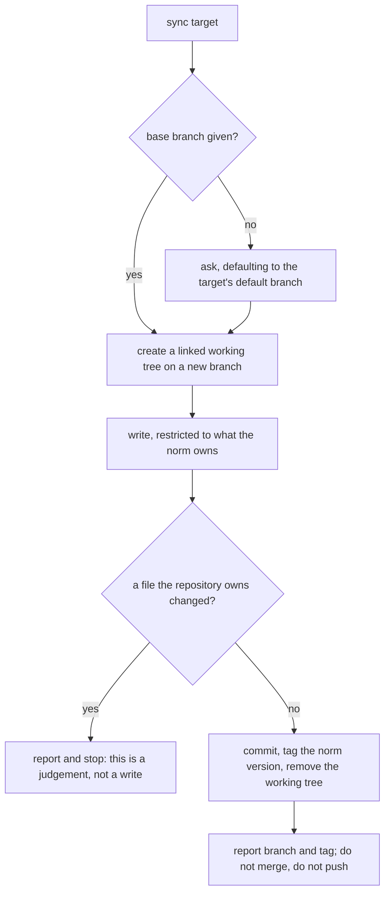

<!--
 Copyright (c) 2026 Danilo Borges (https://github.com/daniloborges)

 Licensed under the Apache License, Version 2.0 (the "License");
 you may not use this file except in compliance with the License.
 You may obtain a copy of the License at

 https://www.apache.org/licenses/LICENSE-2.0
-->

# Plan-025: The harness module, and the norm it promulgates

| Field | Value |
|---|---|
| Status | In Progress |
| Created | 2026-08-13 |
| Author | Danilo Borges |
| Related | [RFC-0002](../rfc/0002-bootstrapping-a-repository-and-what-auto-configuration-may-decide.md) · [RFC-0001](../rfc/0001-gates-and-ops-as-the-cli-unit-of-composition.md) |

---

## Summary

Everything this tooling knows how to write into a repository — rules, templates, the commit gate, the
configuration those read — currently gets there by a skill someone runs by hand, and leaves no trace that
says which version arrived. This plan builds the missing half: a `harness` noun that measures a repository,
promulgates a version of the norm into it on an isolated branch, and stamps what it delivered, so that
*"which repositories are on version N?"* becomes a command rather than an afternoon. It also folds in an
audit that exists today outside this repository as prose, splitting it at the line the tooling can defend —
the measuring half becomes commands that cannot mis-measure, and only the judging half stays a skill.

## Goals

1. A repository declares, in a file, which version of the norm it carries — and anyone can print that for
   several repositories in one command.
2. Nothing this tooling promulgates requires a per-clone manual step to work, and whatever must stay
   clone-local is a declared exception naming why — never a directory-wide rule nobody narrowed, whose
   reach is wider than the one file it was written for.
3. Promulgating into a repository never disturbs work in progress there, and never lands on a shared branch
   without a human deciding to merge it.
4. The boundary between what the norm owns and what a repository owns is written down, and a promulgation
   that would cross it stops and reports instead of writing.
5. The measurements a harness audit rests on are taken by commands with tests, not by a model composing
   shell at the moment it needs an answer.

## Scope

### In scope

The `harness` module and its verbs; the ownership boundary those verbs obey; the clone-local configuration
file and the applied-version map inside it; narrowing the ignore rules that would swallow what promulgation
writes; the source-and-target seam the module needs and the module contract does not yet have; and the
split of the existing harness audit into a deterministic half here and an inferential half that calls it.

### Out of scope

**Which channel performs a repository's *first* wiring, and what an automatic step may decide on its own.**
That is [RFC-0002](../rfc/0002-bootstrapping-a-repository-and-what-auto-configuration-may-decide.md), and it
is out of scope deliberately: its central rule is unstatable until Track 1 lands, and its candidate channels
each reach a different subset of repositories. This plan builds machinery that any of those channels can
call.

**A new composition over the harness apparatus.** Two detectors are named in Track 5 and both are useful,
but composing them into an ops is a separate decision about population, and the wrong time to make it is
while the module they would report on is still being designed.

**Checking a remote for a newer version.** A network check with a dismissal mechanism is a real pattern in
comparable updaters and is not warranted here: the norm is a local installation, so "what version is
available" is a file read.

## Design

The module is a **noun with verbs**, in the shape three governance nouns already use: `resolve` first,
answering where things are, and everything else built on what it returns.

Two facts about the current contract shape the design. First, **the target half is already solved**:
configuration resolution takes a starting directory rather than assuming the working directory, the CLI
resolves a repository root from any path inside it, and the MCP surface already accepts a repository
parameter. Acting on one repository that is not the current one costs nothing new. Second, **the source
half does not exist**: a module is handed exactly one repository root, and the token that expands to a
plugin surface resolves it *relative to the target*, which is the opposite of what promulgation needs. That
gap is Track 4, and it is small — one more resolved path in what a module is handed, declared only for the
modules that need it.

The verbs:

| Verb | Answers |
|---|---|
| `resolve` | where this target's harness surfaces are — rules, the bridge, the commit hook, configuration, the artifact path |
| `shape` | four facts that decide which recommendations are even available: whether there is a remote, where hooks live, what already runs, and what the repository's churn says it is for |
| `catalog` | everything available against everything actually composed here |
| `audit` | the measured inventory — guides with their always-on cost, sensors with their lifecycle position — writing nothing |
| `status` | the version this target carries against the version installed |
| `sync` | promulgation |

`catalog` deserves its own line because it exists to kill one specific failure. The audit this plan
internalises records, as a thing that actually happened, a confident recommendation to build a check that
was already written and merely unwired — sitting in a dependency the repository already had. A command that
prints what exists against what is composed makes that recommendation impossible to make, and it serves any
skill that recommends building something.

### Promulgation

`sync` is deliberately half a ceremony. It ends by producing a branch and a tag, and stops; merging is a
human decision made later, possibly much later, which is the point.

Three things about that flow are load-bearing and none is obvious.

**The isolated working tree removes the dirty-tree question rather than answering it.** A second working
directory of the same repository, on its own branch, means promulgation never touches the checkout someone
is working in. An in-place mode still exists for the case where isolation is unwanted, and *that* mode is
the one that has to insist on a clean tree and ask.

**A linked working tree shares the repository's internal directory, so clone-local git configuration
crosses into it.** The ignore list in particular applies there, and at least one repository excludes a
whole directory in order to hide a single file inside it. Nothing already tracked is at risk — an ignore
rule cannot reach a file the index knows — but every *new* file promulgation writes is: an ignored new path
stages as nothing, exits successfully, and reports the fact only as a hint, leaving a branch that looks
complete. **Promulgation must therefore verify what it actually staged rather than trust an exit code**,
and name the rule that caught anything it could not.

**The durable artifacts are the branch and the tag, not the directory.** The working tree is removed as the
last step, so promulgation cannot accumulate forgotten sibling directories nobody remembers creating. The
tag is what makes the delivered version legible to ordinary git commands without reading any file, and what
lets a later promulgation show only the difference.

### Ownership, and the state that is derived rather than stored

Everything above depends on a boundary that does not exist yet: which files the norm owns and may
overwrite, which the repository owns and it must never touch, and which are seeded once and then belong to
the repository forever. This is Track 1, it is the first track because nothing else can be written without
it, and its shape is the familiar one — a committed sample declaring what exists, and a clone-local file
holding the answers for this machine.

The clone-local file, ignored by version control, holds **one durable fact: which version of each record
type was promulgated here.** Everything a session needs to know is then derived by comparing that map
against what is installed, which means there is no switch anyone has to remember to turn off after the work
is done. That decision is recorded in RFC-0002 and its rationale belongs there; what matters here is the
consequence — a session hook that stays completely silent when the versions match, and costs nothing on the
overwhelming majority of sessions where nothing is pending.

The clone-local file layers over the committed one rather than replacing it, at every level of the
resolution cascade, so a repository can ship a fully populated configuration and a clone override only what
is true of that machine.

## Tracks

The first three are the foundation and are being worked as one dossier; nothing after them can be built
without all three. Tracks 4 through 7 are recorded here in full so their design survives without this
conversation, and each spawns its own dossier when it starts.

- [x] **Track 1 — The ownership boundary, written down.** Declare what the norm owns and may overwrite,
      what the repository owns and is never touched, and what is seeded once. Ships as a committed
      declaration plus the reference documentation that explains it, and every later track reads it rather
      than re-deciding. At the end there is a file that answers "may promulgation write this path?" without
      a judgement call.
      Task: [the-foundation-the-harness-module-stands-on.md](../tasks/the-foundation-the-harness-module-stands-on.md)
- [x] **Track 2 — Narrow an ignore rule that is a trap for the next file, not a blocker for this one.**
      The commit hook turned out to need nothing: it is machine-independent and already tracked everywhere.
      The clone-local ignore rule names its whole directory in order to hide one neighbour, and an ignore
      rule cannot reach a tracked file — so what it actually endangers is anything promulgation adds to
      that directory later, which would arrive untracked and be swallowed in silence. Narrow the rule to
      the one file that needs it.
      Task: [the-foundation-the-harness-module-stands-on.md](../tasks/the-foundation-the-harness-module-stands-on.md)
- [x] **Track 3 — The applied-version stamp, and a session hook that is silent by default.** Add the
      clone-local configuration file to the existing resolution cascade as its nearest entry, store the
      applied version in it, and register a session-start hook that compares it against the installed
      version. At the end the hook exists, says nothing when the versions match, and says something
      specific and actionable when they do not.
      Task: [the-foundation-the-harness-module-stands-on.md](../tasks/the-foundation-the-harness-module-stands-on.md)
- [ ] **Track 4 — A module learns it has a source as well as a target.** Add the resolved source surface to
      what a module is handed, declared only by the modules that need it, so promulgation can read the norm
      from where it is installed rather than from the repository it is writing into. At the end a module
      can name both ends without reaching for the filesystem itself.
- [ ] **Track 5 — The `harness` noun: `resolve`, `shape`, `catalog`, `audit`, `status`.** The read-only
      half of the module, complete and tested, including the measurement traps the audit has historically
      fallen into — a glob that matches nothing and reports zero everywhere, a count derived rather than
      taken. At the end each of those traps is a test rather than a paragraph asking a reader to be
      careful. The two detectors this track will surface but not compose — one refusing a gate runner that
      was copied in rather than resolved, one requiring a disabled check to name its reason — are recorded
      here and left to a later decision about population.
- [ ] **Track 6 — `sync`: isolated working tree, branch, tag.** Promulgation as designed above, including
      the in-place mode and its clean-tree requirement. At the end a repository can be brought to a version
      of the norm without its working tree being disturbed, and the result is inspectable as an ordinary
      branch before anyone merges it.
- [ ] **Track 7 — The audit's judging half becomes a skill that calls the audit's measuring half.** Retire
      the hand-run audit's measurement steps in favour of the verbs from Track 5, leaving the skill only
      what genuinely needs a model: placing components on the guide/sensor grid, recognising an instruction
      that is a command written in prose, and deciding whether a check may block or must only warn. At the
      end the skill is substantially shorter and cannot produce a wrong number.
- [ ] Run `/vibe-ops:close-plan` — retrospective against the goals, the demotion check, the tracking
      issue closed. The plan file itself is kept. Stays unchecked until the plan is actually closed; a
      track list that is otherwise complete but has this box open is not finished.

## Success criteria

- `vibe-ops harness status` run against several repository paths prints one line each, naming the version
  applied and the version installed, and the answer is stable across two consecutive runs that change
  nothing.
- The commit hook is a tracked file in this repository: `git ls-files` names it, and no clone-local ignore
  entry is required for it.
- `vibe-ops harness sync` against a target with uncommitted work leaves that work untouched, and produces a
  branch and a tag whose diff contains only paths the ownership declaration marks as owned by the norm.
- Opening a session in a repository whose applied version matches the installed one produces no injected
  text at all.
- `vibe-ops harness catalog` names at least one available-but-uncomposed item in a repository that has one,
  and reports none in a repository that is fully composed.

---

<!-- ===== LIVING SECTIONS — maintained during the work, not written at the end ===== -->

## Decision Log

- Decision: Discovery and mechanical porting may be delegated to a subagent; design judgements may not.
  Rationale: a subagent can survey what exists across repositories, and can port a detector from shell to
  TypeScript under a contract that fits in a paragraph, because both have a checkable result. The ownership
  boundary, the source-and-target seam, and the line between what the audit measures and what it judges are
  judgements that must agree with this plan's intent — a subagent does not hold the plan and returns
  something plausible that drifts.
  Date / Author: 2026-08-13 / Danilo Borges

- Decision: Bootstrapping and automatic configuration are an RFC, not a track of this plan.
  Rationale: the question has at least three candidate channels with genuinely different reach, and its
  central rule cannot even be stated before Track 1 defines ownership. Folding an unsettled design question
  into a plan track produces a track that cannot be started and blocks the ones behind it.
  Date / Author: 2026-08-13 / Danilo Borges

- Decision: The state a repository carries is the version applied, not a set of switches.
  Rationale: a stored switch has to be cleared by someone after the work it announces is done, and a signal
  that keeps firing once satisfied gets ignored rather than fixed. Comparing an applied version against an
  installed one is self-clearing. Recorded in full in RFC-0002.
  Date / Author: 2026-08-13 / Danilo Borges

- Decision: Promulgation stops at a branch and a tag; it does not merge and does not push.
  Rationale: merging into a shared branch is a judgement about timing that belongs to whoever is working
  there. Stopping at a branch also makes the result reviewable as an ordinary diff, which a direct write
  never is.
  Date / Author: 2026-08-13 / Danilo Borges

- Decision: The hook that dispatches to the workspace's knowledge pipeline stays clone-local, and this is a
  declared exception rather than an omission.
  Rationale: it is the only hook that genuinely embeds an absolute machine path, and it belongs to a
  pipeline this tooling's norm does not own. Promulgating it would put one machine's directory layout into
  every clone. What it must not do is take its neighbour down with it, which is what a directory-wide
  ignore entry has been doing.
  Date / Author: 2026-08-13 / Danilo Borges

- Decision: The applied-version state is a map keyed by record type, not one aggregate number and not the
  plugin's version.
  Rationale: per type is the granularity everything else already uses — each template declares its own
  version and each jump has its own migration note — so an aggregate would need a translation layer before
  it could say anything actionable. It is also not duplication of the version each artifact declares in its
  own frontmatter: the map is what was **promulgated** here, the frontmatter is what an artifact was
  **written against**, and the case worth detecting is exactly when the two diverge.
  Date / Author: 2026-08-13 / Danilo Borges

- Decision: Clone-local and general configuration are layered at every level of the cascade, not swapped at
  the nearest one.
  Rationale: layering lets a general config ship fully populated while a local file overrides only the keys
  it cares about, and applying the pair at every level makes the same override available in the operator's
  home directory — which the committed config already asks for in prose and had no mechanism for. The
  directory walk still outranks the pair: a nearer general file beats a farther local one.
  Date / Author: 2026-08-13 / Danilo Borges

- Decision: Track 2 is housekeeping, not a prerequisite, and Track 6 no longer waits on it.
  Rationale: this was recorded the other way round the same day, on the belief that the commit hook was
  excluded from version control and so could not be promulgated. Measurement refuted it — the hook is
  tracked in all eight repositories checked, and an ignore rule has no effect on a tracked file. What
  survives is narrower and still worth doing: a linked working tree shares the repository's internal
  directory, so the clone-local ignore list applies inside it, and any *new* file promulgation adds to that
  directory would be swallowed silently. That is a trap for future work rather than a blocker for this.
  Date / Author: 2026-08-13 / Danilo Borges

- Decision: A work item whose stated cause has not been measured does not get written into a record.
  Rationale: Track 2 was diagnosed wrong twice in one day — first as a machine path to extract, then as an
  exclusion to lift — and both were mechanisms reasoned from rather than facts checked. Each was refuted by
  a single command that could have been run before writing. The cost was low only because nothing had been
  built on either version yet, which is luck rather than process.
  Date / Author: 2026-08-13 / Danilo Borges

## Outcomes & Retrospective

**Tracks 1–3 landed 2026-08-13.** The ownership declaration and its reference exist and classify every path
the scaffold writes; the clone-local configuration file layers into the cascade at every level with the
applied-version map inside it; the session hook is registered and silent. Against the goals: goal 4 is met,
goal 2 is met for the one repository this dossier committed to, and goals 1, 3 and 5 are untouched by
design — they belong to the verbs, which start at Track 4.

Two things are worth carrying forward rather than leaving in a dossier that gets deleted.

**The `norm` class came out far smaller than the design assumed, and that is a finding about promulgation
rather than about classification.** Of what the scaffold writes, most is `seed` — a shape whose value is
that someone changes it. Promulgation being safe turns out to be mostly a statement about how little it
overwrites, which makes the whole mechanism cheaper and less frightening than the plan's Summary implies.

**Track 2 was diagnosed wrong twice before being measured once.** Both diagnoses were mechanisms reasoned
from rather than commands run, both were refuted in seconds, and the second was written immediately after
correcting the first. Nothing had been built on either, so the cost was a rewrite rather than a defect —
that is luck, not process, and it is why the Decision Log now carries a rule about it.

<!-- ===== END LIVING SECTIONS ===== -->

---

## Open questions

- Whether `status` across several repositories is one invocation per target or one invocation given many.
  The module contract hands a module exactly one repository root, and the honest reading is that many
  targets is the caller's loop rather than the module's argument — but that makes the common case noisier
  than it needs to be.
- Whether the two detectors named in Track 5 belong to a new composition or to an existing one. Their
  population is the mechanical apparatus, which is neither a record nor prose about machinery, and the
  precedent is that a detector whose population does not match its composition inherits the wrong
  exclusions in silence.
- What promulgation does when the ownership declaration itself has changed between the version applied and
  the version installed. The boundary is versioned like everything else, and a promulgation that reads the
  new boundary to decide what it may overwrite in a repository that agreed to the old one is assuming
  consent it does not have.

## Related

- [RFC-0002](../rfc/0002-bootstrapping-a-repository-and-what-auto-configuration-may-decide.md) — which
  channel performs a repository's first wiring, and the limit on what an automatic step may decide; blocked
  on Track 1 and deliberately outside this plan.
- [RFC-0001](../rfc/0001-gates-and-ops-as-the-cli-unit-of-composition.md) — the separation between a detector and
  the composition that decides its scope; this plan applies the same separation one level up, between what
  promulgates the norm and what verifies it.
