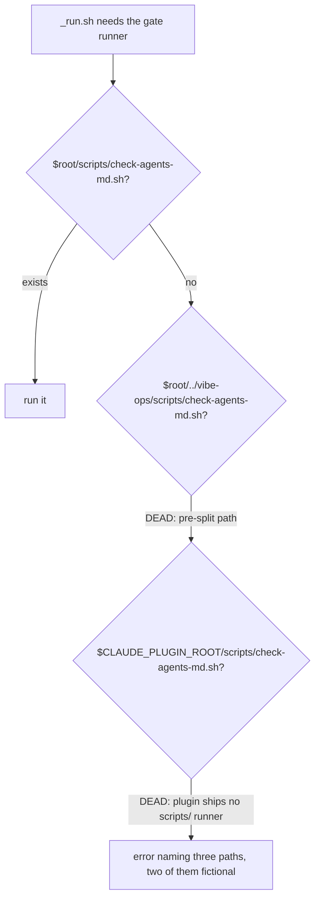

# Plan-026: The commands the agent had to work around

| Field | Value |
|---|---|
| Status | In Progress |
| Created | 2026-08-13 |
| Author | Danilo Borges |
| Related | Plan-027 (surface reform, Backlog) |

---

## Summary

An audit of ~390 session transcripts measured how this repository's own CLI and MCP server are
actually invoked. Two independent passes over the same corpus disagree on the absolute counts and
agree on every ratio and ranking, so the figures here are stated as the range the two produced: the
CLI outweighs the MCP surface by 8–9 to 1, `check` accounts for somewhere between 44% and 74% of all
CLI-side traffic, and — the finding that drives this plan — 1,400–1,650 greps are scoped to
`project/` across 570–630 distinct patterns, with 43 chains of three or more
consecutive greps. Those greps are not exploration. They are five structured questions the tooling
does not answer, asked by brute force: what is this record's status, which sections does it have,
how many tracks are still open, how many Surprises and Observations it carries, and what the next
free number is. This plan delivers the read verb that answers them, repairs four entry-level defects
that make the CLI unpleasant before it is even useful, closes the flag asymmetries between sibling
verbs, and ends by turning the gate into the post-edit hook it has always been used as.

## Goals

1. A single `records show <file>` answers the five questions that produced ~1,500 greps, as JSON.
2. No command in this repository ever returns an empty string that is indistinguishable from success.
3. `vibe-ops --version` and `--help` work, and `check` says why it failed instead of exiting 2 mute.
4. Every noun and every ops verb offers the same three cross-cutting flags: `--json`, `--verbose`,
   and one single name for "do not write".
5. `vibe-ops check` runs as a `PostToolUse` hook after Write/Edit, in the shape
   `plugin/skills/authoring-agents-md/SKILL.md` already ships and tests.

## Scope

### In scope

The twenty-nine items below, grouped into seven tracks by the package each one touches — the first of
which writes down the measurement the rest of them invalidate. Every item carries measured evidence
from the transcript audit or a `file:line` from the current tree.

### Out of scope

Two consolidations that change a public contract and need a recorded decision before any code moves.
They become **Plan-027, Status Backlog**, created as part of Track 2 of this plan:

- **One `resolve` or four.** `plan resolve`, `task resolve`, `log resolve` and `records resolve` all
  call the same `resolveRecord` + `formatResolved` from `@entelekheia/vibe-ops-records`, and
  `records resolve --type` already covers `plan|task`. Consolidating means choosing a direction —
  `--type` wins and the nouns lose the verb, or the inverse. They diverge today: `records resolve`
  fails without `--type`, `log resolve` has no numbering at all.
- **Per-`command` MCP schemas instead of a flag union.** `cli/packages/cli/src/mcp.ts` unions every
  verb's flags into one tool schema, so the `task` tool advertises `plan` and `summary-file` for
  `resolve` and `guard`, where neither is valid. The schema lies about what is accepted. Fixing it
  means generating one schema per verb, which changes the shape of every tool.

Also out of scope: cutting a release. This repository is under a deliberate version freeze — work
accumulates under `[Unreleased]` and `plugin.json` is not bumped.

## Design

### The read verb, and why it is the centre of this plan

`records show <file> --json` is one new verb in `cli/packages/module-records/`. It reads a governance
record and returns what the transcript audit shows agents grepping for, in one call:

The rank order below is the part to trust: both measurement passes produced the same seven patterns in
the same order, by different filters. The counts are the lower of the two passes.

| Field | Replaces | Measured greps |
|---|---|---|
| `sections` | `grep '^## '` | 41 (+33 with subsections) |
| `status` | `grep '^\| Status'` | 40 (+15 with the table form) |
| `surprises` | `grep '^## Surprises'` | 31 (+10 spelled out) |
| `tracks.open` / `tracks.total` | `grep '^- \[ \]'` | 14 |
| `observations` | `grep '^- Observation:'` | 15 |
| `migrations` | `grep '\[MD[0-9]+\]'` | 14 |
| `next number` | `grep '[0-9]{3}'` | 17 |
| `ceremony` | `grep 'close-plan\|close-task'` | 8 |

The tracks field costs almost nothing, and it lands in the package that already computes it:
`trackCheckboxes` in `cli/packages/records/src/status.ts:47-61` walks the tree-sitter tree of the
`Tracks` H2 section and counts checked against unchecked markers; `planStatusFindings`
(`status.ts:73-106`) consumes that count, emits only the Status-versus-tracks verdict, and throws the
numbers away. This is a projection of data the function already computes, in the package `records`
that `show` belongs to.

### Two entry defects that are not the same defect

`--help` already works at the top level (`cli/packages/cli/src/bin.ts:158-161`). What fails is
narrower and worth stating precisely, because the fix differs:

- `vibe-ops --version` falls through to `runNamed` at `bin.ts:182`, where any unrecognised top-level
  token becomes a module name — hence `cannot load @entelekheia/vibe-ops-module---version`. The fix
  is one more case beside the existing `--help` branch.
- `vibe-ops mcp --help` fails because `mcp` runs its own `parseArgs` (`bin.ts:163-176`) declaring only
  `--http` and `--port`. Per-subcommand help is a separate, per-verb fix.

Likewise, `check` exiting 2 has two sources: a spawn failure (`module-check/src/index.ts:94`) and the
shell runner's own refusal (`sh/check-agents-md.sh:577`, `not a git working tree: $ROOT`, written to
stderr). The cause "appears only sometimes" because the Node wrapper filters the runner's output
before printing it (`src/index.ts:105-110`). The fix is in the filter, not in the message.

### The empty-output contract

Four of the eight abandoned calls in the audit returned an empty string. In each one the agent did
not trust the silence and switched strategy: `log resolve` empty → fell back to `find`; `log index`
empty → skipped straight to `sweep`; `plan status --json` empty → hand-rolled a `for f in
project/plans/*` loop. The same thing happened live during the audit session itself.

`ModuleResult.summary` becomes **required** rather than optional (`cli/packages/core/src/module.ts`),
and a summary states what was looked for and where — `"no plan in project/plans has a Status
disagreeing with its tracks"` rather than nothing at all. There is deliberately no new object and no
`count`: the field already existed, both surfaces already render it, and a count beside a report array
would contradict this repository's own convention.

Under `--json` the line goes to stderr, so stdout stays a stream `jq` can read while a human still gets
the reason. See the Decision Log for why each of those three choices differs from what this section
first specified.

### The gate resolution chain, and its two dead branches

`plugin/skills/setup/templates/harness/checks/_run.sh` resolves the gate runner through three
branches. Two of them point at the pre-split location, which no longer exists — the file moved to
`cli/packages/module-check/sh/check-agents-md.sh`, recorded in
`project/log/scaffolding-a-repo-gate-after-the-scripts-split.md`.

Only the first branch resolves. A repository relying on the sibling-checkout branch gets the error at
line 61-62 listing three paths, two of which never existed at that location. Both dead branches are
repointed at `cli/packages/module-check/sh/check-agents-md.sh`, and the CI template
`plugin/skills/setup/templates/github/workflows/check.yml` is checked against the same reality.

### The gate as a hook

`vibe-ops check` is 27% of all measured invocations — 44% counting the equivalent direct script
calls. The bigram evidence says it is never a decision: `Edit → check` 38 times, `Bash → check` 24,
`Write → check` 6. A command invoked unconditionally after an event is a hook.

The shape already exists and is tested. `plugin/skills/authoring-agents-md/SKILL.md:11-19` declares a
skill-scoped `PostToolUse` hook whose command is the bare `vibe-ops` binary with an `args` array, and
`cli/packages/cli/src/hook.ts` reads the `PostToolUse` payload and answers in the hook protocol
itself. This track adds one `hook` verb, not a new script.

**The hook introduces no severity of its own, and does not read the check's default either.** It
consumes whatever the config cascade *resolved* for that check in that repository: the built-in
default is only the bottom of the cascade, and a repository's own configuration sits above it. What
resolves to fail, fails; what resolves to warn, warns; what a repository declared off through
`VIBE_OPS_DISABLED_CHECKS` reports `SKIP` naming its reason.

The distinction matters because reading the default would make the hook disagree with the terminal in
exactly the repositories that configured anything — the ones most likely to have had a reason. The
hook is a second invocation path for the same resolved run, not a second policy, which is what keeps
`git grep VIBE_OPS_DISABLED_CHECKS` the single answer to "what is switched off here" whether the gate
was reached by hook, by hand, or by `pre-commit`.

## Tracks

- [x] **Track 1 — The baseline snapshot.** Touches only
      `project/research/vibe-ops/2026-08-13-<slug>.md` and the workspace
      `project/research/README.md` row. Written with `/new-research` before any code moves, because
      every number in this plan describes a state that Track 2 starts destroying. It records the
      method as a re-runnable command rather than the ad-hoc aggregation that produced the figures,
      the two passes that disagreed and by how much, and the ranking both agreed on. Workspace-scoped,
      so no public twin: the corpus is this machine's session history across nine repositories, not
      anything belonging to `vibe-ops`. At the end: re-running the recorded command after Track 7
      produces a comparable number. Task: to be opened.

- [x] **Track 2 — Entry defects and cross-cutting flags.** Touches
      `cli/packages/cli/src/bin.ts` and `cli/packages/core/src/ops.ts`. Add `--version` as a case
      beside the existing `--help` branch at `bin.ts:158-161`, so it stops falling through to
      `runNamed` at `:182` and resolving as the module name
      `@entelekheia/vibe-ops-module---version`; give `mcp` and the other verb-owning subcommands
      their own `--help`, which today dies in each subcommand's private `parseArgs` (`:163-176`).
      Land the `{ok, count, reason}` contract in `core` and print it at `bin.ts:144-146`
      unconditionally, not only under `--json`. Add `--json` to `check` and to all three ops — it
      exists on all four nouns and is missing exactly where output volume hurts, which is why one
      session shows four successive reformulations of the same call adding `tail`, `grep` and `sed`.
      Add `--verbose` to the nouns, beside the `core/src/ops.ts:182-195` block that already declares
      it for the ops. Also file Plan-027 with the two out-of-scope decisions. At the end:
      `vibe-ops --version` prints a version, and no command can return a bare empty string.
      Task: to be opened.

- [x] **Track 3 — The gate command tells the truth about itself.** Touches
      `cli/packages/module-check/`. Give exit 2 a diagnosis: the runner already writes
      `not a git working tree: $ROOT` to stderr at `sh/check-agents-md.sh:577`, and the Node wrapper's
      output filter at `src/index.ts:105-110` is what makes it appear only sometimes; a spawn failure
      (`src/index.ts:94`) exits 2 for an entirely different reason and must say which. Resolve the argument
      question — `check .` ignores its argument and keys off cwd, so either the argument works or it
      is refused. Declare the `git add` precondition in the output, since three separate sessions
      independently discovered the clean output was lying about unstaged work. Add
      `check --explain <check-id>`, because agents opened the check's own `.sh` twice to find out what
      it verified, and `check → Read|grep` happened 17 times. Bring `--audit` and `--fix` over from
      the ops, and unify the duplicated `--list`/`--self-test` pair. At the end: no failure mode of
      `check` requires reading its source to interpret. Task: to be opened.

- [x] **Track 4 — The read verb.** Touches `cli/packages/records/` (where the reading primitives
      already live) and `cli/packages/module-records/src/index.ts` (where the verb is declared). Add
      `records show <file>` with the seven fields tabulated in the Design section, reusing
      `trackCheckboxes` and `findHeaderTable` from `records/src/status.ts` rather than reparsing.
      Add `--next-number`, which `computeNumbering` already produces inside `resolveRecord`
      (`records/src/resolve.ts`) and `formatResolved` emits as one `NEXT=` line among a dozen —
      replacing 17 greps for `[0-9]{3}`. Make `resolve` return the template body rather than its
      path: `formatResolved` (`records/src/format.ts:8-47`) returns `KEY=value` lines today, which is
      exactly why five `resolve → Read` pairs appear in the audit, the agent reading the very file the
      command had just named. Have it report which migration the record is behind, since
      `readTemplateVersion` already gives it the version. At the end: the five questions in the
      Summary are each one call. Task: to be opened.

- [ ] **Track 5 — Sibling verbs stop diverging.** Touches `cli/packages/module-plan/`,
      `module-task/`, `module-log/` and `module-records/`. Add `plan guard`, the missing symmetric of
      `task guard`, for plans whose success criteria are unverified. Give `plan close` the
      `--plan`/`--summary-file` parity `task close` already has, so a plan closure has somewhere to
      record itself. Settle on one name for "do not write" — `log index --check` and `--dry-run` are
      the same concept twice. Move `records`' repeated per-verb `JSON_FLAG` up to the module, as the
      other three nouns declare it. Make `records handling` with no path mean the census, since
      `census` is already that function over every record. Add `list` to the nouns, which every ops
      has as `--list`. Regroup the MCP tools so `plan` stops mixing record CRUD with prompt-text
      generation and `records` stops mixing layout with template-version reporting. At the end: no
      two sibling verbs differ in a way nobody chose. Task: to be opened.

- [ ] **Track 6 — Routing and the duplicated entrypoint.** Touches `plugin/skills/*/SKILL.md` and
      `plugin/skills/setup/templates/harness/`. Replicate into the nine skills that lack it the exact
      six-line MCP blockquote that `close-task/SKILL.md:31-37` and `close-plan/SKILL.md:39-45`
      already carry verbatim, including its honest fallback that the CLI is correct when no server is
      listed — this is why the MCP surface carries 11% of traffic despite zero hard failures against
      the CLI's 15. Repoint the two dead resolution branches in
      `templates/harness/checks/_run.sh:47-50` at
      `cli/packages/module-check/sh/check-agents-md.sh`, and verify the CI template's paths against
      the post-split reality. At the end: no skill prescribes only the terminal, and no resolution
      branch names a path that does not exist. Task: to be opened.

- [ ] **Track 7 — The gate becomes a hook.** Touches `cli/packages/cli/src/hook.ts` and
      `plugin/hooks/hooks.json`. Add the `hook` verb that runs the gate on `PostToolUse` for
      `Write|Edit|MultiEdit`, in the shape `authoring-agents-md` already ships, using the severity the
      config cascade resolved for each check rather than the check's default or a policy of its own. This track is last because it
      depends on Track 3 having made a failing gate
      interpretable without reading source. At the end: the 68 manual post-edit invocations are
      unnecessary. Task: to be opened.

- [ ] Run `/vibe-ops:close-plan` — retrospective against the goals, the demotion check, the tracking
      issue closed. The plan file itself is kept.

## Success criteria

`npm test` from the repository root is green (`node --test "cli/packages/*/test/*.test.ts"`, with
`pretest` building first). New behaviour is covered in the package's own `test/` directory, following
`cli/packages/module-plan/test/module.test.ts` — `node:test` plus a `scratchRepo()` built from
`mkdtemp` + `git init`, asserting against the module definition rather than a fixture repository.

Then re-run the measurement that produced this plan and compare:

- `vibe-ops --version` prints a version; `vibe-ops check --help` and `vibe-ops mcp --help` print help
  rather than `Unknown option`.
- `vibe-ops check` outside a git working tree exits non-zero **and** prints the cause on the same run.
- `vibe-ops records show project/plans/026-*.md --json` returns status, sections, open track count,
  Surprises count, Observation count, pending migrations and applicable ceremony in one call.
- `vibe-ops plan status` and `vibe-ops log index` on a repository with nothing to report print a
  summary naming where they looked, never an empty string.
- `vibe-ops check --json` and `vibe-ops governance --json` both emit structured data.
- `git grep -n 'check-agents-md.sh' plugin/skills/setup/templates/` shows no path under a `scripts/`
  directory that the repository does not have.
- `git grep -L 'Prefer the MCP tool' plugin/skills/*/SKILL.md` returns nothing.
- Editing a governance file in a session with the plugin loaded runs the gate without anyone typing
  it. In a repository whose configuration changes a check's severity away from its default, the hook
  and the terminal report that check identically — same resolved severity, same text — and a check
  disabled through `VIBE_OPS_DISABLED_CHECKS` reports `SKIP` with its reason on both paths.
- `vibe-ops check .` is green, and `vibe-ops plan status` reports nothing for this plan.

---

## Decision Log

- Decision: Group tracks by the package each one touches, rather than by theme or by execution
  independence.
  Rationale: Minimises merge conflict between tracks worked in parallel and makes each track
  independently verifiable against one build. The cost is accepted: a cross-cutting concern like
  `--json` is split across Track 2 and Track 3.
  Date / Author: 2026-08-13 / Danilo Borges

- Decision: The gate-as-hook is the last quick win rather than a separate design decision.
  Rationale: The shape it needs already exists and is tested in
  `plugin/skills/authoring-agents-md/SKILL.md:11-19`, and `cli/packages/cli/src/hook.ts` already
  parses the `PostToolUse` payload. It is a new `hook` verb, not new machinery. What a red gate does
  inside the hook inherits the gate's own configured severity, decided below.
  Date / Author: 2026-08-13 / Danilo Borges

- Decision: The `PostToolUse` hook uses the severity the config cascade resolved for each check —
  not the check's built-in default, and not a policy of the hook's own. Fail stays fail, warn stays
  warn, and a check disabled through `VIBE_OPS_DISABLED_CHECKS` reports `SKIP` with its reason.
  Rationale: Severity is the output of the cascade, where the built-in default is only the bottom
  layer and a repository's own configuration sits above it. Reading the default instead would make
  the hook disagree with the terminal in precisely the repositories that configured something — the
  ones that had a reason. It would also place a severity override somewhere
  `git grep VIBE_OPS_DISABLED_CHECKS` cannot see, breaking the property that makes that grep the
  workspace's whole debt ledger.
  Date / Author: 2026-08-13 / Danilo Borges

- Decision: The empty-output contract is `summary` made **required** on `ModuleResult`, not a new
  `{ok, count, reason}` object as this plan's Design section originally specified.
  Rationale: The field already existed and both surfaces already render it — the CLI prints it, the MCP
  server returns it as tool text. The defect was that it is optional, so modules omitted it on exactly
  the path where it matters, and `module-task` had the shape written out literally:
  `summary: dangling > 0 ? "…" : undefined`. A new object would have been a second channel for what
  `summary` is for, and its `count` field would have contradicted this repository's own stated
  convention that a report array carries its own length (`cli/AGENTS.md`, "The module contract").
  Making the field required turned the compiler into the census: it found every site, and nothing else
  had to be searched for.
  Date / Author: 2026-08-13 / Danilo Borges

- Decision: Under `--json`, the summary is written to **stderr** rather than printed with the payload.
  Rationale: Making `summary` required immediately broke `cli/packages/cli/test/json-flag.test.ts` —
  the line landed after the JSON on the same stream and stdout stopped being parseable. Suppressing the
  summary under `--json` would have restored exactly the silence this track exists to remove, so the
  line moved streams instead: a human still reads the reason, a pipe never sees it. The same reasoning
  applied to `module-check`, which had to start gating its own logging on `--json` for the first time.
  Date / Author: 2026-08-13 / Danilo Borges

- Decision: `--verbose` is **not** added to the four governance nouns, contrary to this plan's Track 2.
  Rationale: On an ops, `--verbose` selects between printing the whole run and printing only what
  failed. The nouns have no such distinction, so the flag would parse, appear in `--help` and in the MCP
  schema, and change nothing. Declaring an argument that does nothing is the same defect this plan sends
  to Plan-027 in the MCP flag union — adding a fresh instance of it while removing another is not
  symmetry worth having.
  Date / Author: 2026-08-13 / Danilo Borges

- Decision: The `resolve` consolidation and the per-`command` MCP schema leave this plan for
  Plan-027, Status Backlog.
  Rationale: Both change a public contract, and they influence each other — what `resolve` returns
  affects what a per-verb schema must declare. Neither should be decided under the momentum of a
  cleanup pass.
  Date / Author: 2026-08-13 / Danilo Borges

## Outcomes & Retrospective

**Track 1 (2026-08-13).** The baseline is written, with the aggregation reproducible from a single
recorded block rather than from the ad-hoc passes that produced the original figures. No task dossier
was opened: the track is one document plus one index row, and a dossier would have been overhead with
nothing to log.

Writing it changed what the plan claims. Two independent passes over the same corpus disagree on every
absolute — 507 against 623 CLI-side invocations, 1,626 against 1,420 greps, and 44% against 74% for
`check`'s share — while producing an identical ranking of grep patterns. The first pass of the second
aggregation was itself wrong in a way worth keeping: a loose pattern read space-separated folder lists
(`for repo in vibe-ops sites …`) as subcommands, inflating the CLI count to 935. Restricting the first
token to the verb list declared in `cli/packages/cli/src/builtins.ts` brought it to 623. Residue
survives and is declared rather than hidden.

The consequence for this plan: **the comparison after Track 7 is against the ranking, not the
absolutes.** Any retrospective claiming a percentage improvement in raw counts is measuring filter
choice as much as tooling change.

**Track 2 (2026-08-13).** `vibe-ops --version` prints a version, every module answers `--help` instead
of rejecting it as an unknown flag, `check` and all three ops gained `--json`, and every module command
now returns a summary — so `vibe-ops plan status` on a clean repository says
`no plan in project/plans has a Status disagreeing with its tracks` where it used to say nothing at all.
Three of the track's choices differ from what the Design section specified, and each is in the Decision
Log above with its reason: the contract is `summary` made required rather than a new `{ok, count,
reason}` object, the line goes to stderr under `--json`, and `--verbose` was refused on the nouns.

Two things the work exposed that the plan did not anticipate:

- **`--json` was declared but not honoured, twice.** Adding the flag to `check` and to the ops was not
  enough — both kept printing their human lines to the same stdout the payload uses, so the first
  `check --json` and the first `governance --json` produced unparseable output. Gating is per log site,
  and `defineOps` had four of them. This is the shape of the defect the flag exists to fix, reproduced
  while fixing it.
- **The typecheck was already red, and it hid the change.** `npm run typecheck` alone reported success
  because every `module-*` package checks against `core`'s built `dist/`, not its `src/` — the false
  green `cli/AGENTS.md` warns about. Running `npm run build` first turned 0 errors into 6 real ones.
  Two errors in `core`'s own tests (`config.test.ts:103`, `ops.test.ts:113`) predate this work and were
  confirmed against a clean checkout; they are still there.

**Track 3 (2026-08-13).** `check` stopped ignoring its own argument, stopped exiting 2 without saying
which of two unrelated failures happened, and stopped reporting a clean run over a population it had
silently narrowed. `--explain <id>` reads the fragment's own prose rather than a table kept beside the
id, so it cannot go stale against the check it describes.

The argument turned out to be a contract question, not a bug. A module may not touch `process.cwd()`
by design, so a relative `.` or `../other` is unresolvable inside one — which is *why* `check` was
keying off the working directory and ignoring what it was handed. The fix is a new declaration,
`repoFromFirstArg`, honoured by `runModule`: the one layer that legitimately knows the working
directory resolves the path and consumes the argument. `check .` still means what it always meant;
`check ../dot-agent-spec` now checks that repository instead of this one while reporting on the wrong
tree. Two tests guard both halves, including that a module *without* the declaration keeps its
positionals — a dossier path read as a repository would be the same defect inverted.

`--fix` was refused. The seventeen checks are shell fragments with no repair capability, so the flag
would parse, appear in `--help` and the MCP schema, and do nothing — the same reasoning that kept
`--verbose` off the nouns in Track 2. `--audit` was added, because it has real behaviour: report
identically, exit 0.

**Track 4 (2026-08-13).** `records show <file>` exists and answers the five questions in one call. It is
a projection, not new analysis: `handlingFor` already knew the type and the migrations, `trackCheckboxes`
and `findHeaderTable` already read what they read. What was missing was `packages/records/src/shape.ts`
— the headings a record has, and how many entries stand under a named section.

The design choice worth keeping is that **`entriesUnder` returns `undefined` for an absent section and
`0` for an empty one.** A plan with an empty `## Surprises & Discoveries` and a plan with no such
section are different states, and only one of them means nothing is owed. Collapsing both to zero would
have been the same defect as a command returning an empty string — the one Track 2 removed.

Reading the block tree rather than the text pays for itself immediately: the shipped templates contain
`## Surprises` inside a fenced example, and a `grep '^## '` counts it. The tests assert that difference
directly, since it is the whole reason a verb beats the grep it replaces.

`resolve` gained `--next-number` (17 greps for `[0-9]{3}`) and `--template`, which returns the body
rather than the path (five `resolve → Read` pairs). `--template` is a flag rather than the default: a
template body is ~150 lines and the common path should not carry it into every payload.

Covered on all three surfaces, and the third was a live gap rather than a formality: the module tests
call `run()` directly, which is surface-agnostic, so `records show` had no coverage on the MCP path
until a test was added to `mcp-nouns.test.ts` — the file that exists because positionals once reached
the terminal and nowhere else. It also asserts the summary arrives in the structured channel, since an
MCP client renders `structuredContent` and discards the text.

One failure in `npm test` is inherited, not caused here:
`project/tasks/template-version-gate-resolves-wrong-templates-path.md` declares no template version, so
`template-version-undeclared` fails against this repository's own checkout. Stamping it is a migration
action and belongs to `/vibe-ops:migrate`, not to this track.

---

## Open questions

- Whether `check`'s positional argument becomes meaningful or is refused. Both are defensible; the
  audit only shows that the current silent-ignore is what taught agents to `cd` first.

## Related

- Plan-027 — surface reform: one `resolve` or four, per-`command` MCP schemas. Backlog.
- `project/log/scaffolding-a-repo-gate-after-the-scripts-split.md` — records the move that left the
  two dead resolution branches behind.
