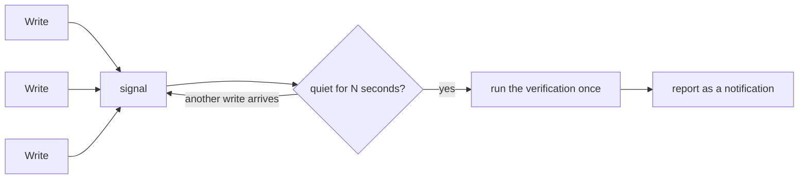

# Plan-028: The debounced channel for opportunistic verification

| Field | Value |
|---|---|
| Status | Backlog |
| Created | 2026-08-13 |
| Author | Danilo Borges |
| Depends on | Plan-026 |
| Related | [Plan-026](026-the-commands-the-agent-had-to-work-around.md) Track 7, which ships the unconditional version this replaces |

---

## Summary

Verification in this plugin fires at one of two bad moments: immediately after a single write, when the
tree is still mid-edit and any finding may be an artifact of a half-finished file, or unconditionally at
the end of every turn, which costs a full repository sweep and a model round-trip whether or not
anything was touched. Neither is the moment a reader actually wants, which is *after a batch of edits
has settled*. This plan builds the channel that can express that moment — a write signals, a few seconds
of quiet confirm the batch is over, and only then does anything run — and moves the gate, the plan
coherence read, and eventually test runs onto it.

## Goals

1. A verification runs once per settled batch of edits, not once per edit and not once per turn.
2. Nothing runs against a tree that is still being written.
3. The gate, `plan-status`, and any future opportunistic runner share one channel rather than each
   inventing its own timing.
4. A run that finds nothing still says so, without costing a turn continuation.

## Scope

### In scope

The channel and the two existing consumers moved onto it.

### Out of scope

Opportunistic test running — editing a source file and getting its test result back unasked. It is the
strongest argument for the channel and the reason to build it well, but it needs the channel first and
brings its own questions (which test, whose runner, what a failure means mid-batch). It gets its own
track here only once the channel is real, or its own plan.

Also out of scope: cutting a release. The repository is under a version freeze.

## Design

### Why the two moments available today are both wrong

`PostToolUse` fires per write. A multi-edit sequence passes through states nobody intends to keep, so a
gate reading one of them reports a failure that was never real. Scoping to the written path does not
help — that path is precisely the one mid-edit.

`Stop` fires once per turn, which is a coherent tree, and that is what Plan-026 Track 7 ships. Two costs
come with it: the runner sweeps the whole repository (~3.1s) whether one file changed or none, and
`hookSpecificOutput.additionalContext` on `Stop` **continues the conversation** — documented as keeping
it going "through the same loop protections as `decision: block`". Speaking on a clean run therefore
buys a model round-trip every turn.

### The channel

A write signals. A short quiet period — four to six seconds, tuned against real sessions rather than
guessed — confirms the batch has settled. Only then does the verification run, once, over what changed.

Two mechanisms can carry this and the choice is the plan's first decision. A **plugin monitor**
(`monitors/monitors.json`, `experimental.monitors`) runs a persistent command whose every stdout line
reaches Claude as a *notification* — no turn continuation, which is exactly the cost `Stop` imposes.
Against it: monitors are an experimental component and **do not load for project-scope plugins**. A
`PostToolUse` hook that only ever writes a signal file, paired with something that reads it, keeps the
work inside the surfaces this repository already uses, at the price of needing a reader that outlives
the hook.

### The opportune variant

A settled batch is not the only good moment. A tool result can name one: a test command that just
passed is a strong signal that a check is what comes next, and running it then is free attention rather
than an interruption. The channel should be able to carry a trigger that is *an observed tool result*,
not only *a quiet timer* — the two differ in what starts them and agree on everything after.

## Tracks

- [ ] **Track 1 — Choose the mechanism, and record why.** Monitor against signal-file-plus-reader,
      weighed on: turn continuation, whether project-scope plugins are in scope for this plugin's
      audience, and what an experimental component costs if its contract moves. At the end: an ADR, and
      a channel that runs one verification after a batch of writes settles in a real session — measured,
      not assumed. Task: to be opened.

- [ ] **Track 2 — Move the gate onto it.** `vibe-ops hook check-global` stops being a `Stop`
      registration and becomes the channel's consumer, keeping its severity contract unchanged: whatever
      the config cascade resolved, propagated, never reclassified. At the end: no turn continuation is
      spent on a clean run, and the agent still learns the gate ran. Task: to be opened.

- [ ] **Track 3 — Move `plan-status` onto it.** It has the same shape and the same defect in miniature:
      it fires per write on a plan that may be mid-edit. At the end: one coherence read per settled
      batch. Task: to be opened.

- [ ] **Track 4 — A trigger that is a tool result, not a timer.** Carry the opportune variant: a passing
      test run signals the channel directly instead of waiting out the quiet period. At the end: the
      channel accepts both kinds of trigger and the consumers do not know which fired. Task: to be
      opened.

- [ ] Run `/vibe-ops:close-plan` — retrospective against the goals, the demotion check, the tracking
      issue closed. The plan file itself is kept.

## Success criteria

- Editing eight files in one turn produces **one** gate run, not eight and not zero.
- A gate run never reports a finding caused by a file that was still being written — demonstrated
  against a multi-edit sequence that passes through a broken intermediate state.
- A clean run still reaches the agent, and costs no turn continuation.
- `vibe-ops check .` is green and `npm test` passes.

---

## Decision Log

- Decision: This is a plan of its own rather than a track inside Plan-026.
  Rationale: The channel does not exist yet, it would carry at least three consumers, and designing it
  while finishing a cleanup pass is how it gets designed badly. Plan-026 Track 7 ships the
  unconditional `Stop` version in the meantime, which is worse and works.
  Date / Author: 2026-08-13 / Danilo Borges

## Outcomes & Retrospective

<!-- Filled at each track completion. -->

---

## Open questions

- The quiet period. Four to six seconds is the intuition; the number should come from what real sessions
  do between writes, which is measurable from the same transcript corpus that produced Plan-026.
- Whether a project-scope plugin is in this plugin's audience. If it is, monitors are ruled out for that
  audience and the mechanism decision is already made.

## Related

- [Plan-026](026-the-commands-the-agent-had-to-work-around.md) — Track 7 and its Decision Log carry the
  measurements that produced this plan: the ~3.1s sweep, the mid-edit objection, and the documented
  turn continuation on `Stop`.
