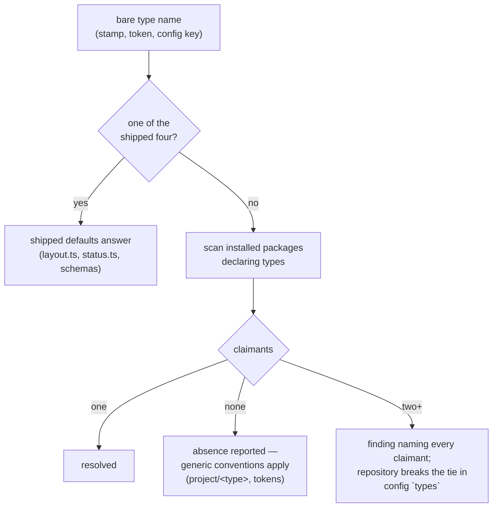

<!--
 Copyright (c) 2026 Danilo Borges (https://github.com/daniloborges)

 Licensed under the Apache License, Version 2.0 (the "License");
 you may not use this file except in compliance with the License.
 You may obtain a copy of the License at

 https://www.apache.org/licenses/LICENSE-2.0
-->

# Plan-029: A record type becomes a resolved name

| Field | Value |
|---|---|
| Status | In Progress |
| Created | 2026-08-20 |
| Author | Danilo Borges |
| Depends on | [RFC-0003](../rfc/0003-a-governance-type-as-a-pluggable-unit.md) |
| Related | [Plan-030](030-the-type-unit-and-the-compositions-derived-from-it.md) · [Plan-031](031-ownership-fragments-and-the-shaped-class.md) |

---

## Summary

`RecordType` in `cli/packages/core/src/config.ts` is a closed union of four literals — `"adr" | "rfc" |
"plan" | "task"` — and `RecordsConfig` keys both of its maps by it. The consequence, measured while
writing RFC-0003: a repository cannot even *mention* a type this tooling does not ship. `records: { dirs:
{ policy: "project/policy" } }` is a compile error, so no package can contribute a type and no repository
can bind one. This plan opens the union, adds the `types` binding table, and gives the CLI the scan that
resolves a bare type name to the one installed package that declares it — refusing, as a finding, when two
do. It is the first of three plans implementing RFC-0003 and delivers nothing user-visible by itself; what
it delivers is that every later step becomes possible.

## Goals

- A type name outside the shipped four is representable end to end: in `RecordsConfig`, in the
  `<records:<type>>` / `<template:<type>>` tokens (already generic since commits `a4d01e7` and `50ad03e`),
  and in every signature that today demands the union.
- `types` exists in `VibeOpsConfig`: a map from local type name to the qualified identifier of the package
  that governs it, declared only when the scan alone is ambiguous — same doctrine as `records.dirs`.
- The scan enumerates installed packages that declare types, and resolves a bare name by the rule of
  RFC-0003 ("Resolution: scan, refuse, declare"): one claimant resolves silently, zero reports absence,
  two or more is a finding naming every claimant — never a guess, never an error that aborts the run.
- The four shipped types keep working with zero configuration in every existing repository.

## Scope

### In scope

The type union and its consumers in `cli/packages/core`, `cli/packages/records`, and the signatures that
flow from them; the `types` config key; the package scan and its finding.

### Out of scope

- What a package's type declaration *contains* — the per-type unit (template, authoring rules, migration
  notes) is [Plan-030](030-the-type-unit-and-the-compositions-derived-from-it.md). This plan only needs
  the *marker* that lets the scan enumerate claimants.
- Ownership classes and the `shaped` class — [Plan-031](031-ownership-fragments-and-the-shaped-class.md).
- Any verb that writes configuration — deferred by RFC-0003's own scope decision.

## Design

The load-bearing fact for a reader with no other context: **the union is not one line**. Twenty-four
source files across eight CLI packages and three plugin directories mention the type `plan` (measured
2026-08-14, recorded in RFC-0003's Motivation). Most are *data keyed by type* — `CANDIDATE_DIRS`,
`DEFAULT_PAD`, `DEPTH` in `cli/packages/records/src/layout.ts`, the status chains in `status.ts`, the
header schemas in `cli/packages/gates/src/record-header/` — and stay exactly where they are: they become
the *shipped defaults* for the four names this package itself declares, rather than the definition of what
a type can be. The type opens; the knowledge about the four does not move.

Two constraints carried over from work already shipped, so they are not rediscovered: a **declared**
binding is used even when it does not resolve — the entry examines zero files against the name the
repository chose, visible and attributable, never a silent fallback (the same decision the
`<records:<type>>` token already implements); and ambiguity is a **finding**, not an exception — the same
shape as the emit-failure decision in commit `66343a1`, where an infrastructure problem must not
impersonate a gate verdict.

The scan's marker is the smallest thing that can work: a field in a package's `package.json` (working name
`vibeOps.types`, final name decided in the track) listing the type names it declares. Enumeration walks
`node_modules` the same way the existing three-form resolver (`cli/packages/cli/src/resolve.ts`) already
loads modules by name — no registry file, deliberately, for the reason `cli/AGENTS.md` records: a registry
is a second place to forget.

## Tracks

- [x] **Track 1 — Open the union.** `RecordType` becomes `string` (or a branded name type), the shipped
  four become data, and every consumer compiles and passes with the shipped types unaffected. Exists at
  the end: a repository config naming `policy` type-checks and flows to the tokens. Acceptance:
  `npm run typecheck && npm test` green from a clean build (`rm -rf cli/packages/*/dist` first — an
  incremental build cannot see cross-package staleness, per `cli/AGENTS.md`), plus a fixture repo with a
  custom type name in `records.dirs` resolving through `<records:policy>`.
  Task: [tasks/record-type-union-opens.md](../tasks/record-type-union-opens.md)
- [ ] **Track 2 — The scan and the binding table.** The package marker, the enumeration, the
  one/none/many rule, and `types` in `VibeOpsConfig`. Exists at the end: two fixture packages both
  declaring `policy` produce the finding naming both; adding the `types` line resolves it. Acceptance: the
  fixture scenario as a test, and the finding visible in `vibe-ops check`-style output.
  Task: [tasks/type-scan-and-binding-table.md](../tasks/type-scan-and-binding-table.md)
- [ ] Run `/vibe-ops:close-plan` — retrospective against the goals, the demotion check, the tracking
      issue closed. The plan file itself is kept.

## Success criteria

- A fixture repository declaring a type the tooling does not ship passes `typecheck`, resolves its
  directory and template through the tokens, and appears in `records census` without special-casing.
- Two fixture packages claiming one type name produce a finding that names both; the `types` binding
  resolves it; the binding used-though-unresolvable case reports zero examined, attributably.
- Every repository currently using the shipped four types needs no config change: `npm test` in this
  repository and a `vibe-ops governance .` run against an adopted repository behave identically to before.

---

## Decision Log

- Decision: Delegation split for this plan — discovery sweeps (finding every consumer of `RecordType`,
  every signature the union flows through) and mechanical rename/retype edits under a closed contract are
  delegable; the shape of the scan marker, the resolution rule, and anything that must agree with
  RFC-0003's intent are not.
  Rationale: the mechanical half is large (24 files) and contract-checkable by `typecheck`; the judgment
  half is small and drift-prone.
  Date / Author: 2026-08-20 / Danilo Borges

## Outcomes & Retrospective

(No outcomes yet — filled at each major track completion and at the end.)

---

## Related

- [RFC-0003](../rfc/0003-a-governance-type-as-a-pluggable-unit.md) — the model this implements (its
  Implementation Notes 1–3).
- Commits `a4d01e7` and `50ad03e` — the `<template:<type>>` / `<records:<type>>` tokens whose generic
  fallback (`project/<type>`) this plan's open union finally lets a repository reach on purpose.
