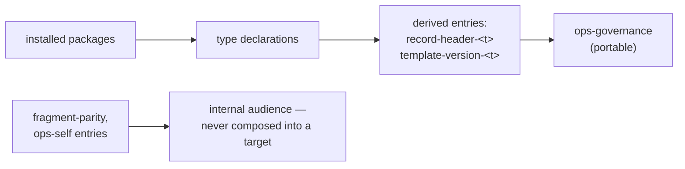

<!--
 Copyright (c) 2026 Danilo Borges (https://github.com/daniloborges)

 Licensed under the Apache License, Version 2.0 (the "License");
 you may not use this file except in compliance with the License.
 You may obtain a copy of the License at

 https://www.apache.org/licenses/LICENSE-2.0
-->

# Plan-030: The type unit, and the compositions derived from it

| Field | Value |
|---|---|
| Status | Backlog |
| Created | 2026-08-20 |
| Author | Danilo Borges |
| Depends on | [Plan-029](029-a-record-type-becomes-a-resolved-name.md) |
| Related | [RFC-0003](../rfc/0003-a-governance-type-as-a-pluggable-unit.md) · [RFC-0001](../rfc/0001-gates-and-ops-as-the-cli-unit-of-composition.md) |

---

## Summary

A record type's data facets — template, authoring rules, migration notes, declared directory and header
schema — live today in three unrelated plugin directories and two CLI packages, found by five different
conventions. This plan gathers them into **one per-type unit** that a package ships and a root resolves,
and makes the governance ops **derive** its entries from installed type declarations instead of
hand-writing ten literal entries for six types. It also draws the boundary RFC-0003 needs and the
2026-08-14 architecture research measured: each ops declares who it serves, so what adoption composes into
a target repository stops including entries that only make sense here.

## Goals

- One resolvable unit per type holding its data facets, shipped by a package, found through a root list
  (installed norm first, repository second) — the shape the migration notes already have, generalised.
- `ops-governance`'s per-type entries (`record-header-<t>`, `template-version-<t>`) are generated from the
  installed types, so a new type gets both entries without an edit here.
- Every ops declares its audience (portable vs this-repository-only); `fragment-parity` leaves the
  portable composition of `ops-governance`, and `ops-self` is formally marked internal.
- A type added by a fixture package is created by `/vibe-ops:new`, examined by the governance ops, and
  migrated by `/vibe-ops:migrate`, with no edit to this repository.

## Scope

### In scope

The unit's layout and resolver; deriving `ops-governance` entries; the audience field on ops; moving the
three prose facets of the four shipped types into their units.

### Out of scope

- Ownership classes travelling with the unit — [Plan-031](031-ownership-fragments-and-the-shaped-class.md).
- A type shipping its own gate or verb (executable code from outside) — deferred by RFC-0003, reopens
  only with a real external consumer.
- Adoption (`setup repo`) composing type declarations instead of its fixed skeleton — recorded as an open
  question in RFC-0003; worth its own plan when this one proves the unit.

## Design

The model to reconstruct from scratch: **migrate is already the shape.** Its notes are
`plugin/skills/migrate/migrations/<type>-<from>-to-<to>.md`, found by name from the stamp each artifact
declares — nothing in code knows the list, so a package depositing a note extends it. The other data
facets need the same property. Today they are scattered:

| Facet | Today | Convention |
|---|---|---|
| template | `plugin/templates/<t>.md` | flat directory |
| authoring rules | `plugin/references/records/<t>.md` | flat directory, different root |
| migration notes | `plugin/skills/migrate/migrations/<t>-A-to-B.md` | name-encoded jumps |
| directory / pad / depth / status chain | `cli/packages/records/src/layout.ts`, `status.ts` | TypeScript constants |
| header schema | `cli/packages/gates/src/record-header/` | TypeScript, keyed by `options.schema` |

The unit gathers them under one folder per type (working layout below; the track settles names), resolved
through a root list the same way config cascades — nearest declaration wins, absence falls through:

```text
<root>/types/<name>/
  template.md            # carries its own vibe-ops-template stamp
  authoring.md           # what /new loads for this type
  migrations/<a>-to-<b>.md
  type.json              # dir, pad, depth, status chain, header schema — data, not code
```

**Deriving the ops entries** replaces this hand-kept block in `cli/packages/ops-governance/src/index.ts`:
ten literal entries for six types, each new type costing two more. Derived, an entry pair
(`record-header-<t>` with the unit's schema, `template-version-<t>` with `<template:<t>>`) is emitted per
installed type. RFC-0001's doctrine is unchanged — the ops still owns population and emission; what
changes is where the entry list comes from.

**The audience boundary** is the 2026-08-14 research finding made mechanical: 9 of 17 shell fragments and
several composed entries only make sense in a repository that publishes a Claude Code plugin, and today
nothing distinguishes them from portable ones — a composition that "announces seventeen and delivers
five". An ops (and, where needed, an entry) declares `audience: portable | internal`; what a consumer
installs is filtered by it.



## Tracks

- [ ] **Track 1 — The unit and its resolver.** Layout settled, the four shipped types' prose facets moved
  in (with backwards-compatible reads from the old paths during the move), resolution through the root
  list. Exists at the end: `records resolve --type adr` answers from the unit. Acceptance: existing tests
  green; a fixture unit in a temp root resolves.
  Task: [tasks/type-unit-and-resolution-roots.md](../tasks/type-unit-and-resolution-roots.md)
- [ ] **Track 2 — Entries derived from installed types.** `ops-governance` builds its per-type entries
  from the declarations. Exists at the end: a fixture type gains both entries with no edit to this
  repository. Acceptance: `vibe-ops governance .` output identical for the shipped types before/after
  (diffed), plus the fixture case.
  Task: [tasks/ops-entries-derived-from-type-data.md](../tasks/ops-entries-derived-from-type-data.md)
- [ ] **Track 3 — The audience boundary.** `audience` declared on ops and entries; `fragment-parity` out
  of the portable composition; `ops-self` marked internal; what adoption/consumers see is filtered.
  Exists at the end: composing "portable only" over a plugin-less fixture repo yields no
  plugin-shaped SKIPs. Acceptance: the before/after SKIP count on such a fixture.
  Task: [tasks/ops-declares-its-audience.md](../tasks/ops-declares-its-audience.md)
- [ ] Run `/vibe-ops:close-plan` — retrospective against the goals, the demotion check, the tracking
      issue closed. The plan file itself is kept.

## Success criteria

- A fixture package's type is usable end to end — `/new` creates from its template and authoring rules,
  the governance ops examines it, `/migrate` applies its notes — with zero edits to this repository.
- `vibe-ops governance .` findings for the four shipped types are byte-identical before and after Track 2.
- A repository that publishes no plugin, composed with portable audience only, reports no entry that can
  only skip there.

---

## Decision Log

- Decision: Delegation split — moving the shipped types' files into units and the mechanical read-path
  updates are delegable under a closed contract (old path reads preserved, tests green); the unit's
  layout, `type.json`'s schema, and every audience classification are not.
  Rationale: the classifications *are* the boundary the research was commissioned to draw; delegating
  them re-opens it unrecorded.
  Date / Author: 2026-08-20 / Danilo Borges

## Outcomes & Retrospective

(No outcomes yet — filled at each major track completion and at the end.)

---

## Open questions

- Whether `plugin/templates/` can be fully vacated or must keep reading copies for artifacts that predate
  the move (the stamp-in-HTML-comment population `plugin/AGENTS.md` documents).
- Whether an entry-level audience is needed at all, or the ops-level field covers every real case — decide
  from the actual classification pass in Track 3, not in advance.

## Related

- [RFC-0003](../rfc/0003-a-governance-type-as-a-pluggable-unit.md) — the model; this plan is its "type
  ships as data" half. The measurements behind Track 3 (12 of 15 gates hold no repository knowledge; 9 of
  17 fragments apply only to a plugin-publishing repository) are restated where used, so this plan stands
  alone.
