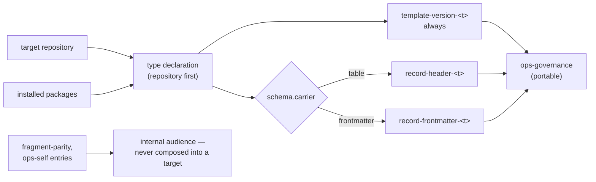

<!--
 Copyright (c) 2026 Danilo Borges (https://github.com/daniloborges)

 Licensed under the Apache License, Version 2.0 (the "License");
 you may not use this file except in compliance with the License.
 You may obtain a copy of the License at

 https://www.apache.org/licenses/LICENSE-2.0
-->

# Plan-030: The type unit, and the compositions derived from it

| Field | Value |
|---|---|
| Status | In Progress |
| Created | 2026-08-20 |
| Author | Danilo Borges |
| Depends on | [Plan-029](./shipped/029-a-record-type-becomes-a-resolved-name.md) |
| Related | [RFC-0003](../rfc/0003-a-governance-type-as-a-pluggable-unit.md) · [RFC-0001](../rfc/0001-gates-and-ops-as-the-cli-unit-of-composition.md) |

---

## Summary

A record type's data facets — template, authoring rules, migration notes, numbering and header schema —
live today in four unrelated plugin directories and two CLI packages, found by six different conventions,
one of which is a second copy of the template kept in step by hand. This plan gives a type **one
declaration** that a package ships and a root resolves, and makes the governance ops **derive** its
entries from installed type declarations instead of hand-writing ten literal ones. It also draws the
boundary RFC-0003 needs and the
2026-08-14 architecture research measured: each ops declares who it serves, so what adoption composes into
a target repository stops including entries that only make sense here.

## Goals

- One resolvable unit per type declaring its data facets, shipped by a package, found through a root list
  (repository first, installed norm second — the order `migrationsDir()` already implements) — the shape
  the migration notes already have, generalised.
- `ops-governance`'s per-type entries (`record-header-<t>`, `template-version-<t>`) are generated from the
  installed types, so a new type gets both entries without an edit here.
- Every ops declares its audience (portable vs this-repository-only); `fragment-parity` leaves the
  portable composition of `ops-governance`, and `ops-self` is formally marked internal.
- A type added by a fixture package is created by `/vibe-ops:new`, examined by the governance ops, and
  migrated by `/vibe-ops:migrate`, with no edit to this repository.

## Scope

### In scope

The manifest and its resolver; the header schema as data; deriving `ops-governance` entries; the one
mechanism for what a type duplicates today (the `setup` copy, the per-type skill) and the move it enables;
the audience field on ops.

### Out of scope

- Ownership classes travelling with the unit — [Plan-031](031-ownership-fragments-and-the-shaped-class.md).
- A type shipping its own gate or verb (executable code from outside) — deferred by RFC-0003, reopens
  only with a real external consumer.
- Adoption (`setup repo`) composing type declarations instead of its fixed skeleton — recorded as an open
  question in RFC-0003; worth its own plan when this one proves the unit.

## Design

The model to reconstruct from scratch: **migrate is already the shape.** Its notes are
`plugin/skills/migrate/migrations/<type>-<from>-to-<to>.md`, found by name from the stamp each artifact
declares — nothing in code knows the list, so a package depositing a note extends it. The other data
facets need the same property. Today they are scattered:

| Facet | Today | Convention |
|---|---|---|
| template | `plugin/templates/<t>.md` | flat directory |
| the same template, again | `plugin/skills/setup/templates/project/templates/<t>.md` | a second copy, held in step by `35-dogfooding-drift.sh` |
| authoring rules | `plugin/references/records/<t>.md` | flat directory, different root, **own version axis** (`vibe-ops-reference: records/<t>@N`) |
| migration notes | `plugin/skills/migrate/migrations/<t>-A-to-B.md` | name-encoded jumps |
| pad / depth / candidate dirs | `cli/packages/records/src/layout.ts` | TypeScript constants |
| header schema | `cli/packages/gates/src/record-header/`, `check-frontmatter/` | TypeScript, keyed by `options.schema` |

Two facets a first reading expects here are deliberately absent. **The status chain is not one:**
`plan-fields.ts` reads it from the resolved template's own `Status lifecycle:` marker, falling back to the
repository's governance rule, so the number already has an authority and a second one would contradict it.
**Nor is "the records directory":** `layout.ts` holds a *search order in a target repository*, which
`records.dirs` overrides — where a type is defined and where its artefacts live are different questions,
and merging them is what made an earlier draft of this table read as if a type owned a directory.

**The unit is a manifest, not a folder.** A path in this repository is load-bearing rather than an
address: the authoring rules declare their version *as their path* and a check matches the two, a
migration note's type is parsed out of its filename, `template-heading-drift` attributes dropped sections
by that same prefix, and the drift check pairs each template with its second copy. A manifest declaring
where each facet already sits costs none of that, and a package shipping a self-contained folder declares
that geometry just as well:

```json
// <root>/types/<name>/type.json — data, never executable
{
  "type": "adr",
  "template": "../../templates/adr.md",
  "authoring": "../../references/records/adr.md",
  "migrations": "../../skills/migrate/migrations",
  "schema": { "carrier": "table", "required": ["Status", "Date", "Deciders"] },
  "numbered": true, "pad": 4, "depth": 1,
  "dirs": ["project/adr", "adr", "docs/adr"]
}
```

**Moving this repository's own five types into self-contained folders is Track 5**, taken up once the
unit is proven — the declaration and the reorganisation are independent, and only the second carries risk.

**Two authorities, because there are two populations.** The norm's own facets are generated, so the CLI
reads a generated index rather than walking files; a target repository has no build, so its artefacts' own
headers are the authority there. That split is the pair `vibe-ops harness status` already compares, and it
is why resolution runs repository first.

**Where the norm's half of that pair LIVES is what Track 3 corrects.** Tracks 1 and 2 put it in the plugin
tree (`plugin/types/index.json`), because `sourceRoot` — the only path to the norm the CLI has —
resolves to a plugin tree in all three of its forms. RFC-0003 had already decided otherwise: the
resolution protocol is npm. The measured consequence of the current placement is that an npm-only install
has no norm at all, and the precedent for fixing it is in this workspace already — `core` ships `queries/`
beside `dist/` and resolves it relative to `import.meta.url`, working identically from a checkout and from
an installed package.

**Deriving the ops entries** replaces this hand-kept block in `cli/packages/ops-governance/src/index.ts`:
ten literal entries, each new type costing more. Derived, each installed type emits a
`template-version-<t>` entry against its own template, plus the entry its `schema.carrier` calls for —
`record-header-<t>` for a `table` carrier, `record-frontmatter-<t>` for a `frontmatter` one.
RFC-0001's doctrine is unchanged: the ops still owns population and emission; what changes is where the
entry list comes from.

**The entries are not a uniform pair, and the carrier is why.** `log` carries `name`, `description`,
`kind`, `path`, `attempted` and `source` in YAML frontmatter rather than a `| Field | Value |` table, so
its absence from the `record-header` entries is a second carrier and not a missing facet. Each carrier
maps 1:1 onto its own gate — `table` to `record-header`, `frontmatter` to `record-frontmatter`, the
symmetric sibling Track 2 adds. **`check-frontmatter` is not that gate and is never made into it**: its
three schemas are not field lists but per-schema logic, its population is the instruction surface rather
than records, and two `fragment-parity` entries pin it to the shell fragments it is being compared
against. `research` is the genuine irregularity — it has no template, borrows `<template:plan>`, and sits
disabled in `vibeops.config.ts`. It entered by mistake and is **removed rather than modelled**; the
freeze-status type it was standing in for arrives from `dot-agent` already conforming.

So the composed output changes by exactly two entries, both declared in advance, and they land in
different tracks: `log` gains the frontmatter entry it never had **in Track 2**, where the gate that
serves it is written and proved against the ten real entries under `project/log/`;
`template-version-research` disappears **in Track 4**. Everything else is byte-identical, and a difference
outside those two is a defect.

**The audience boundary** is the 2026-08-14 research finding made mechanical: 9 of 17 shell fragments and
several composed entries only make sense in a repository that publishes a Claude Code plugin, and today
nothing distinguishes them from portable ones — a composition that "announces seventeen and delivers
five". An ops (and, where needed, an entry) declares `audience: portable | internal`; what a consumer
installs is filtered by it.



## Read these first

Written 2026-08-21, before a compaction, because the session that produced Tracks 1–3 is about to be
discarded and a compacted session trusts the retelling rather than re-exploring. In order, each with why:

1. **[ADR-0018](../adr/0018-a-package-declares-its-types-by-pointing-at-a-directory.md)** — what a package
   publishes to declare a type, and the two shapes rejected. Track 3 implements this contract; everything
   below is downstream of it.
2. **[Plan-029, shipped](shipped/029-a-record-type-becomes-a-resolved-name.md)** — the dependency this
   plan declares, now closed. Its retrospective carries what its two success criteria actually cost, and
   one blocked promotion. `RecordType` is an open name and the package scan exists *because of it*.
3. **`cli/packages/core/src/type-scan.ts`** — the scan Track 3 resolves the norm package through. Its
   header states the one/none/many rule and why it never imports.
4. **`cli/packages/records/src/type-unit.ts` and `type-index.ts`** — what a type unit IS and how the
   generated index is built. Track 3 moves both to the package; nothing about their shape changes.
5. **[tasks/the-norm-travels-as-a-package.md](../tasks/the-norm-travels-as-a-package.md)** — Track 3's
   dossier, split into two parts, with the measurement that motivates it: an npm-only install has no norm
   at all.

**The one thing not written down anywhere else:** Track 3's Part 1 was about to begin and the package was
scaffolded and then removed, deliberately — `cli/packages/*` is the workspace glob, so an empty `src/`
breaks `npm run build`. Recreate it only together with its first source file.

## Tracks

- [x] **Track 1 — The unit and its resolver.** The manifest schema, the resolver over the two roots, one
  unit per shipped type pointing at where its facets already sit, and the generated index that is the
  norm's authority. **Nothing moves.** Exists at the end: a fixture unit in a temp root resolves every
  facet. Acceptance: existing tests green; the fixture resolves; `vibe-ops governance .` output unchanged,
  because Track 1 composes nothing.
  Task: [tasks/type-unit-and-resolution-roots.md](../tasks/type-unit-and-resolution-roots.md)
- [x] **Track 2 — The header schema becomes data.** `record-header` takes its required-field list from
  `options` instead of a closed union of four literals it throws outside of, and `options.schema` becomes
  `options.type` because it now names a type rather than selecting a schema. The `frontmatter` carrier
  gets `record-frontmatter`, a symmetric sibling — **not** an extension of `check-frontmatter`, whose
  schemas are logic rather than field lists and which two `fragment-parity` entries pin in place. `log`'s
  entry is composed here, where the gate serving it can be proved against ten real records rather than a
  fixture alone. Exists at the end: a type the tooling ships nowhere gets a header entry with no gate
  edit. Acceptance: `governance` output diffed before/after differs only by the added
  `record-frontmatter-log` entry; a gate test with an invented type produces `record-header-<that type>`.
  Task: [tasks/header-schema-becomes-data.md](../tasks/header-schema-becomes-data.md)
- [ ] **Track 3 — The norm travels as an npm package.** A course correction, and it comes from RFC-0003's
  own words: *"the resolution protocol is therefore npm, and a type's identity is the package that ships
  it."* Today no package publishes anything but `dist` (plus `core`'s `queries`), so every type unit,
  template, authoring rule and migration note lives only in the Claude plugin tree — and `sourceRoot` is
  `harness.source ?? --source ?? CLAUDE_PLUGIN_ROOT`, all three naming a plugin tree. **Install the npm CLI
  alone and there is no norm at all**: no templates, no notes, no types, so `migrate` finds nothing,
  `harness status` is mute and promulgation cannot run. Tracks 1 and 2 built on the plugin tree because
  that is where `sourceRoot` points, which is consistent with the machinery and divergent from the
  protocol. Exists at the end: `vibe-ops governance` resolves the shipped types in a repository with the
  npm CLI and no plugin installed. Acceptance: that case, plus the plugin keeping only what drives the
  CLI.
  Task: [tasks/the-norm-travels-as-a-package.md](../tasks/the-norm-travels-as-a-package.md)
- [ ] **Track 4 — Entries derived from installed types.** `ops-governance` builds its per-type entries
  from the declarations, keyed by carrier; the `required` literals Track 2 wrote into those entries — and
  the guard holding them to the manifests — are deleted together, because the derivation supersedes both.
  The `research` entry is deleted rather than derived. **The structural change this no longer needs:**
  `OpsDefinition.gates` is a static array today, read once at `defineOps` time for the emit-id check and
  iterated per run, so an entry list computed from the repository being run against needs that field to
  become a function of it. Exists at the end: a fixture type gains its entries with no edit to this
  repository. Acceptance: `vibe-ops governance .` output diffed before/after, differing only by the
  removed `research` entry (`log`'s landed in Track 2), plus the fixture case.
  Task: [tasks/ops-entries-derived-from-type-data.md](../tasks/ops-entries-derived-from-type-data.md)
- [ ] **Track 5 — What the unit derives, and the move.** One generation mechanism for both artefacts a
  type duplicates today: the `setup` template copy and the per-type `/new-<t>` skill, whose `paths:`
  frontmatter is the only reason those skills exist separately. Generated at build for this plugin's own
  types, at adoption into the target repository's `.claude/skills/` for a type an external package brings
  — a package cannot inject a `SKILL.md` into this plugin. The five shipped types move into
  self-contained folders here, once there is something proven to move them into. Exists at the end:
  `35-dogfooding-drift.sh`'s pair list is empty because nothing is duplicated by hand.
  Task: (to be written)
- [ ] **Track 6 — The audience boundary.** `audience` declared on ops and entries; `fragment-parity` out
  of the portable composition; `ops-self` marked internal; what adoption/consumers see is filtered.
  Exists at the end: composing "portable only" over a plugin-less fixture repo yields no
  plugin-shaped SKIPs. Acceptance: the before/after SKIP count on such a fixture.
  Task: [tasks/ops-declares-its-audience.md](../tasks/ops-declares-its-audience.md)
- [ ] Run `/vibe-ops:close-plan` — retrospective against the goals, the demotion check, the tracking
      issue closed. The plan file itself is kept.

## Success criteria

- A fixture package's type is usable end to end — `/new` creates from its template and authoring rules,
  the governance ops examines it, `/migrate` applies its notes — with zero edits to this repository.
- `vibe-ops governance .` findings for the shipped types are byte-identical across Tracks 2 and 3, except
  the two differences Design declares in advance and assigns to a track each: `log`'s frontmatter entry
  gained in Track 2, `research` removed in Track 4.
- No gate holds a list of the types this repository ships. Passing an invented type name and a field list
  to `record-header` or `record-frontmatter` produces findings under that name, with nothing edited here.
- Nothing that a type owns is written twice by hand: `35-dogfooding-drift.sh` has no pair left to compare,
  and adding a type adds no file to `plugin/skills/`.
- A repository that publishes no plugin, composed with portable audience only, reports no entry that can
  only skip there.

---

## Decision Log

- Decision: Delegation split — moving the shipped types' files into units and the mechanical read-path
  updates are delegable under a closed contract (old path reads preserved, tests green); the unit's
  layout, `type.json`'s schema, and every audience classification are not.
  Rationale: the classifications *are* the boundary the research was commissioned to draw; delegating
  them re-opens it unrecorded.
  Date / Author: 2026-08-20 / Danilo Borges

- Decision: The unit is a manifest declaring where each facet sits, not a folder the facets move into.
  The five shipped types stay where they are until Track 5.
  Rationale: four mechanisms read a facet's path as meaning rather than as an address — the authoring
  rules' version *is* their path under `references/` and a check matches the two, a note's type is parsed
  from its filename, `template-heading-drift` attributes dropped sections by that prefix, and the drift
  check pairs each template with a second copy. Moving first would put all four inside the track that was
  supposed to only define the unit.
  Date / Author: 2026-08-20 / Danilo Borges

- Decision: Resolution is repository first, installed norm second.
  Rationale: it is the order `migrationsDir()` already implements and `records.dirs` already practises,
  and this tooling does not run continuously — norm-first would impose a shape at the moment somebody
  updated an unrelated package.
  Date / Author: 2026-08-20 / Danilo Borges

- Decision: No version dimension in the unit's path. Old shapes are reconstructed from the migration
  chain, never stored as copies.
  Rationale: carrying versions serves *creating* an artefact at an old version, which nothing needs; the
  chain already serves *reading and migrating* one, which is the case that exists. It is the split
  between Rails/Flyway-style migration chains and Rust-edition/Kubernetes-style multi-version carry, and
  this tooling only needs the first. The honest cost: `template-heading-drift` keeps reconstructing the
  old shape from the notes' tables rather than diffing against a stored template.
  Date / Author: 2026-08-20 / Danilo Borges

- Decision: The header schema is typed by carrier (`table` or `frontmatter`), not a bare field list.
  Rationale: `log` declares its required fields in YAML frontmatter, so its absence from the
  `record-header` entries is a second carrier rather than a missing facet — and a bare list would have
  derived an entry for a gate that cannot read it. The carrier is also what keeps Track 3's byte-identical
  criterion satisfiable.
  Date / Author: 2026-08-20 / Danilo Borges

- Decision: `research` is deleted rather than modelled. The freeze-status type it stood in for arrives
  from `dot-agent` conforming to the unit.
  Rationale: it entered by mistake, has no template of its own, and every generalisation built to
  accommodate it would be a permanent shape carrying a temporary error.
  Date / Author: 2026-08-20 / Danilo Borges

- Decision: the generated index (Track 1, item 5) is shipped inside the plugin tree
  (`plugin/types/index.json`), not an npm package's `dist/`, correcting this Design section's earlier
  "shipped in `dist`" wording.
  Rationale: measured while planning Track 1's execution — `shippedVersion()`, the one reader this index
  has to serve, takes `sourceRoot`, which means the installed plugin tree everywhere else in this
  codebase (it already reads `sourceRoot/templates/<type>.md`, never a `dist/` path); no package here
  writes generated data into `dist/` today (plain `tsc`, no bundler, no prebuild hook in any of the 13
  packages); and both npm packages' `exports` maps are closed, so a `dist/*.json` would not even be
  reachable. `dist` was the wrong word for what this Design section meant by "the norm's own facets have
  a build" — the plugin tree, not an npm package, is what gets distributed.
  Date / Author: 2026-08-20 / Danilo Borges

- Decision: the index's drift check is a **gate** composed into `ops-self`, not a shell fragment under
  `module-check/sh/checks/`.
  Rationale: it was first written as `36-type-index-drift.sh`, on a misreading of `cli/AGENTS.md`'s "the
  checks are shell and stay shell" — a sentence that protects the existing seventeen fragments from being
  rewritten, and says nothing about where a NEW detector belongs. RFC-0001 already answers that: gate plus
  ops entry is the unit, and the direction of travel is one way. The port is strictly better, which is the
  evidence the misreading cost something: as a gate it declares `fixable` and `--fix type-index-drift`
  regenerates the index, it names which type drifted rather than only that the file did, and it rebuilds
  through the same `buildTypeIndex` the generator calls instead of re-deriving a subset of fields in `jq`
  that would silently stop covering any key the index later gains. `cli/AGENTS.md` was corrected so the
  sentence cannot be read that way again.
  Date / Author: 2026-08-20 / Danilo Borges

- Decision: the `frontmatter` carrier gets its own gate, `record-frontmatter`, and `check-frontmatter` is
  never made into it.
  Rationale: measured while elaborating Track 2. `check-frontmatter`'s three schemas are not required-field
  lists — the only presence check is `description`, identical for all three, and everything else is
  per-schema logic (a line heuristic for an unquoted value containing `": "`, a three-key forbidden list
  for `agent`, an enum on `isolation`). Its population is the instruction surface, not records. And two
  `fragment-parity` entries compare it against `40-frontmatter.sh` and `45-skill-frontmatter.sh`, so its
  behaviour is pinned until those fragments retire — the comparison RFC-0001 requires. A symmetric sibling
  keeps each carrier mapping onto exactly one gate and leaves that comparison untouched.
  Date / Author: 2026-08-20 / Danilo Borges

- Decision: `record-header`'s `options.schema` is renamed `options.type`; the finding rule and the entry
  label stay `record-header-<type>`.
  Rationale: with the field list arriving as data the option names a record type rather than selecting a
  schema, and the distinction earns its keep — `schema` selects behaviour, which is what `check-frontmatter`
  genuinely does. The rule and label are held fixed deliberately: `ignore`, `disabled` and `--fix` key on
  the label, `level` keys on the rule first, and the emitted artifact uses both, so changing either would
  silently unbind repository configuration from the entries it names.
  Date / Author: 2026-08-20 / Danilo Borges

- Decision: in Track 2 the entries carry their `required` list literally, guarded by a test that holds it
  to `plugin/types/index.json`; Track 4 deletes the literals and the guard together.
  Rationale: the alternative — the ops naming the manifest path and the gate reading it, as
  `template-version` does with `options.template` — removes the duplication outright, but Track 3 already
  resolves the unit to build the entry list, so the gate would re-read a file the ops just read and the
  path form would be thrown away. The literal is the shape the derivation produces. The duplication it
  creates is real, so it is closed by a mechanical guard rather than by intending to get to Track 3.
  Date / Author: 2026-08-20 / Danilo Borges

- Decision: the norm ships as an **npm package**, and this became **Track 3** rather than later work —
  Tracks 1 and 2 built on the plugin tree, so it corrects the footing the remaining tracks stand on.
  Rationale: RFC-0003 already decided the protocol ("the resolution protocol is therefore npm, and a
  type's identity is the package that ships it"); placing the units in `plugin/types/` diverged from it.
  Measured: no package publishes anything but `dist` (plus `core`'s `queries`), and `resolveSourceRoot` is
  `harness.source ?? --source ?? CLAUDE_PLUGIN_ROOT` — three names for a plugin tree — so an npm-only
  install has no templates, no migration notes and no types at all. It also **supersedes the answer this
  plan had recorded for Track 4**: giving `defineOps` a `needsSource` passthrough would read the norm from
  a plugin tree, which is exactly the install that has none. A package the ops depends on resolves from
  `node_modules`, needs no core change, and answers where `needsSource` could not.
  Date / Author: 2026-08-20 / Danilo Borges

- Decision: the type package carries **the code coupled to its data**, not data alone; and one package
  ships the five types rather than five packages.
  Rationale: a header has a FORMAT, and the TypeScript reading it is coupled to that format —
  `plan-fields.ts` looks for the plan template's own `Status lifecycle:` marker and its living-sections
  fence, `status.ts` counts the checkboxes under `## Tracks`, `close.ts` reads a dossier's shape,
  `log.ts` reads a log entry's frontmatter contract. Shipping a template in one package and its reader in
  another would put a version boundary through the middle of one fact. Measured: 1333 of `records/src`'s
  2866 lines (46%) name a particular template. One package because RFC-0003's own identifier is
  `npm/@scope/governance-policies@0.1#policy@2` — plural, type selected by a fragment — so a package
  shipping several types is the modelled case; the resolver must still handle `governance-plan#plan` and
  `dot-agent-freeze#freeze-policy`, which is what the scan does. **Recorded here rather than only in the
  Track 3 dossier, which is deleted at closure.**
  Date / Author: 2026-08-21 / Danilo Borges

## Outcomes & Retrospective

(No outcomes yet — filled at each major track completion and at the end.)

---

## Open questions

- Whether `plugin/templates/` can be fully vacated, now that Track 3 moves the norm into a package —
  what remains open is only whether reading copies must stay for artifacts predating the move (the
  stamp-in-HTML-comment population `plugin/AGENTS.md` documents), not where the canonical copy lives.
- Whether an entry-level audience is needed at all, or the ops-level field covers every real case — decide
  from the actual classification pass in Track 6, not in advance.
- **A promulgation hash, for [Plan-031](031-ownership-fragments-and-the-shaped-class.md).** `harness.applied`
  records a *version* per type, which answers "is this behind?" and cannot answer "was this edited?".
  Recording a hash of what was written would let a `norm` path be overwritten knowing whether anything is
  being destroyed. It belongs with the ownership fragments rather than here, and is raised now so 031 is
  not written without it.
- **`harness.applied` is clone-local and should not be.** It lives in `vibeops.config.local.json`, which is
  git-ignored, so two clones of one repository can hold different target versions with neither detectably
  wrong. Moving it to a committed file must not move it into `vibeops.config.ts` — that file is
  hand-written and executable, and the tooling editing someone's TypeScript is the bug class the local
  JSON exists to avoid. A committed *state* file is the shape; it blocks nothing in this plan.

## Related

- [RFC-0003](../rfc/0003-a-governance-type-as-a-pluggable-unit.md) — the model; this plan is its "type
  ships as data" half. The measurements behind Track 3 (12 of 15 gates hold no repository knowledge; 9 of
  17 fragments apply only to a plugin-publishing repository) are restated where used, so this plan stands
  alone.
