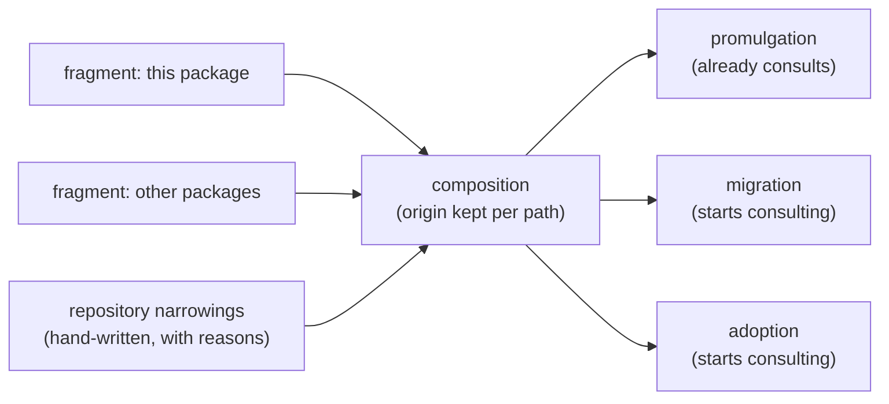

<!--
 Copyright (c) 2026 Danilo Borges (https://github.com/daniloborges)

 Licensed under the Apache License, Version 2.0 (the "License");
 you may not use this file except in compliance with the License.
 You may obtain a copy of the License at

 https://www.apache.org/licenses/LICENSE-2.0
-->

# Plan-031: Ownership fragments, and the shaped class

| Field | Value |
|---|---|
| Status | In Progress |
| Created | 2026-08-20 |
| Author | Danilo Borges |
| Depends on | [Plan-033](./shipped/033-one-artifact-one-governance.md) |
| Related | [RFC-0003](../rfc/0003-a-governance-type-as-a-pluggable-unit.md) · [Plan-017](./shipped/017-the-plans-still-written-against-the-first-template-shape.md) (absorbed by Track 3) |

---

> **Updated 2026-08-22, after Plan-033.** The fragment SPLIT already happened: each governance package
> ships an `ownership.json` fragment for its artifact and the harness carries the base half, composed at
> `sync` by concatenation with `version = max`. What this plan still owes of its fragment story is the
> part 033 deliberately left naive: **per-path origin, the double-claim finding, and the repository's
> narrowing layer.** Enumeration is the activated bindings (ADR-0019), never the Plan-029 scan, which
> left the resolution path.

## Summary

The ownership declaration classes `project/{adr,rfc,plans,tasks,log,research}/**` as `repo` — *"never
written and never read for a decision"* — and the migrate skill writes exactly those files. Both are
correct about their own actor, because the declaration governs promulgation and nothing else; the
vocabulary has no word for what migration does. This plan adds that word — the **`shaped`** class, where
the tooling owns a file's *structure* and the repository owns its *content*, permanently — completes the
fragment composition with **per-path origin** and the double-claim finding, and gives the repository its
**narrowing**: reclassifying a path toward less tooling authority, by hand, with a reason. Migration and
adoption start consulting the declaration, which today only promulgation reads.

## Goals

- `shaped` exists in the ownership vocabulary; the record directories are reclassified from `repo` to
  `shaped`; an artifact carrying a locally added section is still migrated and the section survives.
- The composition (already reading the harness base + each activated governance's fragment) keeps each
  path's claimant and reports a doubly-claimed path as a finding — peers, never precedence.
- A repository can narrow a class (`norm → shaped → seed → repo`) in its committed configuration, with a
  reason, refused when it would widen; the composition applies narrowings as the last layer.
- Migration and adoption consult the composed declaration before writing, as promulgation already does.
- This repository's own records, still stamped against old template versions, are migrated under the new
  class — which closes [Plan-017](./shipped/017-the-plans-still-written-against-the-first-template-shape.md).

## Scope

### In scope

The `shaped` class and its semantics; fragments and composition with origin; the repository-side
narrowing, hand-written; migration/adoption reading the declaration; the acceptance migration run.

### Out of scope

- The `ownership` verb surface (`get`/`list`/`set`) and the configuration-format question it drags in —
  [Plan-032](032-the-ownership-verb-and-the-configuration-it-writes.md), per RFC-0003's scope decision.
- Overlapping-but-unequal glob claims — deliberately unresolved in RFC-0003 until a real overlap exists;
  identical claims conflict, and that covers the case that exists.

## Design

The vocabulary, complete, for a reader with only this file (full model: RFC-0003, "The fourth ownership
class"):

| Class | The tooling owns | The repository owns |
|---|---|---|
| `norm` | the whole file — promulgation overwrites it | nothing |
| `seed` | the file until it exists | everything afterwards |
| `shaped` | the structure | the content, permanently |
| `repo` | nothing | the whole file |

`shaped` is not new behaviour — it is what `/vibe-ops:migrate` already does (evolve structure per the
recorded note, preserve everything written under it) given a name the declaration can carry. The gates
`template-version` and `template-heading-drift` only make sense over `shaped` files: they detect
divergence between a declared shape and a carried one, a comparison that requires the shape and the
content to have different owners.

Composition (full rules: RFC-0003, "Ownership arrives in fragments"): fragments from different packages
are peers, a path claimed twice is a conflict resolved only by the repository's declaration, the composed
view always names each claimant, and absence of any claim is not permission. The reading side lives where
promulgation already composes the fragments — `cli/packages/harness/src/ownership.ts`
(`composedOwnership`) — generalised from concat-and-max to per-path origin, over the activated bindings
(ADR-0019).

Consulting, for migration, means: refuse to restructure a file whose effective class is `repo` or `seed`,
proceed on `shaped` and `norm`. For adoption it means: what `setup` writes is checked against the classes
it lands in, instead of written blind — the first-contact actor stops being the one that never asks.

## Read these first

Written 2026-08-22 at closure of Plan-033, so a session starting cold does not re-derive coordinates.

1. **`cli/packages/harness/src/ownership.ts`** — `composedOwnership()` is the function this plan
   generalises. It reads the harness's own `ownership.json` (the base half, 21 entries) plus each
   activated governance's fragment, concatenating `paths` and taking `version = max`. **Per-path origin
   is exactly what it discards**, and the double-claim finding is what it cannot report today.
   `classOf`/`entryFor` already return "last match wins"; `widens` already encodes the authority order.
2. **`cli/packages/governance-<t>/ownership.json`** — one entry each, `project/templates/<t>.md` as
   `norm`. This is where a record directory's `shaped` class lands: in the fragment of the type that
   owns it, never in the base half.
3. **`cli/packages/harness/src/sync.ts`** — the one writer, and the one-norm rule it enforces: a pinned
   tree carrying its own `ownership.json` is used **whole**, never blended with fragments. Any narrowing
   layer must respect that seam.
4. **Plan-017's debt is visible right now**: `vibe-ops governance .` reports eight
   `template-version-behind` warnings, all plans still stamped `plan@0.1`. That is Track 3's acceptance
   corpus — the migration run that closes Plan-017.

## Tracks

- [x] **Track 1 — The `shaped` class.** Vocabulary, reclassification of the record directories in each
  governance package's fragment (`project/templates/<t>.md` stays `norm`; the record dirs move to
  `shaped` in the fragment of the type that owns them), and migration refusing/proceeding by effective
  class. Exists at the end: a fixture
  artifact with a locally added section migrates and keeps it; a `repo`-classed file is refused with the
  class named. Task: tasks/shaped-class-and-reclassification.md (closed dossier — `git show aa4e1c6d7d9b6af24baae52ed514ad7452be3329:project/tasks/shaped-class-and-reclassification.md`)
- [x] **Track 2 — Fragments and composition.** Enumeration of installed fragments, per-path origin, the
  double-claim finding, and the hand-written narrowing applied last and refused when widening. Exists at
  the end: two fixture fragments claiming one path produce the finding naming both; a narrowing in config
  changes the effective class.
  Task: tasks/ownership-fragments-and-composition.md (closed dossier — `git show aa4e1c6d7d9b6af24baae52ed514ad7452be3329:project/tasks/ownership-fragments-and-composition.md`)
- [x] **Track 3 — The declaration consulted, proven on this repository.** Adoption checks classes before
  writing; the corpus-wide migration run was reversed by the shipped-corpus policy (Decision Log), so the
  acceptance of `shaped` on a real record became Plan-004's single opportunistic migration at its own
  closure — structure moved across both jumps, every word of content intact, `records handling`
  reporting `ownership: shaped` throughout. Plan-017 closed, its assumption reversed.
  Task: tasks/migration-consults-the-declaration.md (closed dossier — `git show aa4e1c6d7d9b6af24baae52ed514ad7452be3329:project/tasks/migration-consults-the-declaration.md`)
- [ ] Run `/vibe-ops:close-plan` — retrospective against the goals, the demotion check, the tracking
      issue closed. The plan file itself is kept. Plan-017's closure rides Track 3.

## Success criteria

- The migration fixture: locally added section survives a structure migration; a widening narrowing is
  refused naming the fragment that declared the wider class.
- The double-claim fixture: finding names both claimants; the repository's binding resolves it.
- `vibe-ops governance .` on this repository reports no `template-version-behind` after Track 3's
  migration run, and `git diff` of that run shows structure edits only — no content loss in any record.

---

## Decision Log

- Decision: the migration consult's mechanical surface is `records handling` (which gains
  `ownership: <class>` per record), never a new noun; `module-records` gains a dependency on
  `vibe-ops-harness` for the composed boundary.
  Rationale: the ownership verb surface (`get`/`list`/`set`) is Plan-032's, gated on the format RFC;
  handling is already the question migration asks before acting on a record, and the composed boundary
  already lives in the harness package beside its base fragment. Acyclic: harness never imports
  module-records.
  Date / Author: 2026-08-22 / Claude, executing for Danilo Borges

- Decision: the repository's narrowing layer is a top-level `ownership` key in `vibeops.config.ts`,
  hand-written only; and a narrowing on a conflicted or claimed match is refused only when it would
  widen past the HIGHEST-authority identical-match claimant.
  Rationale: four actors read the boundary, so the key does not belong under one reader's `harness.*`
  — the argument RFC-0003 makes for the verb being its own noun. Identical-match comparison covers the
  case that exists while leaving overlapping-but-unequal globs unresolved, as the RFC defers them; and
  resolving a conflict to either claimant's class is a resolution, not a grab — refusal starts only
  past what any fragment declared. Tool-written config stays gated on Plan-032's format RFC.
  Date / Author: 2026-08-22 / Claude, executing for Danilo Borges

- Decision: Track 3's acceptance run shrank from the eight-record corpus to one record (Plan-004),
  because the maintainer's shipped-corpus policy landed mid-track: terminal records are never migrated;
  living ones migrate opportunistically when edited. The success criterion "no template-version-behind
  after Track 3's migration run" is met by exemption for the archival corpus and deliberately unmet for
  the one open old-shape record (Plan-008), whose warning is the policy's own trigger.
  Rationale: recorded in full in Plan-017's Decision Log and retrospective — this entry exists so this
  plan's acceptance reads correctly on its own.
  Date / Author: 2026-08-22 / Danilo Borges

- Decision: Delegation split — fixture construction and the mechanical reclassification edits are
  delegable under closed contracts; the semantics of `shaped` (what migration may touch), the composition
  rules, and the acceptance migration over this repository's real records are not.
  Rationale: the real-records run is the one irreversible step in the three plans; it is reviewed, not
  delegated.
  Date / Author: 2026-08-20 / Danilo Borges

## Outcomes & Retrospective

**2026-08-22 — all three tracks in one day, the third reshaped mid-flight by policy.** Against the goals:
`shaped` exists with the authority order as its semantics, the record directories reclassified in the
fragments of the governances that own them (the widening carried by the version bump, as designed);
composition keeps per-path origin, reports double claims naming both claimants, and the repository's
`ownership` narrowings apply last — refused with the blocking fragment named when they would widen;
migration and adoption both consult (`records handling` answers `ownership: <class>` for any path; the
migrate and setup skills refuse per class); and the acceptance on real records became Plan-004's single
opportunistic migration — content intact, structure moved — after the shipped-corpus policy reversed the
corpus run (Plan-017 closed carrying that reversal as its outcome).

**Criterion amended in flight:** "no `template-version-behind` after Track 3's migration run" — the
archival corpus is exempt by policy; the one remaining warning (Plan-008, open, goals unmet by its own
measurement) is the opportunistic trigger doing its job. **Open, inherited:** the `ownership` verb
surface and every tool-written config value — Plan-032, gated on its format RFC, now with the narrowing
layer real and serialisable as its first concrete input.

---

## Related

- [RFC-0003](../rfc/0003-a-governance-type-as-a-pluggable-unit.md) — Implementation Notes 4–6.
- [Plan-017](./shipped/017-the-plans-still-written-against-the-first-template-shape.md) — absorbed: its whole scope
  is Track 3's acceptance run.

- Task dossiers closed and removed per the task lifecycle (`Planned → In Progress → Done → file removed, git history is the archive`):
  - `git show aa4e1c6d7d9b6af24baae52ed514ad7452be3329:project/tasks/shaped-class-and-reclassification.md`
  - `git show aa4e1c6d7d9b6af24baae52ed514ad7452be3329:project/tasks/ownership-fragments-and-composition.md`
  - `git show aa4e1c6d7d9b6af24baae52ed514ad7452be3329:project/tasks/migration-consults-the-declaration.md`
