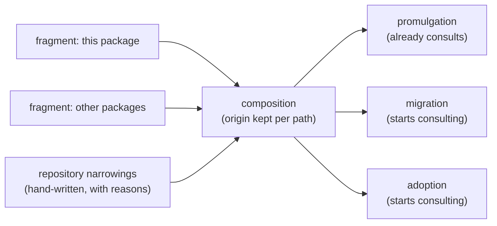

<!--
 Copyright (c) 2026 Danilo Borges (https://github.com/daniloborges)

 Licensed under the Apache License, Version 2.0 (the "License");
 you may not use this file except in compliance with the License.
 You may obtain a copy of the License at

 https://www.apache.org/licenses/LICENSE-2.0
-->

# Plan-031: Ownership fragments, and the shaped class

| Field | Value |
|---|---|
| Status | Backlog |
| Created | 2026-08-20 |
| Author | Danilo Borges |
| Depends on | [Plan-029](029-a-record-type-becomes-a-resolved-name.md) |
| Related | [RFC-0003](../rfc/0003-a-governance-type-as-a-pluggable-unit.md) · [Plan-017](017-the-plans-still-written-against-the-first-template-shape.md) (absorbed by Track 3) |

---

## Summary

`plugin/ownership.json` classes `project/{adr,rfc,plans,tasks,log,research}/**` as `repo` — *"never
written and never read for a decision"* — and the migrate skill writes exactly those files. Both are
correct about their own actor, because the declaration governs promulgation and nothing else; the
vocabulary has no word for what migration does. This plan adds that word — the **`shaped`** class, where
the tooling owns a file's *structure* and the repository owns its *content*, permanently — turns the
single ownership file into **one fragment per package** composed by the CLI with per-path origin, and
gives the repository its **narrowing**: reclassifying a path toward less tooling authority, by hand, with
a reason. Migration and adoption start consulting the declaration, which today only promulgation reads.

## Goals

- `shaped` exists in the ownership vocabulary; the record directories are reclassified from `repo` to
  `shaped`; an artifact carrying a locally added section is still migrated and the section survives.
- `plugin/ownership.json` is this package's *fragment*; the composition reads every installed fragment,
  keeps each path's claimant, and reports a doubly-claimed path as a finding — peers, never precedence.
- A repository can narrow a class (`norm → shaped → seed → repo`) in its committed configuration, with a
  reason, refused when it would widen; the composition applies narrowings as the last layer.
- Migration and adoption consult the composed declaration before writing, as promulgation already does.
- This repository's own records, still stamped against old template versions, are migrated under the new
  class — which closes [Plan-017](017-the-plans-still-written-against-the-first-template-shape.md).

## Scope

### In scope

The `shaped` class and its semantics; fragments and composition with origin; the repository-side
narrowing, hand-written; migration/adoption reading the declaration; the acceptance migration run.

### Out of scope

- The `ownership` verb surface (`get`/`list`/`set`) and the configuration-format question it drags in —
  [Plan-032](032-the-ownership-verb-and-the-configuration-it-writes.md), per RFC-0003's scope decision.
- Overlapping-but-unequal glob claims — deliberately unresolved in RFC-0003 until a real overlap exists;
  identical claims conflict, and that covers the case that exists.

## Design

The vocabulary, complete, for a reader with only this file (full model: RFC-0003, "The fourth ownership
class"):

| Class | The tooling owns | The repository owns |
|---|---|---|
| `norm` | the whole file — promulgation overwrites it | nothing |
| `seed` | the file until it exists | everything afterwards |
| `shaped` | the structure | the content, permanently |
| `repo` | nothing | the whole file |

`shaped` is not new behaviour — it is what `/vibe-ops:migrate` already does (evolve structure per the
recorded note, preserve everything written under it) given a name the declaration can carry. The gates
`template-version` and `template-heading-drift` only make sense over `shaped` files: they detect
divergence between a declared shape and a carried one, a comparison that requires the shape and the
content to have different owners.

Composition (full rules: RFC-0003, "Ownership arrives in fragments"): fragments from different packages
are peers, a path claimed twice is a conflict resolved only by the repository's declaration, the composed
view always names each claimant, and absence of any claim is not permission. The reading side lives where
promulgation already reads the single file — `cli/packages/module-harness/src/ownership.ts` — generalised
from one path to the enumeration Plan-029's scan provides.

Consulting, for migration, means: refuse to restructure a file whose effective class is `repo` or `seed`,
proceed on `shaped` and `norm`. For adoption it means: what `setup` writes is checked against the classes
it lands in, instead of written blind — the first-contact actor stops being the one that never asks.

## Tracks

- [ ] **Track 1 — The `shaped` class.** Vocabulary, reclassification of the record directories in this
  package's fragment, and migration refusing/proceeding by effective class. Exists at the end: a fixture
  artifact with a locally added section migrates and keeps it; a `repo`-classed file is refused with the
  class named. Task: [tasks/shaped-class-and-reclassification.md](../tasks/shaped-class-and-reclassification.md)
- [ ] **Track 2 — Fragments and composition.** Enumeration of installed fragments, per-path origin, the
  double-claim finding, and the hand-written narrowing applied last and refused when widening. Exists at
  the end: two fixture fragments claiming one path produce the finding naming both; a narrowing in config
  changes the effective class.
  Task: [tasks/ownership-fragments-and-composition.md](../tasks/ownership-fragments-and-composition.md)
- [ ] **Track 3 — The declaration consulted, proven on this repository.** Adoption checks classes before
  writing; then `/vibe-ops:migrate` runs over this repository's own backlog of old-stamp records as the
  acceptance test of `shaped` — the run that closes Plan-017. Exists at the end: this repository's records
  carry current stamps, their content intact.
  Task: [tasks/migration-consults-the-declaration.md](../tasks/migration-consults-the-declaration.md)
- [ ] Run `/vibe-ops:close-plan` — retrospective against the goals, the demotion check, the tracking
      issue closed. The plan file itself is kept. Plan-017's closure rides Track 3.

## Success criteria

- The migration fixture: locally added section survives a structure migration; a widening narrowing is
  refused naming the fragment that declared the wider class.
- The double-claim fixture: finding names both claimants; the repository's binding resolves it.
- `vibe-ops governance .` on this repository reports no `template-version-behind` after Track 3's
  migration run, and `git diff` of that run shows structure edits only — no content loss in any record.

---

## Decision Log

- Decision: Delegation split — fixture construction and the mechanical reclassification edits are
  delegable under closed contracts; the semantics of `shaped` (what migration may touch), the composition
  rules, and the acceptance migration over this repository's real records are not.
  Rationale: the real-records run is the one irreversible step in the three plans; it is reviewed, not
  delegated.
  Date / Author: 2026-08-20 / Danilo Borges

## Outcomes & Retrospective

(No outcomes yet — filled at each major track completion and at the end.)

---

## Related

- [RFC-0003](../rfc/0003-a-governance-type-as-a-pluggable-unit.md) — Implementation Notes 4–6.
- [Plan-017](017-the-plans-still-written-against-the-first-template-shape.md) — absorbed: its whole scope
  is Track 3's acceptance run.
