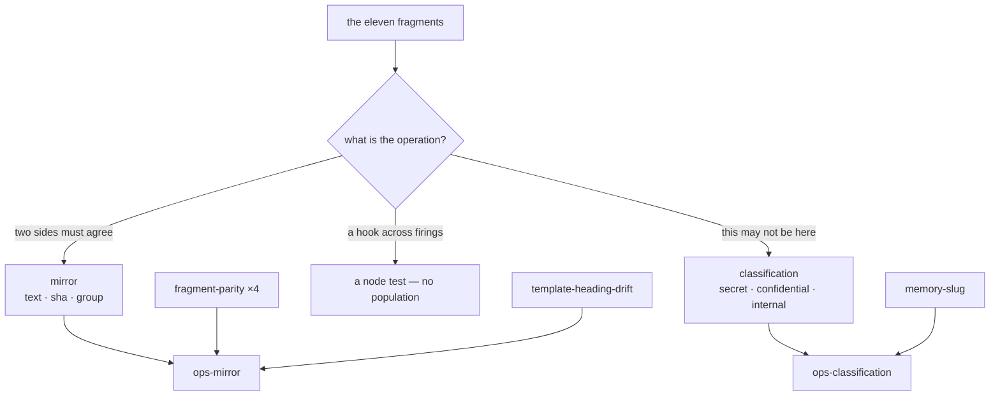

<!--
 Copyright (c) 2026 Danilo Borges (https://github.com/daniloborges)

 Licensed under the Apache License, Version 2.0 (the "License");
 you may not use this file except in compliance with the License.
 You may obtain a copy of the License at

 https://www.apache.org/licenses/LICENSE-2.0
-->

# Plan-037: The eleven fragments become two gates

| Field | Value |
|---|---|
| Status | In Progress |
| Created | 2026-08-23 |
| Author | Danilo Borges |
| Depends on | [Plan-035](035-the-audience-boundary.md) |
| Related | [RFC-0001](../rfc/0001-gates-and-ops-as-the-cli-unit-of-composition.md), [Plan-022](022-retiring-a-shell-fragment-its-port-has-replaced.md) |

---

## Summary

Six of the seventeen shell fragments have gates; eleven do not, and RFC-0001 has recorded that gap as
status rather than as work since the packaging landed. This plan ports the eleven — and not one for one.
Ten of them are two operations wearing different data, so they become **two parameterised gates**:
`mirror`, which produces a left and a right and reports what is in the left and not in the right, and
`classification`, which reports a pattern that must not appear in a population. The eleventh exercises a
hook across firings that share state, has no file population, and becomes a test.

Two ops compose them, and the package boundary is what keeps a plugin-shaped check out of a repository
that publishes no plugin — no field to declare, nothing to filter. Nothing is deleted beyond the gates the
two absorbed; the shell fragments stay, and retiring them is a second phase gated on Plan-022's bar.

## Goals

- Two gates carry every comparison and every prohibition the eleven fragments perform, each proven
  agreeing and disagreeing on its own fixture.
- The mode carries the machinery and the ops carries the data: `compare` is one of three words, `level` is
  one of four, and neither options object spells out how to detect anything.
- Two ops exist whose subjects are one sentence each, and a repository that installs neither composes none
  of their entries.
- `fragment-parity` and `template-heading-drift` leave the compositions a repository without a Claude Code
  plugin installs, by moving rather than by being filtered.
- No repository's commit gate loses a check: the fragments still run.

## Scope

### In scope

The two gates and the two ops that compose them; moving three entries that already exist
(`fragment-parity` ×4, `template-heading-drift`, `memory-slug`) into the ops whose subject they share;
deleting the gates the two absorbed; the nudge fragment becoming a test that runs.

### Out of scope

- **Deleting any fragment, and deleting the runner.** That is phase 2, gated on
  [Plan-022](022-retiring-a-shell-fragment-its-port-has-replaced.md)'s bar — parity green over a real
  corpus, and each port proven to fail on a fixture built to break it. A repository's commit gate resolves
  that runner out of a checkout, and the count of repositories doing so is well into the single digits, so
  removal is a promulgation across all of them rather than a deletion here.
- **The four shell suites under `cli/test/` that nothing invokes.** Found while placing the nudge; a real
  defect, and not this plan's. See Open questions.
- **Porting the six fragments that already have gates.** They are Plan-022's subject, not this one's.

## Design

Ten fragments reduce to two operations, and the reduction is what makes this two gates rather than ten.

**`mirror` — produce a left, produce a right, report what is in the left and not in the right.** A scalar
is a set of one, which is why a copy-against-copy check and a name-against-directory check are the same
gate. `compare` names the mode and the mode carries the machinery: `text` holds both sides together minus
whatever `ignore` names; `sha` hashes a side that is a file and takes a side that is a value as the digest
it already is; `group` asks membership rather than equality. Sides come from seven sources — `file`,
`column`, `json`, `capture` yield a value; `scan`, `entries`, `resolving` yield a set.

**`classification` — a pattern that must not appear in a population.** `level` names the classification of
the material kept out, and decides how a finding may speak: at `secret` the finding names where only, at
`confidential` and `internal` it quotes the match, and `public` is refused because it forbids nothing.
Every rule quotes the MATCH and never the line, which is what makes the levels hold against each other: a
detector cannot see another entry's rules, so a line quoted whole would eventually print what a stricter
rule protects.

`ops-mirror` also receives the four `fragment-parity` entries and `template-heading-drift`, which compare
pairs by any reading. Moving `template-heading-drift` out of `ops-self` preserves the reason `ops-self`
exists: `governance` excludes `**/templates/**` from every entry through one `"*"` line, a safe default
that is wrong for the one gate whose subject is those shipped copies, and `ops-mirror` declares no such
exclusion. `ops-self` keeps `unstated-destination` alone.

`ops-classification` receives `memory-slug` from `ops-agents-md`, where an instruction-surface ops held
what is a classification rule about every committed file.

## Tracks

- [x] **Track 1 — `mirror`, and the ops that composes it.** Landed 2026-08-23. One gate covering seven
      composed entries; `ops-mirror` carries them plus the four `fragment-parity` entries and
      `template-heading-drift`. Acceptance met: 11 entries, 0 failed against this repository, and every
      shape proven agreeing and diverging in the gate's own suite.
- [x] **Track 2 — `classification`, and the ops that composes it.** Landed 2026-08-23. One gate covering
      four composed rules across three levels; `memory-slug` moved in from `ops-agents-md` and the gate
      `gates/src/memory-slug/` was deleted. Acceptance met: 4 entries, 0 failed.
- [ ] **Track 3 — The nudge becomes a test that runs.** `27-nudge-behaviour.sh`'s five assertions become a
      `node:test` file. Whether they are already covered by the existing shell suite for the same hook is
      determined while porting, not assumed. Acceptance: each assertion watched to fail against a
      deliberately broken hook before being kept.
- [ ] **Track 4 — What the ports left behind.** `manifest-sync` is composed for one field pair and needs a
      cross-source selector for the marketplace join; `governance-license` and `governance-classification`
      as data-owning packages (the licence texts, the levels document) are not built. Refined at pick-up.
- [ ] Run `/vibe-ops:close-plan` — retrospective against the goals, the demotion check, the file kept.

## Success criteria

Run from the repository root:

- `npm test` is green and covers every mode of both gates, each proven agreeing and disagreeing.
- `vibe-ops mirror` and `vibe-ops classification` report zero failures against this repository.
- `cli/packages/module-check/sh/check-agents-md.sh .` reports the same seventeen checks and no new
  failure — nothing was removed from the shell suite, so the commit gate is unchanged.
- `vibe-ops agents-md --list` no longer names `memory-slug` or `fragment-parity-*`; `vibe-ops governance
  --list` no longer names `fragment-parity`; `vibe-ops self --list` names `unstated-destination` alone.
- No gate directory remains for a detector one of the two absorbed.

---

## Decision Log

- Decision: the ten gate-shaped fragments become TWO parameterised gates, not ten bespoke ones.
  Rationale: maintainer direction, and the material bears it out. Every comparison check is one
  operation — produce a left, produce a right, report the difference — and every prohibition check is
  another. Ten detectors differing only in their data are ten places to fix the same bug. The discipline
  that keeps this from becoming a configuration language is that the MODE carries the machinery and the
  ops carries only data: `compare` and `level` are single words a reader understands, and neither options
  object may say HOW to detect anything. An options object spelling out patterns and replacements would
  not have removed the detection code, only moved it somewhere nothing versions.
  An earlier cut into four narrower shapes was measured against eight fragments and refuted: three of the
  four had a single inhabitant, which is a bespoke gate with a pretentious name. The same pass named
  prohibition as the largest family in the repository and it is now half of this design.
  Date / Author: 2026-08-23 / Danilo Borges

- Decision: grouping is by subject, one ops per operation, rather than one package for "the rest".
  Rationale: a package whose subject cannot be stated in one sentence accumulates whatever has no other
  home. Grouping by subject is also what removes the plugin-shaped entries from a portable composition —
  a repository that installs no mirror gets no mirror entries, with nothing to declare and nothing to
  filter.
  Date / Author: 2026-08-23 / Danilo Borges

- Decision: an `audience` field on an ops and its entries was built and then removed, unshipped.
  Rationale: the classification it carried was right and is the input to this plan, but the trigger was
  wrong. Nothing consumed the field: no adoption step wrote it, `setup` sends no configuration file to a
  target at all, and the template a target's gate runs never set it — so a composition still announced
  seventeen and delivered seven everywhere, and the plan's own acceptance passed only because the flag was
  passed by hand during the measurement. A boundary that has to be switched on is not a boundary. The
  package boundary carries the same distinction structurally and needs no switch.
  Date / Author: 2026-08-23 / Danilo Borges

- Decision: `27-nudge-behaviour.sh` becomes a `node:test`, not a gate and not a shell test under
  `cli/test/`.
  Rationale: it exercises behaviour across firings that share state, so it has no file population and
  cannot be a detector. `cli/test/` was the obvious home and is the wrong one: nothing invokes those files
  — `npm test` runs only `cli/packages/*/test/*.test.ts` — and a 19 KB suite for this very hook is already
  sitting there unrun. Moving a guard that runs at every commit into a directory nothing executes is a
  demotion wearing the costume of tidying up.
  Date / Author: 2026-08-23 / Danilo Borges

- Decision: phase 1 deletes nothing; the fragments and the runner survive this plan.
  Rationale: a repository's commit gate resolves that runner out of a checkout, so deleting it is a
  promulgation across every one of them rather than an edit here. Doing both at once puts several commit
  gates in a red window, and a gate handed over red is the one people switch off within the week. Parity
  also does not exist for any of the eleven yet, and Plan-022's bar requires it before a fragment goes.
  Date / Author: 2026-08-23 / Danilo Borges

- Decision: licence and classification stay `governance-*`, and `schema` becomes optional in
  `parseTypeUnit` as Track 2 and Track 3's prerequisite.
  Rationale: maintainer correction, and measuring it settled the argument. `parseTypeUnit`
  (`governance-base/src/type-unit.ts:63`) requires only `type`, `template`, `authoring`, `migrations` and
  `schema` — `numbered`, `pad`, `depth` and `dirs` all default. A licence text IS a template, filling the
  same role `adr.md` fills for an ADR, so nothing about either package was foreign to the family. The one
  field with no honest value is `schema.carrier`, which admits `table` or `frontmatter` and would have the
  `governance` ops derive a metadata check over a `LICENSE` file that carries neither. The escape already
  exists one layer down — `ops-derive.ts:100` reads `if (unit.schema === undefined) continue`, with a
  comment saying a package declaring no schema derives no entry — so the consumer anticipates the state
  the validator refuses to produce. Making it optional aligns the two.
  Classification needs no exemption: a level carried as `classification: internal` in frontmatter makes
  `carrier: "frontmatter"` honest, and the check that a document declares its level is then DERIVED rather
  than written. The document defining the four levels is that type's `template`, which is what makes it
  referenceable through `records norm --facet template`.
  Date / Author: 2026-08-23 / Danilo Borges

- Decision on delegation: the ten ports are handed to subagents in parallel, one gate each, against the
  five gates that already document themselves as ports plus `cli/packages/core/README.md` as the
  convention. The three package skeletons, the three `ops.json` compositions, the four classification
  levels and every entry that MOVES rather than being written are done in one hand and not delegated.
  Rationale: a port is a closed contract — the fragment is the specification and behaviour is to be
  unchanged — which is the case this repository already accepts for delegation. Composition is not: it
  decides what a repository installs, which is a judgement that has to agree with this plan's intent.
  An earlier version of this decision had a reference gate written by hand first to fix the conventions;
  it was dropped on the maintainer's correction that five worked examples of exactly this port already
  exist, and writing a sixth to be copied from would have been a round of work spent restating them.
  Date / Author: 2026-08-23 / Danilo Borges

## Outcomes & Retrospective

**Tracks 1 and 2, 2026-08-23.** Two gates replaced ten. `mirror` composes 11 entries and
`classification` 4, both reporting zero failures against this repository; 553 tests pass and the shell
gate stays at 17 checks, 0 failed. `gates/src/memory-slug/` was deleted, absorbed by `classification`.

**Five defects were found by composing against the real repository rather than against fixtures**, and
each changed the design:

- Stripping the first leading comment block took the GUIDANCE block off a shipped copy that carried no
  licence block, so all five dogfooded pairs read as diverged. Only a block that IS a licence block goes.
- Applying one normalisation to both sides digested the digest, so a licence could never match its pin.
  `sha` now knows a file is hashed and a value already is the digest.
- `expandOptionTokens` expanded only top-level strings; every earlier gate had flat options, so a
  `<plugin>` token inside an array of pairs survived and resolved to a file that is not there. Now
  recursive.
- Quoting the whole line let a `confidential` rule print what a `secret` rule protects. Every rule now
  quotes the match, which removes the possibility rather than coordinating around it.
- The population widened without being noticed twice: `command-reference` over `**/*.md` picked up a
  CHANGELOG rename announcement, and `authoring-completeness` over every package asked non-governance
  packages for an `authoring.md`. Both are now scoped to what the fragment scoped to.

**Deleting a gate broke a shipped record.** Plan-013 cites `gates/src/memory-slug/index.ts` twice as
resolvable links. Following Plan-015's design — the record keeps what it said and gains a pointer — the
citations stay as text and an annotation names the successor. The record was not rewritten.

**Behaviour that had to be recovered rather than reimplemented:** the deleted gate matched against
`proseText`, so `[[…]]` inside a code span was being shown rather than used. A line-based port reported
this repository's own README explaining that distinction. `scope: "prose"` restores it.

---

## Open questions

- The four shell suites under `cli/test/` are invoked by nothing — not `npm test`, not the commit gate,
  not CI. One of them tests the same hook as Track 4's subject. Whether they are woken, ported or deleted
  is a decision this plan does not make, and Track 4 must not be read as having made it.
- Whether `authoring-completeness` belongs in `ops-mirror` at all. It compares the set of governance
  packages against the set of authoring files they should each carry, which is completeness rather than
  drift; it is placed here because the shape — one side declares, the other must confirm — is the same.

## Related

- [Plan-035](035-the-audience-boundary.md) — the classification pass that decided which fragment belongs
  where, and the field that was removed in favour of this plan's package boundary.
- [RFC-0001](../rfc/0001-gates-and-ops-as-the-cli-unit-of-composition.md) — the gate/ops split, and the
  rule that a fragment is removed only once its port is shown to agree with it.
- [Plan-022](022-retiring-a-shell-fragment-its-port-has-replaced.md) — the retirement bar phase 2 answers
  to.
