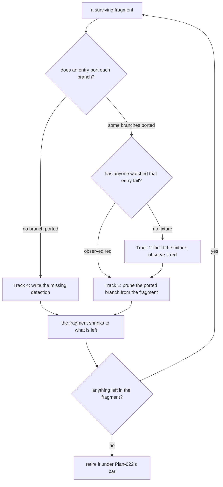

# Plan-039: The ports that do less than what they replaced

| Field | Value |
|---|---|
| Status | Backlog |
| Created | 2026-09-08 |
| Author | Danilo Borges |
| Depends on | Plan-038 (the fragment migration), Plan-022 (the retirement bar) |

---

## Summary

Seven shell check fragments are still running because the TypeScript gates written to replace them do
less than they do — whole populations unread, decoys unimplemented, match semantics narrower. Plan-038
found this by auditing each pair one at a time, after nine other fragments had already been retired on
evidence. This plan closes the gaps, so that the last seven can be retired the same way the nine were:
because someone watched the port fail on the thing the fragment catches.

## Goals

1. Every ops entry that replaced a fragment carries a fixture, and has been observed failing on it.
2. Every branch of the seven surviving fragments is either covered by a port, or is a written exemption
   naming what covers it instead.
3. A fragment shrinks to exactly the branches still unported, so the shell side measures the debt rather
   than obscuring it.
4. `cli/packages/module-check/sh/unported/` is empty and removed, and `sh/` holds `check.sh` and
   `gate-emit.sh` alone.

## Scope

### In scope

The seven fragments under `cli/packages/module-check/sh/unported/checks/`, the ops entries in
`cli/packages/ops-mirror/ops.json` and `cli/packages/ops-exposure/ops.json` that port them, the gates
those entries name, and the fixtures none of them currently has.

### Out of scope

**Publishing the CLI.** It blocks a consumer from authoring a *new* gate (`@entelekheia/vibe-ops-core`
cannot be resolved outside this checkout) and it blocks the CI offer in
`plugin/skills/setup/SKILL.md`. Both are real and neither is this plan's to decide — the release freeze
is a maintainer policy stated in `plugin/AGENTS.md`. Composing an *existing* gate needs nothing published
and already works, through a local `ops.json` named in `config.ops`.

**Retiring the seven on any other grounds.** This plan closes gaps; the retirement itself applies
Plan-022's bar, unchanged.

## Design

The audit that produced this plan is recorded in Plan-038 and in `project/tasks/007-*.md`. Its finding
in one sentence: *having a counterpart is not the counterpart doing the same job*, and nothing required
anyone to check which until the fragments were about to be deleted.

One cause runs under all seven. `fragment-parity` compares **sets of file paths**, and these seven
produce none — so each was written into `fragment-parity-completeness`'s exemption list for a mechanical
reason, and that exemption was then read as though it said something about the port. It does not. The
consequence is measurable and was printed by the tool itself: in `vibe-ops check --self-test`, the mirror
suite reports `no fixture declared` for `license-text`, `hooks-registration`, `authoring-completeness`,
`plugin-root-path`, `command-reference`, `manifest-description` and `manifest-keywords`.

The ordering matters and is not arbitrary: **pruning before the fixture exists would remove a branch on
the strength of a reading rather than an observation**, which is the failure this whole line of work
exists to end.

## Tracks

- [ ] **Track 1 — Prune what is provably ported.** Cut from each fragment the branches whose ports were
      observed failing on the shared fixture, leaving only unported detection behind. `hooks-registration`
      loses its two registration branches (both fire in the port); `plugin-root-paths` loses its existence
      branch. `command-references` is examined and kept whole — removing its existence branch leaves only
      a population filter, which is not a branch. Each cut carries a before/after showing the removed
      branch still caught by the port and the remaining ones still firing in the runner's `--self-test`.
      At the end each fragment is the size of its own debt. Acceptance: the runner's `--self-test` is
      green with fewer assertions, and `vibe-ops check --self-test` still reports every port firing.

- [ ] **Track 2 — A fixture for every entry that has none.** `license-text`, `hooks-registration`,
      `authoring-completeness`, `plugin-root-path`, `command-reference`, `manifest-description`,
      `manifest-keywords`. Each gets a `fixture` block with at least one decoy, and each is observed red
      before it is believed. At the end `mirror self-test` reports no `no fixture declared`. Acceptance:
      deleting one detection line from any of these entries makes the ops self-test fail naming it.

- [ ] **Track 3 — The population and semantics gaps.** Two ports read less than their fragment rather
      than fewer branches of it. `private-name` (`cli/packages/ops-exposure/ops.json`) declares
      `paths: ["**/*.md"]` where `50-private-names.sh` greps every tracked file — 344 of them are not
      markdown — and the gate compiles `new RegExp(pattern)` where the fragment matches `-i -F`,
      case-insensitively and literally. `plugin-root-path` has no notion of a path that climbs out of the
      plugin root, nor of the `plugin-root-paths: allow` marker that exempts one. At the end both read
      what their fragment reads. Acceptance: a private name in a `.ts` file is reported; a climbing
      `${CLAUDE_PLUGIN_ROOT}/../` reference is reported and a marked one is not.

- [ ] **Track 4 — The branches with no port at all.** Six pieces of detection exist only in shell: the
      `hooks.json` description count, the whole skill-scoped `hooks:` population (four failure branches),
      the `vibe-ops-reference: <name>@<n>` token check, the `references/*.md` self-declaration
      population, the `{{placeholder}}` guard on a shipped licence text, and the verification that this
      repository's own `LICENSE` is the real Apache-2.0 text. Each becomes a gate and an entry, or a
      written exemption saying what covers it instead. At the end nothing is detected only in shell.

- [ ] **Track 5 — Decide `manifest-sync`.** Its four comparisons map one-to-one onto four entries and
      all four were observed failing on the shared fixture, so coverage is not the question. The port is
      **stricter**: where the fragment reports SKIP for an absent `marketplace.json`, an absent
      `plugin.json`, or no matching marketplace entry, the port reports FAIL. Decide whether that is
      wanted — a repository that composes `ops-mirror` without a marketplace listing would newly fail
      three checks — and either accept it in writing or add `optional` to those sources. At the end the
      difference is a decision rather than an accident.

- [ ] **Track 6 — Empty the folder and the leftovers.** Retire each fragment whose debt Tracks 1–5
      closed, under Plan-022's bar and one at a time. Then remove `sh/unported/` and the runner,
      `fragment-parity-completeness` (its subject gone), and `runner-provenance`'s self-referential
      branch, which became dead in this repository when the runner moved out of `scripts/`. At the end
      `sh/` holds `check.sh` and `gate-emit.sh`.

- [ ] Run `/vibe-ops:close-plan` — retrospective against the goals, the demotion check, the tracking
      issue closed. The plan file itself is kept. Stays unchecked until the plan is actually closed; a
      track list that is otherwise complete but has this box open is not finished.

## Success criteria

Run from the repository root:

- `node cli/packages/cli/dist/bin.js check --self-test` reports no `no fixture declared` line for any
  entry named in Track 2, and stays green only while every port detects: deleting one detection line from
  any of them makes it fail naming that entry.
- `ls cli/packages/module-check/sh/` prints `check.sh` and `gate-emit.sh` and nothing else.
- `git grep -n "unported" -- ':!project/'` returns nothing.
- A private name planted in a `.ts` file is reported; a `${CLAUDE_PLUGIN_ROOT}/../x` reference is
  reported and one marked `plugin-root-paths: allow` is not.
- `npm test && npm run typecheck` green after `rm -rf cli/packages/*/dist && npm run build`.

---

## Decision Log

- Decision: the fixture comes before the pruning, and the pruning before the retirement.
  Rationale: each step removes something on the strength of the step before it. Cutting a branch because
  a port *appears* to cover it repeats the error this plan exists to correct — Plan-038 retired nine
  fragments on observation and was about to retire eight more on a reading, and the difference between
  the two was invisible until someone asked which gate covered which branch.
  Date / Author: 2026-09-08 / Danilo Borges

- Decision: reading a pair into a fact sheet may be delegated; deciding a fragment may shrink or go may
  not.
  Rationale: carried from Plan-038, where four subagents produced the audit this plan is built on and
  every load-bearing claim was re-verified by hand before it was believed — two of them needed
  correcting. The reading is bounded and checkable; the judgement ends with a check silently absent.
  Date / Author: 2026-09-08 / Danilo Borges

## Outcomes & Retrospective

<!-- Filled at each major track completion and at the end. -->

---

## Related

- `project/plans/038-concluding-the-fragment-migration-and-the-measurement-that-l.md` — the migration
  that produced this backlog, and the audit that named it.
- `project/plans/022-retiring-a-shell-fragment-its-port-has-replaced.md` — the bar every retirement here
  applies.
- `project/rfc/0001-gates-and-ops-as-the-cli-unit-of-composition.md` — the gate/ops split.
