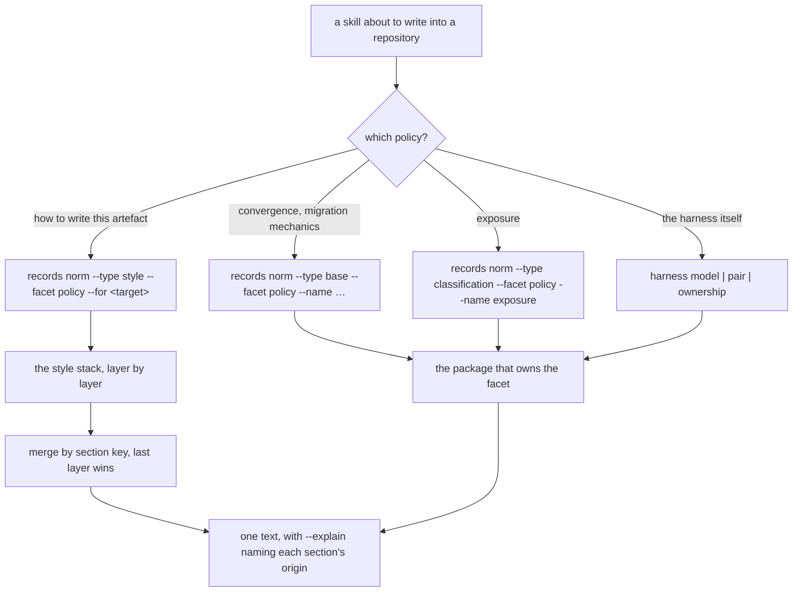

<!--
 Copyright (c) 2026 Danilo Borges (https://github.com/daniloborges)

 Licensed under the Apache License, Version 2.0 (the "License");
 you may not use this file except in compliance with the License.
 You may obtain a copy of the License at

 https://www.apache.org/licenses/LICENSE-2.0
-->

# Plan-040: Every shipped file belongs to a governance

| Field | Value |
|---|---|
| Status | In Progress |
| Created | 2026-09-08 |
| Author | Danilo Borges |
| Depends on | [RFC-0005](../rfc/0005-every-shipped-file-belongs-to-a-governance-and-the-plugin-binds-the-cli.md) |
| Related | [ADR-0013](../adr/0013-the-model-a-shipped-plugin-may-pin.md), [ADR-0019](../adr/0019-one-artifact-one-governance-package-activated-by-config.md), [Plan-033](shipped/033-one-artifact-one-governance.md), [RFC-0006](../rfc/0006-the-repository-as-a-source-of-vibe-ops-units.md) |

---

## Summary

Fifty-five files that this tooling writes into a repository, or reads before writing one, belong to no
package: ten policy references, thirty-two scaffold templates, eight licence-setup files, four shell
scripts and the pinned agent that copies the templates. They live in `plugin/` and are reachable only
through `${CLAUDE_PLUGIN_ROOT}`, so they have no version, no ownership class, no migration note, and no
way to reach a second agent host except by being copied. This plan moves every one of them into a
governance package or a CLI verb, adds the three types that receive them (`style`, `instructions`,
`knowledge`), turns the scaffold into a composition of what the activated governances ship, and leaves in
the plugin only what is judgement or binding: the skills, the two read-only agents, and `hooks.json`.

## Goals

1. `plugin/references/`, `plugin/skills/setup/templates/`, `plugin/skills/license-setup/templates/` and
   every `.sh` under `plugin/` are gone, each file either owned by a package or replaced by a verb.
2. Every file the tooling writes into a repository is named in some package's `ownership.json` fragment,
   including the packages that keep no records — `governance-license` and `governance-classification`.
3. A repository can bind a stack of writing styles, scoped per artefact, and the skills read what that
   stack resolves to rather than one file shipped in the plugin.
4. `agents/rules/governance.md` and `GOVERNANCE.md` are rendered from the activated types instead of
   copied, which is what lets a repository's set of types be visible in its own governance documents.
5. `hooks.json` names `vibe-ops` on all nine registrations, and the plugin ships no script.

## Scope

### In scope

Everything RFC-0005 specifies: the `policy` facet and the reference moves, the type manifest's new fields
(`units`, `facets`, `lifecycle`, `targets`, optional `template`/`dirs`), the three new governance types,
the composed scaffold, the rendered governance documents, the two hook surfaces, and the retirement of the
`scaffolder` agent and the `35-dogfooding-drift` check.

### Out of scope

- **A local, unpublished source for a unit.** A style layer is a package specifier here. Letting a layer
  be a directory inside the consuming repository is [RFC-0006](../rfc/0006-the-repository-as-a-source-of-vibe-ops-units.md),
  and the two land independently — this plan adds specifiers, that RFC adds a source for them.
- **A `docs` governance type.** The Diátaxis skeleton stays `seed` in `governance-base`; the type is what
  to write if a quadrant ever becomes a record.
- **Publishing the packages.** Every package here is resolved from this workspace; whether and when they
  reach a registry is decided elsewhere.
- **Retiring `${CLAUDE_PLUGIN_ROOT}` itself.** The skills still live in the plugin and still resolve
  their own files that way. What ends is its use for policy and for files written into a repository.

## Design

### The rule the plan enforces

A file this tooling writes into a repository, or a policy a skill applies before writing one, is owned by
exactly one governance package: shipped under a version, named in an `ownership.json` fragment, carrying
its migration notes, and served through the CLI. A package that keeps no records owns files the same way,
minus the record. A file with no owner is not shipped.

### How a policy is reached after this plan

A skill that reads a policy stops resolving a path and asks the CLI, which resolves the package that owns
the facet through the repository's own bindings.

### The style stack

`types.style` binds an ordered list of layers rather than one package. A layer is a package named for the
voice it carries, with an optional scope naming the artefacts it applies to; `"@voice/conciso/{plan,task}"`
applies to a plan and a task, `"@voice/explicativo{^rfc}"` applies to everything except an RFC. Inside a
package, `general.md` is what applies to every artefact and `<target>.md` carries only that target's
delta.

Serving `--for plan` concatenates, in layer order, each applicable layer's `general.md` followed by its
`plan.md`. The merge unit is the section, keyed by its heading slug or by an explicit key; a repeated key
replaces, a new key appends. Resolution belongs to whoever composes the stack, never to the package
author — `on: "append"` and the per-key `rules` map are written in the binding, because only the
repository sees two layers at once. A collision nobody declared is reported at the severity the repository
chose (`error | warn | off`, defaulting to `warn`) and never aborts a run. RFC-0005 §2.1 carries the full
specification, including both binding forms.

### What the scaffold becomes

`setup scaffold <shape> <target>` stops copying a template directory. It writes, for every activated
governance, that package's `scaffold/` contribution and the placeholders that package declares, plus the
harness's own files through `harness install`. The record templates come from the packages that own them,
so the five byte-copies and the drift check that held them in sync both disappear.

Two files are rendered rather than copied, from a new manifest field `lifecycle` (the status chain, what
is immutable and when, the living sections, the archival directory): `agents/rules/governance.md`, which
is `norm`, and `GOVERNANCE.md`, which is `shaped` — the tooling owns the rendered lifecycle sections and
the repository owns every other section of that file permanently. With both rendered, `35-dogfooding-drift`
has no pair left and is retired rather than kept.

### What stays in the plugin

The skills, because they carry judgement; the two read-only agents, `governance-auditor` and
`migration-rehearser`; `hooks.json`, because it is the binding to one agent host; and the manifest. A
second binding for another agent host ships the equivalent of those and nothing else.

## Tracks

- [x] **Track 1 — The policy facet, and the references it receives.** `records norm` gains a `policy`
      facet and a `--name` flag selecting which of a package's `facets` to serve, with `NormFacet` staying
      a closed enum. `convergence-policy` and `template-shape-change` move into `governance-base`,
      `exposure-contract` into `governance-classification`, and `harness-model`, `harness-pair` and
      `ownership` are served by the `harness` package. Each keeps its `vibe-ops-reference: <name>@N` stamp.
      The ten skills and the seven CLI source files that resolve these by path repoint to the verb;
      `plugin/references/` is deleted with its README, and `references-completeness` becomes a gate over
      every activated package's facets. At the end, no file under `plugin/` reads a reference by path and
      `vibe-ops check` is green.

- [x] **Track 2 — The manifest that admits the new shapes, and the ADR behind it.** `parseTypeUnit` makes
      `template` and `dirs` optional, and adds `facets`, `lifecycle` and `targets`; a manifest may declare
      `units: [...]`, each a full type unit, and `activateGovernance` caches by `package#type` instead of
      by package name. `records norm --facet template` on a policy-only type refuses, naming it as such.
      The successor ADR to ADR-0019 is written with this track, recording that one artifact is one *unit*
      and a package may ship several. At the end a fixture package shipping two units activates, both
      resolve, and the existing single-unit packages are unaffected.

- [ ] **Track 3 — `governance-knowledge`, and the two packages that owned files without a fragment.**
      `governance-log` becomes `governance-knowledge` with units `log` (moved whole, keeping its type
      name, noun, MCP tool, settings keys and fragment globs) and `learning`, which is not in the default
      bindings. `knowledge-lifecycle` becomes the package's policy facet. `governance-license` and
      `governance-classification` gain `ownership.json` fragments; `governance-license` also takes the
      files the `license-setup` skill ships today — the NOTICE and AUTHORS templates, the header-check
      script and its two CI workflows, the two rules documents — as its scaffold contribution, and
      `get-license.sh` becomes `license get <id>` and `license verify <file>` over the registry that
      package already carries. At the end a repository binding `log` by default sees no change, and
      `plugin/skills/license-setup/` ships no file of its own.

- [ ] **Track 4 — `governance-style` and the layered stack.** The type, the default package
      (`general.md` plus a fragment per target it documents), and `types.style` in the default bindings.
      The composition RFC-0005 §2.1 specifies: both binding forms, the scope grammar, the section-keyed
      merge, `--for` and `--explain` on `records norm`, and `on` / `rules` / `onCollision` read from the
      binding. The four authoring skills read the style through the CLI, each naming the target it is
      writing. At the end a two-layer stack serves one merged text, `--explain` names each section's
      origin, and an undeclared collision warns without failing.

- [ ] **Track 5 — `governance-instructions`.** The type, `instruction-surfaces` as its policy facet, and
      its scaffold files (`root/CLAUDE.md`, `agents/rules/repo-guardrails.md`, `agents/skills/.gitkeep`).
      It ships no gate: gates are resolved from `vibe-ops-gates` alone and the `agents-md` ops keeps
      composing them as it does today. At the end the instruction surface's policy and scaffold have one
      owner, and the ops still reports the same checks.

- [ ] **Track 6 — The scaffold as a composition, and three retirements.** `setup scaffold` writes each
      activated governance's `scaffold/` contribution with its declared placeholders, and the harness's
      files through `harness install`; `project/<type>/.gitkeep` comes from each type's `dirs`.
      `agents/rules/governance.md` and `GOVERNANCE.md` are rendered from `lifecycle`, the second as
      `shaped`. The `scaffolder` agent is retired, ADR-0013 kept as the policy with its one instance gone,
      and `35-dogfooding-drift` retired with its last pair. At the end a freshly scaffolded repository has
      no file whose owner is the plugin, and a second promulgation preserves a section the repository
      wrote into `GOVERNANCE.md`.

- [x] **Track 7 — The hook surfaces.** `plan-progress-nudge.sh` becomes `vibe-ops hook plan-progress`,
      with the handler exported by `governance-plan` and dispatched by the CLI's `hook` namespace;
      `session-state-cleanup.sh` becomes `hook session-cleanup`, and the touched-repositories helper a
      function of the CLI. The host-specific inputs the nudge reads today — the session transcript path,
      the plugin data directory — arrive on the payload from the binding and are never resolved by the
      CLI. At the end `hooks.json` names `vibe-ops` on all nine registrations, no `.sh` remains under
      `plugin/`, and the nudge's existing behaviour test passes against the new surface.

- [ ] Run `/vibe-ops:close-plan` — retrospective against the goals, the demotion check, the tracking
      issue closed. The plan file itself is kept.

## Success criteria

Every criterion below is observed on an ordinary run, with no flag an operator has to remember.

1. `find plugin -name '*.sh' -o -name 'references' -type d` prints nothing, and
   `grep -rn 'CLAUDE_PLUGIN_ROOT.*references' plugin cli` finds no match.
2. `vibe-ops check` in this repository reports the same number of failures as before the plan — zero —
   with `references-completeness` reporting over package facets rather than skipping.
3. `vibe-ops records norm --type base --facet policy --name convergence --print` prints the convergence
   policy with its `vibe-ops-reference` stamp intact, and the same holds for `migration`, for
   `classification`'s `exposure`, and for the three the `harness` package serves.
4. A repository that declares nothing about `log` keeps its `project/log/` records, its noun and its MCP
   tool working, resolved through `governance-knowledge#log`.
5. In a scratch repository binding two style layers, `vibe-ops records norm --type style --facet policy
   --for plan --print` prints one text whose sections come from both layers, `--explain` names each
   section's origin package and file, an undeclared collision prints a warning and exits zero, and the
   same stack with `onCollision: "error"` exits non-zero naming both claimants.
6. `vibe-ops setup scaffold` into an empty directory produces a repository whose `GOVERNANCE.md` and
   `agents/rules/governance.md` describe exactly the types that repository activates; editing a
   repository-owned section of `GOVERNANCE.md` and promulgating again leaves that edit intact while the
   rendered sections are refreshed.
7. `vibe-ops ownership check` (or the equivalent gate in an ordinary `vibe-ops check` run) reports no
   unclassified path among the files the scaffold wrote.
8. Nine of nine registrations in `plugin/.claude-plugin/hooks.json` invoke `vibe-ops`, and the nudge's
   behaviour test passes against `vibe-ops hook plan-progress`.

---

## Decision Log

- Decision: The delegation split follows the routing policy already agreed for this workspace's work,
  which wins over any split invented for this plan. In practice: a deterministic answer — enumerating the
  readers of a reference, grepping for a path, running a fixed command — is not delegated at all; one
  well-specified implement of a single track goes to one subagent behind a real gate (`npm test`, the
  typecheck and `vibe-ops check`), escalating to a stronger model only when the gate fails; an adversarial
  review of each track's diff is its own subagent, told which part of the diff is risky; and everything
  that has to agree with RFC-0005's intent stays in the main loop — the manifest's semantics, the style
  merge algorithm, the default bindings, the successor ADR, and any edit to a file two tracks both touch.
  Rationale: the measured record behind that policy is that a well-specified single-package implement
  holds behind a real gate, and that what it misses sits at the scope boundary, which is the review's job;
  meanwhile a judgement delegated without the plan in hand comes back plausible and drifted. Writing the
  split here rather than leaving it in the conversation is the point of the entry: a conversation is
  summarised away, this file is not.
  Date / Author: 2026-09-08 / Danilo Borges

- Decision: Tracks 3, 4 and 5 may run concurrently once Track 2 has landed, and Tracks 1 and 7 may run
  concurrently from the start, but every edit to a file more than one of them touches — the default
  bindings, this repository's own `AGENTS.md` files, `docs/` — is made in the main loop after the
  concurrent work returns.
  Rationale: two agents writing the same file in one stage is the failure mode that costs more to
  reconcile than the concurrency saved.
  Date / Author: 2026-09-08 / Danilo Borges

- Decision: A track that runs concurrently with another gets a worktree created for it explicitly, from
  the tip of the branch the work is on, rather than one requested from the harness's own isolation.
  Rationale: the harness cuts an isolated worktree from the default branch, so the first concurrent track
  opened onto a base that predated this plan and had to be stopped and re-based before it could start —
  and once re-based it ran in the shared worktree anyway, where `npm test` deletes every package's `dist/`
  and would have broken the other track's gate mid-run. Isolation that is requested rather than
  constructed is isolation nobody verified.
  Date / Author: 2026-09-08 / Danilo Borges

- Decision: A manifest field this plan adds gets a reader in the track that adds it, rather than waiting
  for the track that consumes it. `lifecycle` was specified for Track 6's renderer, and was declared on
  `governance-plan` and wired into `plan resolve` in Track 2 instead.
  Rationale: this plan's own motivation is that a file with no owner has no version, no migration and no
  reader — and a field with no reader is the same debt one level down. Wiring it immediately also proved
  the parse against a real type: changing the declaration moved `PLAN_ACTIVE`, which no test of the
  parser alone would have shown.
  Date / Author: 2026-09-08 / Danilo Borges

## Outcomes & Retrospective

**Track 7 landed** (`01bf2db`): `plan-progress` and `session-cleanup` are CLI hook surfaces, the nudge's
decision logic sits in `governance-plan` as a handler, and `plugin/hooks/` and `plugin/scripts/` ship no
script. Goal 5 is met. The commit went in with the gate skipped, because the shared worktree also held
another track's incomplete work; the branch is red on the link gate until the documents that point at
moved files are updated, which is main-loop work by this plan's own second decision.

**Track 1 landed** (`47f5a8e`): `records norm` serves a `policy` facet by name, five policy documents
belong to the packages whose policy they are, and nineteen readers name a command instead of a path.

**Both tracks were reviewed adversarially and both had real defects**, three of them in behaviour that
had already landed. The review of Track 7 also answered the question it was given: the behaviour test
whose expectation the port rewrote had never executed — it resolved a directory that has never existed —
and the case it asserted was one the original shell never had, which a differential run of the
unmodified test against the unmodified script proved by failing exactly there.

What the two reviews are worth recording for is the shape of what they found. Three of the five defects
were **a guard that did not guard**: a gate passing over an empty population, a description reading one
layer of a ladder its resolver reads whole, and a test suite reporting a skip whose reason was false. All
three were green. None of them would have been found by running the suite, because each was the suite
agreeing with itself.

**Track 2 landed** (`adb3c7a`): a manifest may declare `units`, a binding picks one with `#type`, and the
activation cache is keyed by `<package>#<type>`. Goal 2's mechanism is not in place yet, but the hinge
is: Tracks 3, 4 and 5 can now each add a type.

The defect that track removed is the one worth carrying forward, because it is the same shape as the
three above. Keyed by package name, a second binding to a package was handed whatever the first had
resolved — a real unit, with a template and facets, answering every question about the wrong artifact
and reporting nothing. It could not have been noticed from any output, which is why the test states that
case in words rather than asserting a return value.

<!-- ===== END LIVING SECTIONS ===== -->

---

## Open questions

None. RFC-0005 closed the five it carried before this plan was cut.

## Related

- [RFC-0005](../rfc/0005-every-shipped-file-belongs-to-a-governance-and-the-plugin-binds-the-cli.md) — the
  design this plan implements, including the full `style` specification in §2.1.
- [RFC-0006](../rfc/0006-the-repository-as-a-source-of-vibe-ops-units.md) — a local source for units,
  which is how a style layer exists without being published. Independent of this plan.
- [ADR-0019](../adr/0019-one-artifact-one-governance-package-activated-by-config.md) — the decision Track
  2's ADR succeeds.
- [ADR-0013](../adr/0013-the-model-a-shipped-plugin-may-pin.md) — the policy whose one instance, the
  `scaffolder` agent, Track 6 retires.
- [Plan-033](shipped/033-one-artifact-one-governance.md) — the rule this plan extends past records.
