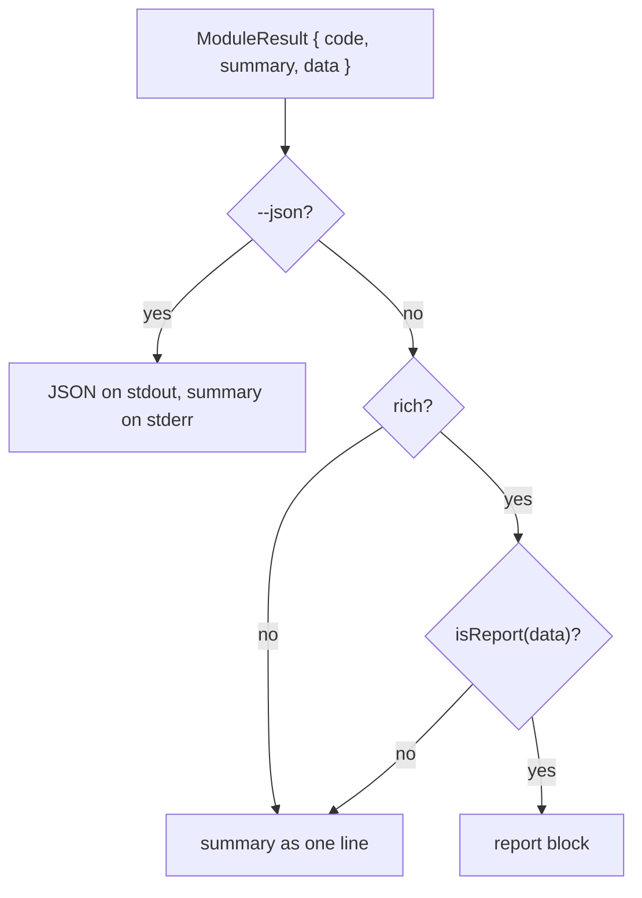

<!--
 Copyright (c) 2026 Danilo Borges (https://github.com/daniloborges)

 Licensed under the Apache License, Version 2.0 (the "License");
 you may not use this file except in compliance with the License.
 You may obtain a copy of the License at

 https://www.apache.org/licenses/LICENSE-2.0
-->

# Plan-041: The CLI grows a render layer

| Field | Value |
|---|---|
| Status | Backlog |
| Created | 2026-09-08 |
| Author | Danilo Borges |

---

## Summary

`vibe-ops` writes to two audiences through one pipe, and today it serves neither well. An agent reading
the output of `vibe-ops check` receives twelve lines to be told nothing failed, two of which are prompt
framing characters the library emits into a pipe it cannot see. A person at a terminal receives the same
twelve lines, flat, with no shape to read them by. This plan puts a single render layer between the
modules and standard output: it decides once whether the reader is a terminal or a machine, gives the
terminal a compact report block, and gives the machine the findings and nothing else.

## Goals

1. A clean `vibe-ops check` run in a pipe prints one line — the totals — and no framing or escape bytes.
2. A clean `vibe-ops check` run at an interactive terminal prints a report block: counts by state, then
   each finding with its location.
3. `--ui` and `--no-ui` override the terminal detection in both directions, and `--json` outranks both.
4. Every module that already returns `{ findings, skipped }` gets the report block without changing a
   line of its own code, and a module that does not is unaffected.
5. `@clack/prompts` is reduced to the one thing that needs an interactive terminal: the confirmation
   before a destructive command.

## Scope

### In scope

The terminal surface in `cli/packages/cli/src/bin.ts`; the two new render modules beside it; the report
shape in `cli/packages/core/src/report.ts`; and which lines `cli/packages/module-check/src/index.ts`
passes through by default.

### Out of scope

**The shell runner is not touched.** `cli/packages/module-check/sh/` keeps emitting everything it emits
today; this plan changes only which of those lines the wrapper repeats. A gate that runs the shell half
directly, with no Node, behaves exactly as it does now.

**Collapsing repeated findings of the same check is not part of this plan.** A repository whose records
predate the current templates reports one warning per record, and on a large corpus that is the bulk of
the output — but those warnings are migration debt with a ceremony of its own (`/vibe-ops:migrate`), and
suppressing them in the renderer would hide a backlog rather than clear it.

**The nouns keep the output they have.** `config`, `ownership` and `records` return rows and answers
rather than findings, so they gain colour and nothing else. Giving them a report view is a separate
decision, taken when one of them has findings to report.

## Design

The CLI's output problem is that no single place decides how anything is printed. `bin.ts` reaches for
`@clack/prompts` in nine places, the modules write through an unformatted `sink`, and the hook surfaces
write JSON payloads directly. The result is an output that is half framed and half raw, with the framing
on the half that a machine reads.

So the design is one door. `cli/packages/cli/src/render.ts` owns the decision — is this a terminal or a
machine — and exposes the writers everything human-facing goes through: `out.help()`, `out.error()`,
`out.summary()`, `out.result()`. Nothing else in the CLI decides about colour, framing or width. The
detection is a single predicate: an explicit `--ui` forces rich, and otherwise rich requires an
interactive stdout with no `--no-ui`, no `CI` and no `NO_COLOR`. Colour comes from `picocolors`, which
honours `NO_COLOR` and `FORCE_COLOR` itself and carries no dependencies of its own.

`out.result()` is where the two audiences separate:

`isReport()` and the `ReportData` type live in `cli/packages/core/src/report.ts` because the core is what
already produces the shape: `runOps` in `cli/packages/core/src/ops.ts` returns
`{ findings, skipped, repaired, population }`, and `check` returns the same `findings` and `skipped`
alongside its own fields. The type is therefore a recognition of what exists rather than a form modules
must be migrated onto, which is why goal 4 costs no module edits. A module joins by returning the shape;
a module that returns something else falls through to the summary line and is not broken by the
addition.

`cli/packages/cli/src/report-view.ts` draws the block from a `ReportData` and is reached from nowhere
else. Keeping it separate from `render.ts` is what lets the block be reworked visually without touching
the surface that decides plain-versus-rich — the two change for different reasons and at different rates.

Two constraints bound the whole design. The first is that the hook surfaces —
`cli/packages/cli/src/hook.ts` and the `plan-*.ts`, `task-guard.ts`, `new-context.ts` and
`prefer-mcp.ts` modules beside it — write JSON payloads that another program parses, and they do not go
through `render`. That is not an omission to fix later; it is the boundary that keeps a colour code out
of a payload. The second is the line `N checks, M failed`. Consumer repositories grep that exact shape
from their own commit hooks to notice a composition that stopped composing, so the renderer may restyle
everything around it and must leave its text alone.

The default plain output narrows at the same time. `module-check` currently repeats any line beginning
with `composed` or two spaces, which passes through the composition preamble and its per-fragment source
listing on every invocation. Those move behind `--verbose`, where the rest of the run's detail already
lives. `FAIL`, `WARN` and `SKIP` continue to print unconditionally, because a finding is what the caller
asked for.

## Tracks

- [ ] **Track 1 — The report contract.** `cli/packages/core/src/report.ts` gains `ReportData` and an
      `isReport()` guard, exported from the core's index, describing the shape `runOps` and `check`
      already return. Nothing consumes it yet. At the end, a type exists that both producers satisfy and
      a test proves the nouns' payloads do not, so the guard cannot silently widen.

- [ ] **Track 2 — The render layer, and the framing leaves the pipe.** `cli/packages/cli/src/render.ts`
      is written and the nine `@clack/prompts` call sites in `cli/packages/cli/src/bin.ts` move onto it,
      leaving `p.confirm` and its cancellation as the only clack usage. `--ui` and `--no-ui` are
      introduced as CLI-level flags, extracted from the argument list before the module's own strict
      parse and listed in `--help` under a section of their own. At the end, `vibe-ops check` piped into
      anything contains no escape bytes and no framing characters, and the orphaned `│` that a run with
      no `p.intro` emits today is gone.

- [ ] **Track 3 — The report block.** `cli/packages/cli/src/report-view.ts` draws counts by state
      followed by each finding with its location, and `out.result()` routes to it. At the end, a run at
      an interactive terminal shows the block, the same run piped shows the summary line, and `--json`
      shows neither.

- [ ] **Track 4 — The plain default narrows.** The passthrough filter in
      `cli/packages/module-check/src/index.ts` stops repeating the composition preamble and its indented
      source lines, which move behind `--verbose`. At the end, a repository with no findings reports one
      line, and `--verbose` reports everything it reports today.

- [ ] Run `/vibe-ops:close-plan` — retrospective against the goals, the demotion check, the tracking
      issue closed. The plan file itself is kept.

## Success criteria

Each command is run from a repository's own root, with no flags beyond the ones shown — what an ordinary
invocation reports, not what a specially configured one reports.

- `vibe-ops check 2>&1 | grep -c '│\|◆'` prints `0`. No framing character survives a pipe. Measured at
  `2` before this plan, which is the orphaned frame and the summary bullet.
- `vibe-ops check 2>&1 | cat -v | grep -c '\^\['` prints `0`. No colour survives a pipe either. This one
  already passes today and is a regression guard: the render layer is what makes it possible to fail.
- On a repository whose run has no findings, `vibe-ops check 2>&1 | wc -l` prints `1`, and that line
  matches `^[0-9]+ checks, [0-9]+ failed`.
- `vibe-ops check --verbose 2>&1 | grep -c '^composed'` is at least `1`. The preamble moved rather than
  disappeared.
- `vibe-ops check --json | jq -e '.findings' >/dev/null` exits `0`. The payload is still a stream `jq`
  reads.
- `npm test` passes, including the three tests the tracks add: that a non-terminal run emits no framing
  and no escapes, that a finding-free run prints one line while `--verbose` prints the preamble, and that
  `isReport()` accepts both producers' payloads and rejects a noun's.
- `grep -o 'p\.[a-zA-Z.]*' cli/packages/cli/src/bin.ts | sort -u` lists only `p.cancel`, `p.confirm` and
  `p.isCancel` — the confirmation and its cancellation. Measured before this plan, the same command also
  lists `p.note`, `p.log.error` and `p.log.success`.

---

## Decision Log

- Decision: The rich block renders from a module's structured `data`, recognised by a shape the core
  declares, rather than from a per-module renderer or a special case for `check`.
  Rationale: `check` and every ops already return `{ findings, skipped }`; recognising that shape gives
  six commands the block for no per-module work, while a `render?()` hook on the module definition would
  turn the CLI's appearance into as many decisions as there are modules and make every module import the
  render layer.
  Date / Author: 2026-09-08 / Danilo Borges

- Decision: The rich block is chosen by terminal detection, with `--ui` and `--no-ui` as explicit
  overrides in both directions, and `--json` outranking both.
  Rationale: The reader that must not be disturbed is the one that cannot ask — a hook, a commit gate,
  continuous integration, a pipe. All four are non-interactive, so detection separates the audiences
  without anyone typing anything. The overrides exist because a terminal can be wrong about itself, and
  `--json` outranks because a caller who named a machine format has stated the contract explicitly.
  Date / Author: 2026-09-08 / Danilo Borges

- Decision: `@clack/prompts` is kept for the destructive-command confirmation and dropped everywhere
  else.
  Rationale: Its framing is written unconditionally, including into a pipe, which is how a lone `│` came
  to precede the summary of every run — the library assumes an interactive session and the CLI is mostly
  not one. The confirmation is the one place that genuinely requires interactivity, and rewriting it by
  hand would buy nothing.
  Date / Author: 2026-09-08 / Danilo Borges

- Decision: The line `N checks, M failed` keeps its exact text.
  Rationale: Consumer repositories grep that shape from their commit hooks, and a repository whose gate
  silently stopped reporting still exits zero. Restyling it would blank that signal everywhere at once,
  which is the failure mode the line was given a fixed shape to prevent.
  Date / Author: 2026-09-08 / Danilo Borges

- Decision: How the work is carried out — what may go to a subagent, on which model, and what may not.
  Rationale: The render layer and the report view decide what a reader sees and how it looks, and that
  judgement has to agree with this plan's intent; a subagent does not hold the plan and returns something
  plausible that drifts. They stay with the author, as does the report contract in Track 1, since a type
  that widens by accident defeats the guard it exists to be. The mechanical remainder is delegable under
  a closed contract: the call-site substitutions in `bin.ts`, the filter change in `module-check`, and
  the three tests each go to a subagent on `sonnet` at `medium` effort behind `npm test` as the gate,
  escalating to `opus` at `xhigh` only if the gate fails. The adversarial review of the finished diff
  runs on `sonnet` at `high`; it moves to `opus` at `high` if the diff turns out to touch the totals
  line, which is the one output other repositories depend on.
  Date / Author: 2026-09-08 / Danilo Borges

## Outcomes & Retrospective

*Not yet started.*

---

## Open questions

*None. The design questions were settled before this file was written; what remains is the work.*
