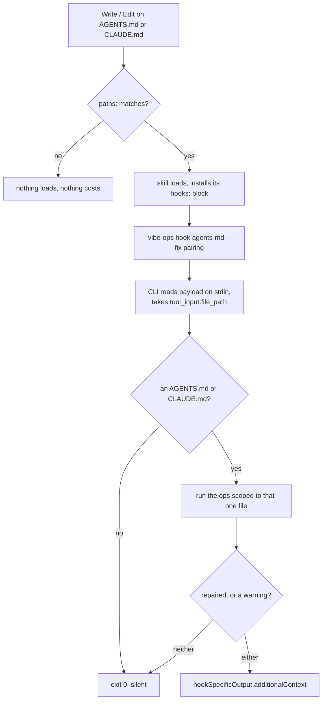

# Plan-009: The first skill-scoped hook, and the CLI it calls

| Field | Value |
|---|---|
| Status | Shipped |
| Created | 2026-08-10 |
| Author | Danilo Borges |
| Depends on | RFC-0001 (Accepted) |
| Related | ADR-0009 (hooks as a delivery surface), `plugin/references/harness-pair.md` |

---

## Summary

`authoring-agents-md` tells an agent that every `AGENTS.md` needs a sibling `CLAUDE.md` containing
`@AGENTS.md`, and then relies on the agent to remember. Measured across ten repositories on 2026-08-10,
eleven `AGENTS.md` files had no sibling and no `@`-import reaching them — two of them repository roots,
meaning the file a newcomer assumes was read had never entered context at all. This plan delivers the
mechanical half: a `PostToolUse` hook scoped to that skill's own lifecycle, which creates the missing
sibling at the moment the `AGENTS.md` is written, and which warns — never blocks — when a `CLAUDE.md`
exists without linking back, or starts accumulating content that belongs in its `AGENTS.md`.

The hook contains no logic. It is the `vibe-ops` command with three arguments, because the CLI learns to
read a hook payload and answer in the hook's own protocol. Making that call possible is most of the work:
the CLI is unpublished and has no route into an installed plugin, so this plan installs it as a command,
teaches an ops to act on a single file and to repair a named subset of what it finds, and gives the whole
arrangement a sensor.

## Goals

1. Writing an `AGENTS.md` with no sibling `CLAUDE.md` produces one, without the agent being asked.
2. A `CLAUDE.md` that does not link back to its `AGENTS.md`, or that carries content belonging in it,
   produces one advisory line — never a block, and never a silent pass.
3. The rule has exactly one detector and one repair, both in the CLI. No shell reimplements either.
4. A hook declared inside a skill has a sensor, so the next one cannot be dead on arrival.
5. `${CLAUDE_PLUGIN_ROOT}/../cli/...`, which resolves in no installation, stops being written and stops
   passing the check that exists to catch exactly this.

## Scope

### In scope

- `vibe-ops` installed as a command on this machine, and the recipe written down.
- A `fix` capability on the gate contract, and `pairing` using it.
- `--file` and a **selective** `--fix` on an ops; a `hook` verb on the CLI.
- A new `claude-md-content` gate, warn-level.
- The hook's `hooks:` frontmatter block, and a sensor for the shape of such a block.
- The `../` guard in `70-plugin-root-paths.sh`, and the six sites that *execute* the runner.

### Out of scope

- **The four `cp` sites in `plugin/skills/setup/SKILL.md`** (lines 166–167, 227–228). They copy the
  harness *into a target repository* rather than running it, so "call `vibe-ops` instead" is not the
  answer; what a target should receive once the CLI is a command is its own question, and
  `templates/harness/checks/_run.sh` already carries a three-source cascade that would have to change
  with it.
- **Publishing the CLI to npm.** `npm link` is a machine-local arrangement; publication is Plan-010's
  channel policy, not this plan's.
- **A per-edit emitted signal.** See the Decision Log: `--file` deliberately records nothing.
- **A mechanical statement of the plugin↔CLI co-dependency.** The dependency is declared in prose and
  enforced by breaking loudly; a check or a manifest requirement is a later act, and there is no surface
  for it today.
- **Porting the remaining twelve shell fragments.** Unchanged from RFC-0001.

## Design

### Why the hook may exist at all

ADR-0009 admits a hook only when it delivers something an instruction line cannot: state read from disk
at that instant, or context placed where an instruction file cannot reach. This one qualifies on the
first count — whether a sibling exists is knowable only after the write, and the file it must create is
named by the file that was just written. The instruction line already exists (`SKILL.md` Step 8) and has
been measured failing.

The cost is bounded by `paths:`, not by the hook. `authoring-agents-md` already declares
`paths: [AGENTS.md, **/AGENTS.md, CLAUDE.md, **/CLAUDE.md]`, so the skill loads only when work touches
those files, and a `hooks:` block is installed only while the skill is active. A session that never
touches an `AGENTS.md` never pays anything.



### The gate learns to repair

`cli/packages/core/src/gate.ts` already declares `fixable?: boolean` on `GateDefinition` and nothing has
ever used it. `defineGate` gains an optional third argument:

```ts
export interface GateFix { readonly file: string; readonly action: string }

export function defineGate(
  definition: GateDefinition,
  run: (context: GateRunContext) => Promise<GateOutcome>,
  fix?: (context: GateRunContext, findings: readonly GateFinding[]) => Promise<readonly GateFix[]>,
): GatePlugin
```

`defineGate` throws when `definition.fixable === true` and `fix` is absent, and when `fix` is present and
`fixable` is not `true` — the same rule the emitter already applies, so the definition and the code
cannot silently disagree.

`cli/packages/gates/src/pairing/index.ts` becomes `fixable: true`, and its two findings stop being
treated as the same kind of thing:

| What is wrong | Level | What `--fix` does |
|---|---|---|
| No sibling `CLAUDE.md` at all | `fail`, root and nested alike | creates it, containing `@AGENTS.md` |
| Sibling exists, but no `@AGENTS.md` in it | `warn`, root and nested alike | nothing, and says so |

**The split is now by failure mode, not by depth**, and `levelFor(isRoot)` disappears from the gate
entirely along with every use of `isRoot`. Both rows change today's behaviour:

- A **nested** `AGENTS.md` with no sibling used to warn, on the grounds that a path-scoped rule was an
  alternative to writing it. That alternative was a choice made *before* the file existed; once it
  exists, it either loads or it does not, and at every depth the answer is the same. So it fails, and the
  repair is the same one line.
- A `CLAUDE.md` that exists **without** the import used to fail at the root. It is unrepairable on
  purpose — appending an import to a file someone else wrote is a judgement about their content — and a
  hard failure the tool refuses to repair is a dead end. So it warns, with evidence naming the
  consequence rather than the rule: *this `CLAUDE.md` does not link to its `AGENTS.md`, so that
  `AGENTS.md` never loads from here*.

Three existing tests in `cli/packages/gates/test/` assert the old levels and are updated, each with the
reason written beside it.

### The ops learns `--file`, and a `--fix` that names its targets

Both in `cli/packages/core/src/ops.ts`, so every ops gets them and none declares them.

`--file <path>` replaces `trackedFiles(repoRoot)` with that one path, normalised to repo-relative. It
deliberately does **not** require the file to be tracked — a just-written `AGENTS.md` is not in
`git ls-files`, and a hook that ignored untracked files would be silent exactly on a new repository.
Each entry still filters by its own patterns, so an entry the file does not match sees an empty
population, which the existing "zero examined is not a reading" branch already handles.

**`--fix` names what it may repair.** Fixing everything a composition happens to contain is the wrong
default: a hook reacting to one write has no business repairing an unrelated gate that merely happens to
be `fixable`, and with a boolean flag there is no way to ask for less.

```
--fix                        every fixable gate in the composition
--fix pairing                only that entry
--fix pairing,other-gate     only those
```

Node's `parseArgs` rejects a bare `--fix` on a `string` option, so `ModuleFlag` gains
`implicit?: string`, and `cli/packages/cli/src/bin.ts` rewrites a bare `--fix` into `--fix=all` before
parsing. Five lines, reusable by any later flag, and it keeps the syntax above real rather than forcing
`--fix all` on every caller. Under MCP the flag is an ordinary string, where a bare form cannot arise.

Naming a gate the composition does not contain **fails**, rather than silently repairing nothing.

For each selected gate declaring `fixable` and holding findings, the ops calls `fix` and then **re-runs
the gate** to confirm the finding is gone. The result separates `repaired` from what still fails, so a
`--fix` covering two of five gates reports two repairs and three failures rather than a green line. That
separation is what answers the objection recorded when `--fix` was first deferred.

`data` becomes `{ findings, skipped, repaired }`.

### The `claude-md-content` gate

New: `cli/packages/gates/src/claude-md-content/index.ts`, `defaultPaths: ["**/CLAUDE.md"]`. It strips
the `@AGENTS.md` import, blank lines and HTML comments; anything left is a finding at `level: "warn"`,
rule `claude-md-carries-content`. Not `fixable` — `plugin/AGENTS.md` says a `CLAUDE.md` may legitimately
hold "content another agent would ignore or misread", so this is a question, not a defect. Added to the
`agents-md` composition with `emits` absent.

### The hook is the CLI, not a script

There is no shell script in the skill. A hook script would exist only to do two things — pull
`tool_input.file_path` out of the JSON on stdin, and wrap the result back into the hook's response
envelope — and the CLI can do both. `Surface` in `cli/packages/core/src/context.ts` is already
`"cli" | "mcp"`; `"hook"` is the third.

```
vibe-ops hook <ops> [--fix <gates>]
```

A new verb beside `mcp` in `cli/packages/cli/src/bin.ts`. It reads the `PostToolUse` payload from stdin,
takes `tool_input.file_path`, exits 0 in silence if that path is neither an `AGENTS.md` nor a
`CLAUDE.md`, otherwise runs the named ops with `--file` set to it, and prints
`{"hookSpecificOutput":{"hookEventName":"PostToolUse","additionalContext":"…"}}` — never a `decision`,
because `plan-progress-nudge.sh` measured that a block arrives framed as a denial, which is wrong for
something the model must be free to decline.

This deletes three hazards the six existing hooks each carry a copy of: a `jq`-or-nothing dependency,
hand-rolled JSON escaping through `sed`/`awk`, and a second parse of the payload shape.

The registration names the command and nothing else — no shell, no guard, no wrapper:

```yaml
hooks:
  PostToolUse:
    - matcher: "Write|Edit|MultiEdit"
      hooks:
        - type: command
          command: vibe-ops
          args: ["hook", "agents-md", "--fix", "pairing"]
          timeout: 10
```

`--fix pairing` is the selective form doing its job — `claude-md-content` is not `fixable` and `budget`
has nothing to do with this edit.

**The plugin and the CLI are co-dependent, and that is now declared rather than worked around.** An
earlier draft wrapped this in `sh -c "command -v vibe-ops || exit 0"` so a machine without the CLI would
see nothing. That is the wrong silence: it makes an unusable installation look like a working one. With
the command named directly, a missing `vibe-ops` surfaces as a hook failure — loud, attributable, and
fixed by Track 1's one command. This satisfies ADR-0009 obligation 3 on its own terms, which forbids
failing *open while appearing to work*, not failing loudly.

A mechanical statement of the dependency — a check that the CLI is present, or a declared requirement in
the manifest — is deliberately left for later; there is no surface for it today and inventing one here
would be the second thing this plan is not about.

`hooks:` is supported from claude-code 2.1.196 (this machine runs 2.1.226). The documentation describes
the field but **ships no complete worked example of the frontmatter shape**, which is why ADR-0009
obligation 4 — exercise it with `claude --plugin-dir` before it ships — is a hard gate here rather than a
formality.

One tradeoff to name: obligation 1 asks a hook to exit on its own condition before doing work, and a
process spawn is more than the `case` builtin the other six use. `paths:` is what pays for it — this hook
does not exist in a session that is not editing these files.

### The sensor

With no script under `skills/*/hooks/`, there is no file to scan, and the failure mode moves: a `hooks:`
block with the wrong shape silently never fires — precisely the risk the undocumented frontmatter shape
leaves open. So `cli/packages/module-check/sh/checks/25-hooks-registration.sh` gains a third assertion
about **blocks**, not scripts: every `SKILL.md` carrying a `hooks:` block must name a known event, must
carry a `command`, and any `${CLAUDE_SKILL_DIR}/`-relative path it names must exist in the plugin. That
also covers the next skill-scoped hook, whether or not it ships a script.

Two existing pieces must not be disturbed, and both are easy to miss:

1. The description-count assertion stays scoped to `hooks.json`, or it starts failing the day a skill
   declares a hook.
2. The jq capture `hooks/[^/]+\.sh$` would match a `skills/x/hooks/y.sh` path if one ever appeared in
   `hooks.json`, and then resolve it as `$PLUGIN_DIR/hooks/y.sh` — a latent false failure. Anchor it.

### The `../cli` breakage

`70-plugin-root-paths.sh` checks that `${CLAUDE_PLUGIN_ROOT}/<path>` exists, and passes
`${CLAUDE_PLUGIN_ROOT}/../cli/...` because `$PLUGIN_DIR/../cli` resolves in this working tree. It cannot
resolve in an installation: the install is a copy of `plugin/`, so the parent of `${CLAUDE_PLUGIN_ROOT}`
holds only version directories. A `case "$path" in ../*|*/../*) fail` guard fires on all ten sites; the
six that *execute* the runner become `vibe-ops check <target>`, which the newly linked command answers.

## Tracks

- [x] **Track 1 — `vibe-ops` becomes a command.** `npm link -w @entelekheia/vibe-ops-cli` from the
      repository root; `cli/packages/cli/package.json` already declares `bin`. The three internal
      dependencies are unpublished `^0.0.1`, so if npm reaches for the registry, fall back to a symlink
      into `~/.local/bin` (already on PATH) — Node resolves the realpath, so imports still find the
      workspace's single `node_modules`. At the end `command -v vibe-ops` answers and `vibe-ops check .`
      reports 17 checks. The recipe replaces "Not published yet" in `cli/README.md`.
- [x] **Track 2 — The gate contract learns to repair.** `defineGate`'s optional third argument, the
      `fixable`/`fix` agreement check, `pairing` creating a missing sibling, `isRoot` leaving the gate,
      and the second finding becoming `warn` with evidence naming the missing link. At the end a unit test
      shows the fix creating the file, refusing to touch an existing `CLAUDE.md`, `defineGate` throwing
      when the definition and the code disagree, and a nested `AGENTS.md` with no sibling failing rather
      than warning.
- [x] **Track 3 — `--file` and a selective `--fix`.** Including `ModuleFlag.implicit`, the bare-flag
      rewrite in `bin.ts`, the untracked-file case, and the re-run-to-confirm. At the end
      `vibe-ops agents-md --file <a fresh AGENTS.md> --fix pairing` creates the sibling and reports one
      repair; `--fix budget` on the same file repairs nothing and says the gate is not fixable; and
      `--fix nosuchgate` fails.
- [x] **Track 4 — The `claude-md-content` gate.** New gate, added to the composition. At the end this
      repository sweeps clean (every `CLAUDE.md` here is exactly `@AGENTS.md`) and a fixture carrying a
      stray paragraph warns.
- [x] **Track 5 — The `hook` verb.** `Surface` gains `"hook"`; `vibe-ops hook <ops>` reads the payload,
      scopes to the file, and answers in the hook protocol. At the end, feeding a captured `PostToolUse`
      payload on stdin produces exactly one line of valid JSON, and a payload naming an unrelated file
      produces nothing at all.
- [x] **Track 6 — Registration and its sensor.** The `hooks:` block in the skill, plus the block-shape
      assertion in `25-hooks-registration.sh` and its self-test fixture case. The mechanical half:
      `25-hooks-registration.sh` correctly fires on an unknown event, a missing `command`, and a
      nonexistent `${CLAUDE_SKILL_DIR}/` path (each corrupted and restored against this real repository),
      and a self-test fixture case proves it in CI. `packages/cli/test/hook.test.ts` exercises the real
      binary end to end: a payload naming a freshly written `AGENTS.md` produces the sibling and one line
      of JSON; an unrelated file produces none.

      **The real `claude --plugin-dir` session acceptance is now done**, run by the maintainer 2026-08-10
      (`-p` does not reliably deliver session-scoped hooks, so this had to be interactive). Both success
      criteria passed: writing `AGENTS.md` produced `PostToolUse:Write hook additional context: fixed
      CLAUDE.md — created, containing @AGENTS.md` and a real `CLAUDE.md` containing exactly `@AGENTS.md\n`
      (11 bytes, confirmed via `od -c`); writing an unrelated `README.md` produced no context at all.
      **A material caveat surfaced in the same run and changes what Goal 1 can promise** — see Outcomes
      & Retrospective and the new Decision Log entry below.
- [x] **Track 7 — The `../` guard and the six execution sites.** At the end `vibe-ops check .` is green
      with the guard active, and no `${CLAUDE_PLUGIN_ROOT}/../` remains outside the four deferred `cp`
      sites — which get a comment naming this plan's Out of scope, so the next reader does not think they
      were missed.
- [x] **Track 8 — Docs, in the same act.** `plugin/AGENTS.md` — the `hooks:` bullet stops saying no skill
      uses it, **and the co-dependency on the CLI is stated where someone installing the plugin will read
      it**, since a plugin that now needs a command on PATH has changed shape. `cli/AGENTS.md` (fix on the
      gate contract, `--file`, selective `--fix`, the `hook` surface, the no-emit decision),
      `cli/README.md`, and RFC-0001 step 4 moving from Postponed to done with its Decision Log entry.
- [x] Run `/vibe-ops:close plan` — retrospective against the goals, the demotion check, the tracking
      issue closed. The plan file itself is kept.

## Success criteria

```bash
cd <this repository's checkout>
npm run build && npm run typecheck && npm test

command -v vibe-ops                       # the command exists
vibe-ops check .                          # 17 checks, 0 failed — with the ../ guard active
vibe-ops agents-md --list                 # 7 gates, claude-md-content among them
vibe-ops agents-md                        # clean on this repository
```

Single-file repair and the selective fix, against a scratch repository rather than this one:

```bash
mkdir -p /tmp/pairing-probe && cd /tmp/pairing-probe && git init -q
printf '# AGENTS.md\n' > AGENTS.md

vibe-ops agents-md --file AGENTS.md --fix pairing   # one repair
cat CLAUDE.md                                       # @AGENTS.md
vibe-ops agents-md --file AGENTS.md                 # no findings

printf 'notes\n' > CLAUDE.md                        # sibling exists, no import
vibe-ops agents-md --file AGENTS.md --fix pairing   # WARN, zero repairs — it must not rewrite this file
vibe-ops agents-md --file AGENTS.md --fix nosuchgate # fails, naming the unknown gate
```

The hook verb, without a session:

```bash
printf '{"tool_name":"Write","tool_input":{"file_path":"/tmp/pairing-probe/AGENTS.md"}}' \
  | vibe-ops hook agents-md --fix pairing          # one line of JSON, hookEventName PostToolUse
printf '{"tool_name":"Write","tool_input":{"file_path":"/tmp/pairing-probe/README.md"}}' \
  | vibe-ops hook agents-md --fix pairing          # no output at all
```

The two that cannot be asserted from a terminal, and are the ones that decide whether this shipped:

- **The hook fires.** A real `claude --plugin-dir <this repository's checkout>` session — not `-p`,
  which does not deliver session-scoped hooks — writes an `AGENTS.md` into a scratch
  repository. The sibling appears and one advisory line arrives. Nothing may be claimed here that was not
  observed in a transcript.
- **The hook stays quiet.** A session in the same repository that edits an unrelated file produces no
  firing at all.

---

## Decision Log

- Decision: The hook is the `vibe-ops` command itself — no shell script, and no shell guard either.
  Rationale: a script would exist only to extract `tool_input.file_path` from stdin and re-wrap the result
  in the hook's response envelope, and the CLI can do both. It also deletes three hazards the six existing
  hooks each carry: a `jq` dependency, hand-rolled JSON escaping, and a second copy of the payload shape.
  Date / Author: 2026-08-10 / Danilo Borges

- Decision: The plugin and the CLI are co-dependent. A missing `vibe-ops` breaks the hook loudly rather
  than being swallowed.
  Rationale: a `command -v` guard would make a machine that cannot run the hook look identical to one where
  the hook found nothing to do — an unusable installation presenting as a working one. ADR-0009
  obligation 3 forbids failing open while appearing to work, which is exactly what the guard would have
  done; failing loudly is compliant. A mechanical statement of the dependency comes later.
  Date / Author: 2026-08-10 / Danilo Borges

- Decision: `vibe-ops` is installed globally via `npm link -w`, and everything that used to reach the CLI
  by relative path now calls it by name.
  Rationale: there is no route from an installed plugin to the CLI — measured, `${CLAUDE_PLUGIN_ROOT}/../cli`
  exists in no installation. A command on PATH is the only route that works from a hook, from a skill, and
  from a git hook alike.
  Date / Author: 2026-08-10 / Danilo Borges

- Decision: `pairing` splits by failure mode instead of by depth; `isRoot` leaves the gate.
  Rationale: a nested `AGENTS.md` warned because a path-scoped rule was an alternative to writing it, but
  that choice was made before the file existed. Once it exists it either loads or it does not, and depth
  changes nothing about that — nor about the one-line repair.
  Date / Author: 2026-08-10 / Danilo Borges

- Decision: `--fix` takes an optional list of gates, and repairs everything only when given none.
  Rationale: a caller reacting to a single edit must be able to ask for one repair. A boolean flag offers
  no way to ask for less than everything, which would let a hook rewrite files the edit never touched.
  Date / Author: 2026-08-10 / Danilo Borges

- Decision: `--fix` is admitted at all, reversing its deferral when the ops was first built.
  Rationale: the objection was that a `--fix` covering two of five gates announces a repair it did not
  make. That is answered structurally rather than by omission — `fixable` is declared per gate, the ops
  re-runs each gate to confirm, and `repaired` is reported separately from what still fails.
  Date / Author: 2026-08-10 / Danilo Borges

- Decision: A `CLAUDE.md` that exists without `@AGENTS.md` warns instead of failing, and is never
  rewritten.
  Rationale: it is unrepairable on purpose — appending an import to a file someone wrote is a judgement
  about their content — and a hard failure the tool refuses to repair is a dead end. The warning names the
  consequence rather than the rule: that `AGENTS.md` never loads from there.
  Date / Author: 2026-08-10 / Danilo Borges

- Decision: A `--file` run emits nothing.
  Rationale: a signal's identity includes the population it was read over. A per-write reading of one file
  and a repository sweep are different signals, and putting both under `agents-md`'s `memory-slug` id
  would make the series uninterpretable. A per-edit signal, if ever wanted, needs its own id.
  Date / Author: 2026-08-10 / Danilo Borges

- Decision: The four `cp` sites in `setup` keep their `${CLAUDE_PLUGIN_ROOT}/../cli/` paths for now and
  are exempted from the new guard by a comment naming this plan.
  Rationale: they ship the harness into a target repository rather than running it, so the substitution
  that fixes the other six does not apply. Left visible rather than silently excluded.
  Date / Author: 2026-08-10 / Danilo Borges

- Decision: `toRepoRelative` (`ops.ts`, `--file`) realpaths both `repoRoot` and the incoming file before
  computing the relative path, not just the file.
  Rationale: Track 5's own hook test caught this live — fed `/tmp/x/AGENTS.md` against a repo whose git
  toplevel reports `/private/tmp/x` (macOS resolves `/tmp` through a symlink), every gate scoped to an
  empty population instead of that one file, because the two path strings shared no prefix. Resolving
  only the file first "fixed" the hook and then broke a Track 3 unit test that hands `toRepoRelative` a
  raw `mkdtemp` path as `repoRoot` — `/var` is the same kind of symlink on the same platform. Resolving
  both sides is correct regardless of whether the caller's `repoRoot` already went through
  `repoRootFrom` (the production path) or not (the test path): realpath-ing an already-resolved path is
  a no-op.
  Date / Author: 2026-08-10 / Danilo Borges

- Decision: `project/` is excluded from `plugin-root-paths` entirely — the climb guard AND the pre-existing
  existence check, not just the new half.
  Rationale: turning the guard on against this repository's own gate immediately flagged
  `project/plans/002-*.md`, a Shipped plan whose prose named `${CLAUDE_PLUGIN_ROOT}/../cli/...` when that
  was the live design, years before this plan's own split. Governance forbids rewriting a Shipped plan or
  an Accepted RFC to match later code, so the fix cannot be "update the doc" — and a doc read as history
  is not a live instruction an agent executes, the same distinction `tracked_md()` already draws for
  `templates/`. `project/` gets the same exclusion, for the same reason.
  Date / Author: 2026-08-10 / Danilo Borges

- Decision: `pairing`'s `defaultPaths` (`**/AGENTS.md`) is left unchanged — a hook firing on a CLAUDE.md
  edit does not re-check that file's own `@AGENTS.md` link.
  Rationale: `--file` passes exactly one path, applied to every composed entry by glob match. Editing a
  CLAUDE.md directly gives `pairing` an empty population (its pattern only matches AGENTS.md paths), so a
  hand-edit that deletes `@AGENTS.md` from an existing, already-paired CLAUDE.md is not caught by the
  hook — though it is still caught by a full `vibe-ops agents-md` sweep. Widening `--file` to accept a
  file's pair as well as itself is a real fix, and is out of scope here: it changes `--file`'s contract
  (Track 3, already shipped and tested single-file), not this plan's hook wiring. Left as a known gap
  rather than silently designed around.
  Date / Author: 2026-08-10 / Danilo Borges

- Decision: Goal 1 is recorded as met, but its guarantee is qualified rather than restated as
  unconditional, following the live-session finding below.
  Rationale: `paths:` matching is what makes the skill *eligible* to load, not what makes it load — the
  live run showed a `Write` to a matching `AGENTS.md`, with the skill not already active, installed no
  hook. Only after the skill was explicitly invoked (via the `Skill` tool) did the same edit fire it. No
  code in this plan controls that decision; it is the host's own skill-selection heuristic. Recorded as a
  known boundary condition rather than pursued as a bug, since there is nothing here to fix it with.
  Date / Author: 2026-08-10 / Danilo Borges

## Outcomes & Retrospective

All eight tracks landed. `npm run build && npm run typecheck && npm test` — 73/73 — and
`vibe-ops check .` (17/17) are green with every change in place, including the two new sensors
exercising themselves against this real repository (a corrupted `hooks:` block, a `${CLAUDE_PLUGIN_ROOT}/../`
climb) rather than only a synthetic fixture.

Against the five goals:

1. **Met, with the guarantee qualified.** `vibe-ops agents-md --file AGENTS.md --fix pairing`, and the
   hook that calls it, both create the missing sibling without being asked — verified against a scratch
   repository, through the built binary with a captured `PostToolUse` payload on stdin (`hook.test.ts`),
   and, 2026-08-10, in a real `claude --plugin-dir` session: writing `AGENTS.md` produced
   `PostToolUse:Write hook additional context: fixed CLAUDE.md — created, containing @AGENTS.md` and a
   real `CLAUDE.md` of exactly `@AGENTS.md\n` (11 bytes, `od -c`). **But the same session found that
   `paths:` matching alone did not install the hook** — a `Write` to a matching `AGENTS.md` with the
   skill not already active fired nothing, in the same session, on the same repository, both before and
   after enabling the plugin globally. Only an explicit `Skill` invocation beforehand made the next
   matching `Write` fire it. So "without the agent being asked" holds once the skill is active, not
   automatically on every matching write — see the new Decision Log entry.
2. **Met**, and changed shape from the design. A `CLAUDE.md` that exists without the import warns
   (`pairing`); one carrying stray content warns (`claude-md-content`, new — not in the original Design).
   Neither blocks. Neither is fixed by the hook, deliberately: both are judgements about content someone
   else wrote.
3. **Met.** One detector (`pairing`'s two rules), one repair (`pairing.fix()`), both in
   `packages/gates/` and `packages/core/src/ops.ts`. No shell reimplements the rule — the hook is the
   `vibe-ops` command itself, with no script in between.
4. **Met.** The sensor exists and is proven against three real corruptions of this repository's own
   `hooks:` block (unknown event, no command, a nonexistent `${CLAUDE_SKILL_DIR}/` path), plus a
   `--self-test` fixture case. The remaining doubt named at Backlog — whether Claude Code accepts the
   `command` + `args` shape this block uses, or only the single `command:` string form the
   documentation's one example shows — is resolved by the same 2026-08-10 session: the block fired
   exactly as written, `command`/`args` and all. Open Questions, below, is updated accordingly.
5. **Met** for the six sites that execute the runner, all now `vibe-ops check <target>` (two of them via
   a `(cd "$TARGET" && …)` subshell — the plan's own text assumed `vibe-ops check <target>` accepted a
   positional target directory, and building it revealed the CLI has no such argument; see Decision Log).
   The guard in `70-plugin-root-paths.sh` fires on any future `../` climb. The four `cp` sites in `setup`
   are explicitly exempted, matching Scope; discovered live, so was `project/plans/002-*.md`, a Shipped
   plan whose own historical prose triggered the new guard — excluded rather than rewritten, since a
   Shipped plan is a permanent record and this RFC's own governance forbids rewriting one to match later
   code.

**The two success criteria the plan's own text named as "the ones that decide whether this shipped" were
run, by the maintainer, 2026-08-10, in a real `claude --plugin-dir` session** (`-p` does not reliably
deliver session-scoped hooks, so this had to be interactive). Both passed: the hook fires and repairs;
an unrelated write stays silent. Full transcript-observed evidence is quoted against Goal 1 and Track 6,
above.

**What the same session found, that this plan did not anticipate:** `paths:` matching makes a skill
*eligible* to load; it does not deterministically *trigger* loading on every matching tool call. The
first attempt — a `Write` to a matching `AGENTS.md` with the skill not already active — installed no
hook, with no difference in outcome before or after enabling the plugin globally in this session's
settings. Only an explicit `Skill` invocation, then a matching write, fired it. This is a boundary of the
host's own skill-selection behaviour, not a defect in anything this plan built — the mechanism is correct
once active, proven twice over. It changes what Goal 1 can promise (see Decision Log) and is the one
finding from this plan promoted to a workspace-level learning (`/route-learnings`,
`project/learnings/claude-code-skill-paths-does-not-guarantee-auto-load.md`), since it is a claim about
the host tool, not about vibe-ops.

**Nothing was cut.** Every "Out of scope" item stayed out for the reason stated there; every Decision
Log entry is a design choice that survived, not one reversed after the fact.

---

## Open questions

Both questions this plan opened with are answered — kept here for the record, not as pending work:

- **Does `npm link -w` resolve the three unpublished `^0.0.1` workspace dependencies without reaching the
  registry?** Yes — Track 1, confirmed by running. The symlink fallback was never needed.
- **Does a skill-scoped `hooks:` block accept the `command` + `args` shape the plugin's `hooks.json`
  uses, or only the single `command:` string the documentation's one example shows?** The `command` +
  `args` shape works as written — confirmed in the real session that closed Track 6, 2026-08-10.

One genuine question this plan's own live-session finding opens, unresolved: **should a hook this plan
treats as "the guarantee" (Goal 1) have a fallback for the case `paths:` matches but the skill was never
actually invoked?** No mechanism in this plan addresses it — `vibe-ops agents-md` (the full sweep, run by
hand or in CI) remains the backstop, but nothing prompts anyone to run it. Left for whoever next relies on
a skill-scoped hook as a guarantee rather than a best effort.

## Related

- `project/rfc/0001-gates-and-ops-as-the-cli-unit-of-composition.md` — Accepted; this plan executes its
  postponed step 4 and its "The skill-scoped hook" section.
- `project/adr/0009-hooks-as-a-delivery-surface.md` — the four obligations every hook here must meet.
- `plugin/references/harness-pair.md` — why the ops owns emission and why zero examined is not a reading.
- `plugin/references/instruction-surfaces.md` — the pairing rule itself, and the ten-repository
  measurement that motivates the hook.
