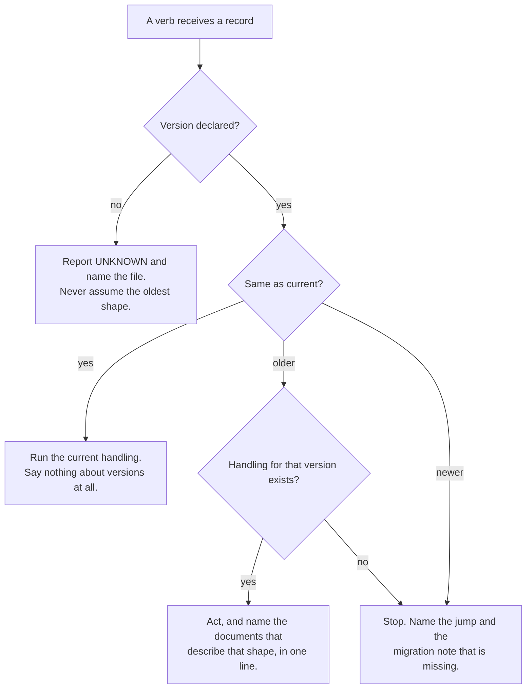

<!--
 Copyright (c) 2026 Danilo Borges (https://github.com/daniloborges)

 Licensed under the Apache License, Version 2.0 (the "License");
 you may not use this file except in compliance with the License.
 You may obtain a copy of the License at

 https://www.apache.org/licenses/LICENSE-2.0
-->

# Plan-012: Versions travel with the record

| Field | Value |
|---|---|
| Status | Shipped |
| Created | 2026-08-11 |
| Author | Danilo Borges |
| Related | [RFC-0001](../../rfc/0001-gates-and-ops-as-the-cli-unit-of-composition.md), [Plan-011](./011-the-governance-lifecycle-becomes-three-cli-nouns.md) |

---

## Summary

Three kinds of thing in this repository change their behaviour over time — the governance templates a
record is written against, the detectors a gate run applies, and the shape of the observations a run
emits — and only the first of them says so on the artifact it produces. A record written against an older
template carries a stamp; a finding produced by a detector that has since changed carries nothing, so two
readings under the same id are not comparable and nothing reports that. This plan puts a version on every
instrument, moves it to a machine-readable place, makes it travel onto the record that instrument
produces, and makes an absent version a refusal rather than a silent default. It then spends that on two
things: a verb handed an older record routes to the handling that matches it, and the spread of records
still sitting on old versions becomes a readable health signal for the repository.

## Goals

1. Every instrument that can change behaviour — template, gate, shell fragment, ops, module — declares a
   version, in frontmatter or in a definition, and that version is on the record it produces.
2. An artifact carrying no version is reported as **unknown**, never silently treated as the oldest known
   shape, and a mechanical check keeps the unversioned population from growing.
3. A verb handed a record written against an older version routes to the handling for that version and
   says so in one line. It never asserts the current shape about a record that does not have it.
4. Version is invisible in ordinary use. It reaches the operator only as an alert, as a health reading, or
   through the verbs whose subject *is* versions and migration.
5. Two observations recorded under the same id at different times can be told apart when the instrument
   between them changed.
6. What is open and what is behind a version is answerable from the repository itself, as the signal that
   says where an upgrade or a fix is owed.

## Scope

### In scope

`plugin/templates/`, the version declarations on records under `project/`, `GateDefinition` and the ten
gates in `cli/packages/gates/`, the seventeen shell fragments in
`cli/packages/module-check/sh/checks/`, the emitter in `cli/packages/core/src/emit.ts`, the closing and
creating skills under `plugin/skills/`, and the shared policy files in `plugin/references/`.

### Out of scope

**Research documents.** The five documents under `project/research/` have no template and the type is
still being felt out. Bringing them into the versioning scheme now would fix a shape that is not settled;
they are excluded explicitly, with the reason recorded, rather than left to read as permanently unknown.

**The hook output contract.** A hook's input envelope belongs to the host and is not this repository's to
version; its output wording is, and it is behaviour, which makes it a candidate for observation as a trait
rather than for a version field. That is a different mechanism from everything else here, it needs a
case-by-case judgement, and folding it in would make this plan two plans.

**Bumping any package version to a release.** Every package in `cli/` sits at `0.0.1` and the plugin
manifest is frozen by policy. This plan makes the version *fields* meaningful and load-bearing; deciding
that a number moves is a release decision and belongs to whoever cuts one.

**Retro-migrating existing records to the current shape.** The backfill declares which shape a record
*is*. Converting a record from one shape to another is `/vibe-ops:migrate`'s job, run per artifact, with a
decision per entry — and it is deliberately not bundled here, because bundling it is how a mechanical
backfill silently deletes a working record.

## Design

The failure this plan removes has one shape, and it appears three times. An instrument produces an
artifact; the artifact does not name the instrument's version; a later consumer assumes the current
version. When the assumption is wrong the consumer does not fail — it produces a plausible, stable, wrong
answer. That is the same failure as grouping observations under an absent condition defaulted to zero: the
output is indistinguishable from a correct one.

**The version goes on the record, not in a registry beside it.** A lookup table mapping artifact to
instrument version is a second place to forget, and it is wrong the moment an artifact is copied. The
declaration travels with the bytes.

### Two axes, and what moves on each

A thing that can change carries two independent numbers, and conflating them is what makes either one
useless:

| Axis | Form | Moves when |
|---|---|---|
| **Document / instrument version** | integer — `plan@2`, `budget@1` | the shape or the behaviour changes in a way a consumer must handle differently |
| **Package version** | semver — `0.0.1` | the package is released |

The integer moves **only on a break** — the change a consumer cannot absorb silently. A detector made
stricter within the same vocabulary does not move it; a detector that starts reporting a category nobody
was handling does. This is the same split the observation framework this repository emits into already
uses, and it is the shape of a pinned major tag in a CI workflow: the consumer names an integer and never
sees the patch stream underneath it.

### The declaration lives in frontmatter

The version is machine-read, so it belongs where a machine reads first. Frontmatter carries it; the
header table in a record becomes a **thin presentation layer** whose only job is rendering in a markdown
preview, never the source of truth. Today's HTML-comment stamp is the intermediate form and is migrated
away — a comment above the H1 is a position that has to be described in prose to every consumer, which is
exactly how one measurement of this repository came back wrong.

Every template moves, so every type takes a version jump with a migration note, written through
`/vibe-ops:new-migration`. That is Track 1, and it is first for a mechanical reason: a sensor built to
read the current position would be invalidated by the move it precedes.

### The dispatch, and where the operator sees it

Ordinary use must not acquire a version vocabulary. A verb resolves the version, picks its handling, and
mentions it only when the answer is not "current". There is no `--version` flag on an ordinary verb, and
no question asked at the prompt.

**Where "that handling" actually lives, and it is not in the CLI.** Box G said *run that handling* until
2026-08-12, which described code that does not exist and was never going to: `plan close` and `task close`
are mechanical — the closure box, the move, the link rewrite — and that mechanism does not vary by the
record's shape. What varies is the **ritual**, which is prose in a `SKILL.md`. So the CLI has exactly one
handling, and its whole job at box G is to act and to *name the documents* describing the shape it was
handed; the skill is what reads them and behaves differently. A CLI branching per version would be a
second place where each version's shape is written down, which is the duplication this plan removes.

The `no` branch is the one that carries the plan's weight. Treating an absent declaration as the oldest
known version is a claim about the file's shape that nobody verified, and it is wrong in both directions:
a record already written in the current shape but never declared receives a migration that does not apply
to it, and a genuinely old record looks handled when it was guessed at.

### The health reading

Once every record declares a version, the interesting number is not how many are stamped — it is **what is
open and what is behind**. A record still on an older version is a place where an upgrade is owed; a
record that is open *and* behind is where a fix is owed first. That reading is the sensor's real output,
and counting stamps is only the means to it.

### Where a version has to be declared, and where it already is

`ModuleDefinition` and `OpsDefinition` in `cli/packages/core/src/` both require `version`.
`GateDefinition` in `cli/packages/core/src/gate.ts` does not — it carries `id`, `summary`,
`defaultPaths` and `fixable`. The gate is the detector, so it is the one whose change actually
invalidates a comparison, and it is the one with no version. The seventeen shell fragments under
`cli/packages/module-check/sh/checks/` have none either, and they are the baseline the `fragment-parity`
gate compares a port against.

### The emitted record, and the shape it must converge on

`cli/packages/core/src/emit.ts` writes one flat object per observation:
`{observedAt, producer, repo, id, subject, value, tags}`. The receiving side accepts a different shape: a
header line declaring `kind`, the producer, the instrument as `<name>@<version>`, the moment and the
population actually examined, followed by finding lines. It validates that header and **refuses** anything
that does not open with it.

So the two do not meet, and the consequence is measurable: the shell emission path reaches the receiving
registry and is ingested, while everything the TypeScript emitter has written is unreadable to it. The
emitter converges on the accepted shape rather than the receiving side growing a second branch — a
translator with a branch per producer shape is the lookup table this design rejected, moved one repository
over. The record also gains its own schema version, because two producers already write into one directory
and a third consumer cannot otherwise tell which shape it is reading.

The instrument field is where the gate version lands: the shell path already writes an instrument name
carrying a trailing `@1` by hand, so the target shape exists and has a consumer. Track 4 makes it declared
rather than hand-written.

### Recovering after a compaction

This file is written to be the whole context. A session that loses its history recovers by reading this
plan and then the one dossier for the track it is about to work — in that order, and nothing else.
Anything a track needed that is not in one of those files was not written down, and rewriting it from
memory is the failure this plan exists to prevent.

**Where the work actually is**, as of 2026-08-11:

- **Tracks 1 through 6 landed.** Track 4 was completed on 2026-08-12, after being found ticked with its
  fragment half undone; the description on the track itself is the record, since its dossier is deleted.
- **Track 6 landed**, every work item including the two P1s. The dispatch runs inside `plan close` and
  `task close` before any mutation; `vibe-ops records --census` replaced `/vibe-ops:migrate`'s regex
  (8 records reported against 32 that exist); `vibe-ops records --handling <record>` answers, for one
  record, which version it declares and which document describes that shape. The multi-version mechanism
  is settled and recorded in the Decision Log. **Two defects it shipped were repaired on 2026-08-12** —
  the line named the version jumps without naming a document to read, and the alert was suppressed under
  `--json` rather than carried in `data`. Both were in the piece agreed as not delegable and delegated
  anyway; see the delegation contract above.
- **Track 7 landed** on 2026-08-12. Eleven files under `plugin/references/` declare
  `vibe-ops-reference: <name>@1`, the two known divergences are reconciled — the four-living-sections
  claim turned out to be in four places, not two — and both closing verbs report
  `policy: { "knowledge-lifecycle": <n> }`.
- **Every track is checked.** What remains is `/vibe-ops:close-plan` itself, and closing the two
  dossiers still open (006 and 007).
- **Every dossier is gone.** Tracks 1–5 closed on 2026-08-11 against
  `55e568956ea95c9e0a4a982cc3a63e49a828e31a`; Tracks 6 and 7 on 2026-08-12 against
  `ca20c345ca3396092db0bf9938a5994d118ccee8`. Every reference in this file carries the runnable
  `git show` against the right one of the two.
  **Closure rewrites markdown links and never code spans**, by design — rewriting a span would corrupt a
  document explaining its own link syntax — so the seven `Task:` lines in the track list are repaired by
  hand each time. The difference between the two closures is the whole point of the fix between them: in
  August 11 the dangling check reported clean over five dead paths, and on August 12 it named both,
  exited non-zero, and the repair happened because the tool asked for it.

**What may be delegated to a subagent, and what may not.** Agreed before Track 1 and written here on
2026-08-12, after it was broken:

| Delegable | Not delegable |
|---|---|
| Discovery — sweeping the plans, the gates, the fragments to report a shape | The version dispatch, the shape of a record, and anything where the right answer is a judgement that has to agree with this plan's intent |
| Mechanical parallel edits under a contract that fits in a paragraph — the same edit to ten gates | The backfill of the eight `plan@0.1` files: the stamp is an assertion about each file, and a wrong one turns *nobody looked* into *someone looked and said this* |
| Measurement that is heavy to read and light to answer | — |

**The reason this is in the file rather than in a message**, and it generalises past delegation: a
compaction carries the *operator's* messages forward and drops the agent's. A rule the agent stated and
the operator only agreed to therefore evaporates at the first compaction, while every decision written
into this file survives. That is not a hypothesis — it is what happened here. The rule above was written
in a chat message, agreed to, lost in the compaction, and then broken in the very next phase: a subagent
was given the version dispatch, and both defects that phase left behind
([`describe`'s line naming no document](#the-dispatch-and-where-the-operator-sees-it), and the alert
suppressed under `--json` instead of moved into `data`) are in the code it wrote.

**So: anything the agent proposes about *how* the work will be carried out belongs in this file at the
moment it is agreed, exactly like a design decision.** The Decision Log is for what is built; this section
is for how.

**Read no further than you need.** Each dossier is self-contained for its own track; reading all seven is
how a recovery spends its context on the six tracks it is not doing.

**Verify the state rather than trusting this list.** `vibe-ops check .` and `npm test` from the
repository root say whether the tree is where these notes claim, and `vibe-ops governance --verbose`
prints the health reading Track 2 produces. The last of those is the fastest way to see what this plan
has actually bought so far.

## Tracks

- [x] **Track 1 — The version moves to the frontmatter.** Every template under `plugin/templates/` gains
      frontmatter carrying its version; the header table becomes presentation only. Each type takes a
      version jump with its migration note, written through `/vibe-ops:new-migration` — five types, five
      notes. At the end the version is read from a parsed field rather than from a position described in
      prose. First, because a sensor built against the old position would be invalidated by this move.
      Acceptance: every template declares its version in frontmatter; every jump has a note; no note was
      invented for a jump that did not happen.
      Task: `git show 55e568956ea95c9e0a4a982cc3a63e49a828e31a:project/tasks/001-the-version-moves-to-the-frontmatter.md`

- [x] **Track 2 — The sensor, and the health reading it produces.** A check fragment that reads the
      frontmatter version and reports a record without one as `UNKNOWN`, naming the file. Its real output
      is the health reading: what is open, and what is behind a version — the signal that says where an
      upgrade or a fix is owed. At the end the unversioned and out-of-date populations are reported by the
      gate rather than discovered by hand, and neither can grow silently. Acceptance: the fragment
      reports unknown, open-and-behind, and behind separately; its fixture proves each fires.
      Task: `git show 55e568956ea95c9e0a4a982cc3a63e49a828e31a:project/tasks/002-the-sensor-and-the-health-reading.md`

- [x] **Track 3 — The emitted record reaches eita.** `cli/packages/core/src/emit.ts` writes the
      header-plus-findings shape the receiving side accepts, carrying its own schema version, the
      population examined and the moment. The local artifacts written under the old shape are deleted, not
      converted. At the end an artifact produced by an ops is ingested the way the shell path already is.
      Acceptance: an emission from `ops-governance` is accepted end to end; the previous flat shape appears
      nowhere.
      Task: `git show 55e568956ea95c9e0a4a982cc3a63e49a828e31a:project/tasks/003-the-emitted-record-reaches-eita.md`

- [x] **Track 4 — The gate declares its version.** `GateDefinition` gains a required integer `version`
      that moves only on a break, and it travels into the emitted record's instrument field. The seventeen
      shell fragments gain the same declaration, replacing the one hand-written instance. Breaking for the
      ten gates in `cli/packages/gates/`. At the end two observations recorded under one id at different
      times can be told apart when the detector between them changed. Acceptance: every gate and every
      fragment declares a version; an emission carries it; `defineGate` rejects a definition without one.
      **Unticked on 2026-08-12 after being found checked against an unmet acceptance, and completed the
      same day.** The seventeen fragments each declare `CHECK_VERSION`, the runner refuses one that does
      not and clears the variable between sources so a forgotten declaration cannot inherit its
      neighbour's, `--list` and the emitted instrument both read `<id>@<version>`, and `fragment-parity`
      names both versions it compared — in the finding and, through `GateOutcome.instrument`, on the
      clean run that has no finding to carry them.
      Task: `git show 55e568956ea95c9e0a4a982cc3a63e49a828e31a:project/tasks/004-the-detector-says-which-detector-it-is.md`

- [x] **Track 5 — Backfill the declarations.** Every governance record under `project/` except research
      declares the template version it was written against. Mechanical for the types whose template has
      only ever had one version; the plans require reading each file's actual shape before claiming one,
      because the declaration is an assertion about the file and not a default. At the end Track 2's
      fragment reports no unknowns. Acceptance: zero unknown records, and no declaration written without
      the file being read.
      Task: `git show 55e568956ea95c9e0a4a982cc3a63e49a828e31a:project/tasks/005-backfill-the-version-declarations.md`

- [x] **Track 6 — Verbs dispatch on the version they were handed.** The creating and closing skills, and
      the CLI verbs behind them, resolve a record's version and route to the handling that matches it,
      reporting the format in one line when it is not current and stopping when no handling exists. No flag
      and no prompt. The mechanism for keeping several versions' behaviour alive is open and is explored
      when this track runs — a skill-scoped hook forwarding to a versioned sibling skill is the candidate.
      At the end a closing verb can no longer assert the current shape about a record that does not have
      it. Acceptance: closing a record written against a previous version routes correctly and says which
      format it used; closing a current one mentions no version at all.
      Task: `git show ca20c345ca3396092db0bf9938a5994d118ccee8:project/tasks/006-verbs-dispatch-on-the-version.md`

- [x] **Track 7 — The cited policy says which policy.** The files under `plugin/references/` are cited by
      name as the authority by more than one skill, and they change. Each declares a version — in
      frontmatter if a prose file can carry it, otherwise by a versioned filename with each citation
      pointing at one — and a closure records which version of the policy it applied. At the end it is
      answerable which closures ran under which routing rule. Acceptance: every reference declares a
      version; a closure's record names the one it applied.
      Task: `git show ca20c345ca3396092db0bf9938a5994d118ccee8:project/tasks/007-the-cited-policy-says-which-policy.md`

- [x] Run `/vibe-ops:close-plan` — retrospective against the goals, the demotion check. The plan file
      itself is kept. Stays unchecked until the plan is actually closed; a track list that is otherwise
      complete but has this box open is not finished.

## Success criteria

Run from the repository root:

- `vibe-ops check .` is green, including the Track 2 fragment, and `vibe-ops check --self-test` still
  asserts every fragment fires on a deliberately broken fixture.
- Every template under `plugin/templates/` declares its version in frontmatter, and every version jump it
  took has a migration note beside it.
- The Track 2 fragment reports zero unknown records outside `project/research/`, and prints the
  open-and-behind reading as a separate number from the behind reading.
- `vibe-ops governance` and `vibe-ops agents-md` each produce an artifact whose first line declares the
  schema version, the producer, the instrument with its version, the moment, and the population examined,
  and that artifact is accepted by the receiving side.
- Every gate under `cli/packages/gates/` and every fragment under `cli/packages/module-check/sh/checks/`
  declares an integer version; constructing a gate without one fails at define time, with a test asserting
  it.
- Closing a record written against a previous version reports which format it used, in one line. Closing a
  current one produces no mention of a version anywhere in its output.
- `npm test` from the repository root passes, having built the foundation packages first.

---

<!-- ===== LIVING SECTIONS — maintained during the work, not written at the end ===== -->

## Decision Log

- Decision: `fragment-parity` **emits**. Its parity result is recorded, not only printed.
  Rationale: found at closure while running the success criteria rather than trusting them —
  `GateOutcome.instrument` was reaching the verbose CLI line and nowhere else, because the entry declared
  no `emits`. That made this plan's own requirement vacuous: "records both versions it compared" has
  nothing to attach to when nothing is recorded. RFC-0001 removes a fragment only once its port is
  *shown* to agree, and a demonstration that is printed and discarded is not that showing. A clean run
  writes a record too — "they agreed over ninety-three files on this date, at these two versions" is the
  whole reading.
  Date / Author: 2026-08-12 / Danilo Borges

- Decision: a prose reference declares `vibe-ops-reference: <name>@<integer>` in **frontmatter**, where
  `<name>` is its own path under `references/`, and a closure reports only the **routing** policy it
  applied.
  Rationale: settled by trying it rather than by reasoning, as the track required — frontmatter on
  `knowledge-lifecycle.md` left `vibe-ops check` and `vibe-ops governance` exactly where they were and
  broke no citation, because a leading block changes no anchor and nothing loads these files as skills.
  So the versioned-filename fallback and the `references/<name>/<version>.md` layout it left room for are
  unnecessary. The key is separate from `vibe-ops-template` because a reference is not a record and a
  shared key would make it look like one to the gate that sweeps for undeclared records. The name must
  match the file: presence alone would pass a reference copied from another that kept its source's token,
  reporting a version belonging to a different document. And only `knowledge-lifecycle` is reported by a
  closure — it is the one reference that decides what a closure *does*; a verb naming policies it never
  read would be a record that looks like evidence and is not.
  Date / Author: 2026-08-12 / Danilo Borges

- Decision: `project/log/` is **never** the overflow bucket for what the promotion test rejected — the
  closing skills were right and `knowledge-lifecycle.md` was wrong.
  Rationale: the reference said an entry failing question 1 or 2 *"still belongs somewhere; the log is
  that somewhere"*, and both closing skills said the opposite. The skills carry the reason and the
  reference did not: filing rejects one tier down is precisely what carried `project/learnings/` past its
  budget, and a tier that receives rejects is the tier that rots. The log is reached on its own merits —
  *can you name the file, folder or package where someone meets this again* — which is a different
  question from *did this fail the filter*.
  Date / Author: 2026-08-12 / Danilo Borges

- Decision: the CLI holds **one** handling per verb and never branches on the record's version. Box G of
  the dispatch flowchart is discharged by naming the documents that describe the shape, and the behaviour
  that actually differs per version lives in the skill that reads them.
  Rationale: `plan close` and `task close` are mechanical — tick the box, move the file, rewrite the
  links — and none of that varies with the record's shape. What varies is the ritual, which is prose. A
  CLI branching per version would put each version's shape in a second place, which is the duplication
  this plan exists to remove; and the branch would be untestable against the thing that actually reads
  it. Recorded on 2026-08-12 because the flowchart said *run that handling* for a day while the code did
  something else, and a plan describing code that does not exist is worse than one that says nothing.
  Date / Author: 2026-08-12 / Danilo Borges

- Decision: an alert a verb produces travels in `data`, not only through `context.log`.
  Rationale: `--json` suppresses every logged line so the output can be piped, so an alert that exists
  only as a line is an alert that does not arrive on that surface — the same defect as a refusal reaching
  an MCP client with `summary` stripped, one surface over. `data` carries the alert only when one is
  owed: a current record adds no key at all, so the transparency constraint holds on this channel by the
  same `undefined` that enforces it on the other.
  Date / Author: 2026-08-12 / Danilo Borges

- Decision: a skill's body always describes the **current** version, plainly and without history; for any
  older version it routes to that version's own document via `vibe-ops records --handling <record>`, and
  that document is the **migration note that already exists**, never a second per-version file.
  Rationale: the forwarding-sibling candidate this plan recorded does not survive — nothing can perform
  the forward. A hook returns text (`additionalContext`) and cannot invoke a skill, and skill→skill
  invocation is explicitly non-deterministic; the documentation's own advice is to use a hook when
  determinism is wanted, which is the mechanism that cannot do this. Measured against
  `plan-0.1-to-0.2.md` on 2026-08-11: the note already states that `Surprises & Discoveries` was living
  at `0.1`, that it is never deleted in place, and it carries the four routing questions per entry — the
  whole of what closure needed and never asked for. So one artifact per version, written by one ritual
  (`/new-migration`) and read by both the migration and the closure; a second document written by a
  second ritual would drift silently and telling which had drifted would mean reading both.
  Date / Author: 2026-08-11 / Danilo Borges

- Decision: the listing-budget argument against a versioned sibling skill is **not** a reason, and the
  claim in `plugin/AGENTS.md` that `disable-model-invocation` costs zero context stands.
  Rationale: recorded because the measurement asserted the opposite and it is the kind of correction that
  gets re-litigated. The documentation lists that field as *"Description not in context"*, so the file is
  right. The sibling mechanism dies on the forwarding question alone, which is independent of budget.
  Date / Author: 2026-08-11 / Danilo Borges

- Decision: version handling is the CLI's and the MCP server's, and it is transparent. An ordinary verb
  resolves the version and acts; version reaches the operator only as an alert, as a health reading, or
  through the verbs whose subject is versions and migration.
  Rationale: a version vocabulary imposed on ordinary use is a tax paid on every invocation to serve the
  rare one. The operator's question is "close this record", never "close this record, which is at 0.1".
  Making it a flag also makes it answerable wrongly under time pressure, and making it a prompt puts a
  question on the path taken every time.
  Date / Author: 2026-08-11 / Danilo Borges

- Decision: an absent version is reported as unknown and refused, never defaulted to the oldest known
  shape.
  Rationale: the default is an unverified assertion about the file's shape, and it is wrong in both
  directions — a record already in the current shape receives a migration that does not apply, and a
  genuinely old one looks handled when it was guessed at. A guess that produces a stable, plausible result
  is indistinguishable from a correct one, which is the class of failure this whole plan is about.
  Date / Author: 2026-08-11 / Danilo Borges

- Decision: two version axes, and they are independent — an **integer** for the document or instrument
  version, moving only on a break, and **semver** for the package, moving on release.
  Rationale: one number cannot serve both. A package version moves for reasons a consumer of the artifact
  does not care about, so routing on it would re-route on every patch; an integer that moves only when a
  consumer must handle something differently is exactly the signal a dispatch needs. This is the split the
  observation framework this repository emits into already uses, and it is the shape of a pinned major tag
  in a CI workflow — the consumer names an integer and never sees the patch stream underneath it.
  Date / Author: 2026-08-11 / Danilo Borges

- Decision: the version is declared in **frontmatter**, and a record's header table becomes a thin
  presentation layer for markdown preview tools rather than a source of truth.
  Rationale: the version is machine-read, so it belongs where a machine reads first. The HTML-comment
  stamp is a position that has to be described in prose to every consumer, and that description has
  already failed once — a substring match over a whole file counted a prose mention as a stamp and made
  this repository's unversioned population look smaller than it is. A parsed field cannot be matched by
  accident.
  Date / Author: 2026-08-11 / Danilo Borges

- Decision: the frontmatter key is `vibe-ops-template`, carrying `<type>@<integer>` — one key, vendor
  prefixed, value shaped exactly like today's comment stamp.
  Rationale: these templates ship into other people's repositories, where other tools read frontmatter and
  `type` and `version` are contested names; a vendor prefix cannot collide. Keeping the `<type>@<version>`
  value means every existing grep, every migration note filename and everything already written about the
  stamp stays true — only its location moves. A single line is also matchable from a shell fragment
  without a YAML parser, which a nested block would not be.
  Date / Author: 2026-08-11 / Danilo Borges

- Decision: each type's integer is its **count of shapes**, and the `0.x` history is kept rather than
  renamed — `plan` and `task` go to `@3`, `adr`, `rfc` and `log` go to `@2`.
  Rationale: the integer has to mean "which shape is this", and three plans are already stamped `plan@0.2`
  on disk. Renaming the history to `1`/`2` would orphan those three and rename two migration notes that
  are already written and correct; restarting everything at `@1` would erase that `plan` and `task` have
  changed shape twice, which is precisely the information the dispatch in Track 6 exists to act on. The
  resulting note filenames (`plan-0.2-to-3.md`) read oddly and are the honest record of what happened.
  Date / Author: 2026-08-11 / Danilo Borges

- Decision: a record **behind** the current version is a warning; **undeclared**, **ahead** and
  **mismatched** are failures.
  Rationale: the three failures are each a file nobody has correctly classified, and they are closeable
  the moment someone looks. Being behind is not — a template bump leaves every existing record behind at
  once, by construction, and they are migrated one at a time with a decision per artifact. A gate that
  goes red for the whole of that interval is the gate people switch off within the week, and it would
  make the version bump itself the expensive act. Warning keeps the reading visible and the gate usable,
  which is what "an indicator of where an upgrade is owed" has to mean to survive.
  Date / Author: 2026-08-11 / Danilo Borges

- Decision: task closure is **deferred to the end of the plan**, not run as each dossier finishes.
  Rationale: `/vibe-ops:close-task` is a ceremony — write-back, routing every entry through the promotion
  test, the demotion check, propagation — and running it seven times interleaved with the building spends
  the session's context on ritual rather than on the tracks. The dossiers stay open and keep accumulating
  their working record, which is what they are for; nothing is lost, because closure reads them at the
  end rather than being reconstructed. **The risk this accepts is named**: a dossier closed long after the
  work has the same memory problem the living-sections rule exists to prevent, so entries must go in
  *while* each track runs, not at closure.
  Date / Author: 2026-08-11 / Danilo Borges

- Decision: a finding's **level is configuration**, not the detector's verdict. `settings.<ops>.level`
  overrides it, keyed by a finding's `rule`, an entry's `label`, or `"*"` — most specific wins — with the
  gate's own declared level as the default underneath.
  Rationale: `GateFinding.level` is already stripped before anything reaches the emitter, on the stated
  grounds that a producer recording a verdict has done the consuming product's job for it. If that is
  true of the artifact it is true of the gate: whether a rule *blocks* is the repository's call, and it
  belongs beside `ignore` ("these files do not count") and `disabled` ("this rule does not apply here")
  rather than inside the detector. This extends [ADR-0011](../../adr/0011-population-belongs-to-configuration-not-a-gate.md)
  from population to verdict; it may deserve an ADR of its own. The concrete need: `template-version-behind`
  warns because a template bump leaves every record behind at once, which is right while a migration is
  in flight and wrong for a repository that has finished one and wants the gate to hold the line —
  unfixable from outside a gate that hardcodes it.
  Date / Author: 2026-08-11 / Danilo Borges

- Decision: the sensor is a **gate** in TypeScript, not an eighteenth shell fragment.
  Rationale: Track 2's dossier asked for both a shell fragment and for it to read through Track 1's
  reader rather than a second parser, and once that reader turned out to be TypeScript the two halves
  stopped fitting. A shell fragment would have re-derived frontmatter parsing and header anchoring in
  awk — the duplicate the instruction existed to prevent, and the exact defect that made this
  repository's first measurement wrong. `packages/gates` already depends on `packages/records` and
  `record-header` already imports its shared reader, so the precedent was set rather than invented.
  Date / Author: 2026-08-11 / Danilo Borges

- Decision: the emitter converges on the shape the receiving side already accepts, rather than the
  receiving side gaining a branch for the shape the emitter currently writes.
  Rationale: a translator with one branch per producer shape is a lookup table mapping artifact to
  instrument, which is the design this plan rejects — moved one repository away rather than removed. The
  receiving shape also already carries the instrument-with-version field this plan needs, so converging
  costs less than branching and lands the plan's own requirement for free.
  Date / Author: 2026-08-11 / Danilo Borges

- Decision: the observations already written under the old emitted shape are deleted rather than
  converted.
  Rationale: they are unreadable to the only consumer that exists, they are a day old, and they live
  outside version control. Converting them would spend real effort to preserve a sample nothing has ever
  read, and would put the first records of a new schema into the world as reconstructions rather than
  observations.
  Date / Author: 2026-08-11 / Danilo Borges

- Decision: the sensor runs before the backfill, and the frontmatter move runs before the sensor.
  Rationale: the backfill is a one-time act against a population that is still growing, so the sensor
  bounds it first and tells it which files it is about — a hand-built list would be one more thing to go
  stale. The frontmatter move goes first for the same class of reason inverted: a sensor built to read the
  comment position would be invalidated by the move that follows it.
  Date / Author: 2026-08-11 / Danilo Borges

- Decision: `project/research/` is out of scope for versioning, explicitly rather than by omission.
  Rationale: the type has no template and its shape is still being felt out. Fixing a version scheme onto
  it now would settle by accident something that has not been decided, and leaving it unmentioned would
  make five documents read as permanently unknown to the sensor. Excluded, with the exclusion recorded so
  the sensor's silence about them is a statement rather than a gap.
  Date / Author: 2026-08-11 / Danilo Borges

- Decision: this plan's tasks open no GitHub issues; the dossiers carry the whole working record.
  Rationale: the work is internal and single-operator for now. ADR-0006 splits a task across an issue and
  a dossier so that status and summary live where collaborators look — with no collaborators and no issue,
  that split buys nothing and costs a second surface to keep current. The dossier remains ephemeral and is
  still closed through `/vibe-ops:close-task`; only the issue half is absent.
  Date / Author: 2026-08-11 / Danilo Borges

- Decision: the hook output contract is cut from this plan.
  Rationale: it is behaviour rather than shape, which makes it a candidate for observation as a trait
  rather than for a version field — a different mechanism from every other track here, needing a
  case-by-case judgement. Recorded as out of scope rather than dropped, so the question survives the plan
  that declined to answer it.
  Date / Author: 2026-08-11 / Danilo Borges

## Outcomes & Retrospective

**All seven tracks landed, between 2026-08-11 and 2026-08-12.** The middle section below was written at
the halfway point and is kept, because this file is the recovery surface a session with no history reads
first and because a retrospective that only records the end hides how the plan actually went.

### The six goals, one by one

**Goal 1 — every instrument declares a version, and it is on the record it produces.** Met. Five
templates, ten gates, seventeen shell fragments; `ModuleDefinition` and `OpsDefinition` already required
one. `defineGate` refuses a definition without a version and the shell runner refuses a fragment without
one, so the declaration is not a convention anybody can forget.

**Goal 2 — absent is unknown, never the oldest shape, and the unversioned population cannot grow
silently.** Met, and enforced in three places rather than asserted once: the `template-version` gate over
records, the dispatch in front of both closing verbs, and `references-completeness@2` over the policy
files. Each fails rather than defaults.

**Goal 3 — a verb handed an older record routes to the handling for that version and says so in one
line.** Met, with a correction the plan needed and got: **the CLI has exactly one handling.** Closure is
mechanical and does not vary with a record's shape; what varies is the ritual, which is prose. So the
line names the documents describing the shape and the skill is what reads them. The plan's flowchart said
*run that handling* for a day while the code did something else, and that gap was the plan describing
code that was never going to exist rather than the code being wrong.

**Goal 4 — version is invisible in ordinary use.** Met, and this is the one enforced by a type rather
than by discipline: `describe()` returns `undefined` for a current record, so a caller that logs its
return value unconditionally says nothing. Both channels are tested — the log and `data` — after the
first implementation held the constraint on the visible one and dropped the alert entirely under `--json`.

**Goal 5 — two observations under one id are distinguishable when the instrument moved.** Met. The
emitted record carries `<gate>@<version>`; `--list` and the fragment emission carry `<id>@<version>`; and
`fragment-parity` records the pair it compared even on a clean run, which is the run that most needs it.
`references-completeness` moving to `@2` in this plan's own last track is the first real exercise of the
axis.

**Goal 6 — what is open and what is behind is answerable from the repository.** Met and readable:
`vibe-ops governance` reports `0 failed, 8 warned`, the eight being plans still at `plan@0.1`, of which
only 004 (Backlog) and 008 (In Progress) are open. `vibe-ops records --census` answers the same question
per record; the regex it replaced saw 8 of 32.

### What was cut, and stayed cut

The hook output contract, the five research documents, any package version bump, and retro-migrating
existing records to the current shape — all four as scoped, none quietly. The `dry-run`-versus-destructive
question was raised during the work and deliberately deferred rather than folded in.

### Where this plan was wrong about itself

**A track was ticked against an acceptance criterion whose words the delivery did not meet.** Track 4
claimed *"every gate and every fragment declares a version"* while zero of seventeen fragments did. It
was found on 2026-08-12, unticked, and completed. Two related instances in the same pass: a work item
reading *"confirm no ordinary verb gained a version flag"* was checked in the commit that added two flags
to `records`, and the flowchart divergence above. The common cause is that the author and the reviewer
were one reader working from memory after a compaction — which is the plan's own subject one level up: a
plausible, stable, wrong answer.

**A delegation agreement was lost to a compaction and then broken by the agent that proposed it.** The
split — subagents for discovery and mechanical edits under a closed contract, never for the version
dispatch — was agreed in conversation before Track 1 and never written down. After the compaction the
dispatch was handed to a subagent, and both defects that phase left behind came from that work. The fix
is structural and is now in the template: **a decision about how the work is carried out belongs in the
`Decision Log`**, because a compaction carries the operator's messages forward and drops the agent's.

### Four things from the middle of the work, kept

**The plan's own track order was wrong twice, in the same direction both times.** Track 1's frontmatter
move had to precede the sensor, because a sensor built against the comment position would have been
invalidated by the move behind it. Track 4 had to precede Track 3, because the emitted header's `tool` is
the gate with its version and the ops's version there would have conflated every detector in a
composition. Both were discovered by looking at the thing rather than at the plan, and both were cheap
because they were found before the code was written rather than after.

**Two tracks could not land separately, and the test is what said so.** Tracks 2 and 5 shipped as one
commit: the end-to-end test asserting this repository runs clean cannot pass while thirty-five records
are undeclared, so the sensor and the backfill are one landing. The plan implies they are separable.

**The gate found more than the plan did, twice.** The dogfooding-drift gate caught that five templates
were ten files, and then that the frontmatter move had silently disabled the gate itself — its stripper
keyed on `NR == 1`. The compiler caught that every gate needed a version, which a grep would have
approximated. The lesson is not "run the gate" but that a positional parser is a dependency on a file's
shape, and moving anything to offset 0 breaks all of them at once.

**The emitter had never produced anything a consumer could read.** Not a regression: it failed at line 1
of every artifact it ever wrote, while the shell path beside it was ingested normally and `cli/AGENTS.md`
asserted the two shared a shape. Emission succeeded, the file appeared, and only a reader was missing —
which is the shape of every defect this plan is about.

**What Tracks 1–5 routed at closure**, so the plan records it once the dossiers are gone: two traps to
`project/log/` — that moving a declaration to offset 0 disables every parser anchored there, and that a
producer writing successfully into a registry is no evidence anything can read it. One decision to
[ADR-0012](../../adr/0012-a-findings-level-belongs-to-configuration.md), a finding's level belonging to
configuration. Two prescriptions to where they execute rather than to prose: `/new-migration` now says to
state a destination positionally, and `cli/AGENTS.md` now says a path inside a gate's free-form `options`
needs the `<plugin>/` token and gets no help finding out. Everything else was dropped deliberately —
mostly because a test or a type already makes the mistake impossible, which is the filter working.

**What Tracks 6 and 7 routed at closure**: one trap to `project/log/` — that removing a section from a
template leaves every prose description of its shape standing, found as four stale copies of "the four
living sections" in files cited as authority, invisible to every gate because a *count* shares no token
with the headings it counts. Two facts held beyond this repository and were promoted out of it: that
nothing in the host can perform a skill-to-skill forward, and that a compaction carries the operator's
messages forward while dropping the agent's. Everything else was dropped because a test or a type now
makes the mistake impossible — which is the filter working, and it accounts for six of the ten entries.

**Two promotions leave this repository and are not yet filed.** Both are facts about the host toolchain
rather than about this codebase, so neither may live in a repository that travels alone: that nothing in
the host can perform a skill-to-skill forward (a hook returns text and cannot invoke a skill; skill→skill
invocation is non-deterministic), and that a compaction carries the operator's messages forward while
dropping the agent's. The surface that receives them is the workspace this repository sits in, through its
own routing ceremony; recorded here so the promotion is visible rather than assumed to have happened.

**Running the success criteria rather than trusting them changed the result once.** Criterion five was
satisfied on paper — `fragment-parity` computed the pair — and inspecting the emitted artifact showed the
entry declared no `emits`, so nothing was recorded and the requirement had nothing to attach to. That is
the plan's own thesis landing on the plan: a stable, plausible, wrong answer, indistinguishable from a
correct one until someone looked at the output.

The demotion check found nothing to delete, in this pass or the earlier one. The nearest candidate is the version paragraph in
`.agents/rules/governance.md`: the `template-version` gate now mechanically enforces its
*absent-is-unknown* half, but the same paragraph carries where the declaration lives and the rule against
a second copy, neither of which any guard covers. Trimming to the unguarded remainder would leave a
sentence that no longer explains itself.

*Written against the goals in full at closure, per `/vibe-ops:close-plan`.*

<!-- ===== END LIVING SECTIONS ===== -->

---

## Open questions

Both are deliberately left to the track that runs into them, because deciding either from here would be
deciding it without the code in front of you.

- **How several versions of a skill's behaviour stay alive at once** (Track 6). The candidate is a
  skill-scoped hook that forwards to a versioned sibling — `close-plan` dispatching to a `close-plan-2`
  that keeps the older handling intact rather than branching inside one skill body.

- **Whether a prose reference under `plugin/references/` can carry frontmatter** (Track 7). If it can, it
  uses the same mechanism as everything else. If it cannot, the fallback is a versioned filename with each
  citation pointing at one, which leaves room for a `references/<name>/<version>.md` layout later.

## Related

- [RFC-0001 — Gates and ops as the CLI's unit of composition](../../rfc/0001-gates-and-ops-as-the-cli-unit-of-composition.md)
- [ADR-0004 — Budgeted artifacts, and a guard instead of a line](../../adr/0004-budgeted-artifacts-and-guards.md)
- [ADR-0006 — A task is an issue plus an ephemeral dossier](../../adr/0006-task-as-issue-plus-ephemeral-dossier.md)
- [Plan-010 — The document model under the gates](./010-the-document-model-under-the-gates.md)
- [Plan-011 — The governance lifecycle becomes three CLI nouns](./011-the-governance-lifecycle-becomes-three-cli-nouns.md)

- Task dossiers closed and removed per the task lifecycle (`Planned → In Progress → Done → file removed, git history is the archive`):
  - `git show 55e568956ea95c9e0a4a982cc3a63e49a828e31a:project/tasks/001-the-version-moves-to-the-frontmatter.md`
  - `git show 55e568956ea95c9e0a4a982cc3a63e49a828e31a:project/tasks/002-the-sensor-and-the-health-reading.md`
  - `git show 55e568956ea95c9e0a4a982cc3a63e49a828e31a:project/tasks/003-the-emitted-record-reaches-eita.md`
  - `git show 55e568956ea95c9e0a4a982cc3a63e49a828e31a:project/tasks/004-the-detector-says-which-detector-it-is.md`
  - `git show 55e568956ea95c9e0a4a982cc3a63e49a828e31a:project/tasks/005-backfill-the-version-declarations.md`

- Task dossiers closed and removed per the task lifecycle (`Planned → In Progress → Done → file removed, git history is the archive`):
  - `git show ca20c345ca3396092db0bf9938a5994d118ccee8:project/tasks/006-verbs-dispatch-on-the-version.md`
  - `git show ca20c345ca3396092db0bf9938a5994d118ccee8:project/tasks/007-the-cited-policy-says-which-policy.md`
