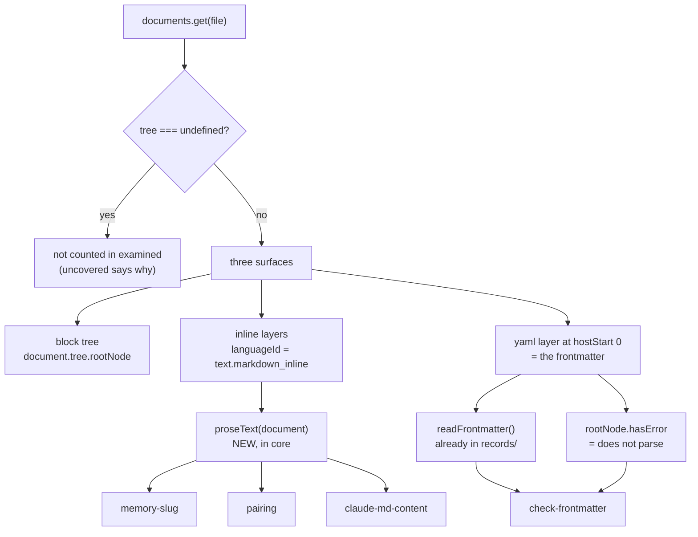

# Plan-013: The document model under the four gates that still read text

| Field | Value |
|---|---|
| Status | Shipped |
| Created | 2026-08-12 |
| Author | Danilo Borges |
| Depends on | Plan-010 (the document model under the gates), RFC-0001 |

---

## Summary

Plan-010 put a tree-sitter document model under `@entelekheia/vibe-ops-gates` and moved four gates onto
it. Six others stayed on `readFile` plus hand-written regular expressions, and four of those six are
solving — badly — exactly the problem the document model exists to solve: telling prose apart from code,
and reading YAML frontmatter without guessing where the block ends. This plan moves those four onto the
parser, extracts the one primitive three of them need into `core`, and fixes the `options` gap that
currently makes a shell fragment impossible to compare against its own port.

It is a correction pass, not new capability. Nothing here changes what the gates are for.

## Goals

1. `memory-slug`, `pairing`, `claude-md-content` and `check-frontmatter` read structure from the parsed
   document instead of from regular expressions over raw lines.
2. The "document text with code masked out" primitive exists once, in `core`, rather than three times.
3. `check-frontmatter` detects frontmatter that genuinely does not parse, not only the one malformed
   shape a regular expression can spot.
4. `fragment-parity` can compare a shell fragment against a gate that needs `options`, so
   `45-skill-frontmatter.sh` becomes comparable at all.
5. Every existing test still passes, or its change is a deliberate, recorded behaviour improvement.

## Scope

### In scope

The four gates named above, one new exported helper in `cli/packages/core/`, the `options` passthrough in
`cli/packages/gates/src/fragment-parity/index.ts`, and the parity entries those two ports now permit in
`cli/packages/ops-agents-md/src/index.ts`.

### Out of scope

- **Removing any shell fragment.** RFC-0001 requires parity evidence first; this plan produces the
  evidence, not the removal.
- **The other two raw-`fs` gates.** `budget` counts lines and `bridge` reads `git ls-files -s` for the
  symlink mode bit — neither has structure to extract, and putting them on the parser would be ceremony.
- **The remaining eleven shell fragments** under `cli/packages/module-check/sh/checks/`. They stay shell
  until an ops composes them.
- **Replacing `check-frontmatter`'s `schema: "rule" | "skill"` enum with a declarative schema format.**
  Discussed and deliberately deferred — see the Decision Log and Open questions. The enum stays exactly
  as it is.

## Design

A markdown document reaches a gate already parsed, and the parse exposes three surfaces that answer
different questions. Reading the wrong one is the defect this plan corrects in four places.



### The shared primitive: `proseText(document)`

Three of the four gates need the same thing — *the document's prose, with anything quoted as code removed*
— and each currently hand-rolls it. `memory-slug` toggles a fence flag line by line and strips code spans
with `` /`[^`]*`/g `` ([memory-slug/index.ts:18-20](../../../cli/packages/gates/src/memory-slug/index.ts#L18-L20));
`claude-md-content` strips HTML comments with `/<!--[\s\S]*?-->/g`
([claude-md-content/index.ts:17](../../../cli/packages/gates/src/claude-md-content/index.ts#L17)); `pairing` does
not strip anything and is wrong for it (below).

`proseText(document): string` returns a string **the same length as `document.text`**, in which only
inline content is visible and everything else — fenced blocks, frontmatter, HTML blocks, and the interior
of every `code_span` — is replaced by spaces. Built by starting from an all-spaces buffer, copying each
`text.markdown_inline` layer in at its `hostStart`, then blanking the `code_span` ranges within it.

Preserving length is the whole trick: a caller regexes the masked string and passes the match index
straight to the existing `lineAt(document.text, index)`, so line numbers stay correct with no offset
arithmetic at the call site. It lands in `cli/packages/core/src/position.ts` beside
`walkLayersWithHostPositions` and `lineAt`, and is documented in `cli/packages/core/README.md` next to the
block-vs-inline table already there.

Fenced code blocks need no special handling: markdown does not inject them as inline layers at all, so
they are excluded by construction rather than by a rule someone has to remember.

### `memory-slug` — the naive port is wrong, and the fixture proves it

Verified against the existing fixture on 2026-08-12: `[[project_something]]` does **not** appear as a
`text` node. The inline grammar parses it as `(shortcut_link (link_text))`, and the `shortcut_link` node's
own text is `[project_something]` — a single bracket pair — so the gate's `SLUG` pattern does not match
it. **Walking node types finds nothing.** Masking via `proseText` and regexing the result reports the real
slug at line 7, which is what [memory-slug.test.ts:39](../../../cli/packages/gates/test/memory-slug.test.ts#L39)
already asserts.

This is the reason the primitive is a masked *string* rather than a node walk.

One behaviour change to make deliberately: the gate currently does `examined += 1` before reading the file
([memory-slug/index.ts:29](../../../cli/packages/gates/src/memory-slug/index.ts#L29)), so a file with no grammar
would count as read. Under the document-model idiom an unparsed file is skipped and not counted, per
`core`'s README. Its composed population is all `.md`, so no real reading moves.

### `check-frontmatter` — the one real capability gain

Two changes, and the `schema` enum is untouched.

The manual block extraction (`lines[0] !== "---"`, then `indexOf("---", 1)` —
[check-frontmatter/index.ts:26-31](../../../cli/packages/gates/src/check-frontmatter/index.ts#L26-L31)) is replaced
by `readFrontmatter(document)` from `@entelekheia/vibe-ops-records`, which `cli/packages/gates` already
depends on. That helper reads the yaml layer at `hostStart === 0` and correctly handles folded multi-line
scalars and sequences, both of which the line reader gets wrong.

The `skill` schema's unquoted-`": "` heuristic gains a real detector beside it. Measured 2026-08-12
against the installed `@tree-sitter-grammars/tree-sitter-yaml@0.7.1`: malformed frontmatter sets
`rootNode.hasError`, and the `ERROR` node's span **ends at the fault**, with the successfully parsed keys
recoverable inside it.

| Fixture | `hasError` | ERROR span ends at | keys inside |
|---|---|---|---|
| `description: template and numbering: an ADR` | `true` | `description: template and numbering` | `["name","description"]` |
| tab-indented key | `true` | `\tdescription` | `["name"]` |
| unclosed quote | `true` | `description: "unclosed` | `["name"]` |
| the same, quoted correctly | `false` | — | — |

So the new finding reports a line via `lineAt(document.text, hostStart + errorNode.endIndex)` and, when
the ERROR node contains keys, names the last one. The existing heuristic stays: when it fires it explains
the *specific and by far most common* fault in actionable language, which "does not parse" does not. The
two are complementary, not redundant.

This changes one test. [check-frontmatter.test.ts:50-55](../../../cli/packages/gates/test/check-frontmatter.test.ts#L50-L55)
asserts exactly one finding and carries a comment conceding the gate "does not actually parse YAML, so it
does not know the unquoted colon would make a real parser drop the description too". After this track it
does know, so the malformed fixture yields two findings — the parse failure and the missing `description`
— which is what that evidence string already claimed was true. Update the test and delete the comment.

The gate also gains `examined`, which it does not currently return at all.

### `pairing` — a false negative with a `fix()` behind it

`content.includes("@AGENTS.md")` ([pairing/index.ts:53](../../../cli/packages/gates/src/pairing/index.ts#L53)) is
a bare substring test, so a `CLAUDE.md` that merely *mentions* the import inside a code span or a fenced
example reads as importing it. The gate then reports the file as correct and moves on. Nothing in this
repository trips it today — all four tracked `CLAUDE.md` files are trivial — but the gate ships to other
repositories through the plugin, and a repository documenting the convention is exactly where it breaks.
Running the test over `proseText` closes it.

**This gate must not use `documents.get()`.** The store caches unconditionally, including the
`cannot read file` document it synthesises for a missing path
([document.ts:82-93](../../../cli/packages/core/src/document.ts#L82-L93)), and `pairing.fix()` *creates* the
missing sibling. The ops re-runs the gate to confirm each repair, that re-run would hit the cached
"missing" entry, and every repair would be reported as unconfirmed. Instead `pairing` keeps its own
`readFile` of the sibling and parses the string with `documentFromText(siblingRel, content)` — exported
from `core` for precisely this case, and the same parse path the store uses, so an in-memory document and
a read one are never two slightly different things. No cache, so nothing to invalidate.

### `claude-md-content`

The weakest of the four and included for consistency rather than urgency: it is `warn`-only and not
fixable, so a false positive costs little. `residualContent()` becomes "is `proseText(document)`, minus
the `@AGENTS.md` import, empty?" — the HTML-comment regex goes away because an `html_block` is not an
inline layer and is already masked.

### `fragment-parity` — the `options` gap

`fragment-parity` runs the gate under test with `options: {}` hardcoded
([fragment-parity/index.ts:90](../../../cli/packages/gates/src/fragment-parity/index.ts#L90)). Comparing anything
against `check-frontmatter` therefore silently exercises its default `rule` schema, and
`45-skill-frontmatter.sh` cannot be compared against its own port at all. The gate gains an optional
`options` in its own options object, forwarded to the gate it loads. This is the smallest change that
lets the parity evidence RFC-0001 requires actually be produced for both frontmatter fragments.

With it, three parity entries become possible in `ops-agents-md`: `60-memory-slugs.sh` against
`memory-slug`, `40-frontmatter.sh` against `check-frontmatter` with the `rule` schema, and
`45-skill-frontmatter.sh` against it with the `skill` schema.

## Tracks

- [x] **Track 1 — `proseText` in `core`.** Add the helper to `cli/packages/core/src/position.ts`, export
      it from `cli/packages/core/src/index.ts`, and document it in `cli/packages/core/README.md` beside
      the block-vs-inline table. Ships with its own unit tests in `cli/packages/core/test/` covering a
      fenced block, an inline code span, frontmatter, an HTML block, and the length-preservation
      invariant that makes `lineAt` work at the call site. Acceptance: the three consuming gates in
      Tracks 2–4 need no masking code of their own.

- [x] **Track 2 — `memory-slug` onto the parser.** Replace the fence toggle and the code-span strip with
      `proseText`. Acceptance: `cli/packages/gates/test/memory-slug.test.ts` passes unchanged — the
      existing decoy fixture, which already asserts the real slug at line 7 and neither decoy, is the
      proof. Record the `examined` semantics change in the Decision Log.

- [x] **Track 3 — `pairing` onto the parser.** Test the `@AGENTS.md` import against `proseText` over a
      document built with `documentFromText`, never `documents.get()`. Acceptance: a new test asserting
      that a `CLAUDE.md` whose only mention of `@AGENTS.md` is inside a code span is reported as not
      importing it; and an existing-behaviour test that `fix()` followed by a re-run confirms the repair.

- [x] **Track 4 — `claude-md-content` onto the parser.** `residualContent()` reads `proseText`; the
      HTML-comment regex is deleted. Acceptance: existing tests pass, plus one asserting a `CLAUDE.md`
      that is the import plus a fenced example is still reported as carrying content.

- [x] **Track 5 — `check-frontmatter` onto the parser.** `readFrontmatter()` replaces the manual block
      extraction; `hasError` becomes a real finding beside the retained heuristic; the gate returns
      `examined`. The `schema` enum is not touched. Acceptance: the malformed-frontmatter test asserts
      two findings with the parse failure carrying a line number, and new tests cover the tab-indent and
      unclosed-quote fixtures the old heuristic could not see.

- [x] **Track 6 — parity for the two ported fragments.** Forward an optional `options` through
      `fragment-parity`, then add the three parity entries to `cli/packages/ops-agents-md/src/index.ts`.
      Acceptance: `vibe-ops agents-md` reports zero `port-regression` findings, which is the evidence
      RFC-0001 wants before anyone proposes deleting the shell fragments.

- [x] Run `/vibe-ops:close-plan` — retrospective against the goals, the demotion check, the tracking
      issue closed. The plan file itself is kept.

## Success criteria

From the repository root:

```bash
npm run build && npm run typecheck && npm test
```

All three green, with the four gates' test files showing the new cases above.

```bash
node cli/packages/cli/dist/bin.js agents-md --verbose
node cli/packages/cli/dist/bin.js check
```

`agents-md` reports no `port-regression` finding from any of the three parity entries, and `check` — the
seventeen shell fragments — reports exactly what it reported before this plan. The two must agree: that
agreement is the point of Track 6.

A grep confirming the duplication is gone:

```bash
git grep -n 'code_span\|```' -- 'cli/packages/gates/src/*/index.ts'
```

should return nothing outside comments — no gate carries its own notion of what code is.

---

## Decision Log

- Decision: `proseText` lives in `cli/packages/core/`, exported, rather than as a private helper inside
  `cli/packages/gates/`.
  Rationale: three gates in this plan need it and it is genuinely general — a masked prose view is a
  property of the document model, not of any one detector. `core` is the package that already owns
  `lineAt` and `walkLayersWithHostPositions`, which it must sit beside to be found. The cost is a wider
  API on the foundation package; the alternative is a second copy the day `records/` needs it.
  Date / Author: 2026-08-12, Danilo Borges

- Decision: `check-frontmatter` keeps `hasError` **and** the existing unquoted-`": "` heuristic, rather
  than replacing one with the other.
  Rationale: `hasError` catches every fault class (tabs, unclosed quotes, bad indentation) but reports
  only "does not parse" plus a position. The heuristic covers one shape and names the offending key in
  language that says what will happen — all fields silently dropped. Coverage and actionability are
  different properties and neither subsumes the other.
  Date / Author: 2026-08-12, Danilo Borges

- Decision: **`check-frontmatter`'s `schema: "rule" | "skill"` enum stays.** A declarative schema format —
  shipped schema files describing which keys a type requires, in an interchange format such as JSON
  Schema, so the same declaration could drive Claude skills, Gemini function declarations, and eita
  profiles — was designed and then deliberately dropped from this plan.
  Rationale: it is a new feature, and this plan is a correction pass. Two findings support deferring it
  rather than doing it cheaply now: the two shell fragments it would generalise
  (`40-frontmatter.sh`, `45-skill-frontmatter.sh`) check almost identical things — block exists,
  `description` non-empty — so the enum encodes nearly no schema today and there is no pressure; and
  `cli/packages/core/` currently has zero dependencies beyond the tree-sitter grammars, so a validator
  there is a real cost to weigh on its own terms. Recorded in Open questions so the idea is not lost.
  Date / Author: 2026-08-12, Danilo Borges

- Decision: `pairing` parses via `documentFromText`, not `documents.get()`.
  Rationale: the store caches the synthesised "cannot read file" document, and this gate's `fix()` creates
  the file that document stood for. The ops re-runs the gate to confirm repairs, so a cached miss would
  make every successful repair report as unconfirmed. Adding invalidation to the store is the larger
  change and nothing else needs it.
  Date / Author: 2026-08-12, Danilo Borges

- Decision: no shell fragment is deleted in this plan.
  Rationale: RFC-0001 wants parity evidence before removal, and Track 6 produces the evidence. Acting on
  it is a separate decision made with the evidence in hand.
  Date / Author: 2026-08-12, Danilo Borges

- Observation: Track 5's `hasError` check, being schema-agnostic, made Track 6's `options` forwarding
  non-load-bearing for the one fault class both frontmatter fragments actually test. Every unquoted
  `": "` fixture tried (three shapes, all top-level) set `hasError` regardless of `schema`, so a file
  tripping the `skill`-only heuristic was already present in `check-frontmatter`'s findings under the
  `rule` default — the two tracks' fixes overlap where I expected them to be independent.
  Evidence: `cli/packages/gates/test/fragment-parity.test.ts`, "skill-frontmatter compares cleanly…" —
  the real end-to-end comparison passes with `options` supplied, as expected, but does not by itself
  prove the forward reaches the gate (an unscoped run gives the same file-level result, because
  `hasError` alone already flags the file). The companion test isolates the mechanism against
  `record-header` instead, which genuinely throws without `options.schema` — a case where the two
  tracks' concerns are independent, and the only one that unambiguously exercises the new parameter.
  Consequence: the `options` forward stays in Track 6 regardless — it is still a real, general gap
  (`fragment-parity` could not otherwise validate the `skill` schema at all, or any future gate with
  required options), and this repository's own two frontmatter fragments happening not to need it for
  their file-level comparison today does not make the parameter unnecessary.
  Date / Author: 2026-08-12, Danilo Borges

## Outcomes & Retrospective

All six tracks shipped as designed, plus the doc updates the plan implied but did not list as their own
track: `cli/packages/core/README.md` gained the `proseText` section, `cli/AGENTS.md` and
`cli/packages/gates/README.md` had their gate/document-model counts corrected (`bridge` and
`fragment-parity` were the only two of eleven gates still not reading the document model; the layout
table's "ten of them" and "four have shell precedent" had already drifted before this plan, from
`template-version` landing after that line was last updated — fixed in passing).

Every goal was met. `memory-slug`, `pairing`, `claude-md-content` and `check-frontmatter` all read
structure from the parsed document; `proseText` exists once, in `core`, and none of the three consumers
carries its own fence-toggle or code-span strip (confirmed by the Success criteria grep); `check-frontmatter`
now catches any YAML parse failure, not only the one shape a regular expression could name; the three
`fragment-parity` entries in `ops-agents-md` produce zero `port-regression` against this repository's own
real checkout, verified end to end rather than against a synthetic fixture. Every existing test still
passes; the two that changed (`memory-slug`'s naive-port proof and `check-frontmatter`'s malformed-fixture
count) both changed for reasons written into the Design section before the code did, not discovered after.

The one real surprise is recorded in the Decision Log above: Track 5's `hasError` and Track 6's `options`
forwarding turned out to overlap for the specific fault both frontmatter fragments test, which meant the
first version of the Track 6 test proved nothing. Isolating the mechanism against `record-header` instead
— a gate whose options genuinely gate its behavior rather than merely adding a second, redundant finding —
is what a real proof needed, and that gate existed already; nothing had to be built to get it. Worth
noting for whoever writes the next gate: a schema-agnostic detector added beside a schema-specific one can
quietly make the schema-specific one's own tests describe less than they claim to.

Nothing was cut from scope. The declarative-schema idea in Open questions remains open, deliberately, and
is now more concretely groundable than when it was proposed: `check-frontmatter`'s two schemas (`rule`,
`skill`) differ by exactly one boolean-shaped concern (`strictParse`) plus a shared `require: ["description"]`
list, which is a small, legible seed for that plan whenever someone starts it.

---

## Open questions

- **A declarative, portable frontmatter schema.** Dropped from this plan as new feature (Decision Log
  above), but worth its own plan later. The shape discussed: `options` accepts either an inline
  key/requirement object or a reference to a shipped schema file, so an ad-hoc check and a named type are
  both expressible without re-specifying keys each time; the file is in a format that already exists for
  this kind of interchange, with JSON Schema the leading candidate because this repository already emits
  it for MCP tool inputs (`cli/packages/cli/src/mcp.ts:75`) and because Gemini's function declarations
  take an OpenAPI subset of it. The open part is whether the gate consumes a documented subset by hand —
  keeping `core` dependency-free — or takes a validator dependency, and which package would own the
  shipped schemas.

## Related

- Plan-010, `project/plans/shipped/010-the-document-model-under-the-gates.md` — put the document model
  under the first four gates; this plan finishes the job.
- RFC-0001, `project/rfc/0001-gates-and-ops-as-the-cli-unit-of-composition.md` — the gate/ops split, and
  the parity requirement Track 6 satisfies.
- `cli/packages/core/README.md` — the document model's own reference, updated by Track 1.
