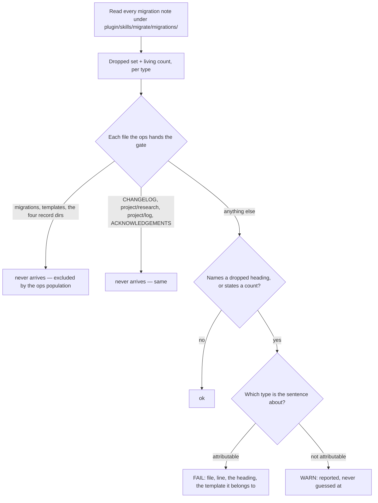

<!--
 Copyright (c) 2026 Danilo Borges (https://github.com/daniloborges)

 Licensed under the Apache License, Version 2.0 (the "License");
 you may not use this file except in compliance with the License.
 You may obtain a copy of the License at

 https://www.apache.org/licenses/LICENSE-2.0
-->

# Plan-014: The prose that describes a template is checked against the template

| Field | Value |
|---|---|
| Status | Shipped |
| Created | 2026-08-13 |
| Author | Danilo Borges |
| Related | [`project/log/dropping-a-section-from-a-template.md`](../../log/dropping-a-section-from-a-template.md), [Plan-012](./012-versions-travel-with-the-record.md) |

---

## Summary

When a template loses a section, every sentence written elsewhere that describes that template's shape
becomes false in the same commit, and it stays readable as authority for as long as nobody looks. This
already happened here: the plan template lost `Progress` and `Surprises & Discoveries`, four documents
describing the old shape were found two days later, and the finding was written down as a trap. The sweep
that followed corrected one of them. Nine files still carry the claim today, two of them shipped into
every repository this plugin scaffolds, and one the reference file the record skill instructs an author to
read before writing a plan. On 2026-08-13 two agents auditing this repository read
that prose and reported the dropped sections as the current model.

This plan derives the dropped-heading set mechanically and fails on it. It does not finish the sweep by
hand: a template's shape change has two populations, and the one nothing has ever handled — the documents
that *describe* the shape — becomes a declared part of the migration that causes it, so the next dropped
section is swept by the act that drops it rather than by whoever remembers.

## Goals

1. No document in this repository states that a record carries a section its template does not have.
2. Nothing this repository ships into another repository carries that statement either.
3. A section dropped from any template is caught on the commit that drops it, not by a reader later.
4. The check separates a **record that has** an old heading — legitimate, it was written against an older
   template — from a **document that says** records have it, which is the defect.
5. The check is proven to fail on a fixture built to break it, before it is trusted anywhere.
6. **A skill describes the present.** Only a migration note discusses what a template no longer has. A
   skill or reference that explains an absence by naming the absent section is corrected, not exempted —
   which is why nothing here ships an inline waiver.
7. **A dropped section is swept by the same act that drops it.** The documents that describe a shape are
   a declared population of the migration, not a follow-up somebody remembers.

## Scope

### In scope

The five templates under `plugin/templates/`, as the only authority on what a record's shape is today.
The documents that describe them: `plugin/references/`, `GOVERNANCE.md`, `.agents/rules/`, and the
scaffolding copies under `plugin/skills/setup/templates/`. One new gate under `cli/packages/gates/src/`,
its fixture, and its composition into the governance ops. The inventory named in Track 3.

Also, because the correction is made by the mechanism rather than by hand: **`/migrate` and
`/new-migration`**, a new shared reference governing both, and
`plugin/skills/migrate/migrations/plan-0.1-to-0.2.md`, amended to declare the describing-document
consequence of the jump it already records. **`vibeops.config.ts`**, which carries the path policy. And a
**self-test for gates**, which does not exist today.

### Out of scope

**Migrating the records that were written against an older template.** A plan carrying
`## Surprises & Discoveries` because it was authored when the template had that section is correct as it
stands; changing it is a separate job with its own per-entry decisions, and it is not this plan.

**The opposite direction** — a document that fails to mention a section a template *gained*. Absence
cannot be located the way a forbidden string can, and a check that guesses at it would fire on every
document that legitimately says nothing about templates. Recorded under `Open questions`.

**Every other kind of stale prose.** Documents in this repository also name scripts and command flags that
no longer exist. That is the same class of failure with a different detector and belongs to its own plan.

**`project/research/` and `project/log/` are never edited by this plan.** Both are write-once by this
repository's own governance rule, and both legitimately narrate the old shape — the trap log that
motivated this plan is itself a hit. They go on the skip list, not the fix list.

**Every other repository.** Repositories that received the false paragraph from this repository's
scaffolding are not this plan's business; correcting the source is.

## Design

The hard part is not finding the string. It is knowing which strings are forbidden and where.

**What a template no longer has is already declared.** Every migration note under
`plugin/skills/migrate/migrations/` opens with a table naming each section and its fate across one version
jump — the note for the plan template's first jump marks `Progress` and `Surprises & Discoveries` as
`dropped` in exactly that form. Reading the notes gives the dropped set as an assertion someone wrote on
purpose. Deriving it from git history instead was considered and rejected: history answers *what changed*
and not *what the change meant*, so a renamed section reads as a drop plus an addition, and the check
would then demand that documents stop naming a section that still exists.

The notes are less uniform than that sentence suggests, and the parser has to know it: they carry **two
table shapes** — a blank first header cell in the five frontmatter-move notes, a literal `Section` cell in
the two that changed content — and the fates are bolded inline phrases rather than a closed enum. The
parser keys on the `Section` header cell and on `**dropped**` in the last column, and `/new-migration`
gains a sentence making that shape a contract instead of a coincidence.

**The same note already carries the count.** `plan-0.1-to-0.2.md` ends its table with
`| Living sections | four | two — Decision Log, Outcomes & Retrospective |`. That matters more than it
looks: the trap this plan closes records that *"a description saying four survives every search for
anything that changed"*, so the count is the copy nobody can grep for — and it turns out to have a
mechanical source of truth in the file the gate is already reading.

**The dropped set is per type, and so is every verdict.** `Surprises & Discoveries` left `plan` at 0.2 and
is still a live heading in `task@3`. A flat sweep for the string accuses correct sentences about dossiers,
which is why the gate attributes a type before it judges.

**Where the forbidden string is a defect is a question about the file, not about the sentence.** A record
written against an older template legitimately carries the old heading as its own structure. A document
that describes the shape of records must not name it at all. No content heuristic separates those two
reliably, and one that tried would be the kind of guard that passes because it is not looking. The
separation is therefore a path policy, declared and reviewable:



**The path policy is configuration, not gate code.** The skip branches above are `paths` plus
`settings.governance.ignore` in `vibeops.config.ts`, never a filter inside the gate — trap 4 of
`docs/how-to/write-a-gate.md` and [ADR-0011](../../adr/0011-population-belongs-to-configuration-not-a-gate.md)
forbid the alternative, and a gate that filters its own files is the fourth divergent copy of a rule that
already exists in three.

**One blanket exclusion has to be narrowed first.** `governance.ignore["*"]` is `["**/templates/**"]`,
which hides `plugin/skills/setup/templates/**` from every governance gate — the exact files Goal 2 names.
`ignore` is additive and offers no negation, so the blanket entry is replaced by per-label entries on the
gates that need it. ADR-0011 is not contradicted: it decides that population is configuration rather than
gate code, which this obeys. What it does not decide is that population must be *identical* across the
gates one ops composes — a uniformity that held only while every gate had the same relationship to a
shipped template, and `template-heading-drift` is the first that does not.

The gate is `template-heading-drift`, written in `cli/packages/gates/src/` against the document model the
other gates already consume, so a heading named in a link target is not mistaken for prose. It reads
inline prose **and the interior of code spans** — the defective sentences write the headings as
`` `Progress` `` and `` `Surprises & Discoveries` `` — while excluding fenced blocks, frontmatter and HTML
blocks. The existing `proseText()` helper does the opposite on code spans, deliberately and for
`memory-slug`'s sake, so this needs a sibling and not an edit. It emits three rules:

| Rule | Fires when |
|---|---|
| `template-heading-drift-named` | A describing document names a heading dropped for the type the sentence is about. |
| `template-heading-drift-count` | Prose states a living-section count that disagrees with the note's `Living sections` row. |
| `template-heading-drift-unattributed` | *(warn)* A dropped heading is named and no type can be attributed. |

**Type attribution is structural, not semantic**, which is what keeps it clear of the content heuristic
rejected above: the type named on the same line or in the enclosing table-row label, then the nearest
enclosing heading naming a record type. Nothing attributable is a `warn` a human closes, never a verdict
the gate invented. This is what separates a paragraph under `### Plan` from one under `### Task`.

Two properties are required of the failure message, because both were missing from the sweep that
preceded this plan. It names **which template** the heading belongs to, so the reader knows whether the
sentence is wrong or merely about a different type. And it names **every** occurrence rather than the
first, because the failure mode being prevented is a partial sweep.

### The second population of a migration

Correcting the prose by hand would fix this jump and teach the repository nothing; the next dropped
section reopens the same hole. So the mechanism learns instead.

A template's shape change has always had two populations. The records written against it are handled by
`/migrate`, whose Step 1 detection is `vibe-ops records census` — an enumeration of *records*. A document
that describes a record's shape is not a record, so it has never been in any population that skill could
see. **The gate is that population**, and it is also the convergence test the skill's target-state kind
already claims.

The rule governs two skills, so it lives in `plugin/references/template-shape-change.md` and is pointed
at, never copied into either `SKILL.md`. `/new-migration` requires a note that drops, renames or adds a
section to declare *what a document describing this shape must now say*, extending its existing hard rule
— a dropped section with no stated destination is an unfinished note — from content to prose.
`/migrate` gains a pass after Step 3, carrying the safety property in the form the new population needs: a
sentence naming a dropped heading is rewritten to the current shape or left and reported, never deleted
and never rewritten into a claim the note does not support.

Neither half works alone. The skill knows there is a second population and how to converge on it; the note
knows what the corrected sentences should say, because only whoever moved the template knows what the new
shape means. `plan-0.1-to-0.2.md` is amended with that section for the jump it already records — a new
`plan-3-to-4.md` would demand a version bump for a template whose shape is not changing, and would leave
a later `0.1 → 0.2` migration still missing the sweep.

### Proving it fails

Gates have no self-test. `vibe-ops check --self-test` covers the shell fragments only, and the CI job that
runs them checks out bare — no Node, no `npm ci` — because that script is also what a consumer runs as a
`pre-commit`. So the capability lands on the ops runner, where each composed entry may declare a broken
fixture, and the two suites are chained in the JS front door:

```text
vibe-ops check --self-test
   ├── check-agents-md.sh --self-test     the shell fragments, still standalone, still Node-free
   └── ops --self-test                    every composed gate, against its declared broken fixture
```

One command means "prove every detector still fires", and nothing couples a dependency-free gate to a
build artifact.

## Tracks

**The gate is built first.** It is the finder every later track depends on, and its own acceptance
evidence — the untouched tree reporting the defects — stops existing the moment anything is corrected.
The original ordering had the inventory first with an acceptance criterion that depended on the gate,
which is a cycle; this makes the dependency explicit.

- [x] **Track 1 — The gate, built and composed.** `template-heading-drift` under
      `cli/packages/gates/src/`, declaring its version like every other gate, emitting the three rules
      above. The code-span-preserving text helper joins `proseText` in core; the dropped-set and
      living-count readers join `livingSectionsFromTemplate` in the records package rather than becoming
      a second heading walk inside a gate. Composed into the governance ops, with the path policy and the
      blanket-exclusion narrowing in `vibeops.config.ts`. Unit-tested against `mkdtemp` fixtures the way
      every other gate is, including a decoy heading inside a fence, a task paragraph that must not fire,
      and the dogfood case against this repository's own records.
      Acceptance: the unit tests pass; `vibe-ops governance --list` names it; run against the tree as it
      stands it reports **eight** of the nine files and nothing else; and every other gate's findings are
      unchanged by the narrowing. Eight, not nine: one of the nine explains the absence without naming
      the section, so no string detector can reach it and it is corrected under Goal 6 by judgement. A
      gate that reported nine here would be matching something it should not.
- [x] **Track 2 — Teach the migration about its second population.** The new shared reference, the step
      it adds to `/new-migration`, the pass and safety property it adds to `/migrate`, both skills'
      review clauses, and `plan-0.1-to-0.2.md` amended with the describing-document consequence of its
      own jump. Nothing is corrected here — this track only makes the correction runnable.
      Acceptance: the reference is pointed at by both skills and copied into neither, and the amended
      note says what a document describing a plan's shape must now say, specifically enough to rewrite a
      sentence from.
- [x] **Track 3 — Run it, and let the gate say when it converged.** `/migrate audit`, then `/migrate`.
      Nine files: the human-facing governance document, the always-on rule that
      governs work inside the records directory, the record-type reference the `/new` skill tells an
      author to read (which contradicts itself within forty lines — its checklist names two living
      sections while its migration guidance and its maintenance contract both name the dropped ones), the
      exposure contract, the knowledge-lifecycle reference, the two closure skills whose sentences
      explain an absence by naming it, and the two scaffolding copies under
      `plugin/skills/setup/templates/`, which means every repository brought to the baseline since the
      drop received the false text as its own governance. The scaffolded twins are byte-identical to
      their originals but for the licence header, so both copies move together or `dogfooding-drift`
      fires.
      Acceptance: `vibe-ops governance` clean, and a second `/migrate` run reports nothing to do.
- [x] **Track 4 — Prove it fails.** A guard nobody has watched fail is not yet evidence of anything, and
      this repository has shipped that mistake before. The ops runner gains `--self-test`, this gate
      declares its broken fixture, and `vibe-ops check --self-test` chains both suites, ahead of the unit
      tests in continuous integration.
      Acceptance: commenting out the gate's detection makes the chained self-test fail, observed rather
      than asserted — and the shell suite still passes standalone with no install step.
- [x] **Track 5 — Document.** The gate catalogue row and the counts that name how many gates there are
      and how many read the document model. The one fact a reader cannot derive — that dropping a section
      from a template now has a mechanical consequence, and that a skill describes the present — stated
      where template versions are already discussed. Three edits under `docs/`: the explanation of the
      document model, whose account of the blanket exclusion would otherwise read as forbidding Track 1's
      narrowing; and two in the gate how-to, where testing becomes three obligations rather than two and
      the silent-trap table gains a fifth — blanking the code spans your signal is written in.
      Acceptance: a scratch edit reintroducing a dropped heading into a describing document fails the
      commit gate.
- [x] Run `/vibe-ops:close-plan` — retrospective against the goals, the demotion check, and the check for
      whether this gate makes any existing written instruction redundant. `project/log/` records that no
      mechanical guard is known for this, which this plan falsifies. The plan file itself is kept.

**Delegation.** Discovery and fixed-string sweeps may go to a subagent; deciding whether a sentence is a
description of a template or a record's own structure may not.

## Success criteria

Run from the repository root:

- `vibe-ops governance --list` names `template-heading-drift`.
- `vibe-ops governance` exits zero with no finding from that gate.
- `vibe-ops check --self-test` passes, showing both suites and the new fixture case running; commenting
  out the gate's detection makes it fail. The shell suite still passes when run on its own, with no
  install step.
- The typecheck and the unit tests pass.
- Reintroducing `Surprises & Discoveries` as a claim about plans, or the phrase "four living sections",
  into any file outside the skipped paths makes `vibe-ops governance` fail, naming the file, the line,
  the heading and the template. The same reintroduction inside a paragraph about task dossiers does
  **not** fail.
- A second `/migrate` run over this repository reports nothing to do.
- Grepping the scaffolding copies under `plugin/skills/setup/templates/` for the dropped section names
  returns only occurrences that are about task dossiers and therefore correct — the task template still
  has that section — so a repository brought to the baseline receives the current shape of each type.

---

## Decision Log

- Decision: the dropped-heading set is read from the migration notes, not from git history.
  Rationale: a migration note is an assertion someone wrote deliberately, one row per section, already
  required to exist for every version jump. History records that lines moved and cannot distinguish a
  rename from a drop followed by an addition, which would make the check demand that documents stop
  naming sections that still exist.
  Date / Author: 2026-08-13 / Danilo Borges

- Decision: a record keeping an old heading is out of scope, and the separation between a record and a
  description of records is a declared path policy rather than a content heuristic.
  Rationale: a plan written against an older template legitimately carries that template's structure, and
  no sentence-level rule separates that from a claim about how plans are shaped. A path list is wrong in
  a way a reader can see and correct; a heuristic is wrong in a way that looks like a clean tree.
  Date / Author: 2026-08-13 / Danilo Borges

- Decision: which type a sentence is about is attributed structurally, and an occurrence with no
  attributable type is reported as a warning rather than judged.
  Rationale: this refines the decision above rather than contradicting it. A path policy alone cannot
  separate a heading that left one template while remaining live in another — the case that makes up most
  of the defect here. Reading the document's own tree for the type (the same line, the enclosing table-row
  label, the nearest enclosing heading) is structure, not meaning, so it stays clear of the heuristic that
  was rejected. And a warning naming what could not be attributed is a state a reader can see and close,
  where a guess is not.
  Date / Author: 2026-08-13 / Danilo Borges

- Decision: discovery and mechanical edits under a contract that fits in a paragraph may be handed to a
  subagent; any judgement that has to agree with this plan's intent may not.
  Rationale: the audit that produced this plan used five subagents, and two of them read the stale prose
  this plan exists to remove and reported the wrong model as current. Sweeping for a fixed string and
  reporting file and line is a closed contract and delegates cleanly. Deciding whether a given sentence
  is a description of a template or a record's own structure is exactly the judgement that drifts.
  Date / Author: 2026-08-13 / Danilo Borges

- Decision: the describing documents are corrected by extending `/migrate`, not by hand.
  Rationale: hand-correction fixes this jump and leaves the next one exposed. A template's shape change
  has two populations, and only one of them has ever had machinery. Giving the second a declared home in
  the note, a requirement in `/new-migration` and a pass in `/migrate` makes the sweep part of the act
  that causes it, with the gate as the proof it converged.
  Date / Author: 2026-08-13 / Danilo Borges

- Decision: the rule about that second population lives in `plugin/references/`, not in either SKILL.md.
  Rationale: it governs two skills, and a rule governing more than one skill is pointed at from both and
  copied into neither. Two copies means the one that goes stale is the one that ships.
  Date / Author: 2026-08-13 / Danilo Borges

- Decision: `plan-0.1-to-0.2.md` is amended rather than superseded by a new note.
  Rationale: a new note would demand a template version bump for a template whose shape is not changing,
  and would leave anyone migrating `0.1 → 0.2` later still missing the sweep. The note was incomplete
  about a consequence of the jump it already records, which is a different thing from being wrong.
  Date / Author: 2026-08-13 / Danilo Borges

- Decision: no inline waiver mechanism ships; a correct-but-flagged sentence is rewritten instead.
  Rationale: a skill describes the present, and only a migration note discusses what stopped existing. A
  sentence that explains an absence by naming the absent section is doing the migration note's job in the
  wrong file. An escape hatch is what gets used the next time somebody is in a hurry.
  Date / Author: 2026-08-13 / Danilo Borges

- Decision: `ACKNOWLEDGEMENTS.md` is excluded by configuration rather than corrected.
  Rationale: it keeps history deliberately, has its own template, and its mention attributes an external
  contract rather than this repository's template. Correcting it would falsify an attribution.
  Date / Author: 2026-08-13 / Danilo Borges

- Decision: the self-test capability lands on the ops runner and is chained from the JS front door,
  rather than growing the shell script.
  Rationale: that script is what a consumer runs as a `pre-commit`, and the job that runs it in continuous
  integration checks out with no install step. Chaining above it yields one command meaning "prove every
  detector still fires" without coupling a dependency-free gate to a build artifact.
  Date / Author: 2026-08-13 / Danilo Borges

- Decision: the blanket `**/templates/**` exclusion is narrowed to per-label entries, and ADR-0011 needs
  no superseding record.
  Rationale: the blanket entry hides the scaffolding copies from every governance gate, and those are the
  files Goal 2 names; `ignore` is additive with no negation, so there is no way to see them from inside
  the composition without changing it. ADR-0011 decides that population is configuration rather than gate
  code, which the narrowing obeys — it does not decide that population must be identical across the gates
  one ops composes, a uniformity that held only while every gate had the same relationship to a shipped
  template.
  Date / Author: 2026-08-13 / Danilo Borges

- Decision: this plan's own Design was corrected before any of it was built.
  Rationale: four of its statements did not hold against the repository — a self-test that covers only the
  shell fragments, a path policy placed inside the gate that the ops doctrine forbids, a walk over files
  an existing exclusion already hid, and a success criterion asserting a grep returns nothing when the
  task template legitimately still carries the section. A permanent design record left asserting
  machinery that does not exist reproduces exactly the failure this plan was written to stop.
  Date / Author: 2026-08-13 / Danilo Borges

## Outcomes & Retrospective

Every track landed and every success criterion was run. Nothing was cut.

**Against the goals.** 1 and 2 hold: `vibe-ops governance` reports no `template-heading-drift` finding,
and the only remaining mentions under `plugin/skills/setup/templates/` are about task dossiers, whose
template still has that section. 3 holds by composition — the gate runs with the others, so a section
dropped from a template now fails the commit that drops it. 4 holds through the ops population plus
per-type attribution rather than through the flowchart's file-level skip alone; the type turned out to
matter more than the path. 5 was observed, not asserted: with the detection commented out,
`vibe-ops governance --self-test` exits 1 naming the rule that stopped firing, and exits 0 restored. 6 and
7 were added mid-plan and both shipped — no waiver mechanism exists, and `/new-migration` now refuses a
note that changes structure without saying what a description of that shape says.

**Three predictions in this plan were wrong, all in the same direction: the inventory.**

- *"Six files."* The gate reports **nine**. The three the original count missed are the two closure skills
  and the knowledge-lifecycle reference, all of which explained an absence by naming the absent section —
  invisible to a sweep looking for claims, because they read as denials.
- *"Eight of the nine, not nine — one explains the absence without naming the section."* Also wrong, and
  wrong about which file. `close-task/SKILL.md` was correctly **not** reported: its sentence names the
  section in a clause about the dossier, which is true. The ninth file was `docs/how-to/write-a-hook.md`,
  which no sweep in this plan or the one before it had found, and which states a living-section count
  inside a trap table whose own trap #5 is *"restating a format in the hook's own prose"*.
- The count rule was scoped as an addition to the named rule. It is the one that found that ninth file.
  The trap's claim that a count *"survives every search for anything that changed"* was measured true a
  second time, by the tooling built to disprove it.

**What the build cost that the design did not anticipate.**

- **`proseText` did not exclude fenced blocks.** Its own documentation said it did, "for free", because
  markdown never injects a fence as an inline layer. That is false for a fence whose info string names an
  injectable language: ```` ```markdown ```` is reparsed as markdown, which then injects its own inline
  layers. Fixed in `position.ts` with an explicit pass, which also closes the same hole in `memory-slug`.
- **`expandPluginToken` output is not interchangeable between `readdirSync` and `documents.get`.** The
  store joins what it is handed onto `repoRoot`; the filesystem needs an absolute path. Handing either the
  other's form fails silently — the document comes back unparsed, the dropped set is empty, and the gate
  reports every stale description clean. Only the deliberately flat fixture showed it, exactly as
  `cli/AGENTS.md` warns.
- **Attribution by plurality is a confident wrong answer.** Counting record-type mentions in a paragraph
  attributed `GOVERNANCE.md`'s plan item to tasks, because "task dossier" matches the alternation twice.
  Replaced by exactly-one-or-nothing at every level; nothing is decided by which type a passage mentions
  more.

**Routing, at closure.** This plan spawned no task dossier, so the promotion test was applied here. One
candidate survived: the path-form duality above, which fails silently and is met by whoever writes the
next gate — routed as a sixth entry in the silent-traps table of `docs/how-to/write-a-gate.md`, the file
that already owns that failure class. Three were dropped deliberately rather than filed one tier down:
the fenced-block hole and the plurality attribution both now carry their measurement in a comment at the
line where someone meets them, and a third copy is the one that goes stale.

**The trap this plan closes needed no retirement.** `project/log/dropping-a-section-from-a-template.md`
says *"No mechanical guard is known"*, which is now false — but it opens with the template's own
`Not current truth` banner naming the date it records, so the sentence is correctly dated rather than
wrong. `project/log/` retires a group only once every path under it stops existing, and these paths all
still exist. Nothing was edited, which is what write-once means.

**Demotion check: nothing to delete.** No `AGENTS.md` line and no always-on rule was made redundant by
this gate. The rule text that changed grew rather than shrank, and deliberately: that dropping a section
now has a mechanical consequence is the one fact a reader cannot derive from the code.

**What is open.** The plan's two original open questions — a section a template *gained*, and a rename —
are untouched and now have a home in `plugin/references/template-shape-change.md`. Self-test coverage is
1 of 14 gates in `governance` and 0 of 10 in `agents-md`; the run says so on every line rather than
implying completeness, and closing that gap is a fixture per entry, not a design question.

---

## Open questions

- The reverse direction: a document that never mentions a section a template **gained** is equally wrong
  and cannot be found by looking for a string. Whether that is worth a second detector, or whether adding
  a section is rare enough and visible enough to leave to review, is unresolved.
- A **renamed** section is a third case: the old name is forbidden and the new one is required in the same
  places. The migration notes carry enough to detect it; whether the gate should report it as its own
  verdict rather than as a drop is not decided.

Both are the same two-population problem, so the shared reference this plan adds is where an answer to
either would land.

## Related

- [`project/log/dropping-a-section-from-a-template.md`](../../log/dropping-a-section-from-a-template.md) —
  the trap this plan closes, recorded when the first four copies were found.
- [Plan-012](./012-versions-travel-with-the-record.md) — moved the version stamp into the
  frontmatter and found the first stale copies while doing it.
