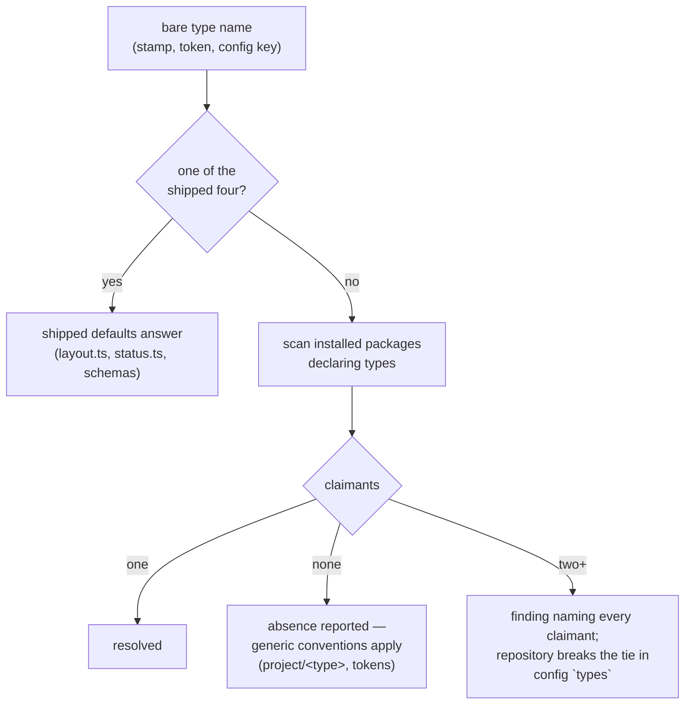

<!--
 Copyright (c) 2026 Danilo Borges (https://github.com/daniloborges)

 Licensed under the Apache License, Version 2.0 (the "License");
 you may not use this file except in compliance with the License.
 You may obtain a copy of the License at

 https://www.apache.org/licenses/LICENSE-2.0
-->

# Plan-029: A record type becomes a resolved name

| Field | Value |
|---|---|
| Status | Shipped |
| Created | 2026-08-20 |
| Author | Danilo Borges |
| Depends on | [RFC-0003](../../rfc/0003-a-governance-type-as-a-pluggable-unit.md) |
| Related | [Plan-030](./030-the-type-unit-and-the-compositions-derived-from-it.md) · [Plan-031](../031-ownership-fragments-and-the-shaped-class.md) |

---

## Summary

`RecordType` in `cli/packages/core/src/config.ts` is a closed union of four literals — `"adr" | "rfc" |
"plan" | "task"` — and `RecordsConfig` keys both of its maps by it. The consequence, measured while
writing RFC-0003: a repository cannot even *mention* a type this tooling does not ship. `records: { dirs:
{ policy: "project/policy" } }` is a compile error, so no package can contribute a type and no repository
can bind one. This plan opens the union, adds the `types` binding table, and gives the CLI the scan that
resolves a bare type name to the one installed package that declares it — refusing, as a finding, when two
do. It is the first of three plans implementing RFC-0003 and delivers nothing user-visible by itself; what
it delivers is that every later step becomes possible.

## Goals

- A type name outside the shipped four is representable end to end: in `RecordsConfig`, in the
  `<records:<type>>` / `<template:<type>>` tokens (already generic since commits `a4d01e7` and `50ad03e`),
  and in every signature that today demands the union.
- `types` exists in `VibeOpsConfig`: a map from local type name to the qualified identifier of the package
  that governs it, declared only when the scan alone is ambiguous — same doctrine as `records.dirs`.
- The scan enumerates installed packages that declare types, and resolves a bare name by the rule of
  RFC-0003 ("Resolution: scan, refuse, declare"): one claimant resolves silently, zero reports absence,
  two or more is a finding naming every claimant — never a guess, never an error that aborts the run.
- The four shipped types keep working with zero configuration in every existing repository.

## Scope

### In scope

The type union and its consumers in `cli/packages/core`, `cli/packages/records`, and the signatures that
flow from them; the `types` config key; the package scan and its finding.

### Out of scope

- What a package's type declaration *contains* — the per-type unit (template, authoring rules, migration
  notes) is [Plan-030](./030-the-type-unit-and-the-compositions-derived-from-it.md). This plan only needs
  the *marker* that lets the scan enumerate claimants.
- Ownership classes and the `shaped` class — [Plan-031](../031-ownership-fragments-and-the-shaped-class.md).
- Any verb that writes configuration — deferred by RFC-0003's own scope decision.

## Design

The load-bearing fact for a reader with no other context: **the union is not one line**. Twenty-four
source files across eight CLI packages and three plugin directories mention the type `plan` (measured
2026-08-14, recorded in RFC-0003's Motivation). Most are *data keyed by type* — `CANDIDATE_DIRS`,
`DEFAULT_PAD`, `DEPTH` in `cli/packages/records/src/layout.ts`, the status chains in `status.ts`, the
header schemas in `cli/packages/gates/src/record-header/` — and stay exactly where they are: they become
the *shipped defaults* for the four names this package itself declares, rather than the definition of what
a type can be. The type opens; the knowledge about the four does not move.

Two constraints carried over from work already shipped, so they are not rediscovered: a **declared**
binding is used even when it does not resolve — the entry examines zero files against the name the
repository chose, visible and attributable, never a silent fallback (the same decision the
`<records:<type>>` token already implements); and ambiguity is a **finding**, not an exception — the same
shape as the emit-failure decision in commit `66343a1`, where an infrastructure problem must not
impersonate a gate verdict.

The scan's marker is the smallest thing that can work: a field in a package's `package.json` (working name
`vibeOps.types`, final name decided in the track) listing the type names it declares. Enumeration walks
`node_modules` the same way the existing three-form resolver (`cli/packages/cli/src/resolve.ts`) already
loads modules by name — no registry file, deliberately, for the reason `cli/AGENTS.md` records: a registry
is a second place to forget.

## Tracks

- [x] **Track 1 — Open the union.** `RecordType` becomes `string` (or a branded name type), the shipped
  four become data, and every consumer compiles and passes with the shipped types unaffected. Exists at
  the end: a repository config naming `policy` type-checks and flows to the tokens. Acceptance:
  `npm run typecheck && npm test` green from a clean build (`rm -rf cli/packages/*/dist` first — an
  incremental build cannot see cross-package staleness, per `cli/AGENTS.md`), plus a fixture repo with a
  custom type name in `records.dirs` resolving through `<records:policy>`.
  Task: tasks/record-type-union-opens.md (closed dossier — `git show 02d513fbf49392b5973f3993403ae7185a1022dc:project/tasks/record-type-union-opens.md`)
- [x] **Track 2 — The scan and the binding table.** The package marker, the enumeration, the
  one/none/many rule, and `types` in `VibeOpsConfig`. Exists at the end: two fixture packages both
  declaring `policy` produce the finding naming both; adding the `types` line resolves it. Acceptance: the
  fixture scenario as a test, and the finding visible in `vibe-ops check`-style output.
  Task: tasks/type-scan-and-binding-table.md (closed dossier — `git show 02d513fbf49392b5973f3993403ae7185a1022dc:project/tasks/type-scan-and-binding-table.md`)
- [x] Run `/vibe-ops:close-plan` — retrospective against the goals, the demotion check, the tracking
      issue closed. The plan file itself is kept.

## Success criteria

- A fixture repository declaring a type the tooling does not ship passes `typecheck`, resolves its
  directory and template through the tokens, and appears in `records census` without special-casing.
- Two fixture packages claiming one type name produce a finding that names both; the `types` binding
  resolves it; the binding used-though-unresolvable case reports zero examined, attributably.
- Every repository currently using the shipped four types needs no config change: `npm test` in this
  repository and a `vibe-ops governance .` run against an adopted repository behave identically to before.

---

## Decision Log

- Decision: Delegation split for this plan — discovery sweeps (finding every consumer of `RecordType`,
  every signature the union flows through) and mechanical rename/retype edits under a closed contract are
  delegable; the shape of the scan marker, the resolution rule, and anything that must agree with
  RFC-0003's intent are not.
  Rationale: the mechanical half is large (24 files) and contract-checkable by `typecheck`; the judgment
  half is small and drift-prone.
  Date / Author: 2026-08-20 / Danilo Borges

- Decision: `RecordType` becomes plain `string` under the same alias name, not a branded type.
  Rationale: the plan left this open at the keyboard, and asking it precisely answered it. A brand
  protects against passing an arbitrary string where a domain value belongs; here every type name arrives
  from OUTSIDE the type system — a config key, a directory name, a frontmatter stamp, a package's
  declaration — so a brand would place a cast at each of those boundaries and protect against nothing.
  Keeping the alias name means the twelve files naming `RecordType` still say what they mean.
  Date / Author: 2026-08-20 / Danilo Borges

- Decision: the scan's marker is `"vibeOps": { "types": "types" }` — a manifest field pointing at a
  DIRECTORY, not a list of type names.
  Rationale: the manifest field has precedent inside this same package, where `grammars.ts` reads a
  grammar's own `"tree-sitter"` array out of its `package.json`. The directory rather than a name list is
  the load-bearing half: a list beside the directory is a second copy of the same fact, which is exactly
  the drift `type-index-drift` was written to catch. One source, and `typesDeclaredBy` reads it.
  Date / Author: 2026-08-20 / Danilo Borges

- Decision: `config.types` merges per key, like `records.dirs`, rather than whole like `harness.applied`.
  Rationale: decided with the cascade's own tests open, as the dossier asked. Two bindings naming two
  different types are independent facts, so a home file binding one must not be discarded by a repository
  binding another — whole-key would make the nearer file's SILENCE about a type into an answer.
  `harness.applied` wins whole for the opposite reason: it is a fact about one working tree.
  Date / Author: 2026-08-20 / Danilo Borges

- Decision: where a resolution finding lands is left to each caller, not fixed here.
  Rationale: the dossier asked whether it should go to the channel `check` uses. `resolveTypeName`
  returns the reason as data (`unresolved`) and throws nothing, so an ops can report it as a finding and
  a verb as a line. Choosing one now would impose that caller's shape on every other, and the ambiguity
  case has no consumer yet to argue from.
  Date / Author: 2026-08-20 / Danilo Borges

## Outcomes & Retrospective

Both tracks shipped. Against the plan's own Goals and Success criteria, one at a time.

### The goals

**"A type name outside the shipped four is representable end to end."** Met, but *end to end* was doing
more work than it looked. Config, both tokens and the layout resolver were reachable after Track 1, and
the plan's Design section had predicted exactly that — the four-keyed maps become shipped defaults with a
generic fallback. What the Design did not name, and what closure caught, is that two surfaces were not
data at all but **gates on input**: `records census` iterated five hardcoded names, and `gateType` in
`module-records` measured `--type` against a closed allowlist. A contributed type type-checked, expanded
through its tokens, resolved its directory — and was then invisible to the census and refused by the
verb. Both are fixed and pinned by tests; see the criterion below.

**"`types` exists in `VibeOpsConfig`."** Met, and the cascade question the dossier left open was decided
against the cascade's own tests rather than by taste: per key, like `records.dirs`, because two bindings
naming two different types are independent facts.

**"The scan enumerates installed packages … one/none/many."** Met, with eight fixtures covering the
general shape rather than only this repository's: `@scope/governance-policies` claiming two types beside
`dot-agent-freeze` claiming one, the two-claimant refusal naming both, and the declared-but-unresolvable
binding that must not fall back.

**"The four shipped types keep working with zero configuration."** Met: 500 tests green from a clean
build, the governance ops unchanged.

### The success criteria

| Criterion | Verdict |
|---|---|
| A fixture repository declaring an unshipped type type-checks, resolves through the tokens, **and appears in `records census`** | **Not met when first checked** — the first two clauses passed and the third failed silently, because `census` iterated five hardcoded names and `gateType` measured `--type` against a closed allowlist. Both fixed during closure and pinned by tests; met now. |
| Two claimants produce a finding naming both; the binding resolves it; an unresolvable binding does not fall back | Met as unit behaviour. **The "reports zero examined" half is a prediction, not a result** — no caller consumes the resolution yet, so nothing counts anything. It is honest to say the rule is implemented and the reporting is unexercised. |
| Every repository using the shipped four needs no config change | Met for this repository (500/500, governance identical). **Not run against an adopted repository** — none was to hand, and saying so is better than implying a run that did not happen. |

### One promotion is blocked, and this is where it is written down

**"An estimate of *how big is this change* made by grepping a value overstates a change to its type."**
It survives the promotion test — it would burn a fresh agent more than once, it is not discoverable by
reading code, and nothing enforces it — and it holds beyond this repository, which puts its surface at
the workspace-level learnings tier. **This repository has no `project/learnings/`**, so the promotion
cannot land from here.

Recorded rather than dropped: the fact is stated in this retrospective, which is permanent, and
`/route-learnings` at the workspace root is what unblocks it. Everything else the two dossiers held was
either discharged into the code comment where someone meets the question, promoted to
[ADR-0018](../../adr/0018-a-package-declares-its-types-by-pointing-at-a-directory.md), or dropped out
loud as a one-time outcome.

### What the closure itself taught

Step 0 of `/close-plan` earned its place. Two of three success criteria were partly unmet at the moment
the plan looked finished — every track checked, every test green, the work genuinely done. A criterion
naming a *surface* (`records census`) rather than a *capability* is what caught it: the capability was
there and the surface did not use it.

The plan's estimate of its own blast radius was three times the reality, and the plan was not wrong — it
measured a different thing. "24 files mention the type `plan`" counts mentions of the string; the type
itself was named in twelve source files and broke seven call sites. Worth carrying: an estimate of "how
big is this change" made by grepping a *value* overstates a change to its *type*.

Opening the union removed more code than it added. `RecordType | "log"` existed in three places and a
`type === "log" ? 1 : DEPTH[type]` in a fourth, all because `log` had a template and a directory but was
not a union member.

**A contributed type and a typo are the same string**, and closure is where that became concrete. The
first fix to the refused verb was "anything outside the shipped list passes" — which promptly let
`--type wat` through, caught by a test that had been asserting the old closed vocabulary. The right gate
is not *is this name unknown* but *did anything DECLARE it*: the repository through `records.dirs`, or an
installed package through the scan Track 2 had just built. Both are declarations somebody made on
purpose; a misspelling is neither. The scan is consulted last and only for a name nothing else explains,
because it walks `node_modules` and a verb that paid for that every time would be paying for the rare
case. This is the first consumer of Track 2's scan, and it arrived by accident an hour after the scan
did.

---

## Related

- [RFC-0003](../../rfc/0003-a-governance-type-as-a-pluggable-unit.md) — the model this implements (its
  Implementation Notes 1–3).
- Commits `a4d01e7` and `50ad03e` — the `<template:<type>>` / `<records:<type>>` tokens whose generic
  fallback (`project/<type>`) this plan's open union finally lets a repository reach on purpose.

- Task dossiers closed and removed per the task lifecycle (`Planned → In Progress → Done → file removed, git history is the archive`):
  - `git show 02d513fbf49392b5973f3993403ae7185a1022dc:project/tasks/record-type-union-opens.md`
  - `git show 02d513fbf49392b5973f3993403ae7185a1022dc:project/tasks/type-scan-and-binding-table.md`
