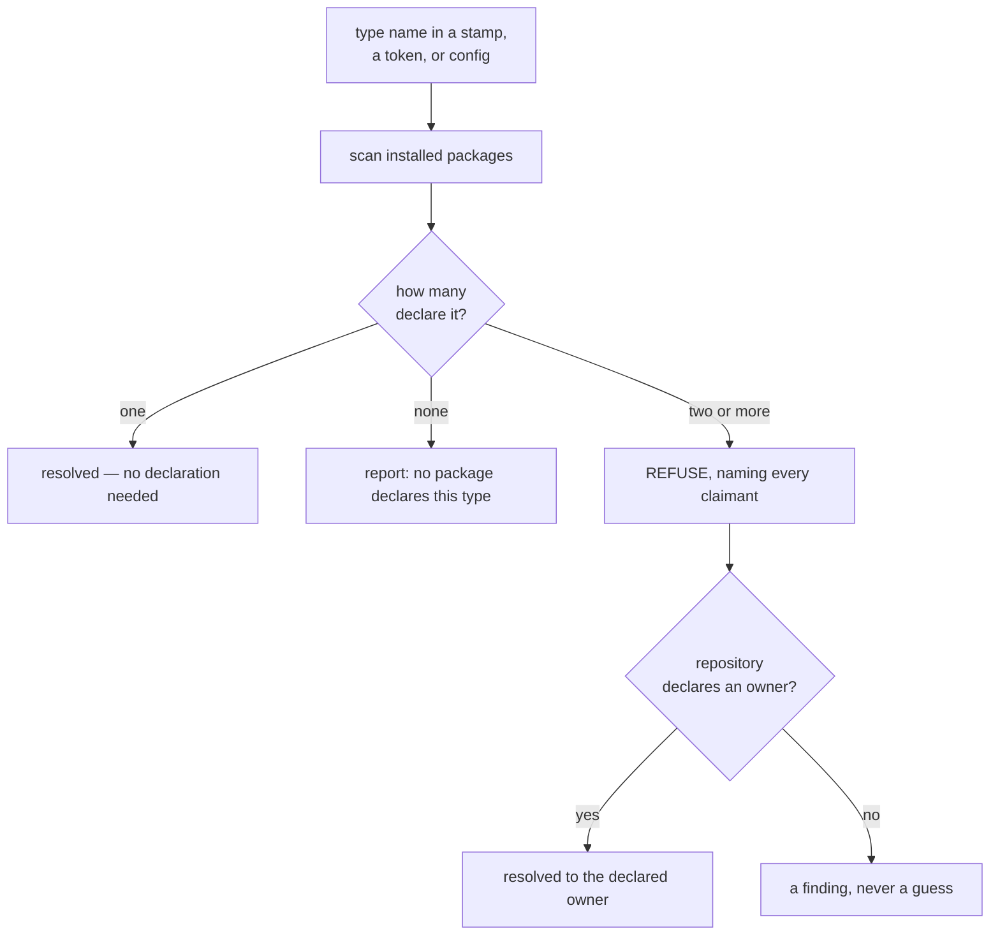

<!--
 Copyright (c) 2026 Danilo Borges (https://github.com/daniloborges)

 Licensed under the Apache License, Version 2.0 (the "License");
 you may not use this file except in compliance with the License.
 You may obtain a copy of the License at

 https://www.apache.org/licenses/LICENSE-2.0
-->

# RFC-0003: A governance type as a pluggable unit

| Field | Value |
|---|---|
| Status | Draft |
| Created | 2026-08-19 |
| Author | Danilo Borges |
| Related | [RFC-0001](0001-gates-and-ops-as-the-cli-unit-of-composition.md) · [RFC-0002](0002-bootstrapping-a-repository-and-what-auto-configuration-may-decide.md) · [`harness/policy/ownership.md`](../../cli/packages/harness/policy/ownership.md) |

---

> **Amended by [RFC-0004](implemented/0004-the-managed-layer-the-configuration-a-tool-writes.md) (2026-09-03):** the
> repository's narrowing may also be written by a tool, into the committed `vibeops.config.json` — the
> "gets no file of its own" sentence below is superseded by that layer.

## Summary

A governance record type — a plan, an ADR, or one a repository invents — is today spread across eight
packages and three plugin directories, and none of its parts can be named by the repository that uses it.
This RFC proposes making a type a **unit that a package ships and a repository binds**: the type's
template, authoring rules, migration notes and header schema travel as data in an npm package, the
repository declares which package is responsible for which artifact, and the tooling refuses to guess when
two packages claim the same one. It also proposes a **fourth ownership class** for the file whose *shape*
belongs to the tooling while its *content* belongs to the repository — the class every migration already
operates on and that the ownership declaration does not name.

## Motivation

**A type cannot be added without changing this repository.** Ten things must exist for a record type to be
known end to end: a template, authoring rules, one migration note per version jump, an ownership class, a
records directory, a status chain, a header-table schema, two ops entries, membership in the type union,
and — for three of the four shipped types — a noun module with its own verbs. Twenty-four source files
mention the type `plan`. Every one of them is in this repository, and a target repository can reach none
of them.

**The configuration file cannot mention an unknown type.** `RecordType` in `packages/core/src/config.ts`
is a closed union of four literals, and `RecordsConfig` keys both of its maps by it. A repository that
keeps an artifact this tooling does not ship has nowhere to say so — not to declare where it lives, not to
name its template, not to bind it to whatever produced it. The two path tokens the ops already expand,
`<records:<type>>` and `<template:<type>>`, accept a bare name and resolve it by convention; the half that
examines is ready and the half that declares is closed.

**The ownership declaration contradicts a first-party skill.** `plugin/ownership.json` classes
`project/{adr,rfc,plans,tasks,log,research}/**` as `repo` — *"never written and never read for a
decision"*. The migrate skill writes exactly those files: it reads each artifact's `vibe-ops-template`
stamp and applies the recorded migration for every version jump. Both statements are correct about their
own actor, because the declaration governs promulgation and nothing else. The vocabulary simply has no
word for what migration does, which is why the contradiction never surfaced.

**Two of the three lifecycle moments do not consult the declaration at all.** Adoption writes the record
templates, the runner, the commit hook and the instruction files — every one of them classed `norm` or
`seed` — without reading the file that classes them. One gate declares itself fixable and creates a
missing sibling instruction file, also classed `norm`, with no notion of a class. Promulgation is the only
actor that asks.

**Nothing surfaces two packages claiming one artifact.** If two installed packages both manage a `policy`,
the failure is not a name clash a reader would notice: it is two governance regimes over one kind of
artifact, each correct on its own terms, differing per contributor.

## Specification

### A type is a package's declaration, bound by a repository

The CLI is what resolves and binds; the Claude Code plugin surface is composed from what the CLI knows and
inherits its identifiers rather than defining any. The resolution protocol is therefore npm, and a type's
identity is the package that ships it:

```text
ref:pkg:npm/@scope/governance-policies@0.1#policy@2
    └──────── the package that ships it ───┘└ type ┘
```

**The two version marks are independent and MUST NOT collapse.** `@0.1` versions the package; `@2`
versions the type's own shape and moves only when a migration note is written for the jump. Collapsing
them makes every patch release of a package mark every record it governs as behind — the failure the
`template-version-behind` finding already defaults to `warn` to survive.

### A type ships as data, not as code

A package contributing a type declares the facets that are data. Code facets stay out of scope here:

| Facet | Form | Who supplies it |
|---|---|---|
| template | a markdown file carrying its own version stamp | the package |
| authoring rules | a markdown reference, loaded when a record is created | the package |
| migration notes | one file per version jump, named for the jump | the package |
| ownership classes | the paths this type claims, and in which class | the package |
| records directory, status chain, header schema | declared values | the package |
| where records actually live here | `records.dirs` / `records.templates` | the repository |

Nothing in this list requires a new detector. Twelve of the fifteen gates in `packages/gates/` hold no
knowledge of the repository they run in, and `record-header` already serves four schemas through
`options.schema` from one detector. **A type contributes composition, not detection** — a versioned record
with a header table needs zero new gates.

### Resolution: scan, refuse, declare



Ambiguity MUST be reported as a finding rather than raised as an error: an unresolvable type name stops
one entry, never a whole run, the same way an unwritable artifact destination produces a finding rather
than aborting the composition.

A repository resolves the ambiguity in its own configuration, keyed by the local name:

```ts
types: { policy: "pkg:npm/@scope/governance-policies#policy" },
```

**The local name is deliberately short, and that is the point.** A fully qualified name in every stamp
would let two packages each manage "their own" `policy` in one repository without either being wrong,
which is the governance failure this mechanism exists to prevent. One short name admits one owner, and
changing owner is a line someone edits in review. The local name is also the directory name, so an
undeclared collision shows up as a path collision rather than only as a configuration one.

A declared binding MUST be used even when it does not resolve. The entry then examines zero files against
the name the repository chose, which is visible and attributable, where a silent fallback to another
candidate is neither.

### Where a short name is legal

A short name resolves only where the binding that gives it meaning is present.

| Written into | Form | Why |
|---|---|---|
| a record's own frontmatter stamp | short (`policy@2`) | it travels with the repository's own configuration |
| an index, an exported edge, a cross-repository reference | fully qualified | the resolution context does not travel with it |

### The fourth ownership class

Three classes exist: the tooling owns the file and overwrites it (`norm`), the tooling writes it once and
the repository owns it afterwards (`seed`), the tooling never writes it (`repo`). They classify by *who
writes*. A fourth behaviour is already in use and classifies by *which part*:

| Class | The tooling owns | The repository owns |
|---|---|---|
| `norm` | the whole file | nothing |
| `seed` | the file until it exists | everything afterwards |
| **`shaped`** | **the structure** | **the content, permanently** |
| `repo` | nothing | the whole file |

A `shaped` file is created from a template, edited freely by the repository, and **evolved in place** by
migration when its type's version moves: sections are added, renamed or dropped according to the recorded
note, and everything written under them survives. An artifact carrying a locally added section is still
migrated.

This class is not new behaviour. `template-version` and `template-heading-drift` exist precisely to detect
divergence between the shape a type declares and the shape a record carries, which is a comparison that
only makes sense when the shape and the content have different owners. Naming the class makes the
declaration match what the tooling already does.

### Ownership arrives in fragments, and the CLI composes them

A package that contributes a type also declares the paths that type claims and the class of each. The
single `plugin/ownership.json` this repository ships stops being *the* declaration and becomes **the first
fragment** — the one for the types this package itself provides.

The CLI composes every installed fragment into one effective declaration. Composition is not precedence:
fragments from different packages are **peers**, so a path claimed twice is a conflict rather than an
override, and it resolves the same way an ambiguous type name does.

| A path is | Effective class | Reported as |
|---|---|---|
| claimed by exactly one fragment | that fragment's class | resolved, with its claimant |
| claimed by two or more | none until the repository declares one | a finding naming every claimant |
| claimed by none | none — **absence is not permission** | a refusal to act on that path |
| claimed, then narrowed by the repository | the narrowed class | resolved, with both origins |

The composed view MUST always be able to name where each class came from. A consolidated declaration that
cannot say which package claimed a path is unauditable exactly when it matters — when two packages
disagree, or when a package is removed and the paths it claimed must be found again.

### Narrowing belongs to the repository

A repository MUST be able to reclassify a path it holds toward less tooling authority — `norm` → `shaped`
→ `seed` → `repo` — declared with a reason, never a boolean. Widening in the other direction MUST NOT be
available to the repository at all: it is the package's declaration, and accepting a widened boundary is
already a consent the repository gives explicitly.

Narrowing is safe by construction, because it can only reduce what the tooling may do — the same argument
the promulgation boundary already makes when it accepts a narrowed declaration without asking. The
repository's narrowings are the last layer of the composition above, which is why a widening attempt can be
refused by naming the fragment it would have overridden.

A narrowing is written **by hand, into the configuration the repository already commits**. That is enough
for every mechanism above, and it adds no file: an override is a fact about the repository rather than
about one clone, and the prevailing convention gives a tool one configuration slot.

### Reading and writing the declaration is derived work

This RFC proposes the model — fragments, composition, the fourth class, and the repository's narrowing. It
does **not** propose the surface that reads or writes it, and that boundary is deliberate.

A verb that returns the effective class, names each claimant, and writes the repository's layer belongs to
its own RFC, because it cannot be specified without answering a question far larger than itself: whether
the committed configuration stays executable or becomes a serialised form a tool can edit safely. The
committed half of the cascade accepts `.ts`, `.mjs` and `.js`, which is enough for a declaration a person
writes. Settling the format here would decide a repository-wide question on the strength of one verb that
does not exist yet.

When that verb is written, `git config` is the shape it should take: a read returns the effective value, a
read with origins returns where each came from, and a write names which layer it touches.

## Rationale

**Why the repository binds rather than the package winning.** Both packages are correct about themselves;
only the repository knows which one governs it. Making the tooling pick — by install order, by version, by
specificity — produces a decision nobody recorded and that changes when an unrelated package is installed.

**Why a fourth class rather than treating migration as promulgation.** They differ in what they preserve.
Promulgation replaces a file with the package's copy; migration rewrites structure and keeps content. A
single class covering both would license promulgation to overwrite records, which is the one thing the
current declaration is most careful to forbid.

**Why data before code.** A type that also brings its own detector or verb is executable code arriving
from outside, and the three-way resolution that would load it has no external consumer today. The data
half covers every artifact that is a versioned record with a header table, which is the case that exists.
Deferring the code half costs nothing that is currently blocked.

**Why not one qualified identifier everywhere.** Measured heading and identifier lengths put a fully
qualified reference well past what a header table can carry, and the frontmatter stamp is read far more
often than it is resolved across repositories. The split above pays the cost only where the context is
genuinely absent.

## Implementation Notes

1. **Open the type union.** `RecordType` becomes a resolved name rather than a closed union of four
   literals, and `RecordsConfig` keys its maps by that name. Nothing else works until this lands, and it
   delivers nothing on its own.
2. **The type declaration and its scan.** What a package publishes to declare a type, and how installed
   packages are enumerated. Ambiguity reported as a finding.
3. **The binding table.** `types` in the repository's configuration, declared only where the scan is
   ambiguous, in the same spirit as `records.dirs`.
4. **The fourth class.** `shaped` added to the ownership vocabulary, the record directories reclassified
   from `repo` to `shaped`, and migration made to consult the declaration as promulgation does.
5. **Fragments and composition.** `plugin/ownership.json` becomes this package's fragment rather than the
   whole declaration; the composition reads every installed fragment, keeps each path's origin, and reports
   a doubly-claimed path as a finding. Nothing about the file's own format needs to change for this step —
   what changes is that it stops being the only one.
6. **Narrowing.** A repository-side declaration that may only reduce a class, carrying a reason, refused
   when it would widen. Hand-written; no verb writes it here.

**Out of scope, and named so it is not mistaken for missing:** the `ownership` verb surface and the
configuration format it would need. When that work is taken up it is its own noun rather than a verb group
under the module that promulgates — four actors read the declaration, and promulgation is only one of
them, so naming it after that one would misdescribe it.

## Open Questions

- What a claim may say beyond a path and a class, and how two **overlapping but unequal** claims resolve —
  one naming a directory, another a subtree inside it. The axes visible so far are whether a claim is a
  takeover, whether it permits one, whether it is specific or a folder whose contents the package
  generates. Identical claims are a conflict by the rule above, which covers the case that exists; the
  shape of the rest should come from the first real overlap, because a rule invented before one is a rule
  the first one changes. This repository carries two opposite house rules for overlap — a finding's level
  is most-specific-wins, an ignore list is additive — so there is no default to fall into by accident.
- Numbering when two types come from different packages. Each type owns its own sequence today; whether
  two packages' types may share a directory, and what arbitrates the next number if they do, is unsettled.
- What happens to records of a type whose package is uninstalled. The artifacts remain and nothing
  resolves their stamp; whether that is `uncovered`, a finding, or a refusal to run is undecided.
- Whether a type may ever ship its own gate or verb, and what trust boundary that requires. Deferred here,
  not rejected.
- Who governs type names across packages that this repository does not publish. The binding table settles
  it per repository; it settles nothing globally.
- How a type changes owner. Reassigning `policy` from one package to another leaves records stamped
  against the previous owner's versions, and no migration note spans two packages.
- Whether adoption should compose the installed types' declarations rather than write a fixed skeleton,
  which is the same generalisation applied to the one lifecycle moment that has no per-type mechanism yet.

## Decisions Closed

- The CLI binds identifiers and the plugin surface is composed from what it resolves. Rationale: the CLI
  is what manages types; a plugin identifier in the scheme would name a distribution rather than the thing
  that resolves it.
- A type's version and its package's version are separate axes. Rationale: collapsing them makes every
  patch release mark every governed record as behind.
- The local type name is short, and one repository admits one owner per name. Rationale: a qualified name
  would let two packages govern one kind of artifact without either being detectably wrong.
- A type ships as data first; detectors and verbs are deferred. Rationale: twelve of fifteen gates are
  already generic and one detector already serves four schemas, so the data half unblocks the case that
  exists without admitting external code.
- `shaped` is a fourth ownership class rather than a variant of an existing one. Rationale: migration
  preserves content while replacing structure, and no existing class expresses an owner per part of a
  file.
- Ownership arrives as one fragment per package and the CLI composes them. Rationale: a type that ships
  its own paths must ship the classes of those paths with it, or the one file declaring every path becomes
  the thing every new type has to edit — which is the coupling this whole RFC removes.
- Fragments are peers, so a doubly-claimed path is a conflict rather than a precedence. Rationale: install
  order is not an authority, and letting it decide produces a boundary that changes when an unrelated
  package is installed.
- The composed declaration keeps each path's origin. Rationale: a consolidated view that cannot name the
  claimant is unauditable exactly when two packages disagree or one is removed.
- The repository's override lives in the configuration the repository already commits, and gets no file of
  its own. Rationale: an override is a fact about the repository rather than about one clone, and the
  prevailing convention gives a tool one configuration slot.
- The verb surface that reads and writes the declaration is derived work with its own RFC, and the
  configuration format goes with it. Rationale: the model works with a declaration written by hand, so a
  repository-wide format question would be settled on the strength of one verb that does not exist yet.
  This is a scope decision, not an unresolved one.
- Narrowing a class is the repository's and widening is not. Rationale: narrowing can only reduce what the
  tooling may do, which is the same asymmetry the promulgation boundary already applies.

## Related

- [RFC-0001](0001-gates-and-ops-as-the-cli-unit-of-composition.md) — the gate/ops split this extends: a
  type contributes composition, and the detectors it composes are the generic ones that already exist.
- [RFC-0002](0002-bootstrapping-a-repository-and-what-auto-configuration-may-decide.md) — the channel
  question. This RFC settles one part of it: the CLI is what binds, and the plugin surface derives.
- [`harness/policy/ownership.md`](../../cli/packages/harness/policy/ownership.md) — the three classes and the test
  for placing a new path, which the fourth class extends.
- [`harness/policy/pair.md`](../../cli/packages/harness/policy/pair.md) — why a reading over an
  empty population is not a reading, which is the same argument behind refusing an ambiguous type name
  rather than resolving it.
