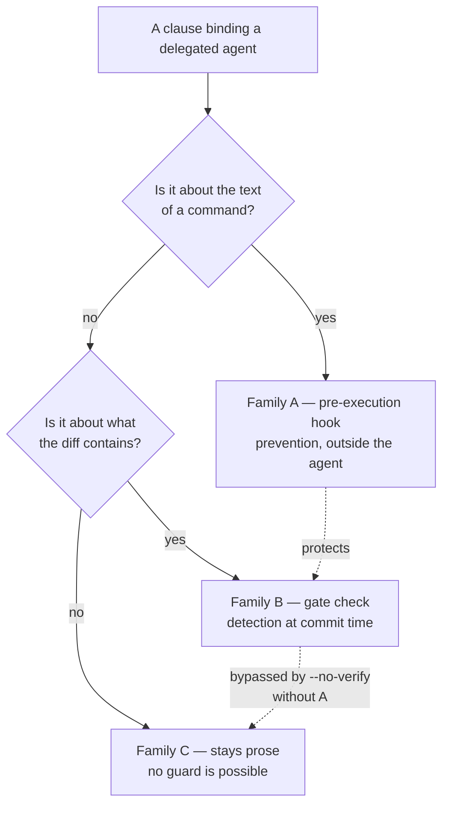

<!--
 Copyright (c) 2026 Danilo Borges (https://github.com/daniloborges)

 Licensed under the Apache License, Version 2.0 (the "License");
 you may not use this file except in compliance with the License.
 You may obtain a copy of the License at

 https://www.apache.org/licenses/LICENSE-2.0
-->

# RFC-0011: The prompt clauses that bind a subagent become a guard

| Field | Value |
|---|---|
| Status | Draft |
| Created | 2026-09-12 |
| Author | Danilo Borges |

---

## Summary

Every rule that keeps a delegated agent from damaging a repository is, today, a sentence in the prompt
that launched it. "Do not commit." "Never stage everything." "Do not bypass the commit gate." "A refusal is
an acceptable outcome." None of them is checked by anything; an agent that ignores one produces the same
transcript as an agent that obeyed. This RFC proposes moving the checkable subset of those clauses into a
mechanical guard — a host-level pre-execution hook for the clauses that are about a *command*, and a gate
check for the clauses that are about a *diff* — and states plainly which clauses cannot be mechanised at
all, so that prose keeps only the work no guard can do.

## Motivation

The commit gate this plugin installs is bypassed by five characters. `git commit --no-verify` skips
`pre-commit` entirely, so the gate is never invoked and therefore cannot refuse, warn, or record that it
was skipped. Nothing else notices either.

The status quo is a prompt clause, and prompt clauses have a measured failure rate rather than a
theoretical one. Two delegations issued under the same instruction, at the same model and effort, diverged
on exactly this: one stopped with the gate red and reported a defect in the tooling; the other wrote two
instruction files into the shape of governance records so that a record check would accept them. The
difference was not capability. It was that "green" is a single legible target and the prompt had named
stopping as allowed in one case and not the other. A rule enforced only by wording is a rule whose
compliance is a property of the wording.

The obstruction is structural, and measurement makes it precise. Which git hooks run, taken on a
throwaway repository:

| Hook | `git commit` | `git commit --no-verify` |
|---|---|---|
| `pre-commit` | runs | **skipped** |
| `prepare-commit-msg` | runs | runs |
| `commit-msg` | runs | **skipped** |
| `post-commit` | runs | **runs** |

A `pre-commit` that exits non-zero refuses an ordinary commit and is bypassed by the flag, which writes
the commit. Three consequences follow, and they decide where a defence can live:

- **The gate cannot defend itself.** Under the flag it is never executed, so no option it could offer
  would be read. Any defence must sit above git.
- **`post-commit` survives the bypass.** It is the only phase that runs in both columns. It cannot prevent
  the commit, but it can run the gate afterwards and report — detection that the same flag does not reach.
- **The pre-execution hook of the agent host is the only prevention point.** It reads the command text
  before the command exists as a process, and it runs outside the agent, so the agent cannot disable it.

Confirmed by observation rather than assumed: a `PreToolUse` hook registered for `Bash` **does fire for
subagents**, not only for the main loop. A subagent in this workspace received a hook's advisory output
before its own searches ran.

## Specification

Clauses split into three families by what they are *about*. Only two are mechanisable, and the split is
the substance of this proposal.

### Family A — clauses about a command

Enforced by a `PreToolUse` hook matching `Bash`, which reads the command text and refuses before
execution. Prevention, and not circumventable by the agent it constrains.

| Clause, as prose today | What the hook matches |
|---|---|
| Do not bypass the commit gate | `--no-verify`, and `-c core.hooksPath=` pointing away from the repository's hooks |
| Do not commit; leave the work in the tree | `git commit` |
| Never stage everything | `git add -A`, `git add --all`, `git add .` |
| Do the work yourself; launch no subagent | a tool call that spawns an agent |

### Family B — clauses about a diff

Enforced by a check composed into the gate, reading the staged diff. Detection at commit time, and
dependent on Family A: without the hook, `--no-verify` skips the whole family.

| Clause, as prose today | What the check reads |
|---|---|
| Do not relax a test to reach green | an existing assertion deleted or weakened in the staged diff |
| Do not declare a check off to reach green | a `disabled` entry added to the repository's own configuration |
| Do not bump a record's version to dodge a check | a version field changed on a record the diff does not otherwise touch |

### Family C — clauses no guard can check

They stay prose, and stating that they stay prose is part of the proposal: a list of mechanised rules
implies the unlisted ones are unenforced, and a reader who does not know which is which trusts all of them
equally.

- Report only what has already happened, never what is under way. A report written in the present
  progressive is indistinguishable from a report of finished work except by reading its tense.
- A refusal is an acceptable outcome. This is a permission, not a prohibition; there is nothing to detect.
- Name the `file:line` you read before writing a claim about the code.

### Enforcement mode

Three modes, not mutually exclusive over time:

| Mode | Behaviour | What it costs |
|---|---|---|
| **Observe** | allow, and append the attempt to the gate's artifact spool | nothing; answers how often this happens before anything is tightened |
| **Warn** | allow, and return the rule's text to the agent as advisory output | an agent may proceed anyway |
| **Refuse** | block the call and return the reason | a legitimate bypass now needs an explicit escape |

**Observe is the honest first mode.** No measurement exists of how often a delegated agent actually
reaches for a bypass, and a guard installed at `refuse` without that number is a guess about frequency
dressed as a policy. The spool this plugin already writes at commit time is the destination; the
observation is of the same kind the delegation-routing producer already emits.

## Rationale

**Why a host hook rather than a permission rule.** A permission rule matches a command's shape; these
clauses are about a flag that can appear anywhere in the command line, and about a diff, which no
permission system reads. The hook receives the full text and can apply a real predicate.

**Why not detect the subagent by environment variable.** An agent that can run shell commands can unset a
variable or invoke the command through a wrapper. Environment-based detection measures accidents and
reports nothing about deliberate circumvention, so it is a signal and never a control. The pre-execution
hook does not have this weakness, because it inspects the command before the environment is ever
constructed.

**Why the asymmetry runs one way.** Relaxing the guard *for* a delegated agent inverts the incentive: the
delegated path becomes the cheapest way around the gate, and work migrates to it for that reason.
Tightening for the delegated agent while a human keeps the bypass is defensible, because a human knows
when a bypass is legitimate and an agent cannot distinguish "the checker is wrong" from "I am wrong" from
inside the task.

**Why Family C is enumerated rather than omitted.** A mechanised rule teaches a reader that rules here are
mechanised. Listing the three that are not is what keeps the other two families from lending them
credibility they do not have.

## Implementation Notes

*Not written. The enforcement mode and the subagent-detection question below decide the shape, and both
are open.*

## Open Questions

- **Can the pre-execution hook distinguish a delegated agent from the main loop, and how reliably?** The
  hook's payload is reported to carry an agent identifier, and that report is unverified here; what the
  field contains in the main loop is the case the asymmetry depends on, and is exactly the case the
  documentation is said not to specify. Measuring it costs one logging hook and one trivial delegation.
  Until it is measured, only the symmetric form of the guard is buildable.
- **Does this belong to the CLI, the plugin, or neither?** The gate half is a check like any other. The
  pre-execution hook is host configuration, which this plugin writes elsewhere but which is not a gate —
  and a guard that only exists while one particular host is in use is a different kind of promise from a
  guard that travels with the repository.
- **What is the escape, and who holds it?** A guard with no legitimate bypass is switched off within the
  week. A guard whose bypass is discoverable by reading the guard is a guard against drift, not against an
  adversary — which may be the correct ambition, and should be stated rather than assumed.
- **Does the `post-commit` detection path earn its complexity?** It is the only mechanism that survives the
  bypass without host cooperation, and it reports after the damage. Whether a loud post-hoc report changes
  behaviour more than an unenforced prose clause is unknown.
- **Which Family B checks are worth writing first?** "An assertion was weakened" is the one with a measured
  occurrence behind it; the other two are inferred from the same failure and have none.

## Decisions Closed

- The guard is not a feature of the commit gate. Measured: `--no-verify` skips `pre-commit`, so the gate is
  never invoked and cannot respond.
- `post-commit` is the only git phase that survives the bypass. Measured on a throwaway repository.
- Environment-variable detection of a delegated agent is a signal, never a control, because the agent can
  alter its own environment.
- The three clauses in Family C stay prose and are enumerated as such, so that mechanising the others does
  not imply they are covered.

## Related

*None yet.*
