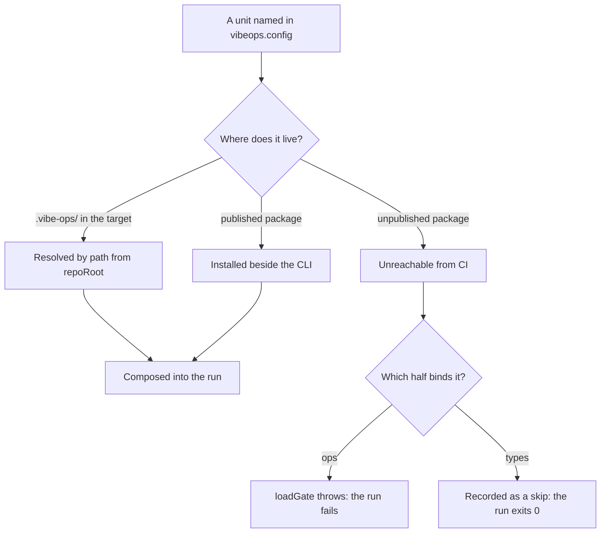

<!--
 Copyright (c) 2026 Danilo Borges (https://github.com/daniloborges)

 Licensed under the Apache License, Version 2.0 (the "License");
 you may not use this file except in compliance with the License.
 You may obtain a copy of the License at

 https://www.apache.org/licenses/LICENSE-2.0
-->

# RFC-0013: The gate's CI entrypoint

| Field | Value |
|---|---|
| Status | Draft |
| Created | 2026-09-22 |
| Author | Danilo Borges |
| Depends on | RFC-0006 (the repository as a source of vibe-ops units) |
| Related | RFC-0001 (gates and ops as the unit of composition), ADR-0019 (the config is the registry) |

---

## Summary

Publish a composite action from this repository that a target's CI workflow calls in place of the install
steps it writes by hand today. The action installs `@entelekheia/vibe-ops-cli` at a pinned version,
installs the published units a target binds, and asserts that every unit named in `vibeops.config`
resolved. It stops there: running the gate stays with the caller, because the caller owns the checkout the
gate reads.

## Motivation

A target repository's CI workflow reaches the gate through three hand-written steps: a Node setup at the
CLI's engine floor, a global install of the CLI, and the target's own `scripts/check.sh`. The first two are
identical in every target, and the knowledge that justifies them — why the Node floor is `>=22.18`, why
there is no fallback when `vibe-ops` is absent from `PATH` — is copied as prose into each workflow. A
fourth target copies it again.

Three defects follow, and two of them are invisible from the workflow file.

**The install is unpinned.** `npm i -g @entelekheia/vibe-ops-cli` with no version means a release changes
every target's gate on the day it lands, with nothing in any target's diff. A rule that arrives this way
turns a pull request red against work that did not touch it.

**A target's own `node_modules` is never consulted.** The CLI installs its resolver at startup —
`cli/packages/cli/src/resolve.ts` calls `setHostResolver` with `import.meta.resolve`, which resolves from
the CLI's own module. Under a global install that is the global tree. When the resolver throws,
`resolveFromHost` returns the bare specifier and `import()` retries from core's own location, which is the
same tree. A governance package installed into the target by `npm ci` is therefore unreachable, and a
workflow that installs it there and expects it to load is wrong in a way nothing reports. **A published
unit must be installed into the same scope as the CLI.**

**A missing unit fails two different ways.** `loadGate` throws when a bound ops fails to import, naming the
specifier and stating that a third-party gate must be installed (`cli/packages/core/src/gate.ts`).
`activateGovernancePackage` returns `undefined` for the same failure, and the run records it among its
skips (`cli/packages/core/src/governance-map.ts`); the process exits `0`. A CI run whose governance
packages never arrived is green with a skip line, which is the shape of failure this apparatus exists to
remove.



## Specification

### The action

`action.yml` at this repository's root, consumed by tag: `entelekheia-ai/vibe-ops@v1`. This repository is
public, so a private target consumes the action with no organization setting.

| Input | Default | Meaning |
|---|---|---|
| `version` | the CLI version the tag was cut against | the `@entelekheia/vibe-ops-cli` version to install |
| `packages` | empty | published units installed into the same scope, space-separated |
| `node-version` | `22` | resolves above the CLI's `engines` floor of `>=22.18` |
| `require-bindings` | `true` | fail when a unit named in `vibeops.config` did not resolve |

The action performs a Node setup, one global install carrying the CLI and every entry of `packages`, and
the binding assertion. It runs no gate and writes no file into the target.

### What the caller keeps

The caller declares its own `on:` triggers and its own `actions/checkout`, including `fetch-depth`. Depth
is a property of the target's content: a target whose records cite commits needs the full history, and one
whose records cite none is correct with a shallow clone. The caller also runs the gate, which is one line.

```yaml
jobs:
  gate:
    runs-on: ubuntu-latest
    steps:
      - uses: actions/checkout@v4
        with:
          fetch-depth: 0
      - uses: entelekheia-ai/vibe-ops@v1
      - run: ./scripts/check.sh
```

### The binding assertion

`require-bindings` needs a verb the CLI does not expose today. The data exists: `cli/packages/core/src/ops-derive.ts`
already computes the set of bound-but-unresolved names, and the run states it among its skips. The verb
turns that set into an exit code, so a target that binds a unit and fails to install it goes red instead of
green.

### Units the action does not install

A unit in the target's own `.vibe-ops/` directory (RFC-0006) needs no install. `gateSpecifierFor`
(`cli/packages/core/src/gate.ts`) resolves a path-shaped gate name against `repoRoot`, so the checkout
already delivers it. The action leaves these alone, and `require-bindings` covers them like any other
binding.

## Rationale

**A composite action rather than a reusable workflow.** The variation between targets sits at the job
level — checkout depth, and whether the target installs its own dependencies for reasons of its own. A
reusable workflow would own the checkout and would have to model that variation as inputs. A composite
action covers the part that is identical everywhere and leaves the rest where it already belongs.

**Install and verify, without running the gate.** Running it would make the action assume the target has
`scripts/check.sh`, and would place the gate downstream of a checkout the action does not control. Install
and verify assume nothing about the target's layout, which also serves a target that has no harness yet.
The cost is one line in the caller.

**The pin travels in the caller's file.** A version written into the target's workflow keeps a gate upgrade
visible as a diff, which is the property the managed-file pattern already gives the commit hook. A floating
install centralizes the unpinned upgrade rather than removing it.

## Implementation Notes

Order matters here, because an action that promises the assertion and omits it is worse than no action: a
caller stops checking by hand.

1. The binding assertion, in the CLI. Either a flag on `check` or a verb beside `config`, reading the
   unresolved set from `cli/packages/core/src/ops-derive.ts`.
2. `action.yml` at this repository's root, with a fixture proving the assertion fails on a target that
   binds a unit it did not install.
3. The CI template `vibe-ops harness install --include ci` writes, so a newly onboarded target emits the
   action call rather than the three steps.
4. Migration of the workflows that hand-write the steps today.

## Open Questions

- Which surface the assertion takes: a flag on `check`, or a verb beside `config`. A flag ties it to a run;
  a verb makes it callable before one.
- Whether `version` defaults to the CLI release the tag was cut against, or is written by each caller.
- What the generated CI template does for a target pinned to an older action tag.
- How an unpublished unit reaches CI. Today it cannot: the action installs from a registry, and a unit that
  was never published has no coordinates. Moving it to `.vibe-ops/` is one answer; publishing it is the
  other.
- Whether `require-bindings` should default to `true` on first release, given that a target binding a unit
  it never installed goes red on its next run.

## Decisions Closed

- **The action installs and verifies; it does not run the gate.** Running it would require assumptions
  about the target's layout and a checkout the action does not control. 2026-09-22.
- **A published unit installs into the same scope as the CLI.** The CLI resolves bound specifiers from its
  own module location, so a target's `node_modules` never participates. 2026-09-22.
- **A `.vibe-ops/` unit is out of scope for installation.** The checkout delivers it and `repoRoot`
  resolves it. 2026-09-22.

## Related

- RFC-0001 — gates and ops as the unit of composition
- RFC-0006 — the repository as a source of vibe-ops units
- ADR-0019 — one artifact, one governance package, activated by config
