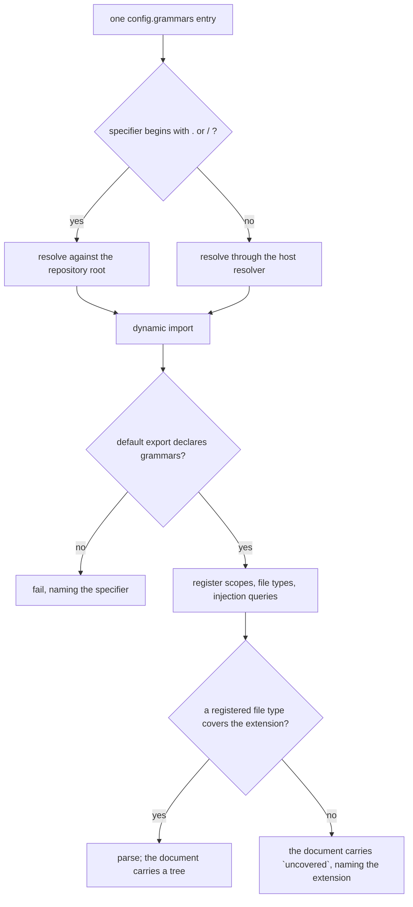

<!--
 Copyright (c) 2026 Danilo Borges (https://github.com/daniloborges)

 Licensed under the Apache License, Version 2.0 (the "License");
 you may not use this file except in compliance with the License.
 You may obtain a copy of the License at

 https://www.apache.org/licenses/LICENSE-2.0
-->

# RFC-0014: A grammar is a pluggable unit a repository composes

| Field | Value |
|---|---|
| Status | Draft |
| Created | 2026-09-22 |
| Author | Danilo Borges |
| Related | RFC-0001 (gates and ops as the unit of composition), RFC-0006 (the repository as a source of vibe-ops units), ADR-0010 (supplement injection queries), ADR-0019 (the config is the registry) |

---

## Summary

A repository declares which tree-sitter grammars the document model loads, the same way it already
declares which ops it composes and which package serves each governance type. `config.grammars` maps a
name to a provider — an installed package, or a path inside the repository — and the registry is empty
until a repository says otherwise. A repository whose sources are Swift and Python composes those two
grammars; a repository that only holds records composes markdown and YAML; a repository that parses
nothing composes none and installs no native binary. The registry that `core` hard-codes today moves out,
and with it the three things that make a third-party grammar impossible: the package list, the scope-to-
language mapping, and the runtime pin.

## Motivation

`core` names its grammars in a constant and depends on them directly. Three consequences follow, each
measurable today.

**Every install pays for every grammar.** `tree-sitter` and the two grammar packages occupy 15.7 MB of a
93 MB dependency tree — 17% of the install — and all of it is native. A repository that runs governance
checks over Markdown records pays for the YAML grammar; a repository that parses no documents at all pays
for both.

**A third-party grammar cannot be added.** `resolveLanguageObject` in `cli/packages/core/src/grammars.ts`
switches on the scope name and throws for anything it does not recognise, so a grammar `core` has never
heard of fails at load time by construction. The package list beside it has the same property: a grammar
is loadable only by editing `core` and publishing it.

**The runtime pin accumulates in one place.** Grammar packages declare peer ranges that disagree —
markdown `^0.21.1`, YAML `^0.22.4`, Swift `^0.22.1`, Python `^0.25.0` — against a runtime this repository
pins to `0.25.1` exactly. Each new grammar adds an entry to a root `overrides` block, which is a file no
consumer of this tooling can edit.

The same three problems were already solved once for ops and for governance types: ADR-0019 made the
config the registry, and `ops-map.ts` made activation a dynamic import so that `core` carries no
compile-time edge to anything it composes. Grammars are the remaining unit that predates that answer.

## Specification

### The axis

`config.grammars` maps a name to a specifier. It has **no defaults**: a repository that declares nothing
loads no grammars.

```ts
grammars: {
  markdown: "@entelekheia/vibe-ops-grammars-markdown",  // text.markdown + text.markdown_inline
  yaml:     "@entelekheia/vibe-ops-grammars-yaml",
  swift:    "@entelekheia/vibe-ops-grammars-swift",
  local:    "./.vibe-ops/grammars/proprietary.mjs",
}
```

Two specifier forms are accepted, matching `opsSpecifier`: a bare package name, resolved through the host
resolver, and a path beginning with `.` or `/`, resolved against the repository root. The path form is the
escape for a grammar that is unpublished, forked, or private; its home is the `.vibe-ops/` directory
RFC-0006 defines.

The absence of defaults is a deliberate divergence from `config.ops`. `ops-map.ts` ships defaults because
restating five names is the cost of adding one. A grammar costs 4 MB to 8 MB of compiled native code, so
the cost runs the other way: the repository that declares nothing installs nothing.

### What a provider package is

A provider default-exports a declaration of the grammars it serves. It owns the three responsibilities
`core` holds today:

| Held by `core` today | Held by the provider |
|---|---|
| `GRAMMAR_PACKAGE_NAMES` | the package is its own declaration |
| the `resolveLanguageObject` scope switch, which throws on an unknown scope | each provider maps its own scopes to language wrappers |
| `dependencies` on `tree-sitter` and both grammars | each provider declares its grammar and pins the runtime |
| the root `overrides` block reconciling divergent peer ranges | each provider reconciles its own |

`SUPPLEMENTAL_SCOPES` and the supplement queries under `queries/injections/` travel with the provider of
the scope they supplement. The table-cell supplement ADR-0010 describes belongs to the Markdown provider.

`core` keeps the algorithm: `readManifest` and its two manifest conventions, the three-tier
`resolveInjectionLanguage`, and the extension map. It keeps no grammar.

### Resolution



### Loading

The host calls `await initGrammars(config, repoRoot)` once at startup, beside the existing
`setHostResolver` call in the CLI's own resolver module. The accessors `grammarForExtension`,
`allGrammars` and `resolveInjectionLanguage` stay synchronous and read a registry that is already
populated. `document.ts`, `injections.ts` and every gate keep their current shape.

A run with no warm-up sees an empty registry. That is the correct state for a host that composed nothing,
and it reports through the same path as a declared grammar that covers no extension.

### Absence is already named

The vocabulary for a missing grammar exists. `documentFromText` returns
`uncovered: "no grammar declares a file type covering .md"` when no grammar matches the extension, and
`resolveLayers` records `reason: "no-grammar"` for an injected language that resolves to nothing. Neither
is silent, and neither changes under this proposal.

What is missing is a reader. No gate consults `uncovered` today, so a gate whose grammar was never
composed runs over a document with no tree and reports nothing. This RFC adds that reader: a gate declares
the extension it depends on, and a run whose registry does not cover it fails naming the grammar.

## Rationale

**Why a provider package rather than listing grammar packages in config directly.** A grammar package
publishes a native binding and a manifest; it does not publish the mapping from a scope to the JavaScript
object `setLanguage` accepts. That mapping is per-package knowledge, it has already caused one measured
failure mode — passing `moduleExport.language` instead of the wrapper leaves `nodeSubclasses` undefined
and the first node access throws — and it has to live somewhere a third party controls. A provider package
is that place. It is also where the runtime pin and the peer reconciliation go, which keeps a divergent
peer range a property of one grammar instead of an entry in a shared file.

**Why no defaults.** Under `config.ops`, a default costs a line of configuration. Under `config.grammars`,
a default costs a native install. The install cost dominates, so the registry starts empty and a
repository pulls each grammar the way it would pull any other language.

**Why a synchronous accessor over a promise.** `grammarForExtension` has four call sites inside `core` and
is reachable from every gate through `DocumentStore`. Making it asynchronous propagates `await` through
the document model and every consumer for no gain over a startup warm-up, which the host already performs
for the resolver.

**Why the mechanism ships before any new grammar.** Migrating Markdown and YAML onto the provider exercises
both manifest conventions, the supplement mechanism, and the multi-grammar package case, against code that
already works. A grammar with no gate that consumes it would be a published package with no reader.

## Implementation Notes

In order:

1. `cli/packages/core/src/grammars.ts` — add the provider contract and `initGrammars`; remove
   `GRAMMAR_PACKAGE_NAMES`, `SUPPLEMENTAL_SCOPES` and the `resolveLanguageObject` switch. Keep
   `readManifest`, `resolveInjectionLanguage` and the extension map.
2. `cli/packages/core/src/config.ts` — add `grammars` to `VibeOpsConfig`, reusing the specifier resolution
   `opsSpecifier` already implements.
3. New packages for the Markdown and YAML providers. Each declares its grammar, pins `tree-sitter`, and
   carries the supplement queries for the scopes it serves.
4. `cli/packages/core/package.json` — drop the three grammar dependencies. The CLI depends on the two
   providers so that an install continues to parse records.
5. The CLI's resolver module — call `initGrammars` beside `setHostResolver`.
6. A gate that declares a required extension and fails naming the grammar when the registry does not cover
   it.
7. `cli/packages/core/test/grammars.test.ts` — build the registry from a fixture config rather than
   asserting against a fixed list. This is also the first exercise of the path form for a grammar.

## Open Questions

- **Which surface pulls Markdown and YAML for a governance repository.** Two candidates: the repository
  lists both in its own `config.grammars`, or a governance package declares the scopes it requires in
  `type.json` and the composition resolves them. The first is explicit and repeated in every repository;
  the second keeps a governance repository from restating the same two lines, at the cost of a second
  place a grammar can be required from.
- **What a gate declares when it depends on an injected language rather than a file extension.** The
  extension case is covered by the reader described above; a gate that reads a fenced block in a language
  the grammar injects has no equivalent declaration yet.

## Decisions Closed

- **Both specifier forms are supported, with the path form as the escape.** Matches `config.ops`, and lets
  a repository that is not an npm project carry a grammar of its own without publishing it.
- **The first delivery migrates Markdown and YAML and adds no new grammar.** The mechanism is proven
  against two existing consumers; Swift and Python enter later as ordinary providers, without touching
  `core` again.
- **The host warms the registry at startup; the accessors stay synchronous.** Smallest change to the
  document model and to every gate that reads through it.
- **`config.grammars` ships no defaults.** A grammar is pulled by whoever needs it, like any other
  language.
- **Each provider declares the runtime and its own grammar as npm dependencies.** `core` keeps no
  compile-time edge to any grammar, which is the property ADR-0019 established for governance types and
  `ops-map.ts` for ops.

## Related

- RFC-0001 — gates and ops as the CLI unit of composition
- RFC-0006 — the repository as a source of vibe-ops units; the `.vibe-ops/` directory the path form uses
- ADR-0010 — supplement injection queries, not a branch per grammar gap
- ADR-0019 — one artifact, one governance package, activated by config
