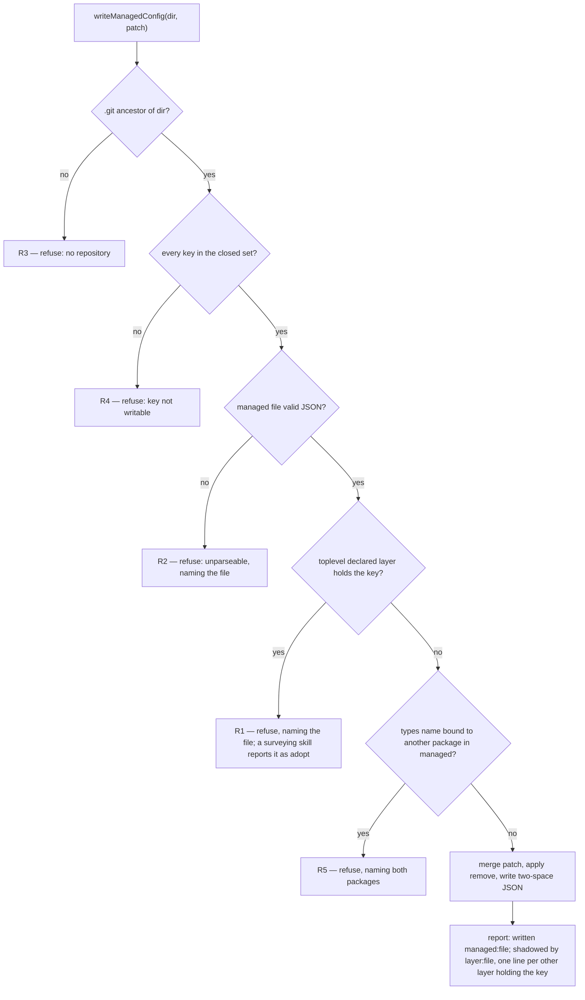

<!--
 Copyright (c) 2026 Danilo Borges (https://github.com/daniloborges)

 Licensed under the Apache License, Version 2.0 (the "License");
 you may not use this file except in compliance with the License.
 You may obtain a copy of the License at

 https://www.apache.org/licenses/LICENSE-2.0
-->

# RFC-0004: The managed layer — the configuration a tool writes

| Field | Value |
|---|---|
| Status | Implemented |
| Created | 2026-09-03 |
| Accepted | 2026-09-03 — Danilo Borges, maintainer sign-off; the two Open Questions carried, neither blocking |
| Implemented | 2026-09-06 — Plan-032 Tracks 2–6 merged; the canonical description now lives in cli/AGENTS.md (Configuration) and docs/how-to/promulgate-the-norm.md |
| Author | Danilo Borges |
| Depends on | [RFC-0002](../0002-bootstrapping-a-repository-and-what-auto-configuration-may-decide.md), [RFC-0003](../0003-a-governance-type-as-a-pluggable-unit.md) |
| Related | [ADR-0014](../../adr/0014-clone-local-configuration-layers-rather-than-replaces.md), [ADR-0015](../../adr/0015-a-third-config-layer-the-tooling-writes.md), [ADR-0019](../../adr/0019-one-artifact-one-governance-package-activated-by-config.md), [Plan-031](../../plans/shipped/031-ownership-fragments-and-the-shaped-class.md), [Plan-032](../../plans/shipped/032-the-ownership-verb-and-the-configuration-it-writes.md), [Plan-033](../../plans/shipped/033-one-artifact-one-governance.md) |

---

## Summary

The cascade gains one file and loses one. `vibeops.config.json` — JSON, committed, tracked, written only
by this tooling — is read at the git toplevel. `vibeops.config.local.json` leaves the cascade, and nothing
writes it after this RFC. Three layers per directory carry a name a command prints and a write targets:
`local`, `declared`, `managed`, in that order, so a person's declaration outranks a program's record.
Three writers share the layer — the `ownership` narrowings, the `types` bindings, and `harness.applied`
with `harness.boundary`, which come from `managed` alone. One load rule is added; every merge rule stands.
A write over a key the toplevel `declared` layer holds is the convergence policy's `adopt`: refused by the
core, reported by the skill, the file untouched. Every write reports what shadows it.

## Motivation

RFC-0003 closed the verb's shape: a read returns the effective value, a read with origins says where each
value came from, and a write names the layer it touches (RFC-0003:221-222). Three things are missing.
**Named layers**, because "where it came from" is unanswerable while a layer is only a filename. **A layer
a write can target**, because every committed form is executable and a program editing someone's
TypeScript to change one key is a failure mode this repository declined (ADR-0015:38-42). **A listing a
maintainer can audit**, because a tool-written value nobody can see shadowed is one nobody trusts.

Three writers wait on that layer (Plan-032:32-39), and `harness.applied` carries a live defect: it is
clone-local, so two clones disagree with neither detectably wrong, and a clone that pulls promulgated files
reports "this clone has never been promulgated to" (`cli/packages/harness/src/index.ts:168`).

## Specification

### 1. Three layers per directory

| Layer | File | Written by | Tracked |
|---|---|---|---|
| `local` | `vibeops.config.local.{ts,mjs,js}` | the operator | no |
| `declared` | `vibeops.config.{ts,mjs,js}` | a person, by hand | yes |
| `managed` | `vibeops.config.json` | this tooling | **yes** |

`managed` is a **third half** of `loadOne`, never a fourth name in the committed half: within a half the
first match wins (`cli/packages/core/src/config.ts:239-252`), so `vibeops.config.json` beside
`vibeops.config.ts` would silently drop one of them. ADR-0015's trap is avoided a second time. The file is
data, parsed rather than imported (`config.ts:212-224`).

**`vibeops.config.local.json` is retired.** `loadOne` stops reading it (`config.ts:243`); the harness
writes the managed file instead. A layer nothing writes is dead weight, and keeping it would give
`harness.applied` two homes with the ignored one nearer. `LoadedConfig` (`config.ts:183`) gains
`leave: readonly { file: string; reason: string }[]` — the convergence policy's verb for a file that is
present but outside the target state (`plugin/references/convergence-policy.md`, `convergence-policy@2`) —
holding a `vibeops.config.local.json` at a toplevel and a `vibeops.config.json` the toplevel rule refuses.
`config list --show-origin`, `harness status` and `harness resolve` print each as `leave <file>: <reason>`.

### 2. Where the managed layer is read

The managed layer is read from the nearest ancestor of `start`, inclusive, containing a `.git` entry —
directory **or** file, because a linked worktree and a submodule both use a file. A filesystem probe inside
core; no git shell-out. With no such ancestor, `config list` prints `no repository: managed layer not
read`.

A `vibeops.config.json` in any other directory of the walk, `$HOME` included, lands in `leave` unread:
a machine-written file governing every repository is an accident nobody can see. A monorepo package needing
its own values hand-writes a `declared` file.

Counted honestly: **one new load rule.** Merge rules are unchanged.

### 3. Merge and ordering

Within a directory `managed` ranks last, so `declared` and `local` both beat it. Across the walk the
directory outranks the layer, so a nearer `managed` beats a farther `declared`, home included. `merge()`
(`config.ts:258-298`) keeps every rule: `types` per local name, `settings` and `records.*` one level deep,
`ownership` concatenated further-first, `modules` and `artifactDir` whole.

`harness.applied` and `harness.boundary` change **source**, not rule: `merge` takes both from the
`managed` layer alone. Exactly one source retires the question ADR-0014 answered with a whole-key merge
(ADR-0014:79-81, `config.ts:282-288`) — there is nothing left to arbitrate. A `declared` or `local` file
holding either key is reported by `config list --show-origin` and fails `config-shadow`. `harness.source`
stays hand-written, per key, and unwritable: it is an absolute machine path (`config.ts:143-149`).

`merge` tags each `ownership` entry with the `<layer>:<file>` that contributed it, and `composedOwnership`
(`ownership.ts:161`) takes the tagged entries in place of the flat array. An entry's origin then reads
`repository(declared)`, `repository(managed)`, `repository(local)`, `home(declared)` or `home(local)`,
where today every repository entry reads the literal `repository` (`ownership.ts:218`).

### 4. Writes, refusals, gates

`writeManagedConfig(dir, patch, options?)` in `@entelekheia/vibe-ops-core` is the only writer. `dir` is the
directory written in — the isolated worktree during a sync, the repository root otherwise. It refuses
content that is not valid JSON (`config.ts:331-337`), merges the named keys, preserves the rest, and writes
two-space JSON. `options.remove` names key paths to delete, which a spread cannot express and the migration
needs. `writeHarnessState` and `statePath` leave core's public export
(`cli/packages/core/src/index.ts:4`, `config.ts:313-314`); the harness is their sole caller.

Five refusals, each a non-zero exit naming a file or a package:

- **R1 — shadowed.** The `declared` layer at this toplevel holds the key. Granularity follows the merge
  rule: `types.<name>` per local name, `ownership` per identical `match` string, `harness.applied` and
  `harness.boundary` whole. The `local` layer is never consulted: one clone must not block a
  repository-wide write.
- **R2 — unparseable.** Existing behaviour, new file.
- **R3 — no repository.** No `.git` ancestor; a write never lands above the toplevel.
- **R4 — key not writable.** The set is closed: `types`, `ownership`, `harness.applied`, `harness.boundary`,
  `harness.agreed` (the last added 2026-09-04, see Consent in §6).
- **R5 — name already owned.** The **managed** layer at this toplevel binds the local name to another
  package: a managed `types.plan` bound to `@acme/governance-plan` refuses a write binding `plan` to
  `@entelekheia/governance-plan`, naming both. A `declared` binding of the same name is R1. This makes
  RFC-0003:130-134's "one short name admits one owner" mechanical; this repository already binds `license`
  and `classification` (`vibeops.config.ts:33-36`).

**The refusals are the mechanism; the skills speak the convergence policy's four verbs.** `setup` and
`migrate` survey before they write. A key the `declared` layer already holds is an **`adopt`** gap: the
local convention is recorded as authoritative, the file is untouched, the report names it, and the run
exits 0 — R1 and R5 are what `writeManagedConfig` returns to a caller that writes without surveying, so a
skill never has to guess. A rebind the operator asked `migrate` for is a **`migrate`**: the binding changes
in place, and the verb names every noun and records directory that stops resolving. A key absent everywhere
is a **`create`**. A file the toplevel rule refuses, or a retired state file, is a **`leave`**: untouched
and reported. `audit` runs the survey and the report and writes nothing. No fifth verb.

**Every managed write recomputes the effective value and reports it**, printing `written managed:<file>`
and, per other layer anywhere in the walk still holding that key, `shadowed by <layer>:<file>`. No write is
silently dead on arrival; the report is the assertion.

`ownership set` keeps Plan-031's three refusals verbatim
(`cli/packages/harness/src/ownership.ts:196-220`).

**Three gates, each shipping a fixture it fails.** `config-shadow` fires at R1's granularity: a
`types.<name>` in both committed layers, an `ownership` entry with an identical `match` in both, or
`harness.applied`/`harness.boundary` outside `managed`. Concatenation is agreement, not a shadow.
`config-managed-committed` runs `git ls-files --error-unmatch vibeops.config.json`, failing when the file
is on disk and absent from the index, and uses `git check-ignore` only to name the rule in the message.
`config-state-leftover` fails while a `vibeops.config.local.json` exists at the toplevel.

### 5. Which verb writes what, and how far each reaches

| Verb | Writes | Policy verb | Reach |
|---|---|---|---|
| `/vibe-ops:setup repo` — a new repository, or an existing one being adopted | `types` | `create` where the name is absent; `adopt` where `declared` holds it | plugin |
| `/vibe-ops:migrate` | `types` on a rebind; removal of a `types` entry whose package is uninstalled, naming the noun and the records directory that stop resolving | `migrate`, references updated in the same run | plugin |
| `vibe-ops harness sync` | `harness.applied`, `harness.boundary`; the retired state file's keys removed | `create` or `migrate`; `leave` for a file it may not reach | CLI (npm) + plugin (MCP) |
| `vibe-ops ownership set <glob> <class> --reason` | one `ownership` entry | `create`; `adopt` where `declared` holds the same `match` | CLI (npm) + plugin (MCP) |
| `ownership get`/`list`; `config get`/`list --show-origin` | nothing | `audit` | CLI (npm) + plugin (MCP) |

The leftover state file's migration runs inside `harness sync` (§6, step 7), so the npm-only channel gets
it without the plugin. A `prepare` script, if ever added, writes nothing.

No install noun: writing a `types` binding **is** installing a governance (ADR-0019). `setup` writes only
entries differing from `DEFAULT_GOVERNANCE_BINDINGS` (`cli/packages/core/src/governance-map.ts:23-29`), and
the write belongs to the caller, after Step 3 and verified at Step 7, never to the `vibe-ops:scaffolder`
dispatch (`plugin/skills/setup/SKILL.md:111-114`).

### 6. The sync ceremony, and the migration

Today `applied` is derived from the staged set **after** the commit
(`cli/packages/harness/src/sync.ts:246-292`). The new order:

1. Read back `<worktree>/vibeops.config.json` — the committed map, never the merged
   `context.config.harness.applied` (`harness/src/index.ts:134-138`).
2. `applied` = that committed map, overlaid by the leftover state file's map for the types this run leaves
   unstaged (a one-time seed: that clone's record is the best record of the tree, and step 7 deletes it),
   then by the staged types at their shipped versions (`sync.ts:286-290`). `boundary` = `installed.version`.
3. Write the managed file in the worktree and add it to `touched` **before** `git add`, so the existing
   swallowed-path verification covers it unchanged.
4. When no norm file stages and the managed map would still change — a seed, a boundary — commit the
   managed file alone. A one-file commit is the honest record of that run.
5. Commit.
6. Tag.
7. After the branch and tag exist, at the repository root, remove `harness.applied` and `harness.boundary`
   from the leftover state file through `options.remove`, and delete the file when nothing is left.

**Consent, and the fragment bump.** `boundaryRefusals` is exported and tested (`sync.ts:140`,
`cli/packages/harness/test/sync.test.ts:196`) with no production caller; instead, any version disagreement
refuses every classified path (`sync.ts:178-189`). The implementation makes `sync` call it, so a bump that
widens nothing promulgates without `--accept-boundary` and records the new boundary. That fix ships with
this RFC's bump to `ownership@2`, so the migration names no consent step, and the one repository holding a
recorded boundary records `boundary: 2` at its next sync.

*Amended 2026-09-04, maintainer decision, found while implementing Track 3.* `boundaryRefusals` takes the
declaration the repository agreed to, and nothing recorded one: `harness.boundary` is a number, and the
composed version is the max across fragments, so "ownership@1" names no document that can be read back.
The record is a **receipt**, `harness.agreed: { "<path>": "<class>" }` — the class of every file the run
wrote, written by `sync` in the promulgation commit beside `applied` and `boundary`, `managed`-only and
whole like them, the fifth member of R4's closed set. A receipt, not a decision: it changes no effective
class (that is `ownership`), it is only what the next `sync` compares the installed declaration against,
per path, so that a widening stops on the path that widened and a bump that widens nothing promulgates. A
repository with no receipt has agreed to nothing this can compare, and promulgates. Folding the receipt
into `ownership` entries was rejected: one list with two writers, where the tool must never rewrite an
operator's entry on the same match.

**Population, measured 2026-09-03**, across the repositories this tooling governs today: one holds a
`vibeops.config.local.json`, carrying `applied` for five types and `boundary: 1`; two hold a committed
`vibeops.config.ts`, this repository among them. The migration is one repository, performed by
`harness sync`.

### 7. Ownership: `shaped`, generalised — four classes stay four

`vibeops.config.json` is **`shaped`**. The class was created for "an owner per part of a file" (RFC-0003's
rationale), with a record as its first instance: the tooling owns the structure, the repository owns every
word under it. This file is the second instance: the tooling owns the keys a recorded rule names —
`types`, `ownership`, `harness.applied`, `harness.boundary` — each through the module that owns it, and the
repository owns the file's existence and every other key, which every write preserves. Promulgation never
rewrites the file whole. A hand edit is legal, loses to `declared` and `local`, and reads as a tool write.
The definition of `shaped` generalises from "structure versus content" to "the parts a recorded rule names
versus the rest"; the enum `repo`, `seed`, `shaped`, `norm` and the authority order
`{ repo: 0, seed: 1, shaped: 2, norm: 3 }` (`ownership.ts:99`) are untouched. The other three classes were
tested and fail: `seed` is written once and never again, where this file takes keyed writes for life;
`repo` is never written, which `records handling` would repeat to a reader while `sync` writes the file
inside the promulgation commit; `norm` overwrites whole, and a `types` entry from `setup` must survive a
`sync`.

`cli/packages/harness/ownership.json` goes to `"version": 2` (`ownership.json:3`), and
`vibeops.config.json` enters as `shaped` with its own `why`. The two existing matches widen to
`vibeops.config.{ts,mjs,js}` and `vibeops.config.local.{ts,mjs,js}` (`ownership.json:86-95`) for the true
reason: `setup`'s per-destination `vibe-ops records handling <path>` consult reports the `.mjs` and `.js`
siblings as unclassified (`plugin/skills/setup/SKILL.md:103-109`), while `sync` never sees them, because
`normContent` holds only `project/templates/<type>.md`. `vibeops.config.local.json` gets no entry: it is
leaving.

`plugin/references/ownership.md` goes to `ownership@3` (`ownership.md:2`): the `shaped` row and the
placement test carry the generalised definition and name both instances. Its repository-layer paragraph reads "written by hand or by `ownership set`", and
its parenthetical deferring tool-written configuration to Plan-032's format RFC (`ownership.md:74-79`)
names this RFC instead.

**The rule, stated out loud.** A class governs file-level writes from a norm's content map; a keyed write
through the owning module is not one — the harness removing its own two keys from a leftover state file at
the repository root is such a keyed write.

The `setup` gitignore template keeps its four literal `vibeops.config.local.*` names (`:12-15`) and never
becomes a glob, which would un-track the managed file in every scaffolded repository with no error.
Its comment calling the `.json` "the machine's own layer"
(`plugin/skills/setup/templates/root/gitignore:9`) is rewritten, as is the same comment here
(`.gitignore:8-19`) and in any repository whose `.gitignore` carries it.

### 8. Backward compatibility, and one named limitation

A repository holding only a `.ts` is unaffected. `VibeOpsConfig` is unchanged, so every consumer reads the
merged result as today, and every ordering assertion in `cli/packages/core/test/config.test.ts:8-154`
holds.

Absence means two things. No managed file means no tool has written here; for `types` the shipped defaults
still answer. For `harness.applied`, absence means never promulgated to — a state rather than zero.

Two surfaces change their words: `harness/src/index.ts:168` becomes "this repository has never been
promulgated to", and `resolve.ts:81-83` gains a `managed` surface while keeping `state` flagged `leave`.

**The limitation, named and accepted.** Between a promulgation and its branch's merge — `sync` stops at the
branch and the tag (`harness/src/index.ts:145-147`) — the clone's managed file is still the pre-run one.
`harness status` reports the pre-run record, a repeated `sync` sees the same, and `sync`'s summary says so.
A named limitation, not a mechanism.

**Gate activation stays a human declaration.** `cli/packages/cli/src/check-global.ts:73-75` computes
`declaredHere` from any `sources` entry under the repository root, so a managed file at the toplevel would
switch the Stop gate on for every contributor. It narrows to the `declared` and `local` layers through
`layers`.

## Rationale

**Editing the `.ts` stays rejected**, on ADR-0015's grounds: these files carry their reasons as comments a
rewriter loses. **Ranking `managed` above `declared`** was rejected: a tool's record would override a
person's intent. **Keeping the state layer readable** was rejected: two homes for one key, the ignored one
nearer, is the ambiguity this RFC ends. **JSON replacing the executable committed form** was rejected:
`vibeops.config.ts` exists so a person can compute a value and type it. **A directory of per-writer files**
was rejected: it multiplies merge rules by the number of writers, which Plan-032 exists to prevent. **A fifth
ownership class** was rejected: it would encode how the tooling writes, where the vocabulary answers who owns
which part, and `shaped` already answers that.

## Implementation Notes

**By file.** `cli/packages/core/src/config.ts` — the third half, `MANAGED_FILENAME`, the `.git`-ancestor
rule, `leave` and `layers` on `LoadedConfig`, `writeManagedConfig` with `remove`, R1–R5, the managed-only
source for `harness.applied`/`harness.boundary`, the rewritten comment at `:282-288`, and the removal of
`statePath`/`writeHarnessState` from `core/src/index.ts:4`. `cli/packages/harness/src/sync.ts` — §6's
ceremony and the `boundaryRefusals` call. `harness/src/index.ts` — `writeManagedConfig` replaces the state
write; the status string at `:168`. `harness/src/resolve.ts` — a `managed` surface, `state` kept and
flagged `leave`. `harness/src/ownership.ts` — per-entry origins; the class vocabulary and the authority order are unchanged.
`cli/packages/harness/ownership.json` — version 2, three entries. `plugin/references/ownership.md` —
`ownership@3`. Three gates under `cli/packages/gates/src/` (`config-shadow/`, `config-managed-committed/`,
`config-state-leftover/`). `cli/packages/cli/src` — the `config` and `ownership` verbs, `check-global.ts`.
`plugin/skills/setup/SKILL.md` and `plugin/skills/migrate/SKILL.md` — the survey step names
`create`/`adopt`/`migrate`/`leave` per key and maps R1 and R5 to `adopt`.
`plugin/skills/setup/templates/root/gitignore:9` (comment only). `vibeops.config.local.example.ts`.
`cli/AGENTS.md:185-188`, `cli/packages/harness/README.md:96-97`, and the `.gitignore` comment here
(`.gitignore:8-19`). One supersession pointer sentence each in ADR-0014, ADR-0015 and RFC-0003, naming this
RFC.

**Assertions, one per rule.** In `cli/packages/core/test/config.test.ts`: one directory holding both
`vibeops.config.ts` and `vibeops.config.json` loads both, `managed` last; a nearer `managed` beats a farther
`declared`; a `vibeops.config.json` off the toplevel appears in `leave` unread; a walk with no `.git`
ancestor reads no managed layer; a `.git` **file** counts as the toplevel; `vibeops.config.local.json`
appears in `leave` unread; `harness.applied` and `harness.boundary` come from `managed` while a
`declared` copy is ignored; `types` merges per local name across three layers; `ownership` concatenates so
`declared` lands last, each entry carrying its `<layer>:<file>` origin; `writeManagedConfig` refuses invalid
JSON, preserves foreign keys, removes named key paths; R1 fires per `types.<name>`, per identical
`ownership` match, and on `harness.applied`; R3, R4 and R5 each exit non-zero naming a file or two packages.
In `cli/packages/harness/test/sync.test.ts`: the managed file stages in the commit carrying the files it
describes; a run staging no norm file commits it alone; step 7 empties the leftover state file and deletes
it; `boundaryRefusals` gates the run. In `cli/packages/harness/test/ownership.test.ts`: `vibeops.config.json`
composes as `shaped` with origin `harness`, and classifying it widens nothing. In `cli/packages/cli/test/hook.test.ts`: a managed file alone leaves the Stop
gate off. In `cli/packages/gates/test/config-shadow.test.ts`, `config-managed-committed.test.ts` and
`config-state-leftover.test.ts`: each gate fires on the fixture it ships.

## Open Questions

1. Overlapping-but-unequal `ownership` globs, open since RFC-0003:270-276. `ownership set` inherits
   Plan-031's identical-match rule, so a narrowing overlapping a fragment's glob is written, neither refused
   nor reconciled. Settled by choosing a comparison: exact string, glob containment, or match-set
   intersection.
2. Whether `config list --show-origin` renders home-directory layers.

## Decisions Closed

- **Three layers per directory, `managed` last** — a third half of `loadOne`, never a fourth name in one.
- **The `state` layer is retired.** `vibeops.config.local.json` leaves the cascade, nothing writes it, and a
  gate fails while one sits at a toplevel. **This amends ADR-0015**, which created that layer because all
  three local filenames were executable (ADR-0015:38-42) and because tracking the state file would put a
  promulgation diff in a file the repository owns (ADR-0015:78-81). A committed JSON layer nobody imports
  answers the first ground; the second is now the point, since that diff is the reviewable record.
- **The managed layer is read at the git toplevel**, by a filesystem probe for a `.git` directory or file.
  Anything elsewhere is a leftover, reported and unread. One new load rule; no new merge rule.
- **A write over a `declared` key is refused, naming the file**; `local` is never consulted; every write
  reports the layers that still shadow it.
- **A nearer `managed` beats a farther `declared`**, home included.
- **`harness.applied` and `harness.boundary` come from `managed` alone.** **This amends ADR-0014**, whose
  whole-key merge for `applied` (ADR-0014:79-81) arbitrated between layers that no longer both hold the key,
  and whose stated benefit — promulgation state no commit will ever contain (ADR-0014:66-67) — is reversed
  deliberately: that diff is the reviewable record, in the commit carrying the files it describes. The
  defect it did not foresee is a clone that pulls promulgated files and reports never promulgated
  (`harness/src/index.ts:168`).
- **The committed configuration is two files.** **This amends RFC-0003:313-315**, whose one-slot convention
  held while every committed form was executable. The repository's override still lives in the configuration
  the repository commits; that configuration is now a hand-written file and a tool-written one.
- **The writable key set is closed**: `types`, `ownership`, `harness.applied`, `harness.boundary`,
  `harness.agreed` (amended 2026-09-04). `harness.source` stays hand-written and unwritable.
- **`vibeops.config.json` is `shaped`, and `shaped` generalises** from "structure versus content" to "the
  parts a recorded rule names versus the rest" — four classes, enum and authority order unchanged; a fifth
  class is rejected. A class governs file-level writes from a norm's content map; a keyed write through the
  owning module is not one.
- **A hand edit to `vibeops.config.json` is undetectable, and that is accepted.**
- **Consent is recorded in the tree**, by the sync that promulgated, in the promulgation commit. Merging
  that branch is the repository's acceptance; a maintainer revokes with a commit that lowers or removes
  `harness.boundary`.
- **The blanket boundary refusal is fixed in the same release** — `sync` calls `boundaryRefusals`
  (`sync.ts:140`) instead of refusing every classified path on any version change (`sync.ts:178-189`), so
  the bump to `ownership@2` needs no consent step.
- **Gate activation stays a human declaration.** A managed file alone leaves the Stop gate off;
  `check-global.ts:73-75` reads the `declared` and `local` layers only.
- **Reach is stated per verb.** `setup` and `migrate` are plugin-only; `harness sync`, `ownership *` and
  `config *` reach the npm CLI too, so the state-file migration reaches a repository with no plugin.
- **No install noun.** Activation is `setup` and `migrate` writing `types`.
- **The convergence policy's four verbs govern the managed layer, and no fifth is coined.** `create` where
  a key is absent; `adopt` where the `declared` layer holds it — reported, untouched, exit 0 at the skill,
  with R1 and R5 as the core's mechanism; `migrate` for an operator-requested rebind, its references
  updated in the same run; `leave` for a file outside the target state; `audit` for every read.

## Related

- [RFC-0002](../0002-bootstrapping-a-repository-and-what-auto-configuration-may-decide.md) — the reach of
  each channel, and the `prepare` rule this RFC keeps.
- [RFC-0003](../0003-a-governance-type-as-a-pluggable-unit.md) — the verb's shape, and the one-slot decision
  this RFC amends.
- [ADR-0014](../../adr/0014-clone-local-configuration-layers-rather-than-replaces.md) and
  [ADR-0015](../../adr/0015-a-third-config-layer-the-tooling-writes.md) — both amended; each gains a
  supersession pointer sentence at implementation.
- [ADR-0019](../../adr/0019-one-artifact-one-governance-package-activated-by-config.md) — activation is the
  config, which is why writing `types` is the whole act of installing a governance.
- [Plan-031](../../plans/shipped/031-ownership-fragments-and-the-shaped-class.md),
  [Plan-032](../../plans/shipped/032-the-ownership-verb-and-the-configuration-it-writes.md),
  [Plan-033](../../plans/shipped/033-one-artifact-one-governance.md).
- `cli/packages/core/src/config.ts`, `cli/packages/harness/src/sync.ts`,
  `cli/packages/harness/ownership.json`, `plugin/references/ownership.md`.
